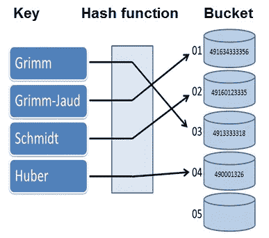

# 哈希表是如何工作的？

> 原文：<https://medium.com/analytics-vidhya/how-does-a-hash-table-work-adafc1882b2?source=collection_archive---------10----------------------->

## 理解直接地址表和哈希表的区别，从头开始实现哈希表

该图显示了使用哈希函数将键映射到它们的存储桶。

哈希表是一个动态集合，支持平均时间复杂度为 O(1)的插入、搜索和删除字典操作。

哈希表是如何工作的？让我们在这篇文章中弄清楚。