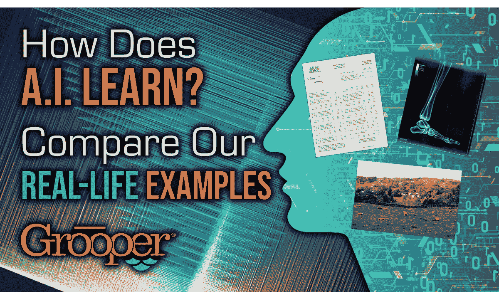
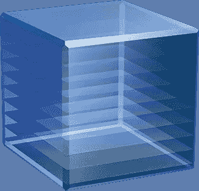
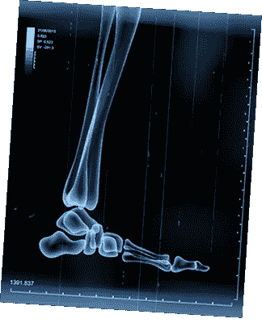
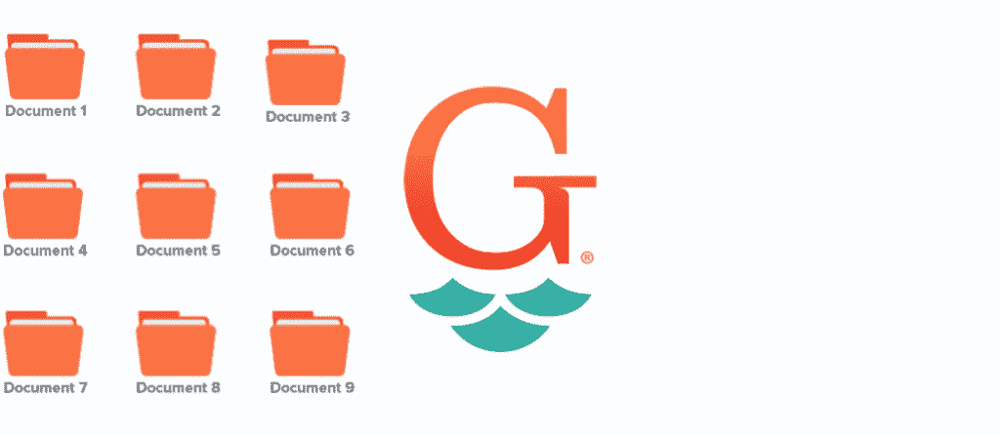
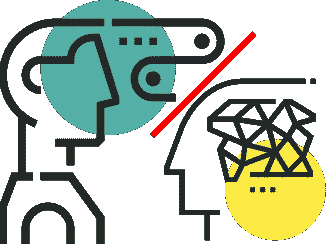

# 人工智能如何学习？没必要害怕奇点。还没有。

> 原文：<https://medium.com/analytics-vidhya/how-does-a-i-learn-no-need-to-fear-the-singularity-yet-179a8d2e3a8b?source=collection_archive---------21----------------------->

AI 是如何学习的？这是一个经常被问及的问题，但真相却很少被揭露。人工智能并不像我们希望的那样聪明。

但是我们不要混淆聪明和强大。或者，计算能力。说到底，我们真正想要的是技术能够快速完成困难的事情，并且只需要很少的人力。我们也希望这些事情做得准确。

人工智能学习的概念既是营销炒作，也是我们更糟糕的恐惧成真。在所有人工智能接管世界的场景中，人工智能已经学会在人类不知道的情况下做事情。

我想这是有一定道理的。如果一个人工智能系统获得了意识，我们所知道的生活将会永远改变。但人工智能的学习方式与人类的学习方式相去甚远。

你可能听说过人工智能是“人类智能的模拟”嗯，那根本不是真的。没有别的原因，仅仅是因为我们还没有完全理解人类大脑是如何工作的。今天的“人工智能”实际上是算法——数学——被编程来做某件事。

如果人工智能学习人类的方式，这将是一场伦理噩梦。

# 那么 AI 是怎么学习的呢？

人工智能通过向算法输入数据来学习，这些算法旨在产生某种结果。在某些情况下，通往结果的道路是高度受限和透明的。

这就是机器学习的工作原理。在其他情况下，路径只是被宽松地约束，并且可预测的结果实际上是不可能的。这就是深度学习或错综复杂的神经网络的现实。

在机器学习的情况下，非常具体的结果是可以实现的。算法被编程为接受特定的输入并提供 100%可预测的输出。

机器学习没有惊喜。它只是快速且可预测地执行一项困难的任务。机器学习(AI)会在新的输入输入到算法中时进行学习，以改变其工作方式。

## 神秘的黑匣子

通过深度学习和神经网络，该算法配置了许多隐藏层和步骤，每个都建立在彼此的基础上。最终的输出，或者说训练，来自一个神秘的“黑箱”，这是设计好的。

神经网络的算法被输入了大量的输入数据，机器的目标是一致地得出正确的结论(我们没有任何方法知道结论是如何得出的，或者它在现实生活中是否可行)。

# 真实世界深度学习/神经网络示例

深度学习和神经网络是迷人而强大的技术，但有一个内在缺陷:

这可以通过两个流行的例子得到最好的理解。在这两个例子中，算法(AI)都是使用大量样本上的显式例子来训练的。所有的训练都是结合在一起的，目的是在新的例子输入算法时提供有用的结果。理想情况下，它会产生持续的好结果。

## 第一，AI 图像识别

图像信用 aiweirdness.com

如果你去微软的图像识别工具[这里](https://azure.microsoft.com/en-us/services/cognitive-services/computer-vision/#features)上传这张橘羊的图片，它会给你下面的说明:“一大片水域，背景是一座山。”

不错吧？但也不是很好。试试这个好玩的:

图像信用 aiweirdness.com

"在郁郁葱葱的绿色山坡上吃草的一群羊。"

因此，有了图像识别，这是可以的，但没有什么像一个人工智能将接管世界！这里的要点是，由于所有的训练算法已经给出，有好处和坏处。

因为之前的图像(可能有羊，看起来像这张)被训练成“一群正在吃草的羊”，所以算法错误地假设这张图像中的岩石是羊。

强大？是的。但是聪明？号码

# 第二，医疗诊断

另一个更有说服力的例子是医疗保健人工智能研究员吴恩达给我们的。他和斯坦福大学的一个研究团队训练了一种深度学习算法，可以从胸部 x 光片中诊断肺炎。总的来说，它比放射科医生表现得更好。

太棒了，对吧？恩，Ng 发现了他所谓的“从概念证明到生产的差距”这是一种想法，即通过一组受约束的测试数据，人工智能可以被训练产生有利的结果，但人工智能不能在一组它以前从未见过的新数据上产生相同的结果。

想想人工智能学习图片中的内容的例子。如果我提交一张人工智能经过训练的照片，它会告诉我照片里到底有什么，因为它以前见过。

## 当人工智能崩溃时

任何一种人工智能学习软件都会发生同样的事情。新数据会导致不可预测、有时甚至疯狂的结果。

Ng 在将他的人工智能软件带到另一个医院系统并输入他们的胸部 x 光片时发现了这个问题。拍摄图像的机器——或图像拍摄方式——的微小差异打破了人工智能算法，基本上不起作用。

顺便提一下，任何人类放射科医师都可以查看任何图像并做出正确的诊断。人类和人工智能的学习方式不同！

# 真实世界机器学习示例

[文档 AI](https://blog.bisok.com/general-technology/what-is-artificial-intelligence-in-computer) 中智能学习方式的一个非常容易理解的例子就是所谓的文档分类。这是一种训练软件分析文档页面以确定文档类型的方法。

机器学习算法被输入，例如发票。假设机器学习算法还没有训练好，系统也不知道是什么类型的文档。它只知道页面上有哪些单词和特征。

该软件的用户只需点击一个按钮，就可以训练人工智能软件这是一张发票。一种算法立即运行，查看文档中包含的所有内容，并创建一个大型数据表，其中包含页面上出现的所有单词和特征的列表。

如果用户向系统提交另一张看起来大体相同的发票，软件将识别出这也是一张发票。分类完成。嗯，没那么快。

## 为什么 AI 学习≠人类学习

如果将另一种文档类型(如采购订单)输入到系统中会怎样？很可能会有很多相似的单词和特征。系统也可能称之为发票。

对于机器学习来说，它需要人类至少向它展示它需要了解的每种类型的文档的一个示例。当系统被训练识别发票和采购订单时，它会查看其中任何一个并给出一个信任等级。比如，这 70%可能是发票，只有 30%可能是采购订单。在大多数情况下，这是正确的。

这与人类学习的方式完全不同。如果我从来没有见过核管理委员会的数据采集表，有人把它放在我面前，我会马上知道它是什么，即使它在顶部没有写“核管理委员会数据采集”。

*   我会注意到文档的结构看起来像一个表单
*   我可能注意到地址是 NRC 的
*   或者我可能会在文档上看到一个印章或页脚来提示我。上面可能会写着“将此表提交给核管理委员会”之类的话

另一种可能性是，它是一个样本数据摄取表格，以 NRC 的表格为例，但不是真正用于现实生活的表格。从文件的布局来看，我也能理解这一点。

关键是机器学习需要人类的输入来学习和改进。

学习如何玩国际象棋和围棋等游戏的人工智能系统代表了计算机的力量，而不是人工智能学习的进步。强大？是的。聪明？号码

例如，谷歌的 AlphaGo 不能下棋，或跳棋，或井字游戏。但这并不是要排斥谷歌创造的东西。

AlphaGo 代表了一种通过自我游戏来学习的 AI 模型。给定初始训练数据和游戏规则，软件被编程以避免失败。如果有足够的处理能力，该软件不仅可以以超人的速度与自己对弈，还可以预测未来的走向，以确定每一步成功的新路径。

# 关于人工智能如何学习的最后评论

因此，你可以看到人工智能实际上只是算法(数学)和处理数据的巧妙/创造性方法的混合。建立一个甚至可以远程接近人类智能的人工智能系统是科幻电影或未来许多许多年的事情。

如果有人告诉你，他们的人工智能学习，或者像人类一样学习，他们要么说他们的算法是:

*   手动更新
*   在编程规则下工作(想想 AlphaGo)
*   或者他们只是不确定软件实际上是如何工作的。

## 如果今天的人工智能可以独立于人类输入进行学习，那么这将意味着它知道在做出决定时是错误的。

## 如果它知道自己错了，难道它第一次不会做出更好的选择吗？

*最初发表于*[*【https://blog.bisok.com】*](https://blog.bisok.com/via/how-does-a.i.-learn-no-need-to-fear-the-singularity.-yet)*。*