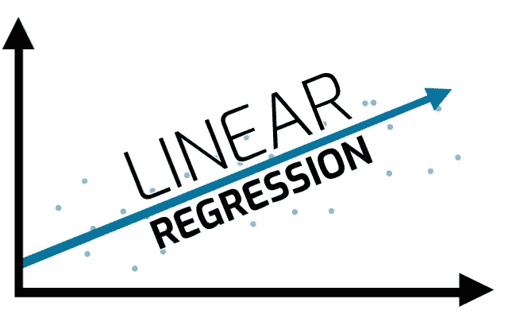
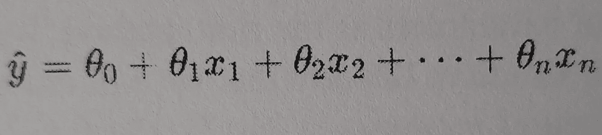
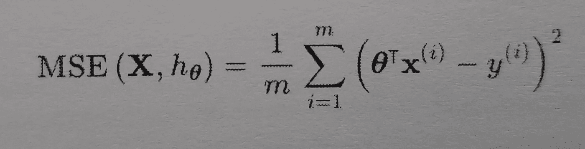
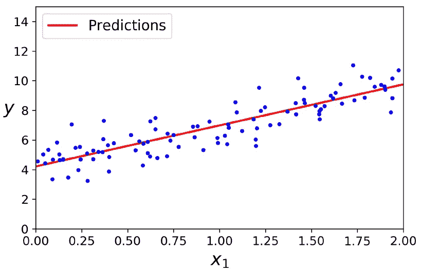

# 线性回归是如何工作的？用 sklearn 实现。

> 原文：<https://medium.com/analytics-vidhya/how-does-linear-regression-work-implementation-with-sklearn-e5a850eddc89?source=collection_archive---------9----------------------->



# 介绍

观众好，我是穆斯塔法，在这篇博客中，你将学习一种简单的机器学习算法，叫做**线性回归。**我们会经过一些数学，然后跳转到编码部分。相信我，你只需要几行代码就可以实现任何机器学习模型，但你真正需要理解的是它是如何工作的，以及这些机器学习算法背后的数学原理。我们开始吧！

那么什么是线性回归呢？它用什么数学方程来预测数值？。我将在这篇博客中尝试回答这些问题。

# 什么是回归？

在继续之前，让我们了解一下什么是回归？。回归是一种借助独立值或称特征来预测未来值或目标值的方法。

# 什么是线性回归？

顾名思义，它是一个**线性模型**，所以如果我们有线性数据，基本上我们可以得到好的结果。什么是线性数据？简而言之，当我们绘制数据时，我们会得到一条有一定角度的直线(假设是二维数据)。因此，回归模型试图以最小的损失拟合训练数据的最佳可能线。

线性模型通过简单计算输入要素的加权和以及称为偏差或截距的常数项来进行预测



线性回归模型预测方程。

在这个等式中:

*   y-hat 是预测值。
*   n 是特征的数量。
*   x(i)是第 I 个特征值。
*   θ是模型参数，或者我们可以说是特征权重。

# 线性回归模型如何训练？

这就是线性模型的方程，现在我们如何训练它？。训练模型意味着设置其参数，使模型最适合训练集。为此，我们首先需要衡量模型与训练数据的吻合程度。因此，回归任务最常见的性能度量是应用均方误差(MSE)。为了训练回归模型，我们需要找到最小化 MSE 的值θ。



MSE 成本函数

*   x 是特征向量。
*   h 是系统的预测函数，也称为假设。
*   θ是权重矩阵。
*   x(i)是 x 的第 I 个实例。
*   y(i)是第 I 个实例的目标值。

为了更新θ的值，我们先来看看基本方程，叫做**正规方程。**


正态方程

*   θ是使成本函数最小的θ值。
*   y 是包含 y(1)到 y(m)的目标值的向量。

让我们生成一些数据来测试上面的等式。

```
import numpy as np# generating dataX = 2 * np.random.rand(100, 1)
y = 4 + 3 * X + np.random.randn(100, 1)X_b = np.c_[np.ones((100, 1)), X] # add x0 = 1 to each instance# normal equation
theta_best = np.linalg.inv(X_b.T.dot(X_b)).dot(X_b.T).dot(y)
```

为了生成数据，我们使用了 numpy . rand . rand()，它为我们提供了具有一些随机值的 100 大小的向量，为了生成我们的目标值，我们使用了 4x+3+(一些高斯噪声)。为了实现法线方程以获得θ的最佳值，我们使用了 numpy inv()函数来计算矩阵的逆矩阵，使用 dot()函数来计算点积。

请记住，我们用来生成数据的等式是 4+3x+(一些高斯噪声)。让我们看看使用法线方程会得到什么:

```
print(theta_best)# output:
# array([[4.21509616],
#       [2.77011339]])
```

我们希望得到值 4 和 3，但我们得到了足够接近的 4.215 和 2.7701。

让我们预测新的值并把它们画在图上。

```
X_new = np.array([[0], [2]])
# add x0 = 1 to each instance
X_new_b = np.c_[np.ones((2, 1)), X_new]y_predict = X_new_b.dot(theta_best)
print(y_predict)
# output
# array([[4.21509616],
#        [9.75532293]])# plotting data
plt.plot(X_new, y_predict, "r-")
plt.plot(X, y, "b.")
plt.axis([0, 2, 0, 15])
plt.show()
```



在上面的代码中，我们生成 2 个随机值，并将它们传递给 predict 方法以获得目标值。在 matplotlib 库的帮助下，我们绘制了训练数据的散点图和我们生成的一行数据。

LinearRegression 类基于 **scipy.linalg.lstsq()** 函数(该名称代表“最小二乘”)。它返回线性矩阵方程的最小二乘解。

```
theta_best_svd, residuals, rank, s = np.linalg.lstsq(X_b, y, rcond=1e-6)
print(theta_best_svd)
# ouput
# array([[4.21509616],
#       [2.77011339]])
```

此函数计算θ = (X+) y，其中 X+是 X 的伪逆。您可以使用 np.linalg.pinv()直接计算伪逆:

```
np.linalg.pinv(X_b).dot(y)
```

伪逆计算如下:X+= vσ+UT(T 代表转置)。v 和 U 是正交矩阵。为了计算矩阵σ+，该算法采用σ，并将小于一个微小阈值的所有值设置为零，然后用它们的逆矩阵替换所有非零值，最后，转置得到的矩阵。但是为什么要用伪逆代替正规方程呢？如果矩阵 XTX 是不可逆的(即奇异的)，例如如果 m < n 或者如果一些特征是冗余的，则正规方程可能不起作用，但是伪逆总是被定义的。

# 使用 sklearn 实现线性回归

让我们使用 sklearn 库实现线性回归。

```
from sklearn.linear_model import LinearRegression
lin_reg =LinearRegression()
lin_reg.fit(X,y) # data we genrated above
print(lin_reg.intercept_, lin_reg.coef_)# output
# (array([4.21509616]), array([[2.77011339]]))
```

因此，使用 sklearn 实现线性回归是一项非常简单的任务。我们只需要 3 行代码来实现它，首先从 sklearn.linear_model 导入模型，然后初始化一个对象，最后调用 fit 方法，将特征值和目标值作为参数。

此外，您可以评估模型并尝试 GridSearchCV 进行超参数调优。

如果你觉得有用或者你认为需要改进，请在下面评论。谢谢:)