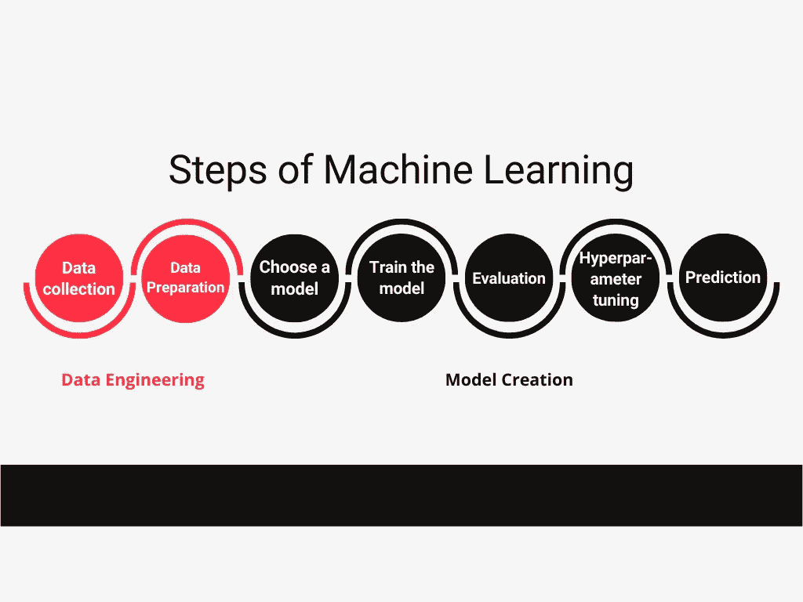

# 机器学习是如何工作的？

> 原文：<https://medium.com/analytics-vidhya/how-does-machine-learning-work-ec29e65060e4?source=collection_archive---------9----------------------->

格伦·卡斯滕斯-彼得斯在 [Unsplash](https://unsplash.com?utm_source=medium&utm_medium=referral) 上拍摄的照片

今天，我们来看看什么是机器学习，它是如何工作的:一步一步来。这种对机器学习过程中涉及的所有步骤的高层次概述将为您提供关于该主题的很好的概述。在我接下来的博文和视频中，我会分别对每个步骤进行更详细的描述。这篇文章摘自我上一个 YouTube 视频:

【https://youtu.be/vN_LpDzFawU 

# 什么是机器学习？

以下是《麻省理工科技评论》对机器学习(ML)的定义，我觉得非常好:

> “机器学习算法使用统计学在海量数据中寻找模式。这里的数据包含了很多东西——数字、文字、图像、点击等等。”-《麻省理工科技评论》

# 机器学习是如何工作的？

创建 ML 模型需要 7 个步骤:数据收集、数据准备、选择模型、训练模型、评估模型、调整超参数，最后使用模型进行预测。

前两步只关注数据工程，而后面的五步则关注实际的模型创建。

机器学习的 7 个步骤

现在，所有这些步骤到底意味着什么？我将用一个例子来解释它们:

让我们假装我们想建立一个 ML 模型，将电子邮件分类为垃圾邮件或非垃圾邮件。

## 1.数据收集

首先，我们需要获得用于垃圾邮件分类模型的数据。

这里需要注意的重要一点是，我们获得的用于训练模型的数据的质量和数量非常重要，因为它将直接影响您的模型工作的好坏。我们有几种方法可以获得所需的数据，最简单的方法是使用互联网上的大型数据集。还有很多其他方法可以获得数据来训练一个人工智能模型，我会在下一篇博文和视频中向你展示。

现在，我们在互联网上找到了一个包含垃圾邮件或非垃圾邮件的数据集，我们可以继续准备我们的数据了。

## 2.数据准备

在这一步，我们将首先随机化数据的排序。为什么？我们不希望我们的数据排序影响我们的 ML 模型学习的内容，因为这不是确定一封邮件是垃圾邮件还是非垃圾邮件的一部分。

然后，我们将它可视化，以查看不同特征之间是否存在相关性，或者我们的数据中是否存在数据失衡。例如，如果我们收集的数据包含的垃圾邮件比非垃圾邮件多得多，我们的模型就会偏向于猜测实际上看到的每封邮件都是垃圾邮件，因为大多数情况下这是正确的。然而，在现实世界中，该模型可能会看到等量的垃圾邮件和非垃圾邮件，这意味着猜测“垃圾邮件”有一半是错误的。

在这一步中，我们还将把我们的数据分成两部分:第一部分和第二部分是我们的大部分数据，将用于训练我们的模式。第二，小部分将用于评估其性能。

## 3.选择模型

我们工作流程的下一步是选择模型。多年来，研究人员和数据科学家创建了许多模型。它们各有利弊，这取决于您的 ML 模型需要处理的数据类型:图像数据、数值数据等。在我们的例子中，我们可以使用一个简单的朴素贝叶斯分类器。同样，我会在下一篇 plog 文章和视频中详细介绍何时使用哪种类型的模型。

## 4.训练模型

现在，终于到了训练我们 ML 模型的时候了。在这一步中，我们将使用我们的邮件数据来逐步提高我们的模型预测给定邮件是否是垃圾邮件的能力。

为此，我们将为模型的权重和偏差初始化一些随机值，并尝试用这些值预测输出。目前，您只需知道权重是影响输入和输出之间关系的值。

一旦我们初始化了它们，它们将被我们选择的算法自动调整。这是可能的，通过比较我们的模型的预测和它应该产生的输出，然后调整权重，这样随着时间的推移，我们将有一个更准确的预测精度。

当我们第一次开始训练时，就像我们在数据中画了一条随机的线。然后，随着训练的每一步进行，这条线一步一步地移动，更接近垃圾邮件和非垃圾邮件的理想分离。

## 5.估价

还记得我们在第二阶段是如何搁置测试数据的吗？现在是使用它的时候了。

正如“测试数据”的名称所表明的，在评估步骤中，我们将根据尚未看到的数据来测试我们的模型。这是为了代表模型在真实世界中的表现。在这一步中，我们希望看到与上一步相似的高精度。

## 6.超参数调谐

假设我们训练好的模型在前一步表现很差:预测精度不好。

在“超参数调整”步骤中，我们试图解决这个问题。有很多方法，如何提高预测精度。一个快速的解决方案是增加我们迭代训练数据的次数。这些迭代被称为纪元。由于在如何改进您的模型方面有无限的机会，所以我们必须定义什么使我们的垃圾邮件分类模型“足够好”,否则我们可能需要几周的时间来完成这一步。

## 7.预言；预测；预告

现在，我们终于成功了！现在，我们能够在现实生活中使用我们的模型来评估我们收到的邮件是否是垃圾邮件。

我希望这个解释可以给你一个关于什么是机器学习以及它是如何工作的第一直觉！