# ReLU 激活是如何工作的？(第二部分)

> 原文：<https://medium.com/analytics-vidhya/how-does-relu-activation-work-part-2-8bb4feeb3b42?source=collection_archive---------8----------------------->

由[亚历山大·文德](https://unsplash.com/@alexwende?utm_source=unsplash&utm_medium=referral&utm_content=creditCopyText)在 [Unsplash](https://unsplash.com/s/photos/dimension?utm_source=unsplash&utm_medium=referral&utm_content=creditCopyText) 拍摄的照片

这是理解 ReLU 激活如何工作的旅程的第二部分。如果您还没有阅读第一篇文章，请在继续阅读之前阅读它。

在上一篇文章中，我们已经看到了一个简单的激活函数是如何与一个线性函数相结合并使其变得复杂的。但是我们还没有讨论好的学习功能如何与实际功能相比较。

在此之前，我们必须更新我们对学习功能的理解。到目前为止，我们认为学习函数只是输入的函数。实际上，作为一个学习函数，它必须是一个可以使用参数修改的**函数。然后，我们可以使用“学习函数”作为改变这些参数的各种组合的输出的函数。对于这些不同的值，我们定义了一个**损失值。**当我们以理想的方式配置学习函数时，损失值应该很低。**

现在，注意损失函数对于不同的参数组合给出不同的损失值；我们的**目标**是找到最小化损失的“最佳点-参数值”。因此，我们将此定义为我们的“目标函数”；它输出一个必须最小化的值。我们最终将我们的“模型”视为*“损失总量的优化”*

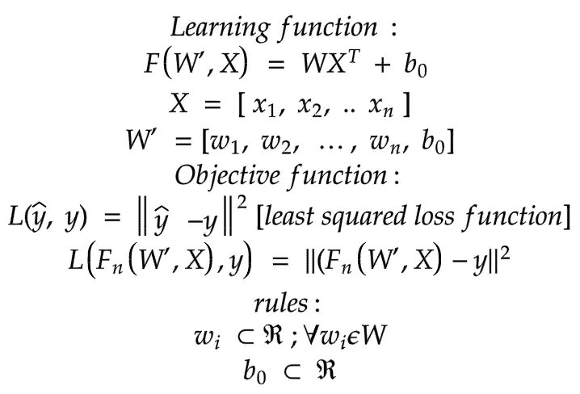

在反向传播步骤中，我们计算每个参数应该改变多少，以降低给定`X`值处的损失函数值[如果我们在每个数据点反向传播]。

现在我们知道了学习函数，目标函数，以及一点点学习函数是如何变化的。现在让我们来解决我们最大的问题，“ReLU 激活如何用一个线性函数以非常高的精度逼近一个复杂的函数？”。为了说明这一点，我们试图建立一个对数函数的回归模型。

假设我们想要“学习”二维输入的以下函数:

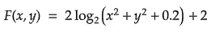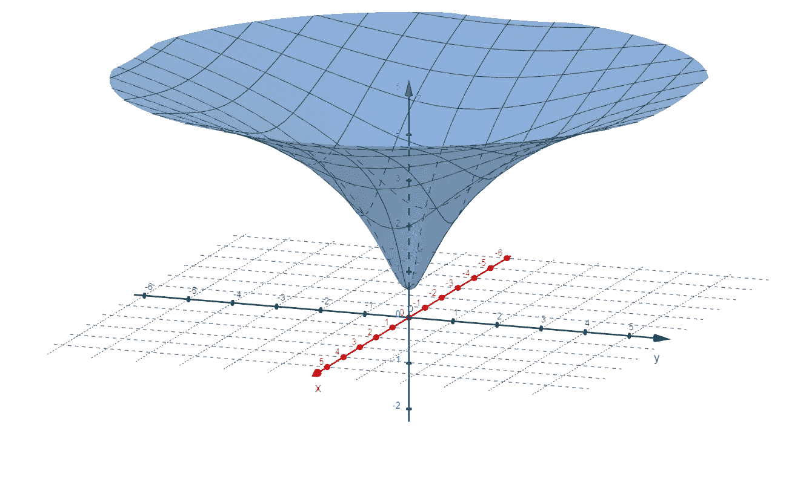

为了方便我们创建最终的图形，这里我们建立一个 4 层的神经网络，有 2 个输入和 1 个输出。你会看到除了 **logits 层**【输出神经元】之外，每个神经元后面都有 ReLU 激活函数。在潜入 3D 空间之前，需要了解一件小事；即使我们的输入是 2D，ReLU 也只接受向量空间[1D 输入],正如我们之前看到的。但这并不意味着我们的学习功能只接受一个输入。

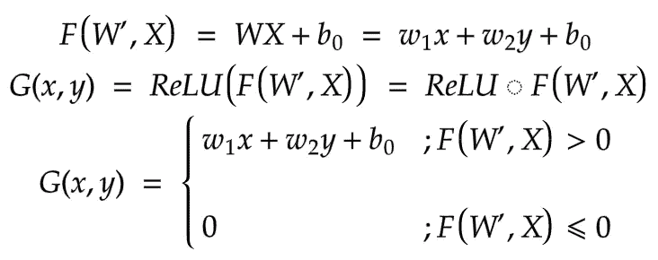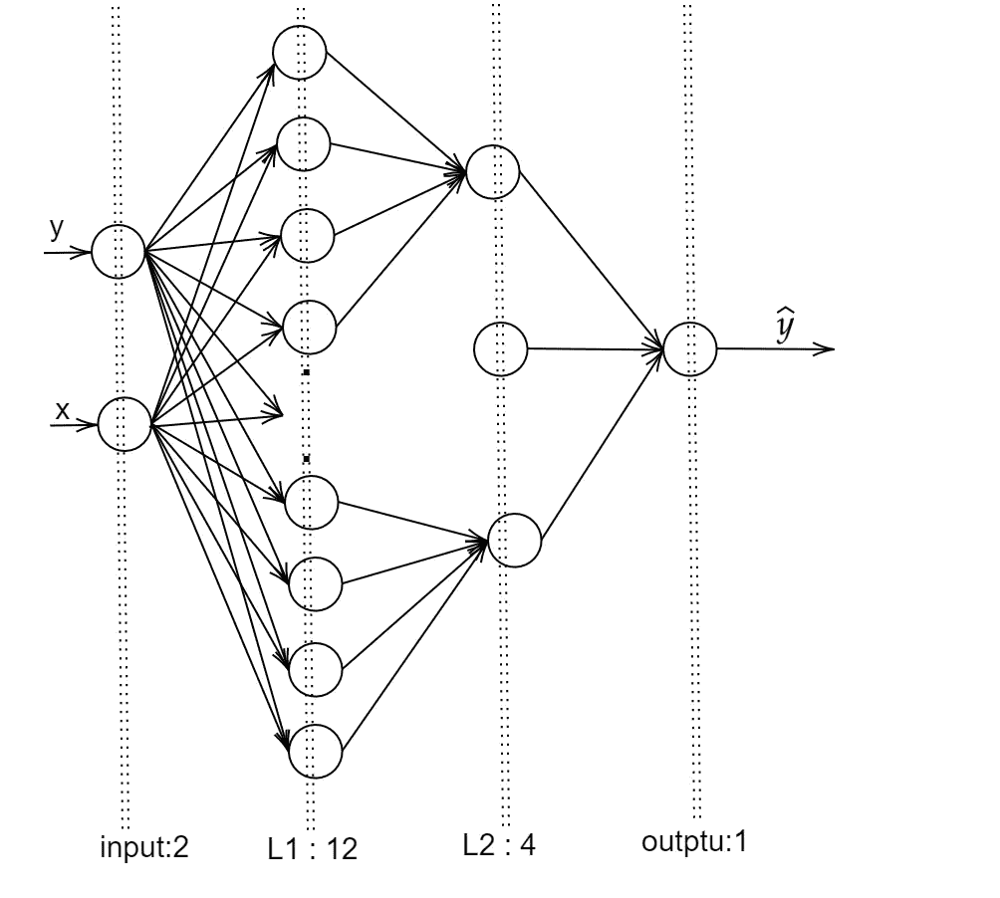

第一步:*在 2D 空间中重新折叠图形*

我们希望神经网络做的是找到一个函数，该函数(如果按照我们的要求训练的话)给出与上面的对数函数的平滑曲线接近的形状。

现在想象一下:

想一个由 2D 函数值构成的曲面。想象它是 x-y 平面上方的一个可拉伸、可折叠的表面。现在，改变 x-y 平面上方的曲面形状相当于改变输入-输出关系:也就是说，每个不同的形状都是不同的函数。飞机越扭曲折叠，功能越复杂。

现在来做一些“精神折纸”:

简单的 F(x，y)= WX + b 在做平面。

应用一个 Relu 意味着“折叠”穿过切割 x-y 平面的线，如步骤 1 所示。

请注意，我们的神经网络的第 2 层有 12 个节点，每个节点给出简单 1 折曲面的不同版本。

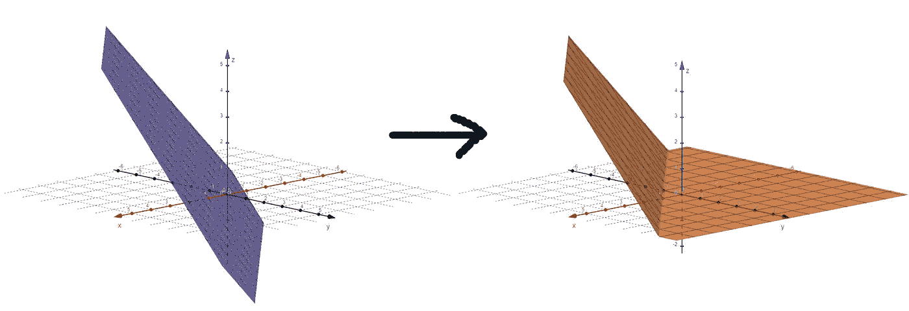

步骤 2:前一层中功能的集合。(我们对第 2 层中的输入做了什么)

我们的神经网络的第二个隐藏层的每个节点将 4 个这样的 1 折曲面作为输入，然后将它们相加(将 4 个曲面叠加在一起)。这创造了一个很好的“漏斗形状”。基于我们的线性权重矩阵 w，我们得到长/高漏斗、平/开口漏斗和许多其他形状。

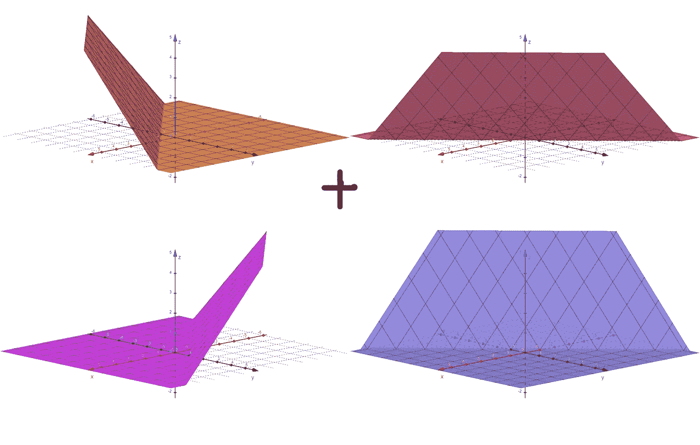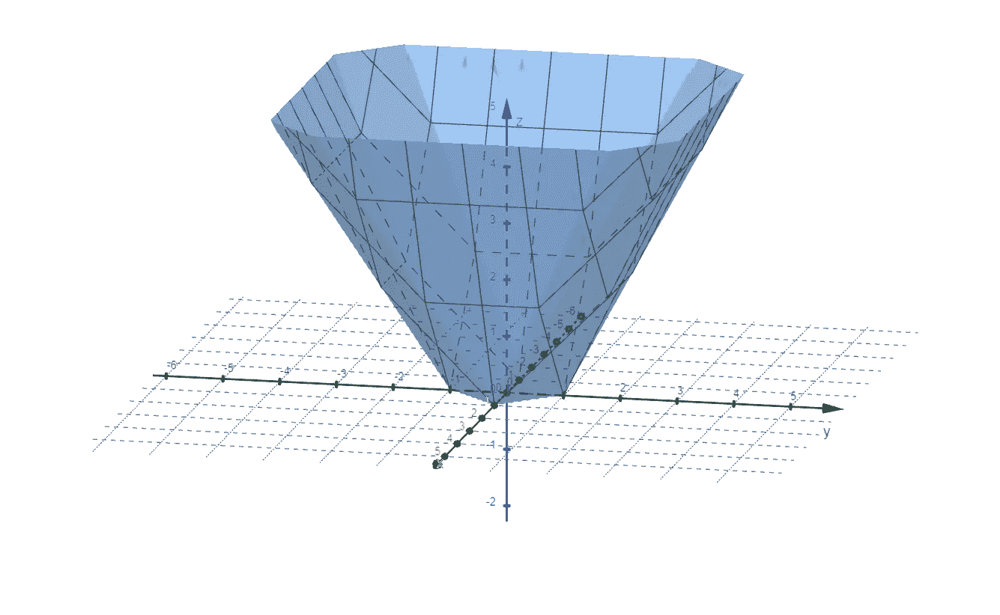

层 2 的 Relu 现在使 x-y 平面下的表面变平，以给出最终的漏斗形状。

步骤 3:集合函数空间的集合函数。(第 3 层的输出)

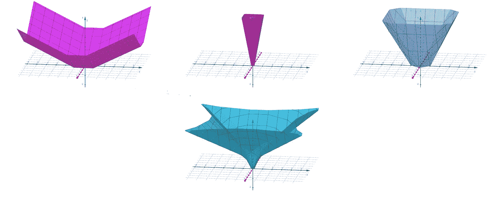

现在，我们每个节点有三个漏斗的集合，这些集合构成了一个更复杂的漏斗。

第四步:创建最终学习函数。(第 4 层-没有 ReLU，只是一个聚合)

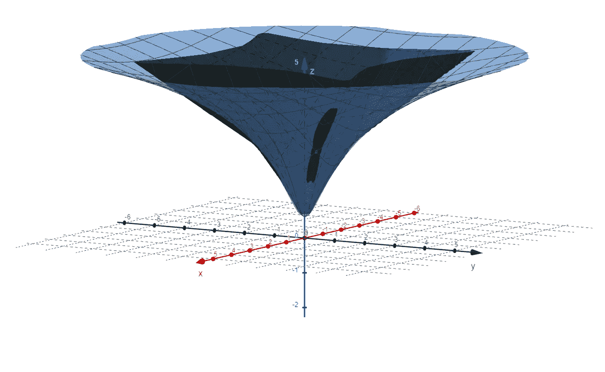

第五步:模型建立的实际学习功能

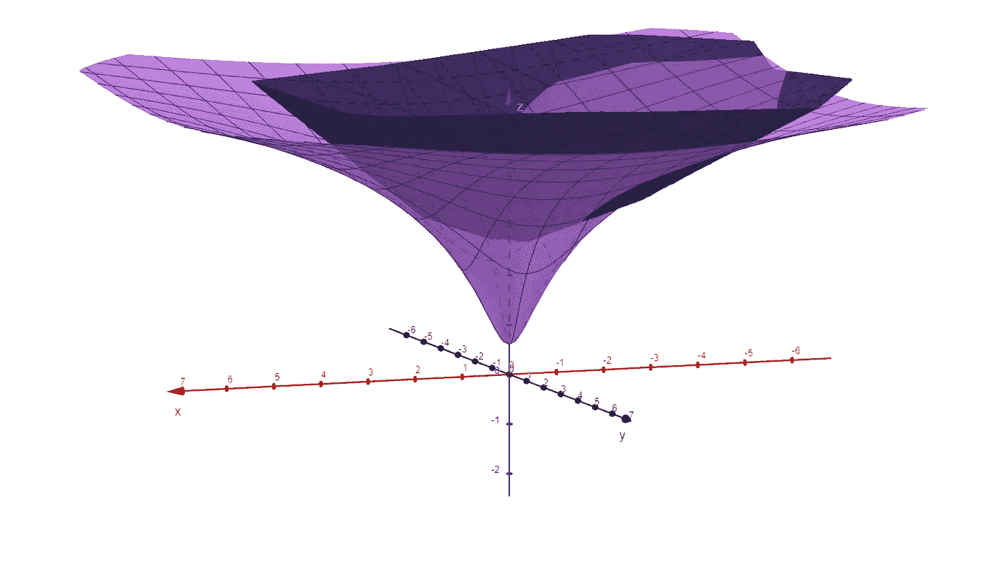 [## geogebra-文件- Google Drive

### 编辑描述

drive.google.com](https://drive.google.com/drive/folders/1jMvEqEx0Xi1lwy8IerYphouAAQAcjiJ0?usp=sharing) 

现在，唯一剩下的问题是为什么 ReLU 激活在深度学习中受欢迎。

*   ***“ReLU 赋予模型函数流形空间”。*** A **流形**是一个“局部”类似欧几里得空间的拓扑空间。这仅仅意味着我们可以用一个流形在一个相对低维的空间中表示高维空间。这里我们通过 2D 无穷小面片【平面】建立到三维空间的流形。因此，我们可以像在梯度下降中使用**等高线**图一样使用这个空间。
*   还有，最后的学习函数是一个“n 重**折纸空间”**。这意味着通过折叠空间来增加维度，就像通过折叠 2D 纸来构建 3D 折纸一样。 **N 折**的意思是，折纸空间中所有的折线都是恒定梯度的【直线】。我们可以利用这些特性，使用线性规划(如单纯形算法)来优化学习函数。
*   ReLU 是一个计算非常简单但功能非常复杂的函数。数学上，这是输入函数和单位阶跃函数之间的卷积。这意味着我们的模型更复杂，计算负担更少
*   使用 ReLU 时，自动签名比使用其他激活功能相对容易。这意味着使用 ReLU 激活不会改变学习函数的导数，因此 ReLU 激活不会在每次反向传递时增加计算梯度的额外负担。

最后，我们已经讨论了 ReLU 激活函数是什么**，**它对学习函数有什么作用，它如何构建精确而复杂的学习函数，以及为什么 ReLU 在深度学习中如此有前途。我们对 ReLU 激活函数的讨论到此结束。

谢谢大家！