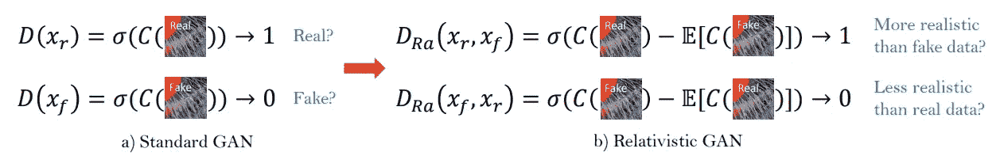

# ESRGAN 方法的概述和实现

> 原文：<https://medium.com/analytics-vidhya/how-esrgan-improves-super-resolution-performance-15de91d77ada?source=collection_archive---------4----------------------->

SR 与 SRGAN 的性能比较

# 方法概述

我们将总结 ESRGAN(增强型超分辨率生成对抗网络)[1]的关键概念以及本文中提出的提高单幅图像超分辨率的感知质量的方法。该文件提出了以下技术:

*   根据 EDSR[4]的观察结果，使用 RRDB(残差密集块中的残差)改进模型架构，无需批量标准化。
*   使用 RaGAN(相对论性 GAN)[3]相对损失，而不是之前用于对抗性损失的交叉熵损失。
*   通过比较激活前的 VGG 层，改善 SRGAN[2]的感知 VGG 损失。

ESRGAN 的完整实施和培训可以在[这里](https://colab.research.google.com/drive/1rmwJrrHB8L7m1RmSUQhmbfy1iS09gLmO?usp=sharing)找到。

# 模型架构

## RRDB(残余致密岩块中的残余)

左:斯尔甘残余地块/右:RRDB 地块

ESRGAN 遵循 SRGAN 的基线 ResNet 风格架构，但用 RRDB 块替换了残差块。RRDB 街区受到 DenseNet 架构的启发，将剩余街区内的所有层直接相互连接起来(见右图)。我们可以通过将前一层输出的级联数组馈送到下一个卷积来实现类似于 DenseNet 的 RRDB 模块。下面的代码实现了 RRDB 块。

ESRGAN 发生器模型与 SRGAN 发生器完全相同，只是对残差块进行了修改。所以我们可以简单的冻结 SRGAN 模型实现，只改变残差块。我们还将残差缩放应用于残差块的输出。

作者引用“在不同的面向 PSNR 的任务中，包括 SR 和去模糊，去除 BN 层已经被证明可以提高性能和降低计算复杂度。”，并因此移除每个残余块中的批量归一化层。这是因为对于每个图像以及测试图像，每个层的统计数据都非常不同。这违背了 BN 的假设，即训练/测试图像的特征是相似的，因此使用测试集的训练数据的统计。上图显示了添加 BN 时经常出现的不必要的批量归一化伪像。

此外，作者试验了几种技术来提高性能，并采用残差缩放和较小的参数初始化。残差缩放是乘法残差缩放是在添加到主模块之前，将范围[0，1]中的参数β乘以残差输出的过程。本文采用β=0.2。

# 损失函数的改进

## 拉甘相对论损耗

相对论损失通过修改鉴别器来预测 Xr 比 Xf 更真实的概率，从而测量图像之间的“相对”真实性。作者认为，这种对鉴别器角色的修改“显示出有利于学习更清晰的边缘和更详细的纹理”，但指标(FID/IS)在论文中没有测量。下图比较了结果(第 3 次和第 4 次)。我认为这是本文中的一个缺陷，即本文中的感知指数仅在人类意见调查中测量，因此没有被用于调整超参数和模型设置。拉甘损失实现如下。

## 修正的 VGG 损失

作者认为，信号大多在激活功能后消失。例如，在 vgg 19–54 层之后，图像“狒狒”的激活神经元的平均百分比仅为 11.17%。因此，作者比较了 ReLU 激活前的特征，以测量 VGG 损失。由于 ReLU 激活函数被嵌入在 Conv 层内，这种修改的 VGG 损失是通过手动应用卷积运算并在最终层添加偏置权重来实现的。以下代码将按照本文中的意图对 VGG 网络进行切片，并且 VGG 损失被计算为训练期间 HR 和 SR 图像的 MSE。

这两个模型的结果基本相同，除了由于 ReLU 激活导致负值消失。正如本文所讨论的，ReLU 函数杀死了中间层的很大一部分。

## 完全损失

总损失定义为三种损失的总和。每个重量的超参数设置为λ= 5×103，η= 1×102。与 SRGAN 不同，本文将 L1 损失与 VGG 感知损失相加。

# 结论

我们回顾了 ESRGAN 提出的提高超分辨率性能的方法。在感知质量方面，ESRGAN 似乎优于所有其他模型，但在实时性能和超参数调整方面，似乎仍有进一步改进的空间。虽然 IS/FID 不是测量感知图像质量的完美指标，但如果在比较不同模型配置时将这些指标作为辅助信息给出，可能会有所帮助。

我们将以更多的 ESRGAN 输出的例子来结束这篇文章。

# 参考

[1]王，，等.“Esrgan:增强的超分辨率生成对抗网络”欧洲计算机视觉会议(ECCV)研讨会会议录。2018.

[2] Ledig，Christian 等，“使用生成式对抗网络的照片级单幅图像超分辨率”*IEEE 计算机视觉和模式识别会议论文集*。2017.

[3]若利科尔-马蒂诺，亚历克西亚。"相对论鉴别器:标准氮化镓中缺失的关键元素." *arXiv 预印本 arXiv:1807.00734* (2018)。

[4] Lim，Bee 等，“用于单幅图像超分辨率的增强深度残差网络”IEEE 计算机视觉和模式识别研讨会会议录。2017.