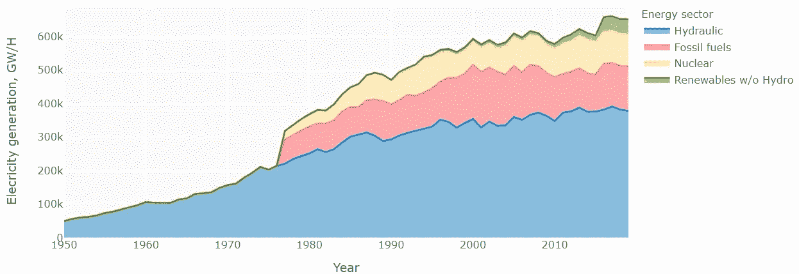

# 加拿大在发电方面有多“环保”？

> 原文：<https://medium.com/analytics-vidhya/how-green-is-canada-in-terms-of-electricity-generation-15ec0da8a556?source=collection_archive---------22----------------------->

众所周知，加拿大是可再生能源的重要参与者，但是他们的电力有多少是由可再生能源产生的呢？随着时间的推移，随着新的可再生技术的加入，这种情况会发生怎样的变化？

在本文中，我们将通过使用数据来描述加拿大的发电情况，并尝试回答这些问题，从而对该国的能源状况有一个清晰的了解。

为了进行分析，我们将使用三个数据集:

*   从 1950 年到 2007 年的加拿大电力统计数据，这是按能源部门划分的各省和全国每月发电量的复合数据。
*   加拿大 2008 年至 2020 年的发电量，延续之前的数据集。
*   英国石油公司的统计审查来自世界能源，世界复合能源的统计运行的跨国公司。

所有的图表和分析都是使用 Python 完成的，特别是 Pandas、Numpy & Plotly。如果您对本文背后的代码感兴趣，请访问这个 Github [资源库](https://github.com/leopalavicini/energy_canada)。

加拿大从 1950 年到 2007 年的电力统计数据和加拿大从 2008 年到 2020 年的发电量数据集，都是在[加拿大](https://open.canada.ca/en/open-government-licence-canada)开放政府许可下许可的。

## 总发电量

首先，让我们定义什么是发电，这是多少电力正在生产在一个特定的时期。最常见的单位是千瓦/小时，但对于商品，我们将使用千兆瓦/小时(GW/H)。

## 2020 年电源分布

到 2020 年，加拿大发电的主要来源是水力发电，占加拿大总发电量的 60%。接下来的来源是高达 17%的化石燃料和 15%的核能。

水力发电之外的可再生能源对加拿大的发电影响较小，因为它们合起来占总发电量的 7%，而风力是主要来源。

将所有可再生能源加在一起，它们约占加拿大全部发电量的 68%，使其成为一个超过一半发电量来自可再生能源的国家。

## 1950 年至 2019 年的发电量

随着时间的推移，随着新技术的增加和其他技术的减少，这种发电量的分布已经发生了变化。但是有一个不变的事实，那就是水力是最重要的能源。

另一方面，化石燃料发电和核能发电始于 1977 年，从那以后，它们一直分别是第二和第三重要的能源。

在 2010 年之前，没有水力发电的可再生能源发电量很低(不到 15，000 GW/H)。但在 2016 年大幅增加，超过一倍。看看同一时期的图表，除了水力发电，我们可以看到这种增长的影响。

可再生能源发电量的大幅增长应归功于风力涡轮机，仅在一年内(2016 年)，该行业的发电量就增长了两倍。随着这种增长，风能成为加拿大第二重要的可再生能源，仅次于水力发电。

生物质是第三重要的可再生能源，它在 1974 年开始发电。直到 2002 年，生物质部分一直在增长，此后达到了大约 10，000 千兆瓦/小时的稳定水平。

太阳能在 2011 年开始产生大量能量，但直到 2016 年，与风能一样，该行业的发电量增加到 2000 千兆瓦/小时。

加拿大的另一种可再生电力来源是潮汐，这种来源从未产生大量电力，其最高发电量为 27 千兆瓦/小时。2019 年，加拿大唯一的潮汐能电厂被关闭，导致不再有这种电力。

# 每个省的发电量

现在，我们对加拿大作为一个国家的发电量有了更好的了解，让我们深入了解每个省的发电量，重点关注总发电量及其最重要的电力来源。

## 总发电量

发电量最大的省份是魁北克省，约为 122，000 千兆瓦/小时。其次是安大略省，为 93，000 千兆瓦/小时。到目前为止，2020 年这两个省的发电量占加拿大总发电量的 50%。

艾伯塔省和不列颠哥伦比亚省生产了全国 20%的电力。产量最少的地区是北方，不到 1%。

## 每个省的主要电力来源

通过查看地图，我们可以看到每个省的发电量各不相同，水力和化石燃料是 5 个省最重要的电力来源。这完全说得通，因为水力是这个国家最大的能源，化石燃料是第二大能源。

其余省份的另外两个最重要的电力来源是核能(安大略省和新不伦瑞克省)和风能(爱德华王子岛省)。

仅在一个省，除了水力发电，电力的主要来源是可再生能源。所以，让我们分析一下每个省的主要可再生能源来源。

如上图所示，几乎在每个省，最重要的可再生能源是风能。唯一一个风能不是主要可再生能源的省份是不列颠哥伦比亚省，那里 2020 年主要的可再生电力来源是生物质。

# 结论

事实上，加拿大在发电方面是一个“绿色”国家，因为大约 68%的发电量来自可再生资源，主要是水力和风力。自 50 年代以来，这一直是该国的标准，因为从那一年到今天，水力发电一直在增长。

近年来，随着新技术和新投资的出现，风力发电行业将继续增长，成为中国更重要的能源来源。这也适用于太阳能，太阳能还有很大发展空间，还没有真正开发出来。