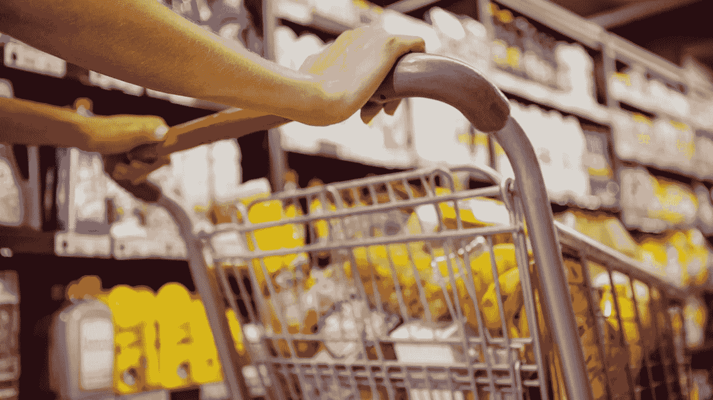
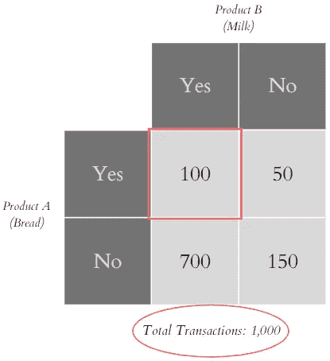
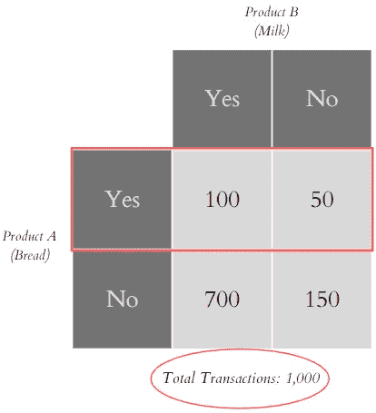
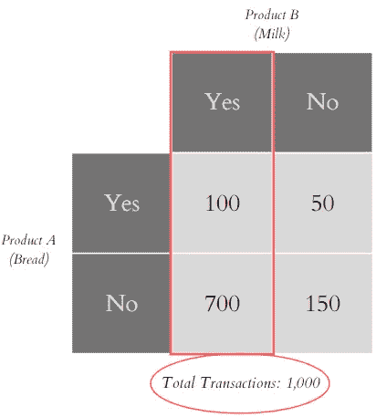
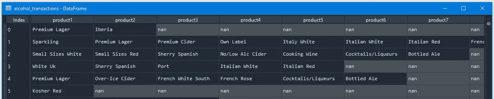
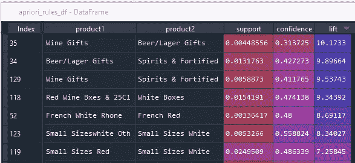

# 杂货店如何哄骗你买一件又一件商品

> 原文：<https://medium.com/analytics-vidhya/how-grocery-stores-trick-you-to-buy-an-item-after-another-1f7d9e4b3fb4?source=collection_archive---------4----------------------->

图片由[壁纸洞穴](https://wallpapercave.com/w/wp9217953)

*杂货店如何决定哪一条通道穿过另一条通道，以及不同的类别和/或产品如何彼此相邻。额外收获:包括一个 python 代码。*

你有没有想过杂货店是如何决定哪一条过道穿过另一条过道的？还是不同品类和/或产品旁若无人？或者你可能也注意到他们是如何销售商品或捆绑商品的，比如买一送一？这就是*联想分析*是什么。

# 联想分析

***关联分析*** 是发现隐藏在大型数据集中的有趣关系的有用方法。它使您能够识别彼此有关系的项目。它更常用于分析交易数据，这被称为市场购物篮分析，以确定哪些项目是经常购买的或在交易中一起出现的。

许多企业从日常运营中积累了大量数据。如前所述，杂货店就是一个例子。零售商对分析数据感兴趣，以便了解客户的购买行为。这些信息可用于支持商业决策，如营销促销和库存管理。

关联分析产生简单的规则。一个例子是:

如果{产品 A}、{产品 B }→{产品 C}或{面包、鸡蛋}→{牛奶}

这些是简单的“如果”“那么”类型的规则。该规则有两个前提(产品 A 和产品 B)和一个结果(产品 C)。这里，规则长度等于三，因为有三种产品，项目集是{面包，鸡蛋，牛奶}。

# 关联规则学习

***关联规则学习*** 是一种发现不同数据点之间关系强度的方法。它通常用于了解哪些产品经常一起购买，如上面的面包-鸡蛋-牛奶示例中简要说明的那样。一种常用的关联学习算法叫做 *Apriori* 。

> Apriori 算法采用两步“连接”和“剪枝”来缩小搜索空间。这是一种发现最频繁项目集的迭代方法

先验有四个度量: ***支持*** *，* ***信心*** *，* ***预期信心*** *，**。这四个指标中的每一个都将帮助您理解它们以自己的方式与其他项目的关系。*

# *先验度量*

## ***支持***

****支持*** 给出了一个*项目集*在所有事务中的频繁程度。它给出了包含产品 A 和产品 b 的所有交易的百分比。*

**

*简而言之，包含产品 A & B 的交易数除以总交易数。*

*这里，100/1000 =**0.1***

*这意味着所有交易的 10%包含面包和牛奶。*

## *信心*

***例如，在包含{产品 A}的所有交易中，有多少也包含{产品 B}？***

**

*置信度等于包含产品 A & B 的交易数量除以包含产品 a 的交易数量*

*这里，100 / 150 = **0.67***

*这意味着在所有包含面包的交易中，67%也包含牛奶。*

****注意:*** *如果您交换产品 A 和 B 的顺序，意味着产品 A 现在是牛奶，产品 B 现在是面包，那么这个指标将会改变。主要原因是牛奶比面包更容易买到；所以等式的分母会改变，置信度也会改变。**

*在上面的信心例子中，67%的分数会让你认为面包和牛奶之间有很强的关系。但实际上，这 67%中的大部分可能是因为牛奶被如此普遍地购买，以至于它们经常出现在大多数其他产品中，即使它们之间并没有特定的关系。为了规范它们，需要另外两个指标(*预期信心*和*提升*)。*

## *预期信心*

****预期置信度*** 是包含产品 b 的所有交易的百分比。*

**

*预期置信度的等式是包含产品 B 的交易数除以总交易数。*

*在这里，800 / 1000 = **0.8***

*在我们得出预期置信度的结果之前，我们需要跳到最后一个指标，即 ***提升*** 。*

## *电梯*

****Lift*** 是项目组合的置信度除以后件的支持度。它是*置信度*超过*预期置信度*的因子。Lift 在控制产品 B 受欢迎程度的同时，告诉你产品 A 被购买时，产品 B 被购买的可能性有多大。*

*在面包牛奶的例子中，它仅仅意味着当面包被购买时，牛奶被购买的可能性，同时控制牛奶的受欢迎程度。*

*回到 ***置信度*** 的例子，我们得到的结果是 0.67。它显示，在所有包含面包的交易中，67%包含牛奶。那么对于 ***预期置信度*** ，我们的得分是 0.8。这意味着在所有的交易中，80%含有牛奶。为了计算 ***升力*** ，我们只需将*置信度*除以*预期置信度*即可。所以，0.67 / 0.8 等于 0.83。0.83 的升力指数意味着什么？这只是意味着它们出现的频率比基于牛奶购买频率的预期要少。*

****注:*** *A lift 得分* ***大于 1*** *表示产品 A 和 B 一起出现的频率高于预期。并且 lift 得分* ***小于 1*** *表明产品 A 和 B 一起出现的频率低于预期。**

*在示例中，我们只计算了面包和牛奶之间的关系。然而，在现实中，您将同时计算多个产品，您所需要的只是对每个产品的提升分数进行排序，以查看哪些产品彼此之间的关系最密切。*

*就是这样！您现在已经理解并能够回答前面的问题，即杂货店如何决定哪一个通道在另一个通道的对面，不同的类别和/或产品如何彼此相邻，以及商品如何打折。现在去杂货店，观察产品的摆放！*

# ***在 Python 中运行***

***问题来自** [***数据科学无限课程***](https://data-science-infinity.teachable.com/courses/data-science-infinity?affcode=716157_jcwmqdhh)*

***问题概述**:使用提供的数据分析酒类销售，并确定哪些产品是一起购买的，以决定哪些产品可以放在彼此附近，从而使客户的商店更容易运营，并让营销团队知道哪些产品应该做更多广告并吸引客户购买。*

****数据集概述:****

**

****结果解读*** :如下图所示，第一行 lift 得分为 10.17，这意味着葡萄酒礼品经常与啤酒/淡啤酒礼品一起购买。下一行是啤酒/贮藏啤酒礼品，通常是购买烈性酒&,以此类推。*

**

*从商业角度来看，看到上面的结果将对你如何在商店中战略性地放置酒类物品有很大的帮助。*

****参考文献:****

* [## 数据科学入门(2021 版)

### 加入这个免费的在线课程，了解数据科学。本课程将向您介绍数据的基本原理…

open.sap.com](https://open.sap.com/courses/ds3)  [## 数据科学无限

### 以正确的方式学习正确的内容，并提供无限的支持和指导，我致力于帮助您成为一名…

data-science-infinity.teachable.com](https://data-science-infinity.teachable.com/courses/data-science-infinity?affcode=716157_jcwmqdhh) 

[https://www.softwaretestinghelp.com/apriori-algorithm](https://www.softwaretestinghelp.com/apriori-algorithm/)*