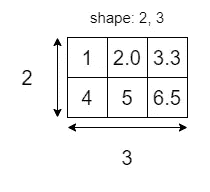
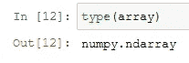
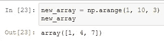
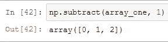

# 我是如何学习机器学习的——第三周:python 和 numpy(第一部分)

> 原文：<https://medium.com/analytics-vidhya/how-i-am-learning-machine-learning-week-3-python-and-numpy-part-one-ca7227d8f855?source=collection_archive---------17----------------------->


Numpy 是一个强大的 python 包,主要有三个原因:

*   python 很慢， [numpy 大部分是用 C](https://github.com/numpy/numpy) 编写的，这是有史以来最快的语言之一。
*   Numpy 是其他包的主干。
*   这使得使用*数组*和*矩阵*变得容易。

机器学习的核心是通过大量数字发现模式，这就是为什么 numpy 是*必不可少的*。

# 数字阵列的剖析

由 [mrdbourke](https://github.com/mrdbourke) 的机器学习课程所举的例子

在机器学习中，我们的主要关注点将是我们的数据形状如何与其他数据和输出对齐，numpy 数组，技术上称为 [ndarrays](https://numpy.org/doc/stable/reference/arrays.ndarray.html) ，或 n 维数组，将是基础。

# 导入数字

你不会忘记最重要的事吧？


# 一维数组

第一种类型的 ndarray 是最简单的:只有一维的数组，通常称为 vectors:


每个数组都有一个*形状*，在本例中是 1 和 3。


# 二维数组

二维数组通常被称为*矩阵*，与熊猫数据帧非常相似:


很明显，连形状都变了。



# 三维阵列

三维数组是多维数组的概念非常重要的时候。此后，数组就被简单地称为 n 维数组:


现在形状有了均匀的深度。


如果你记得我在[上一篇文章](https://dev.to/russianmouth/how-i-am-learning-machine-learning-week-3-python-and-numpy-47l1-temp-slug-2512393?preview=fff6ca1119f66069a36df85f17c6cbebd0d455943a52875f2bf50ad669f77dec0534b1d8ce54de1e54d8c7e97f57917ceec29826dbb301feef69e554)中提到的轴心，这就是它变得重要的地方。

# 使用 numpy 创建数组

我们已经看到了 numpy 中数组的结构，但是，很明显，创建一个总是自己键入每个值的数组是低效和无用的。

# 示例数组

我们可以用函数 *ones()* 创建第一个示例数组，但是如果我们使用快捷键 **shift + tab** 我们可以不用搜索文档就能看到函数做了什么，它会出现在函数本身的下面:


但是这些信息还不够。我们可以通过单击 x 在小窗口中实际滚动所有文档，或者单击^将文档定位在屏幕的下部来查看更多内容:


向下滚动，在这种情况下，我们甚至可以看到如何使用该功能的示例:


现在我们知道我们可以在函数中放入什么，以及预期会发生什么:


我们已经定义了数组和输出的**形状**，对应于一个两行四列的表，或者一个包含两个数组的数组，每个数组有四个元素。

# 为什么都是 1？

有时候，在开始工作之前，我们可能想要确定我们的数组的*形状*，这就是为什么我们可能想要创建一个填充 1 或 0 的数组——另一个 numpy 函数——创建一个具有*初始*形状的简单数组。

# 有用的功能和方法

在这一节中，我们将深入研究 numpy 提供的最有用的函数和方法，然后介绍随机数的概念。

# 数据类型

dtype numpy 方法向我们展示了数组的数据类型。
使用之前的数组:


用函数创建一个数组，如本例所示，默认类型是 *float64* 。

# 类型

type 函数将简单地显示我们有什么类型的数组，在 numpy 中，它将总是产生一个 ndarray，正如我们已经说过的:



# 大小

size 方法将告诉我们数组中有多少个元素。


# 形状

shape 函数将显示数组的形状:


# Ndim

ndim 方法显示数组有多少维:


在这种情况下，这个数组是一个矩阵，然后是二维的。

# 阿兰格

Arange 让我们在一个范围内生成数字。按下括号中间的 shift + tab，我们可以阅读文档以更好地理解它的作用:

```
Docstring:
arange([start,] stop[, step,], dtype=None)Return evenly spaced values within a given interval.Values are generated within the half-open interval ``[start, stop)``
(in other words, the interval including `start` but excluding `stop`).
For integer arguments, the function is equivalent to the Python built-in
`range` function, but returns a ndarray rather than a list
```

但是这个，尽管非常清楚，但是如果我们看例子的话，它太罗嗦了

```
Examples
--------
>>> np.arange(3)
array([0, 1, 2])
>>> np.arange(3.0)
array([ 0.,  1.,  2.])
>>> np.arange(3,7)
array([3, 4, 5, 6])
>>> np.arange(3,7,2)
array([3, 5])
```

因此，第一个参数是范围的开始，第二个是结束，第三个是跨度，让我们在实践中看看:



# 兰丁特

我们可以用 random.randint 函数在一个数字范围内创建偶数的随机数组。
按下 shift + tab 我们可以读到:

```
Docstring:
randint(low, high=None, size=None, dtype=int)Return random integers from `low` (inclusive) to `high` (exclusive).Return random integers from the "discrete uniform" distribution of
the specified dtype in the "half-open" interval [`low`, `high`). If
`high` is None (the default), then results are from [0, `low`).
```

但是最好的方法总是去探索:


默认情况下，第一个参数是 1，所以如果我们只是在函数中键入一个数字和一个形状，它将创建介于 0 和我们放入的数字之间的值。

我们已经创建了一个数组，其值的范围在 4 和 9 之间，形状为 2 和 5。


# 随意

但是如果我们想创建一个没有精确范围的随机数组，我们可以使用 random 函数。我们只需输入形状:


random.random 介于 0.0 和 1.0 之间。

# 编程中的随机性

计算机只能处理二进制值 0 和 1，那么计算机怎么能产生随机值呢？
计算机通过一个按惯例被称为*种子*的函数来创建**伪随机**值。如果我们总是对随机值使用相同的种子，这些值将总是相同的，否则，numpy 将总是更改种子以创建看起来随机的值:


我们可以*手动*声明种子，这样即使在运行命令时数字是随机的，它们也总是相同的，因为它们基于相同的种子:


# 操纵数组

Numpy 通过一种叫做 [**广播**](https://numpy.org/doc/stable/user/basics.broadcasting.html) 的技术为我们提供了很多操纵数组的方法。让我们从创建可以进行测试的新阵列开始:


有了 numpy，我们可以进行基本的算术计算，这一点我们现在就能看到，其他的我们将在第二部分看到:

# 附件

我们可以使用运算符直接在数组中进行计算，但是，在某些情况下，它可能会给出我们不希望的结果:


所以最好使用 numpy 提供的专用功能:


这就是我们想要的结果，[1，2，3] + [4，5，6]给了我们第三个数组，里面有[5，7，9]。

# 减法

如果没有这个函数，我们会有一个错误，但是使用它一切都按预期工作:


但是当使用 numpy 函数时，我们不需要只使用数组，我们甚至可以降低一个数组的所有元素，或者我们想要的任何数字:



# 除法和乘法

使用专用的 numpy 函数，一切都会很好:


# 楼层划分和权力

如果我们在划分数组时不想要小数，我们可以使用 floor division 函数，该函数将返回不含小数的数组以及我们不想要的类型，我们可以使用 tolist 函数来修复它:


对于两个数组的能力，情况是一样的:


# 最后的想法

这是关于使用 numpy 进行机器学习的第一部分，如果你有任何疑问，欢迎留下评论。

最初发表于[发展至](https://dev.to/gabrieleboccarusso/how-i-am-learning-machine-learning-week-3-python-and-numpy-part-one-27b4)