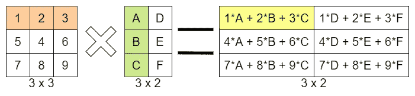

# 我是如何学习机器学习的——第四周:python 和 numpy(第二部分)

> 原文：<https://medium.com/analytics-vidhya/how-i-am-learning-machine-learning-week-4-python-and-numpy-part-two-afe036916260?source=collection_archive---------20----------------------->

本周我们将看到在我们的机器学习项目中使用 numpy 可能需要的所有函数的最后一部分。让我们开始吧！

# 查看操作性能

在 python 中，使用 numpy 以及其他语言，我们将有很多方法来做同样的事情；在 python 中，我们有 *sum* 函数，在 numpy 中，我们还必须有 *np.sum* 函数。


如您所见，两者返回相同的结果，留下一个问题:

> *什么时候一个功能比另一个好？*

Num 是对 python 列表求和的官方 python 函数，而 np.sum 函数是对 *numpy 数组*求和的官方函数，它们在概念上是一样的，但不是在机器必须执行计算的时候。最好的方法是对 python 数据类型(在这里是列表)使用 python 函数，对 numpy 数据类型(numpy 数组和类型)使用 numpy 函数。
但除了这两个功能的**性能**之外，还有一个更重要的区别。通过一些特殊的 numpy 函数(以开头的%为特征)，我们可以显示机器执行操作所用的*时间*，在这种情况下，我们将使用 *%timeit* 。
我们首先创建一个大数组:


然后使用 timeit 功能:


使用 google converter，我们可以看到 python sum 耗时 2.28 毫秒，而 numpy sum 耗时 13 微秒，比*快了 500 多倍*。

# 重塑和移调

正如我们已经说过的，在我们的机器学习载体中要确定的最重要的事情之一是数据*适合*其他数据，让我们看一个例子。
让我们从创建两个不同形状的不同数组开始:


让我们试着把它们相乘:


错误说两个形状不同的数组不能[一起](https://dev.to/gabrieleboccarusso/how-i-am-learning-machine-learning-week-3-python-and-numpy-part-one-27b4#manipulating-arrays)播。如果我们继续看数字文档，我们可以看到广播的一般规则是:

*当操作两个数组时，NumPy 按元素比较它们的形状。它从尾部(即最右边的)维度开始，然后向左移动。两个尺寸在下列情况下兼容:*

*   他们是平等的，或者
*   其中一个是 1

这意味着我们必须**重塑**我们的数组，我们可以用 numpy *重塑*函数来完成:


既然第一个数组对应于广播的主要规则，我们可以将两个数组相乘:


注意，整形函数遵循[精确](https://numpy.org/doc/1.18/reference/generated/numpy.reshape.html)规则，这只是一个例子，数组不能总是被整形成不同的形状。

现在我们已经看到了整形函数，让我们看看*转置*函数。


我们可以调用 transpose 函数，我们称之为“T ”,简单地在它们之间交换一个数组的轴。

*整形*和*转置*都是非常有用的函数，当我们必须做*两个或者更多矩阵的乘法*时，它们会非常方便

# 矩阵乘法

将一个矩阵乘以一个数字或者一个一维数组是相当容易的，但是将一个矩阵乘以另一个矩阵可能有点难以理解，但是非常重要。
数组互乘有两种方式:

# 元素方面

逐元素乘法非常简单，只能在相同大小的数组之间进行:


我们可以用 numpy 函数来实现:


# 点积

注意:在下面的例子中，矩阵中有一个错误:它有 5 而不是 4，反之亦然。
另一个是专门针对矩阵的，如果你第一次尝试不明白，不要担心，如果你*明白*发生了什么事情，就很简单了。


但这一点，乍一看，仍然令人困惑。让我们用一些颜色来看看:



如您所见，我们采用了第一个数组，其中的矩阵包含“1”、“2”和“3”，并将其乘以“A”、“B”和“C”。这通常被称为*瀑布法*。你可以理解为什么在这里看动画。

一般来说，要将两个矩阵相乘，它们的 T21 需要对齐。让我们看看，如果我们使用*点*函数，尝试对元素相乘的矩阵使用点积，会发生什么:


如你所见，它们没有对齐。当第一个矩阵的行 o 与另一个矩阵的列相同时，两个矩阵对齐，或:`m x n * n x p`。这样我们知道结果将是一个 m×p 的矩阵:

```
m x n * n x p = m x p
that in our case could be:
3 x 2 * 2 * 3 = 3 * 3
```

这意味着两个矩阵可以相乘。在我们的例子中，我们必须**转置轴**:


在我们的例子中，我们得到了一个 2 x 2 矩阵，正如我们已经看到的:

```
2 x 3 * 3 x 2 = 2 x 2
```

正如我们所料。如果我们转置第一个矩阵，结果将是一个 3 x 3 的矩阵。
从*数学*的角度来看点积，你可以在这里阅读。

# 比较运算符

在数组和矩阵之间，我们甚至可以做比较。结果将是另一个*布尔*数组。让我们看一个例子:


我们可以使用我们在编程载体中使用的所有逻辑运算符，但重要的是要知道比较遵循相同的传播规则:


# 排序数组

Numpy 提供了各种查找元素和排序数组的函数。最常见的方法是*排序*，当应用于一个矩阵的每一个*行*时进行排序。


# 寻找数组的最小值

为了找到数组的最小值，numpy 提供了 *argmin* 函数，该函数返回最小值的*索引*:


# 寻找数组的最大值

如果要找到最小值，我们使用 argmin，要找到最大值，我们找到 argmax:


# 关于 argmin 和 argmax 的更多信息

这两个函数都让我们输入数组的*轴*，这样我们就可以找到所有列或行的最大值或最小值，而不是所有数组的最大值或最小值:


当轴设置为 0 时，如果在所有行中设置为 1，它将找到所有列中的最大值。

# 最后的想法

上周我们看到了 numpy 库来操作数组和矩阵，我们将在机器学习中用到这些数据集。下周，我们将看到 matplotlib 将我们的数据可视化，然后专注于更实际的东西。如果您有任何疑问，请随时留下您的评论。

最初出现在[发展到](https://dev.to/gabrieleboccarusso/how-i-am-learning-machine-learning-week-4-python-and-numpy-part-two-4co4)