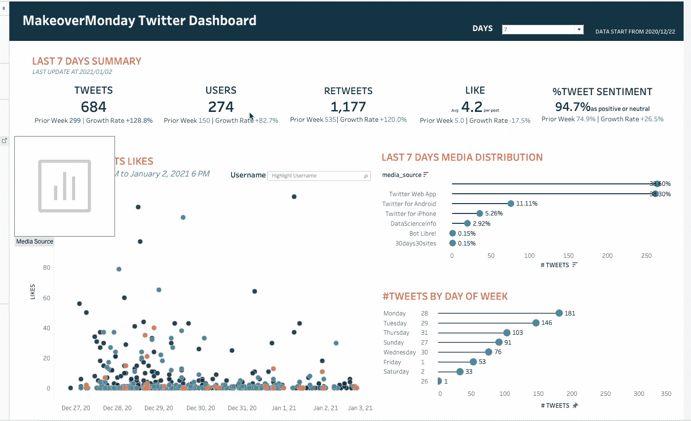

# 我如何建立一个 Twitter 仪表板

> 原文：<https://medium.com/analytics-vidhya/how-i-built-a-twitter-dashboard-4d5d0e53c36c?source=collection_archive---------8----------------------->

## 从构建 ETL 管道到自动更新仪表板。

在这篇文章中，我想分享我如何使用 Python 从 Twitter API 中提取数据，并将它们传输到 PostgreSQL 数据库中，执行情感分析，并进一步使用 Tableau 构建仪表板来跟踪每周趋势。

## 背景

> 根据 Twitter 的使用统计，每天有 5 亿条推文被发送。月活跃用户 3.3 亿。*——*[*名表*](https://www.brandwatch.com/blog/twitter-stats-and-statistics/#:~:text=Twitter%20usage%20statistics,That's%206%2C000%20tweets%20every%20second.)

*作为一名数据分析师，我很好奇人们在 Twitter 上说了什么，他们多久发一次微博，人们对特定标签的态度等等。Twitter API 为我们提供了一种简单的方法来检索关于特定关键词和标签的推文。换句话说，我可以利用这个工具来分析任何我感兴趣的话题。*

*我已经参与了几个月的周一改造项目。“改头换面星期一”是一个社交数据项目，每周都会修改一张图表，更有效地复述一个故事，甚至找到更多有趣的见解。2020 年一直是我最喜欢的项目。社区将在 Twitter 上分享他们的想法，并与其他成员互动。因此，我有兴趣从#改头换面星期一这个标签中了解更多。*

## *目标*

*这个项目旨在建立一个自动 ETL 管道，让我可以轻松地在每周一更新仪表板。为此，我选择将数据存储在 Postgresql 数据库中，这样我可以存储每周的新数据并加载到 Tableau 中。此外，我想写一个脚本，我可以重用不同的标签和关键字。*

## *我的结果*

*[Github 回购](https://github.com/thejasmine/twitter_scraper_PostgreSQL)*

*[Tableau 仪表盘](https://public.tableau.com/views/MakeoverMondayTwitterDashboard/TwitterDashboard?:language=en&:display_count=y&:toolbar=n&:origin=viz_share_link)*

**

## *一些见解💡*

**基于 2020 年 12 月 22 日至 2021 年 1 月 2 日的数据。**

*   *毫不奇怪，人们喜欢在周一发帖，因为这一天应该做项目。我也喜欢在周一完成我的项目，因为这可以迫使我更有效率。*
*   *95%的推文是正面的或自然的。人们很乐意分享他们的作品，并给予积极的反馈。*

# *过程*

*我会简单地分享我在这个项目中使用的工具和步骤。如果你有任何问题，请随时联系我。*

## *我使用的工具*

*提取数据:Twitter API、Python (tweepy)*

*将数据加载到 PostgreSQL: Python(sqlalchemy)，PgAdmin*

*情感分析:Python(TextBlob，stopwords)*

*EDA 和数据可视化:Tableau*

## *连接 Twitter API*

*Medium 里面有很多文章在讲如何连接 Twitter API。第一步是去 Twitter Developer 注册一个账户，获取你的密钥。*

*以下是我用作参考的一些资源。有不同的连接方式。请随意使用您喜欢的任何方法:)*

*   *[十二年](https://www.tweepy.org/)*
*   *[如何从推特上抓取推文](https://towardsdatascience.com/how-to-scrape-tweets-from-twitter-59287e20f0f1)*
*   *[使用 30 行 Python 代码抓取 Twitter 数据](https://chatbotslife.com/crawl-twitter-data-using-30-lines-of-python-code-e3fece99450e)*

## *将数据流入 Postgresql*

*在这一步中，我使用了 [SQLAlchemy](https://www.sqlalchemy.org/) 包。要记住的一件重要事情是，有时我们可能会从 Twitter 中提取重复的数据。因此，我们需要为我们的数据库设置一个约束，并使用下面的函数来跳过重复的行或更新现有的记录，以避免数据库中出现重复的记录。*

## *情感分析*

*情感分析是一种使用 NLP 技术来判断文本数据是积极的、消极的还是中性的方法。这里我使用了 [TextBlob 的](https://textblob.readthedocs.io/en/dev/quickstart.html) [**情绪**](https://textblob.readthedocs.io/en/dev/api_reference.html#textblob.blob.TextBlob.sentiment) 属性来获取字符串的极性得分。范围[-1.0，1.0]内的极性得分。对于这个项目，我只对推文是正面的、中立的还是负面的感兴趣；因此我选择返回 0(中性)，1(正)，-1(负)。*

## *数据可视化*

**

*最后一步是将我的 PostgreSQL 数据库与 Tableau 连接起来。我纠结的一件事是 PostgreSQL 的版本。目前，Tableau 在 PostgreSQL 10 上运行良好(对我来说是这样。)，但是 PostgreSQL 12 不行。即使 Tableau update 最新更新显示支持 PostgreSQL 12。如果您有同样的问题，只需下载旧版本的 PostgreSQL，并记住使用不同的端口号以避免冲突。*

*对于仪表板设计，我想显示本周的总推文数、独立用户数、总转发数、正面和中性推文的百分比，以及与过去七天的比较。使用大散点图，我绘制了七天内的所有推文(您可以将参数更改为 14 或 21)。它会显示该推文的用户名和特定用户的总转发数。*

## *结论*

*看到我可以轻松地构建数据管道和更新新数据，真是令人着迷。通过制作仪表板，我可以清楚地看到推文趋势，看到人们在谈论什么。*

*我希望你喜欢读这个:)*

## *参考*

*   *[Github 回购](https://github.com/thejasmine/twitter_scraper_PostgreSQL)*
*   *[画面仪表盘](https://public.tableau.com/profile/thejasmine#!/vizhome/MakeoverMondayTwitterDashboard/TwitterDashboard)*