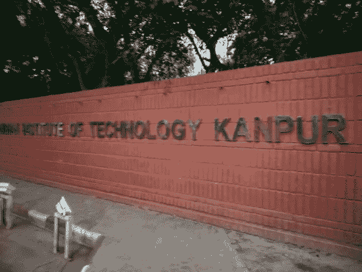
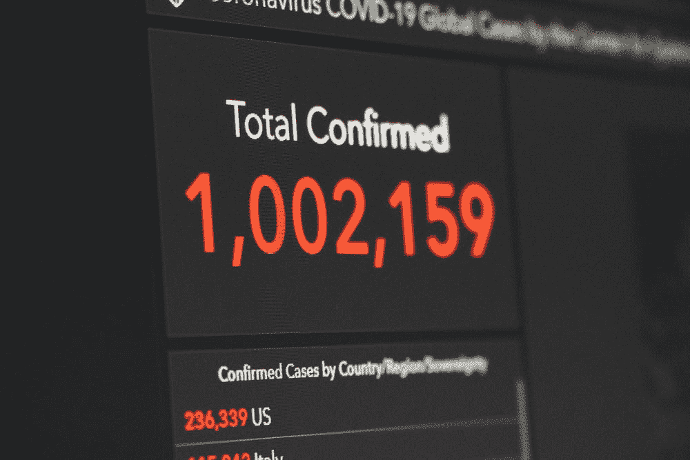

# 我是如何通过数据科学面试的

> 原文：<https://medium.com/analytics-vidhya/how-i-cracked-my-data-science-interview-16654f250178?source=collection_archive---------5----------------------->

## 印度名校之一 IIT 坎普尔的经历

来源:[https://www . quora . com/How-do-How-does-Kanpur-looks-like-you-share-some-pictures](https://www.quora.com/How-does-IIT-Kanpur-looks-like-Can-you-share-some-pictures)

## 简要介绍我的背景

我是印度理工学院坎普尔分校的最后一年本科生，主修**机械工程**系，辅修**工业工程和管理**系。

你可能会觉得有趣的是，属于一个核心领域，我是如何找到一份数据科学家的工作的。

在校园安置季(2020 年 12 月)，我被安排在 [HiLabs](http://www.hilabs.com/) 担任数据科学家。HiLabs 拥有一个专注于医疗保健的人工智能解决方案，可以在没有人工干预的情况下自动检测数据错误。它是大数据、人工智能和医学宇宙学的结合。

# 我是如何着陆的？

我如何成为一名数据科学家的故事很长。它有许多层次和章节。每个阶段都同样有助于让我进入这份工作。

## 我打赌你会发现每一章都很有趣，很有启发性。

## 第一章:开始阶段

演职员表:[马雷克·皮尼基](https://unsplash.com/@marekpiwnicki)

2019 年夏天，我报读了一门课程——数据挖掘与知识发现，这是我迈向目标的第一步。我喜欢那门课，在那期间，我知道我想成为一名数据科学家。

在那之后，我选择了一门关于 Udemy 的课程，它教会了我 python，机器学习的基本语法，ML 算法背后的直觉。本课程还包括在热门数据集(如 Titanic 和 Iris)上的实践经验。

也是我第一次使用 matplotlib 和 seaborn 进行数据探索的经历。每次我绘制图表时，这些图表都令人着迷。

## 第二章:我是一个 NOOB！

演职员表:[安东尼·陈](https://unsplash.com/@anthonytran)

我知道所有的主要语法，我准备解决简单的预测建模问题。于是，我去了 [Kaggle 团队](https://medium.com/u/c288db7291e7?source=post_page-----16654f250178--------------------------------)。我确信我现在可以解决任何预测建模问题。

但是，当我看着 Kaggle 的时候，我震惊了。我破译的所有问题都非常先进。我一个问题也解决不了。

在浪费了一个月之后，我意识到我需要更多的知识来成为一名数据科学家。

## 第三章:金色锁定

演员表:[马丁·桑切斯](https://unsplash.com/@martinsanchez)

封锁期间，Linkedin 上全是证书。每个人都学过一些课程。在一级防范的前四周，我在[的 InterviewBit](http://interviewbit.com/) 和[的 GeekforGeeks](https://www.geeksforgeeks.org/) 上提高了我的竞争性编码技能。

我几乎经历了 40 天左右的面试。

在那之后，我参加了一些数据科学的在线培训(付费)，培训的重点是解决一个预测建模问题。这是一次高强度的统计训练。它包括像推断统计学和学生 T 检验这样的新概念。

我再次感到力不从心，于是去找卡格尔。但很快，我开始意识到现在的问题更加错综复杂。所以我寻找 Kaggle 的替代品，它提供了一些简单明了的问题陈述。你猜怎么着，我找到了！

是[战队 AV](https://medium.com/u/c7c686fcd4b?source=post_page-----16654f250178--------------------------------) 。许多黑客马拉松都是可用的，并且范围各不相同。简单的预测问题、图像分类、文本和情感分析…集于一身。

我开始在 Coursera 上持续做一些关于深度学习的项目和课程。我选了三门描述 ANN 和 CNN 的课程。此外，我还参加了三次黑客马拉松。

## 第四章:实习

演职员表:[斯科特·格雷厄姆](https://unsplash.com/@homajob)

实习在我的旅程中扮演了至关重要的角色。这是 IIT 德里的一个新公司。
它的任务是将机器学习和现有的知识树结合起来，帮助学生按照自己的节奏学习。这种想法被称为适应性学习。

我学到了让我变得更强的新东西。那时我更加自信了。我用 python 分析数据，用 seaborn 和 Matplotlib 绘制各种图表。此外，阅读大量的研究论文，为我们的客户寻找解决方案。

那是一个为期三个月的实习，我没有任何报酬，只有经验。对于任何新鲜的经验，这是最好的津贴。

## 第五章:安置准备

演职员表:[绿色变色龙](https://unsplash.com/@craftedbygc)

制作简历不仅仅是实习期间的任务。所有的候选人都能写出一份像样的简历。但是如果你想被雇佣，你需要做更多的事情。

我想从事数据科学方面的职业。所以，我概括一下概率、统计学、机器学习(算法、成本函数、评估指标)、深度学习、计算机编程和数学。

此外，我还关注了一些 youtube 频道，这些频道为我提供了算法背后的理论概念。

> **我关注的 Youtube 频道:**
> 
> [克里斯·纳伊克](https://www.youtube.com/user/krishnaik06)
> [与乔希·斯塔梅](https://www.youtube.com/user/joshstarmer) r

## 第六章:面试准备

演职员表:[史蒂夫·哈拉玛](https://unsplash.com/@steve3p_0)

即使你已经体面地完成了所有的必修课，面试也需要一些额外的准备。

而这些都是 HR 问题的准备。

> 描述一下自己！
> 为什么是你？
> 为什么是我们，而不是别人？
> 你的强项和弱项？
> 你做出艰难决定的情况？你的人生哲学是什么？

你需要准备好这些问题，也要准备好你简历的每一行。

> **Youtube 人力资源频道:** [预科生](https://www.youtube.com/channel/UCg0AJl1CbDVzrjlJuk0c4AQ)

## 第七章:终局

采访！

演职员表:[拉维·帕尔韦](https://unsplash.com/@ravipalwe)

决赛需要你的耐心、信心和积极的态度。如果你没有被任何公司选中，请放松，不要惊慌。安置活动是一个漫长的游戏，每天尽可能多地接受面试。

不是每个人都第一。

# 剧终

演职员表:[马库斯·斯皮斯克](https://unsplash.com/@markusspiske)

最后，我想说所有的章节对我来说都很有趣，我希望你也是。那是我一生中非常乏味和令人疲惫的时期。但是我很享受！

请分享你的观点，我也想听听你的旅程！！