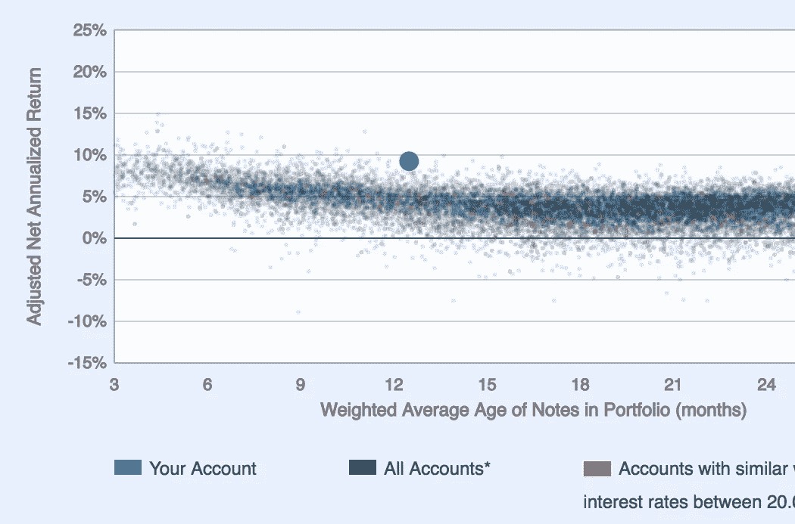

# 我是如何创建最赚钱的贷款俱乐部组合的

> 原文：<https://medium.com/analytics-vidhya/how-i-created-the-most-profitable-in-class-lending-club-portfolio-82254abd669e?source=collection_archive---------11----------------------->

我的投资组合比我的同行的多。图片作者。

Lending Club 是点对点借贷的先驱。借款人可以像在其他银行一样申请贷款。贷款申请人提供了自己的信息，他们的信用记录被删除。

与普通银行不同，Lending Club 不从储备金或储蓄账户中放贷——资金来自于那些认为…