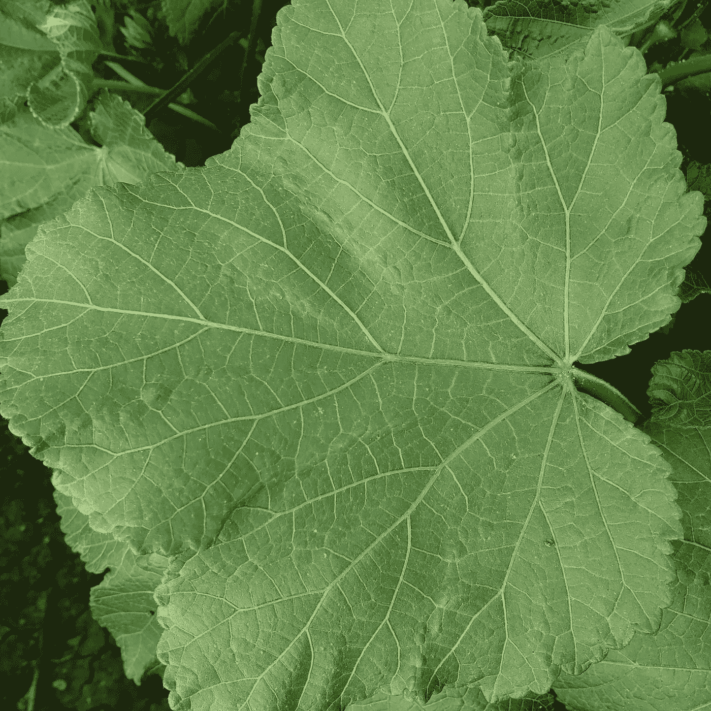

# 我如何使用深度学习帮助我的乡村农民！

> 原文：<https://medium.com/analytics-vidhya/how-i-helped-my-village-farmer-using-deep-learning-ecb1f8d5533c?source=collection_archive---------12----------------------->

> 1.**项目构思，是如何开始的？**

上个月，我完成了我的深度学习课程，这是我在 IIIT PGD 的一部分，我做了许多基于 CNN 和 LSTM RNN 的项目，但都是用公开的数据。尽管这些项目和任务看起来很酷，但这并没有给我太多的满足感。所以，我决定从头开始做一个项目。

> **2。为什么是这个项目？**
> 
> 我住在一个村子里！所以我选择了一个以农业为基础的项目，这对我来说也很容易收集数据。为了收集数据，我首先需要想一个问题，对吗？
> 所以我和离我最近的一个种植黄秋葵的农民交流，我问了他几个问题，比如影响黄秋葵生长的主要疾病是什么？
> 他不能说出确切的疾病名称，但他给我看了一些患病的黄秋葵叶子，这些叶子完全受到疾病的影响(黄脉花叶),他还提到，在疾病传播的早期阶段，很难发现疾病(因为健康和患病看起来几乎相似),当他发现疾病时，疾病几乎已经蔓延到剩余的植物。所以，在实地走了一圈并与他交谈后，我发现了问题所在，即在早期发现疾病是一件至关重要的事情，如果我们能够在早期发现疾病，我们就可以通过使用杀虫剂来阻止疾病的进一步传播。
> 所以最后我公式化了问题！🕺
> 
> **3。接下来发生了什么？**
> 
> 在我发现可以使用深度学习解决的问题后，我和我的朋友讨论了同样的问题，他同意帮助我。
> 作为该过程的下一步，我们在两天内收集了黄秋葵患病和健康叶片的图像数据，并且我们有大约 2000 幅图像准备用于训练。

好奇看数据？😃

**以下是一些样本图片**:

黄脉花叶病叶

健康的黄秋葵叶

> **4。这个项目的目标？**
> 
> 该项目的主要目标是创建一个可以检测疾病(黄脉花叶)的模型，并建议使用农药来控制疾病的进一步传播。
> 
> 您可以在我的 github 个人资料中找到该笔记本:

 [## manoj 567/黄秋葵叶黄脉花叶病预测

### 这个项目的目标是帮助农民在疾病的早期识别“黄脉花叶病”,并对其进行诊断

github.com](https://github.com/manoj567/yellow-vein-mosaic-disease-prediction-in-okra-leaves) 

> 在模型训练之后，我使用 flask 创建了一个 web 应用程序(用于农药建议和预测)

如果有人对进一步提高准确性感兴趣，可以在这里找到数据集:[https://www . ka ggle . com/manojgadde/yellow-vein-mosaic-disease](https://www.kaggle.com/manojgadde/yellow-vein-mosaic-disease)

请随时在 Linkedin 上与我联系:)

 [## Manoj Gadde - Kaggle 投稿人- Kaggle | LinkedIn

### 查看 Manoj Gadde 在世界上最大的职业社区 LinkedIn 上的个人资料。Manoj 有 2 份工作列在他们的…

www.linkedin.com](https://www.linkedin.com/in/manoj-gadde/)