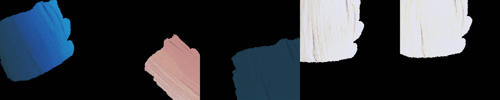
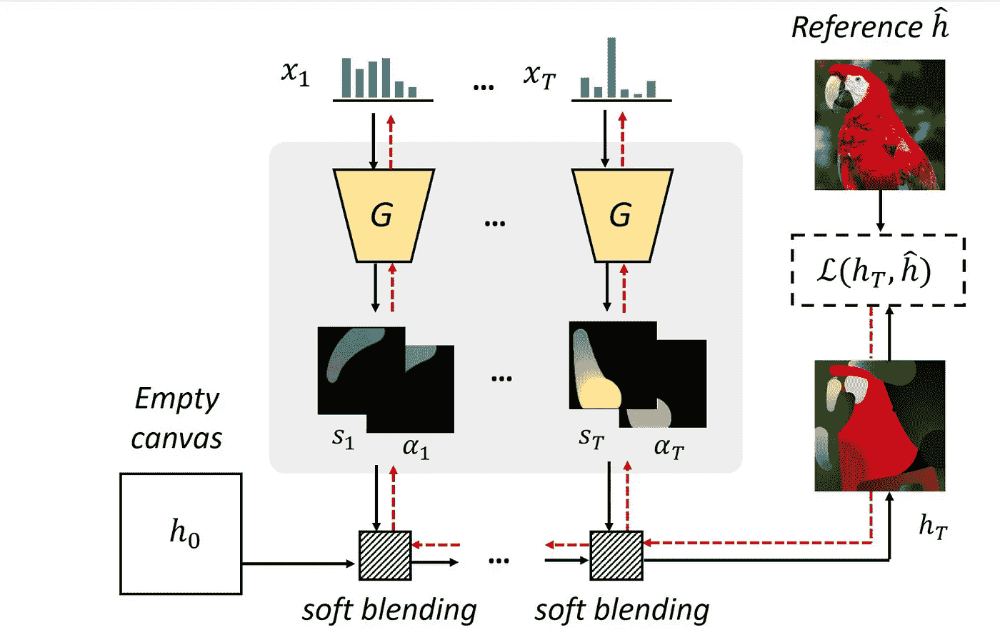
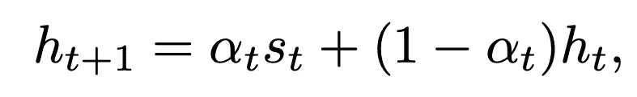
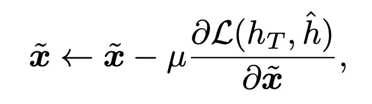
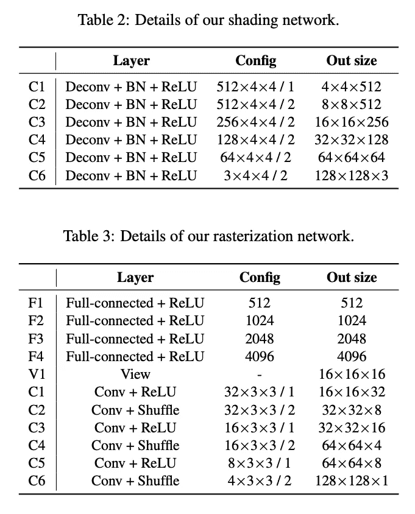
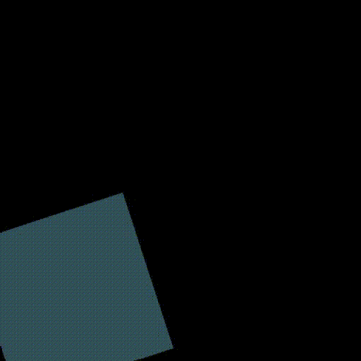
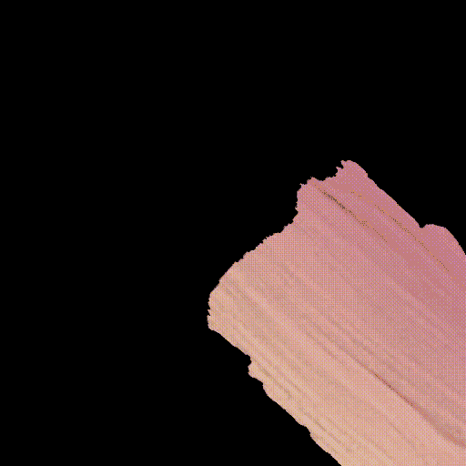
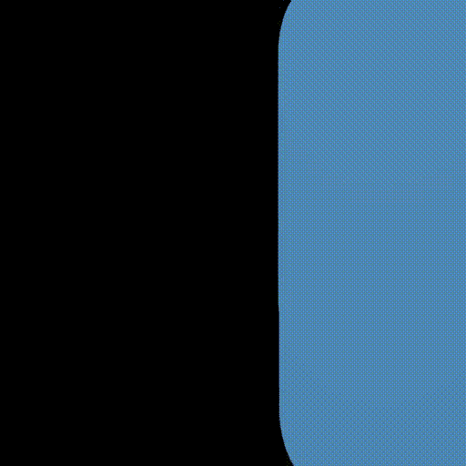

# 我如何用深度学习制作我自己的 NFT

> 原文：<https://medium.com/analytics-vidhya/how-i-made-my-own-nfts-with-deep-learning-9266232b9c13?source=collection_archive---------3----------------------->

不可替代令牌(NFT)代表一种独特且不可分割的加密货币。每个 NFT 都有独特的特征和值，它们通常以有限的数量通过不同的数据格式表示，如 MP4、JPG 或 PDF。

加密和区块链是即将到来的技术，深度学习也是如此。结合这两种技术会产生有趣的结果。我决定尝试一下，并开始头脑风暴深度学习和 NFT 的独特用法。

我想到了加密艺术的想法。利用代表以太坊和比特币等加密货币的标志，并利用深度学习模型将其转化为独特的艺术作品。

深度学习的部分是要把这些标志变成某种有创造性和独特性的艺术形式。创造力需要从深度学习模型中分离出来。我在深度学习论文的汪洋大海中搜索模型。最终我找到了我所需要的:风格化的神经绘画([链接到纸](https://arxiv.org/abs/2011.08114))。

# 什么是风格化神经绘画？

用人类能够定义和表达自己的方式创作绘画。使用风格化的神经绘画，这个过程是自动化的，并且通过其渐进的笔划看起来像人类一样自然。

你可能已经在想 GAN 架构是这背后的原因，但你错了。大多数生成网络在其体系结构中利用了逐像素映射或连续优化方法，然而本文利用笔画预测的思想为这种类型的生成增加了另一个维度。

笔画预测是一个参数搜索过程，旨在最大化输入图像与其给定“画布”之间的相似性。实现的另一个变化是光栅化网络和着色网络，而不是通常的生成器和鉴别器。提出的渲染器更好地处理了形状和颜色的解纠缠，这种新的架构比其他具有深度学习的绘画方法好得多。

网络架构(【https://arxiv.org/pdf/2011.08114.pdf】T2

软混合的定义如下:

软混合

其中 *h* 是画布，α被定义为α遮罩， *s* 被定义为笔画前景。

梯度下降用于更新笔划，定义如下:

梯度下降

假设 *T* 的 *h* 是画布， *h hat* 是参考图片，ℒ是最小化 t 的 h 和 h hat 的差异的损失函数， *x* 是所有笔画参数的集合，是预定义的学习率。

这种优化用于优化下面提到的模型架构:

着色网络和光栅化网络架构

这些模型参数可以针对不同类型的笔画进行优化，包括油画棒、水彩、马克笔和方框/矩形，我利用了这一点，我将在后面解释。这是神经风格化绘画的一个非常基本的概述，如果你想更深入地了解实际发生了什么，我建议你阅读这篇论文并浏览我将在下面链接的代码:

 [## GitHub -九品甲/风格化-神经-绘画:官方 Pytorch 实现的预印本论文…

### 预印本|项目页面| Colab 运行时 1 | Colab 运行时 2 |复制时的演示和 Docker 图像我们建议…

github.com](https://github.com/jiupinjia/stylized-neural-painting) 

https://arxiv.org/pdf/2011.08114.pdf

## 我是如何利用这个模型的？

我在 Github 上使用了他们的代码实现，并预先训练了模型，创建者很友好地提供了独特的输入来创建各种 NFT。

# OpenSea 和发布 NFT

在我让所有的代码工作之后，我所要做的就是选择基本图像，选择一种风格，并设置一些超参数来得到最终的结果。

输出是 gif 格式的渐进绘画，依赖于绘画笔画，使 NFT 看起来更酷。下面是一些独特而时尚的 gif，是我用自己的想法制作的秘密主题艺术:

作者使用框样式的 BitLocker

作者的油画棒风格的 EthHandOG

作者采用 MarkerPen 风格的 BlueEth

我需要找到一个地方来铸造 NFT，并张贴出来出售给艺术爱好者。为此，我选择了 OpenSea 平台。OpenSea 是一个点对点的 NFTs 市场，在这里你可以购买、出售和拍卖你的数字收藏品。OpenSea 使得铸造你的 NFT 然后发布拍卖变得非常容易。

我决定把我的收藏命名为 CryptoArt AI。

# 我学到了什么？

我从这个项目中学到了很多关于这两种即将到来的技术，我很高兴能更多地使用它们。

风格化的神经绘画重新定义了我们如何看待深度学习世界中的艺术生成，这为许多令人兴奋的新可能性打开了大门。了解这种新的架构并查看实际的代码实现帮助我了解了许多关于新的光栅化和着色架构的知识，我可能会在将来用于我自己的个人工作。

学习如何使用 OpenSea 也是学习推动当今世界发展的新技术的关键一步。我很高兴在 OpenSea 上发布新的 NFT，并可能上市出售(敬请期待！).我最兴奋的是了解区块链环境中的代码开发及其用法。

你觉得这篇文章和使用的技术怎么样？我很乐意就这些话题与您交流。

链接:

我的远海收藏:[https://opensea.io/collection/cryptoart-ai](https://opensea.io/collection/cryptoart-ai)(看看吧，如果你觉得有趣，就给它点个赞，如果你是个收藏家，它也是待售的。)

 [## Github: NNDEV1 -概述

### 本人高二，求知欲强，主要对 AI 和 ML 感兴趣。- NNDEV1

github.com](https://github.com/NNDEV1)  [## GitHub -九品甲/风格化-神经-绘画:官方 Pytorch 实现的预印本论文…

### 预印本|项目页面| Colab 运行时 1 | Colab 运行时 2 |复制时的演示和 Docker 图像我们建议…

github.com](https://github.com/jiupinjia/stylized-neural-painting) 

风格化神经绘画:【https://arxiv.org/pdf/2011.08114.pdf 

NFTs 的不和服务器:【https://discord.gg/hHW2kSzp 

我的个人网站:[https://personal-website-nndev1.vercel.app/](https://personal-website-nndev1.vercel.app/)

## 感谢阅读，如果你喜欢这篇文章的内容，请给我几个掌声！