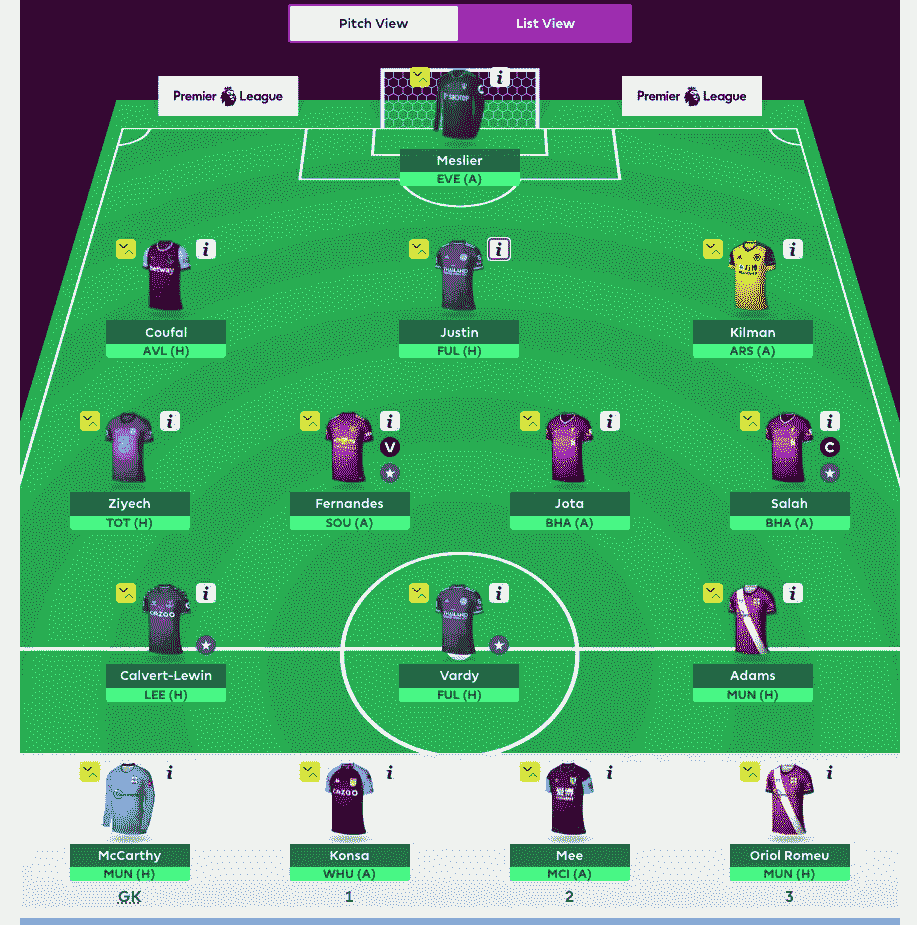

# 我是如何在梦幻英超比赛中提高我的决策能力的

> 原文：<https://medium.com/analytics-vidhya/how-i-managed-to-improve-my-decision-making-in-the-fantasy-premier-league-game-4ade299e6115?source=collection_archive---------15----------------------->

# 简而言之 FPL

Fantasy premier league 包括从参加英超联赛的不同球队中选择 15 名球员组成您的球队，该球队将根据以下规则在英超联赛中赢得积分:

*   **不超过三名玩家** …