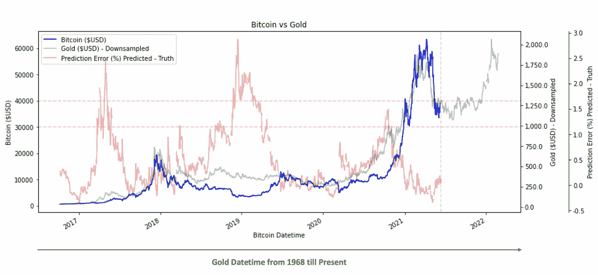
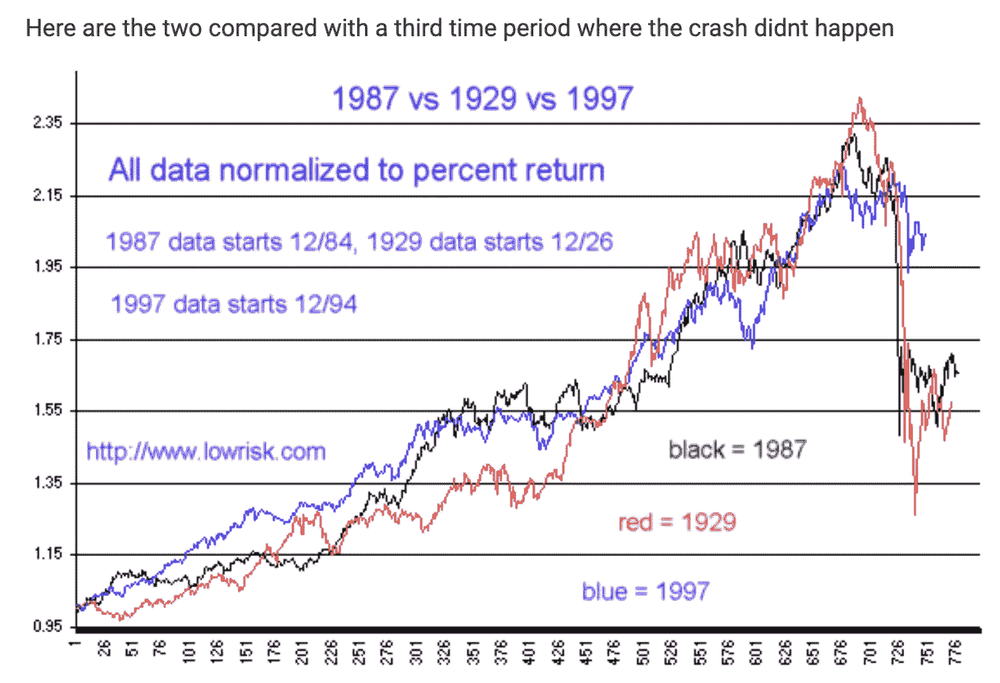
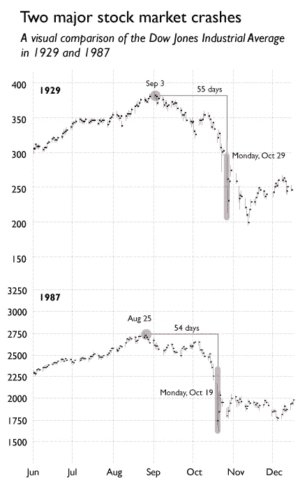

# 我如何预测 2021 年比特币与黄金的崩盘

> 原文：<https://medium.com/analytics-vidhya/how-i-predicted-the-2021-bitcoin-crash-with-gold-a1cc8a060faf?source=collection_archive---------16----------------------->

当我冒险进入加密货币领域时，我最喜欢的一本书是《比特币标准》。作者从总体上谈到了价值储存，从石头到布雷顿森林到菲亚特，现在随着我们进入数字时代，加密货币正在成为主流。作为一名同为定量分析师和数据科学家的人，这篇文章刺痛了我的大脑，让我发现了黄金和比特币之间的神秘关系。

这张图表意味着什么？如果我们相信将比特币描述为数字黄金的说法，在某种程度上，资产的数字化将整个货币化过程加快了约 10 倍。从 1968 年至今的黄金价格，向下采样大约 10 倍，能够代表误差最多约 3%的比特币价格。观察这种关系如何继续解开将是非常有趣的，如果这种关系保持正确，市场可能会在未来几个月保持区间波动，并在明年开始反弹。比特币确实有在年末或新年伊始表现更好的历史。真巧:)

随着时间的推移，价格峰值在一个因子内匹配。他们崩溃了，他们作为一个整体燃烧了，他们重整旗鼓，他们一起获得了荣誉。简直不可思议。

当然，像这样的图表可能会被证明是一个很大的巧合，只不过是对世界的过度适应。然而，从历史上看，黄金确实与比特币有一定的相似之处。1971 年，当布雷顿森林体系结束时，它实际上终止了黄金与美元的挂钩。此后，黄金在一段时间内仍具有投机性，在高通胀时期以及金融危机时期(如 2008 年)表现良好。事实证明，它是一种可靠的价值储存手段，可以对冲通货膨胀。比特币也不例外，一开始纯粹是投机性的，在通胀时期会随着时间的推移而上涨，在新冠肺炎疫情爆发后量化宽松开始实施时表现良好。M2 货币供应量和 CPI 等图表失去了重力，比特币获得了动力。最近，我们开始在新闻中看到缩减谈判。但是看看我们周围，疫情看起来并不像是在对世界仁慈。我不会照原样接受这张图表，但至少从根本上来说，它听起来不像是一派胡言。当然不是财务建议，而是意见。

引用伟大的亚瑟·海斯最近的杰作《成长或毁灭》中的一句话，

> 正确是伟大的，但真正的交易传奇是正确的，然后继续持有他们的头寸，直到他们变得富有。许多人哀叹道，如果他们几年前买了比特币，如果他们持有到今天，他们就会处于不同的财富类别。但有多少投资者本应该在 1 美元时买入比特币，而在它翻倍至 2 美元或 10 倍至 10 美元时不卖出呢？

睿智的话语。

有人曾经告诉我，拥有信息是没有用的，除非你采取行动。明智的话，太:)

哦，这种模式识别在过去有用吗？问保罗·都铎·琼斯:)

> 两次崩盘之前都有多年的牛市。它们都发生在接近 10 月底的一个周一，第一次崩盘发生在牛市顶峰后 55 天，第二次是 54 天。除了时间上的相似，他们下跌的幅度也几乎一样。1929 年的崩盘导致两天内下跌 23%，1987 年下跌 22.6%。

(我在某处记录了这一点，不幸的是，失去了来源)

如果这种方法过去在股票市场奏效，那么它可能也适用于比特币:)简单地说，不可思议！大自然给敢于探索的人留下了无处不在的线索。预测崩盘肯定很有趣，但让我们密切关注这一点，看看它在多大程度上代表了 2021 年即将到来的牛市。因此问题来了，我们**现在真的处于熊市吗？**

我们去 mOOOOOn