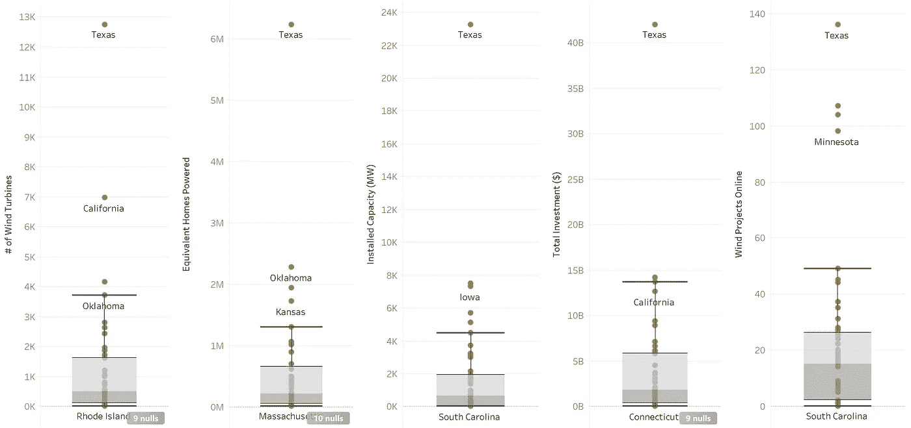
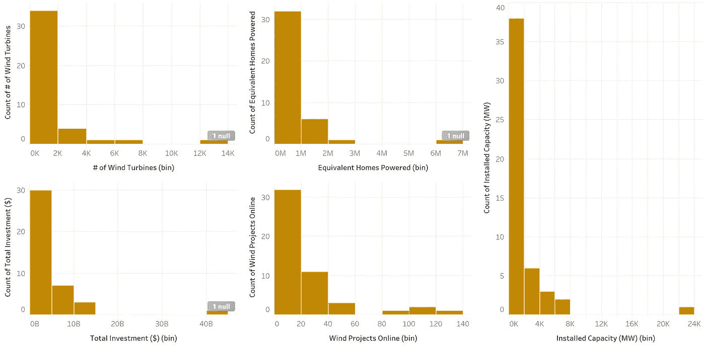
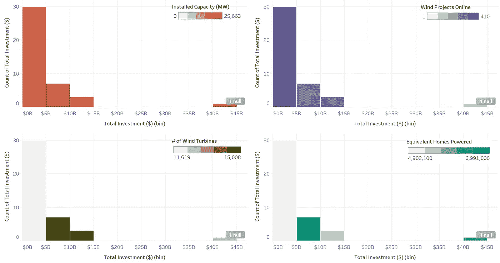
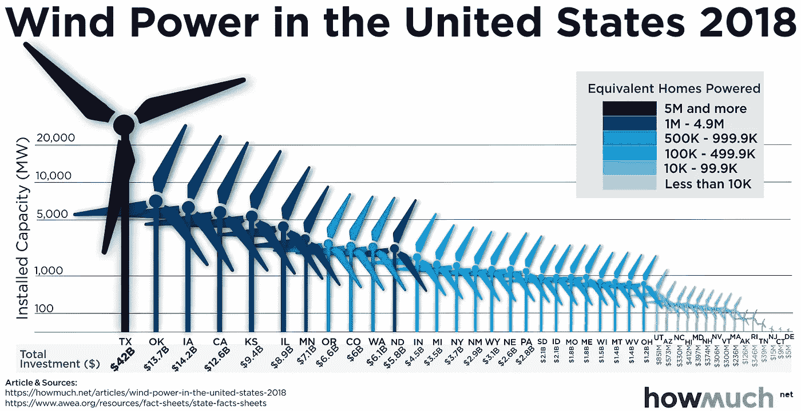
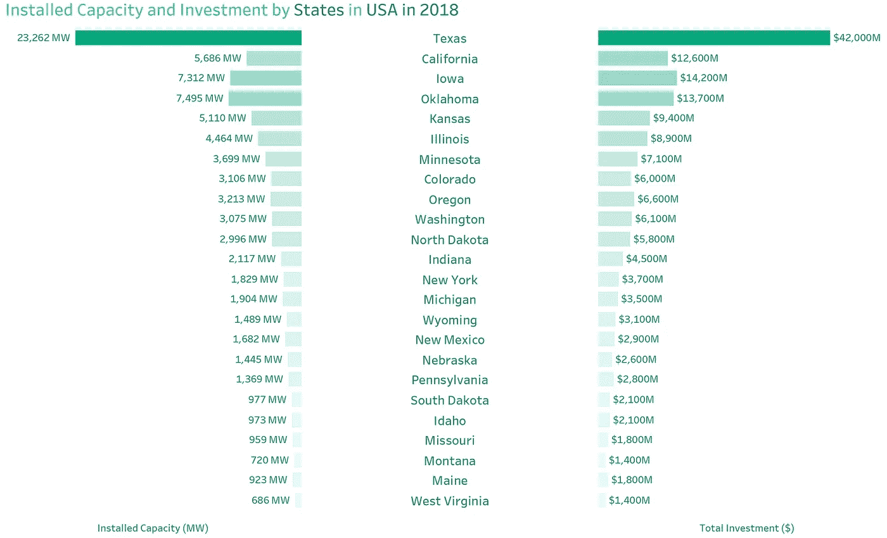
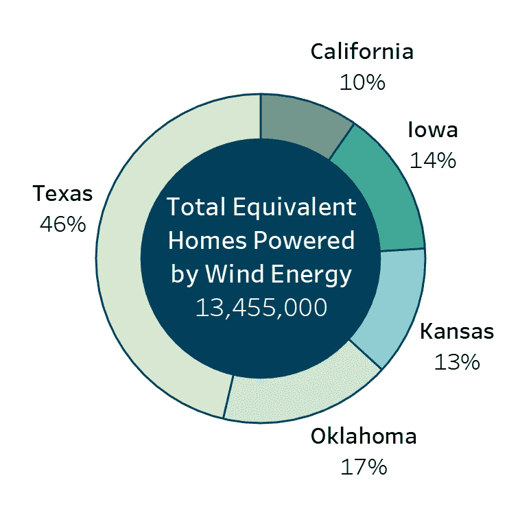
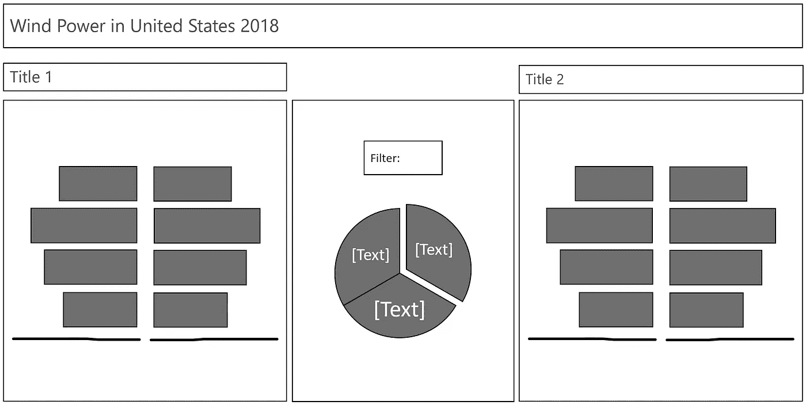
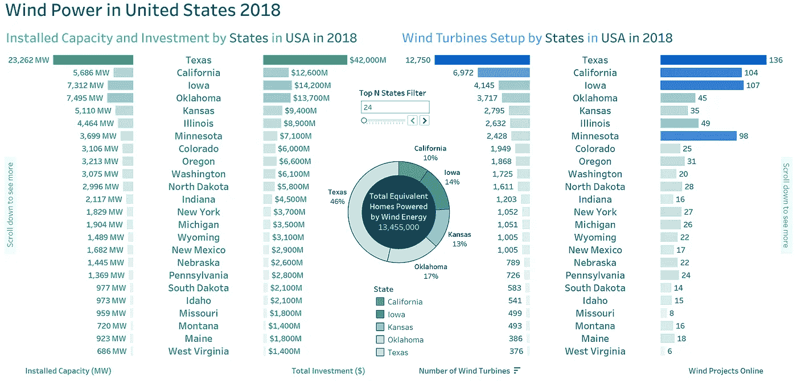

# 我如何使用 Tableau 通过 5 个步骤重新设计了#改头换面星期一可视化

> 原文：<https://medium.com/analytics-vidhya/how-i-redesigned-a-makeovermonday-visualization-in-5-steps-using-tableau-966efb1b55a4?source=collection_archive---------14----------------------->

以下是我如何用 5 个步骤重新设计可视化。

卢卡斯·布拉塞克在 [Unsplash](https://unsplash.com?utm_source=medium&utm_medium=referral) 上的照片

1.  探索和评估数据
2.  分析当前可视化中需要改进的地方
3.  选择最佳可视化图表
4.  选择数据故事类型(即动画数据故事、演示、仪表板)
5.  重新设计可视化

# 1.探索和评估数据

我浏览了一下[改头换面星期一](https://www.makeovermonday.co.uk/data/data-sets-2019/)网站，选择了这个[数据可视化](https://data.world/makeovermonday/2019w8)来重新设计。

可视化描述了 2018 年为每个州收集的风电关键数据。可视化的目标是突出 2018 年美国的风力使用。在数据集中发现了以下特征/变量，它们的类型标注在它们旁边。

*   **#风力发电机组** — *定量*
*   **等效家庭供电** — *定量*
*   **装机容量(MW)** — *定量*
*   **总投资(美元)** — *量化*
*   **风能项目在线** — *定量*
*   **状态** — *分类*

在数据集的评估阶段，对数据进行了评估，以确定在数据收集、数据处理和数据洞察这三个阶段可能出现的局限性和偏差。以下简要讨论了在以下阶段发现的偏差:

## 数据收集

在此阶段发现了以下偏差:*选择*，*响应*和*缺失* *变量*

*选择和响应偏差*是由于少数州没有响应或选择不响应，或者他们没有所需变量的数据，因此存在无响应偏差的可能性。

*遗漏变量*偏差是可能的，因为更多的特征可以作为数据收集的一部分，以进一步改善分析和最终建议。这些变量可以是每个州的电价、每个州的天气模式等。

## 数据处理

在此阶段发现了以下偏差:*异常值*、*分布理解*和*缺失理解*

*异常值*出现在如下所示的几个变量中。如下所示，这些异常值存在于其余变量中，它们对分析结果没有显著影响。

这个可视化可以在[这里](https://public.tableau.com/profile/shaheer.ali.khan#!/vizhome/WindEnergybyStates/Dashboard-BoxPlots)找到

*所有数量变量的分布*都是右偏的，都是单峰的。从分布来看，可以说它不会对结果有很大的影响。尽管如此，在分析任何隐藏的偏见时还需要进一步的调查。

这个可视化可以在[这里](https://public.tableau.com/profile/shaheer.ali.khan#!/vizhome/WindEnergybyStates/Dashboard-Distributions)找到

进一步分析这些分布，得到如下所示的可视化结果。我想看看分布是否反映了可能的现实，或者数据是否被过滤或篡改，从而影响了结果的有效性。

如左上图(红色)所示，0-50 亿美元区间的数量最高，显示的装机容量值适中，这只能说明一件事。报告的投资数字被低估，以显示这些项目比实际更便宜。对于剩余的地块可以发现相同的观察结果。

这个可视化可以在[这里](https://public.tableau.com/profile/shaheer.ali.khan#!/vizhome/WindEnergybyStates/Dashboard-DistributionInvestigation)找到

*在以下状态的数据中发现缺失*。这种偏见可能是由于缺乏提供的数据，但经过一点研究，我发现 2018 年这些州中的大多数碰巧由共和党人管理。数据缺失的州大多是共和党控制的州(88%)。因此，缺失是[非随机缺失(MNAR)](https://en.wikipedia.org/wiki/Missing_data#Missing_not_at_random) 。这种缺失对结果没有显著影响，因为 82%的州都有完整的数据，但是获得下面所示的州的完整和准确的数据是理想的。

*   弗吉尼亚(民主党)
*   南卡罗来纳州(共和党)
*   密西西比州(共和党)
*   路易斯安那州(共和党)
*   肯塔基州(共和党)
*   格鲁吉亚(共和党)
*   佛罗里达(共和党)
*   阿肯色州(共和党)
*   阿拉巴马州(共和党)

## 数据洞察

在这个阶段发现了以下偏差:混杂变量。

*混杂变量*可能是数据洞察阶段偏差的来源，但是我发现这种偏差的存在可以忽略不计。

# 2.分析当前可视化中需要改进的地方

根据经验，编码有**位置变化**(x 和 y 位置的差异，即散点图)和**长度变化**(方框高度的差异，即条形图和直方图)的数据为人所熟知。

以下方面被发现违反了有效可视化的契约:

*   令人困惑的风车高度导致对数值的不准确理解——寿命因数是可能的。
*   过于拥挤——在一个情节中过度使用编码。

原始可视化可以在下面看到。

这个可视化可以在[这里](https://data.world/makeovermonday/2019w8)找到

# 3.选择最佳可视化图表

以下几点旨在选择最佳的图表类型。

*   专注于简单，去掉多余的东西
*   选择能有效展示洞察力的视觉编码
*   条形图是最好的比较

给定数据的性质，因为状态是数据集中唯一的分类数据，其余的本质上是定量的。因此，以下图表类型将用于重新设计的可视化:

*   条形图—蝴蝶巴特图
*   圆形分格统计图表

选择蝶形条形图是为了更好地进行比较。这种类型的图表使用较少的空间，并执行有效的比较。我为此数据集创建的蝶形条形图示例如下所示:

这张图表可以在[这里](https://public.tableau.com/profile/shaheer.ali.khan#!/vizhome/WindEnergybyStates/InstalledCapacityandTotalInvestment)找到

人们制作了一个饼状图来显示各州风能供电的同等家庭的比例。出于简化的目的，图表中只显示了风能供电家庭最多的前五个州。该图表将用于重新设计的可视化。

从图表中可以得出一个结论:在 2018 年美国大约 1350 万个由风能供电的家庭中，德克萨斯州已经为其中的 46%提供了电力。

# 4.选择数据故事类型(即动画数据故事、演示、仪表板)

在本节中，我将讨论为什么我选择了我为重新设计的可视化所选择的数据故事类型。

首先，我将讨论为什么*数据故事*没有被用作重新设计的可视化媒介。有八种类型的*数据故事*。下面显示了这些类型，并说明了未选择它们的原因:

*   随时间变化-探究数据中不存在的时间因素
*   层次向下钻取—探索不同级别的类别—这在数据中是不存在的
*   放大/缩小—在地理数据中发现，可放大到州、城市等。视图-不存在于数据中
*   对比价值——比较最多和最少，比较极端的对立面——不适合这个分析
*   交叉点-时间序列图中大多数值的交叉点-不适合此分析
*   不同因素——分解为子因素的复杂指标——不适合此分析
*   离群值——离群值的性质，为什么会这样，以及从中可以推断出什么——不适用于此分析
*   相关性——两个测量值如何一起变化，以及变化背后的原因——不适合本分析

其次，我将讨论为什么*演示*没有被用作重新设计的可视化媒介。一个*演示*需要对特性进行详细分析，而在这种情况下，不需要这样的详细分析，因为只有少数特性/变量可用。鉴于数据集有更多的数据，那么*演示*将被视为一个可能的选项。

一个*演示文稿*有以下组成部分:

1.  问题陈述
2.  构建问题树和幽灵甲板——分析路线图，包括有效分析；结构化、假设驱动的分析
3.  局限性和偏见
4.  可行的建议

最后，我将讨论为什么选择*仪表板*作为重新设计的可视化媒介。Dashboard 是给定数据集讲述数据故事的最有效的媒介，因为数据的大小有限，可用的数据功能也很少。

重新设计的仪表板将能够回答以下问题:

*   2018 年各州装机容量和投资
*   2018 年各州在线风力涡轮机和风力项目的数量
*   由前 5 个州组织的由风力供电的家庭比例

# 5.重新设计可视化

首先，我探索了仪表板设计的各种线框。获得反馈后，最终选择的设计如下所示。

第一个蝶形条形图(最左边一个)将显示 2018 年*的**装机容量**和**投资**。*

*第二个蝶形条形图(最右边的一个)将显示 2018 年*国家**风力涡轮机**和**风力发电项目在线**。**

**中间的饼图将显示由 ***前 5 个州*** 组织的**风力发电家庭比例****

**可以使用动态过滤器过滤这两个蝶形图。该过滤器根据用户的偏好按前 N 个州过滤图表。这样，用户可以通过风力发电看到最上面和最下面的状态。**

**重新设计的可视化快照如下所示:**

****

**仪表板可以在这里找到**

**我重新设计的数据可视化比原来的可视化做得更好:**

*   **低图形水平——以便低图形水平的人可以使用重新设计的可视化。**
*   **条形图和饼图被用来准确地传达信息，而不像最初的可视化那样，风车高度被描绘成不准确的值，因此由风车高度编码的长度不是最理想的。**
*   **在重新设计的可视化中有效地使用颜色编码，以突出这些值。明亮的颜色不是用来帮助减轻眼睛疲劳的。**
*   **与原始可视化不同，重新设计的可视化中的仪表板布局宽敞且平衡。**
*   **重新设计的可视化仪表板是交互式的，为用户提供了从不同角度探索数据的选项。**
*   **重新设计的可视化在注释中使用适当的颜色编码，以帮助更有效地传递洞察力。注释在数量和大小上是平衡的，帮助用户提取关键的见解。**

# **感谢您的阅读！**

**我非常愉快地分享了我的思考过程和我在数据可视化之旅中获得的技能。如果你想开始讲述数据故事并了解更多关于数据可视化的知识，请务必关注我在[媒体](http://shaheerak.medium.com)上的活动，让我们在 [LinkedIn](http://www.linkedin.com/in/shaheerkhan200) 上进行交流。**

**展望未来，在[改头换面周一](https://www.makeovermonday.co.uk/)有许多数据可视化等待重新设计，请务必查看并开始您自己的数据可视化之旅。**

# **参考**

*   **[原始可视化和数据集](https://data.world/makeovermonday/2019w8)**
*   **[https://www . uda city . com/course/data-visualization-nano degree-nd 197](https://www.udacity.com/course/data-visualization-nanodegree--nd197)**