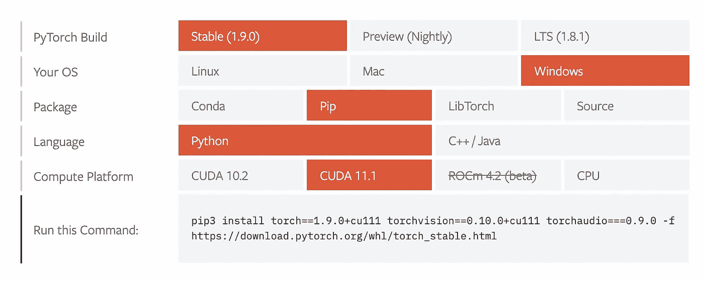

# 我如何设置我的 Windows 机器进行深度学习

> 原文：<https://medium.com/analytics-vidhya/how-i-setup-my-windows-machine-for-deep-learning-82358a939c74?source=collection_archive---------0----------------------->


费尔南多·埃尔南德斯在 [Unsplash](https://unsplash.com/s/photos/desk-setup?utm_source=unsplash&utm_medium=referral&utm_content=creditCopyText) 上的照片

当我还是个孩子的时候，我哥哥的一个朋友来我们家帮助我们安装干净的窗户。当时安装操作系统对我们来说是一件很神秘的事情，我们以前从来没有这样做过。我请我哥哥的朋友教我如何安装操作系统。他开玩笑地告诉我:“不，我不会教你。因为如果你学会了那个，你会每天都想做的！”原来是真的！在完成我的第一次操作系统安装后，我立即又做了一次，因为感觉太好了！不知何故，我变得如此沉迷于它，以至于我仍然经常这样做。虽然让一切恢复到全新状态感觉很好，但这样做的最大麻烦是，你需要重新设置一切。作为一名程序员和深度学习爱好者，我总是在全新安装 Windows 后安装的第一件事是 Anaconda，然后是 Pytorch 和 Tensorflow。我写这篇文章的一个原因是，它将帮助我设置我的开发环境，下次我被我的冲动再次欺骗进行全新的 Windows 安装，另一个原因是，它可能会帮助你们中的一些人设置您的 Windows 机器进行深度学习。

我在 Youtube 上做了一个视频。如果你更喜欢视频指南或这篇文章中听起来不清楚的东西，检查视频！

# 蟒蛇

Anaconda 是一个 Python 和 R 发行包，包括一些最需要的包，如 numpy、pandas、scikit-learn 等。对于数据科学来说。安装 Anaconda 就像在 Windows 上安装任何其他普通软件一样。以下是步骤:

1.  [从 Anaconda 官网下载安装程序](https://www.anaconda.com/products/individual)。
2.  运行下载的 exe 文件。
3.  安装步骤不言自明。继续点击“下一步”，直到出现“**高级安装选项**”页面。有两个复选框。第一个是“将 Anaconda3 添加到我的 PATH 环境变量中”。虽然上面说不推荐，但我更喜欢选择这个框。我的系统上通常没有其他 python 安装，如果你也没有，我建议你选择这个选项。不要担心红色警告。
4.  继续点击“下一步”，直到“完成”按钮出现并完成安装。

要检查你的 python 是否在工作，你可以打开一个**命令提示符**窗口，键入`python`并按下`enter`。这将打开 python 解释器，您可以编写任何想要的 python 代码并执行它。如果您没有选中我在第 3 步中提到的复选框，这可能不会起作用。在这种情况下，在开始菜单中搜索 **Anaconda 提示符**并打开它而不是**命令提示符**窗口。

太好了！现在我们的 Python 已经准备好了。接下来要做的就是安装 Pytorch 或者 Tensorflow 或者两者都安装！让我们从 Pytorch 开始。但是让我们先谈谈“虚拟环境”,因为我要创建几个虚拟环境。

# 虚拟环境

虚拟环境就像一个沙盒。使用虚拟环境的优势在于，您可以在机器上同时拥有不同版本的包，而不会相互影响。此外，如果在安装或卸载任何包时出现问题，您的主要 python 安装将不受影响。事情确实会出错。它发生在我身上，为了解决这个问题，你猜对了，我必须重新安装一次 Windows。但这不是一个好的解决方案。拥有虚拟环境将让您免去麻烦。我得到了教训。所以我把 Pytorch 和 Tensorflow 安装在两个不同的虚拟环境中，而不是安装在基础环境中。(如果愿意，您可以只创建一个环境，并在那里安装两个库。)

也有不同的 python 包用于创建虚拟环境。但是您也可以使用 anaconda 创建一个！如果您在命令提示符下键入`conda env list`(或者 Anaconda 提示符),您将会看到系统中当前可用的 conda 环境。在新鲜状态下，你只会看到`base`的环境。那是默认的。当我们在安装 python 之后运行它时，它是在这个`base`环境中运行的。保持现状，这样你总是有一个新鲜的环境开始。以下是使用 conda 环境的步骤。

1.  要创建一个新的，在命令提示符下键入`conda create --name <give a name here> --clone base`(或者 Anaconda 提示符，我不再赘述)并按下`enter`。`--clone base`标志克隆了基本环境，这样，您新创建的环境将与基本环境相同。您可以省略此标志。如果您这样做，将不会在此环境中安装任何软件包。您必须单独安装它们。
2.  要激活您的环境，请键入`conda activate <your environment name>`并按回车键。
3.  当环境处于活动状态时，在此环境中安装所需的软件包。完成这里的工作后，通过运行`conda deactivate`停用环境。停用环境后，您将返回到`base`环境。

# Pytorch

如果你不知道 Pytorch 是什么，它是一个开源的机器学习库，广泛用于深度学习。它最初是由脸书的人工智能研究实验室开发的。比起 Tensorflow，我更喜欢 Pytorch，因为它更 Pythonic 化’，也更容易理解。也更容易安装！你会看到的。

按照以下步骤安装 Pytorch，

1.  进入 Pytorch [网站](https://pytorch.org/)，点击安装按钮[进入](https://pytorch.org/get-started/locally/)页面。
2.  您将看到一些选项。选择您喜欢的选项，这将在“运行此命令”单元中为您提供适当的命令，以便在您的机器上运行。在“Package”字段中，您可以选择 **Pip** 或 **Conda** 。另外两个我没试过。在“计算平台”字段中，如果您的机器中有支持 CUDA 的 GPU，请选择 CUDA 版本，否则请选择 CPU。
3.  复制此命令，并在命令提示符下运行它。在运行此之前，请确保您已经激活了正确的虚拟环境。



完成了！要检查 Pytorch 是否安装正确，可以运行以下 python 代码，

```
import torch

# if you have cuda enabled GPU and selected a CUDA version, the following code should print "GPU support availble: True"print("GPU support availble:", torch.cuda.is_available())
```

# 张量流

Tensorflow 是一个开源的机器学习库，广泛用于深度学习，就像 Pytorch 一样。Tensorflow 实际上来的更早，它是由 Google 开发的。如果您使用的不是支持 CUDA 的 GPU，安装与 Pytorch 非常相似。但是如果你正在寻找 GPU 的支持，你将需要一些额外的工作。

以下是步骤，

1.  转到 [Tensorflow 网站](https://www.tensorflow.org/)，点击“安装”选项卡，将带您进入[安装指南](https://www.tensorflow.org/install)页面。
2.  按照我前面提到的说明创建并激活一个虚拟环境。或者，如果您的环境已经存在，请激活它。
3.  在命令提示符下运行`pip install --upgrade pip`命令。
4.  按照指南中接下来的指示运行`pip install tensorflow`。
5.  pip 安装完成后，您可以尝试在 python 代码中导入 tensorflow，如下所示`import tensorflow as tf`。如果你在 python 解释器中运行这个，你可能会得到一个警告，比如，它找不到 GPU。如果你打算只在 cpu 中使用 Tensorflow，那么你的工作就完成了。你不必担心警告。一切正常。
6.  如果你有支持 CUDA 的 GPU，你必须遵循 [GPU 指南](https://www.tensorflow.org/install/gpu)中提到的一些额外步骤。我将在下面的步骤中讨论它们。请继续阅读以正确完成安装。
7.  你需要安装 4 样东西——*NVIDIA GPU 驱动、* *CUDA 工具包、CUPTI、*和 *cuDNN SDK。* CUPTI 将与 CUDA Toolkit 一起安装，因此您实际上只需安装 3 件东西。首先，安装 GPU 驱动程序。您可以遵循指南中的链接，或者如果您安装了 Geforce Experience，请在“驱动程序”选项卡中检查驱动程序更新。确保您的 **GPU 驱动程序版本** **符合版本要求(相同或更高)。**
8.  接下来需要下载 **cuDNN SDK。**你需要有 NVIDIA 开发者账号才能下载。注册是免费的，所以如果你没有帐户，只需注册并登录。登录后，您可以访问下载页面。您将看到最新版本，但它可能与[指南](https://www.tensorflow.org/install/gpu)中的版本号不完全匹配。**您必须符合指南中的版本号。**如果最新版本更高，请转到旧版本[档案链接](https://developer.nvidia.com/rdp/cudnn-archive)并找到与指南中的版本号相匹配的版本。现在，相同的版本可能适用于不同版本的 CUDA。**您还必须匹配您当前 tensorflow 支持的 CUDA 版本号。**比如假设 tensorflow 目前支持 *CUDA 11.0 和**cud dn SDK 8 . 0 . 4 版*。你在存档页面看到有一个“ *cuDDN v8.0.4 for CUDA 11.0* ”，还有一个“ *cuDDN v8.0.4 for CUDA 11.1* ”。选择与 CUDA 版本匹配的版本，在本例中为 *11.0* 。
9.  现在下载 **CUDA 工具包。版本完全匹配！**不要上版本。在前面的例子中，我们为 CUDA 11.0 下载了 *cuDDN，所以在这种情况下 *CUDA 工具包*也需要是 *v11.0，但是*不能是 v11.1*
10.  要安装 **CUDA Toolkit，**你需要安装微软 Visual Studio(不是 Visual Studio 代码)。[下载](https://visualstudio.microsoft.com/downloads/)社区版，因为它是免费的。然后安装它。当您到达要求您选择一个工作负载的页面时，您可以不选择任何工作负载而直接继续。
11.  安装 Visual Studio 后重新启动计算机。
12.  现在通过运行下载的安装文件来安装 **CUDA toolkit** ，并在每个步骤中点击 next。那里没什么特别的事可做。
13.  接下来，提取下载的 cuDNN 文件。在提取的文件夹中，您会发现另外 3 个文件夹— *bin、include、lib。*这些文件夹中的文件需要复制到另一个特定的位置——您的 CUDA Toolkit 安装文件夹。默认位置是`C:\Program files\NVIDIA GPU Computing Toolkit\CUDA\<version number>`，在这里我们还会找到三个同名的文件夹。因此，相应地将提取的内容复制到这个位置。它可能会请求许可，如果请求许可，请按继续。
14.  复制完这些文件后，再次访问 tensorflow gpu [指南](https://www.tensorflow.org/install/gpu)并向下滚动到底部，那里显示“Windows setup”。您将看到我们需要添加一些 PATH 环境变量。为了便于复制粘贴代码，让我们将提取的 cuDDN 文件复制到示例期望的位置，在您需要创建的`C:\tools\`位置内。或者，如果您想根据自己的喜好将它放在不同的位置，请随意。然后在命令提示符下运行命令，添加 PATH 环境变量。

最后，我们在 GPU 支持下完成了 Tensorflow 的安装！让我们检查它是否正常工作。您可以运行以下 python 代码，

```
import tensorflow as tf# should return true
tf.test.is_built_with_cuda()# will list your available gpu
tf.config.list_physical_devices('GPU')
```

# Jupyter 笔记本

Jupyter Notebook 对于数据科学家来说是一个很棒的工具。使用 Jupyter Notebook，您可以使用浏览器编写代码，保存每个代码块的输出，添加必要的文档，可视化并以非常方便的方式与他人共享您的工作，包括结果。Jupyter 笔记本将安装 Anaconda。我将和你分享一些我喜欢用 Jupyter 系统做的事情。

## 启动位置

Jupyter 笔记本默认的启动位置是用户的主目录`C:\Users\<username>\`。我不喜欢把我的文件放在这个位置，也没有方便的方法来浏览这个目录之外的文件。在安装 Windows 之前，有时我会忘记从这个位置备份文件，因此我丢失了一些正在进行的项目文件。我把所有的项目都保存在 D: drive 中的某个地方。所以我希望 Jupyter 的默认启动位置是那个文件夹。要设置这个，

1.  在开始菜单中搜索 **Jupyter 笔记本(Anaconda3)** 。
2.  在搜索结果的右侧面板中点击“**打开文件位置**”，或者在 Jupyter 笔记本快捷方式上点击右键，然后点击“**打开文件位置**”选项。
3.  右击“Jupyter 笔记本(Anaconda3)”文件，转到“**属性”**
4.  在快捷方式选项卡中，找到"**目标"**字段，并在其中找到" **%USERPROFILE%** "文本，将其替换为您想要的目录位置，如"**D:\ programming**"
5.  同样，在“字段中找到“**开始”，用位置替换“ **%HOMEPATH%** ”。**
6.  点击**应用**和**确定。**

## 核心

我们创造了一些康达环境。但是我们如何在我们的 Jupyter 笔记本中使用它们呢？遵循这些步骤，

1.  通过运行`conda activate <environment name>`激活您的 conda 环境。
2.  如果您的环境中还没有安装`ipykernel`，运行`pip install ipykernel`来安装它。
3.  然后运行这个:`python -m ipykernel install --user --name <your environment name> --display-name <A Beautiful Human Readable Name>`

现在，当你在 Jupyter 中打开笔记本时，你可以点击顶部的`Kernel`选项卡，然后悬停在`Change kernel`选项上，你会看到你新添加的环境列在那里。如果您选择内核，Jupyter 将使用该环境。当然，您可以通过这种方式添加多个环境。您必须在每个环境中运行上述步骤，一旦添加了这些步骤，它们都将出现在 Jupyter 内核列表中。这样，只需一次点击，您就可以轻松地在您的环境之间切换。

# 结尾部分

我希望这个指南是有帮助的。如果您对 anaconda 设置做了任何额外的配置，这可能会让您的生活更轻松，请在评论中分享。我很乐意听你这么说。

如果你觉得这篇文章有帮助，给它一些掌声吧！如果你想和我联系，请在[*Twitter @*AhsanShihab _](https://twitter.com/AhsanShihab_)*上给我发请求。)*