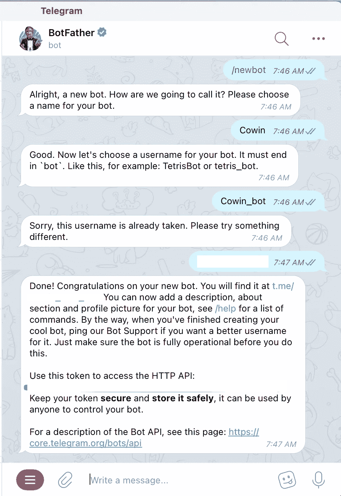

# 我如何使用机器人在 2 天内成功预订了疫苗接种位置！

> 原文：<https://medium.com/analytics-vidhya/how-i-used-a-bot-to-successfully-book-a-vaccination-slot-in-2-days-89e7ce274234?source=collection_archive---------2----------------------->

***使用 Python，Telegram & AWS 创建与 Cowin API* 交互的 bot**


你的私人机器人随时听候你的命令。

如果你正在努力预订一个疫苗接种位置，指责政府可能不会有帮助——但一个个性化的机器人肯定会做✅

我所在地区的疫苗接种中心很少，我厌倦了定期访问 Arogya Setu App & Cowin 网站，查看我所在地区的所有位置都已预订。我也尝试了一些电报频道，但它们总是充斥着太多其他地方的信息。每小时在这 200 封邮件中进行搜索是很费力的。所以，我决定偷懒，把这项工作交给我的 bot。

你猜怎么着？在不到 48 小时的时间里，机器人完成了提醒我有空位的任务，我所做的只是在收到机器人的消息后立即打开了 Cowin 网站。

> 为了帮助你自己构建它，我创建了这个 3 部分教程:
> 👉Python 代码
> 👉电报消息
> 👉使用 AWS (cron)每分钟运行 python 代码

在我们开始之前，快速边栏-我假设你在编码和自动化方面有一些经验。如果你是初学者——不用担心，我已经尽可能让这篇文章不使用术语，并在适当的地方添加了很多链接和教程。

# 让我们从 Python 代码开始:

Python 是最简单的编码语言，因为它的语法简单(语法&重要的词)。一旦你安装了它，就像简单地写你想要你的代码(机器人)做什么。

python 安装，可以参考这个 youtube [视频](https://www.youtube.com/watch?v=YYXdXT2l-Gg)。

接下来，你的机器人需要一个为你工作的地方，那里有所有的包或预定义的，可重用的代码，使我们的机器人易于编写，非常小。那个地方叫环境；在机器上安装 python 时就已经设置好了。

但是如果你想在另一台机器上运行这个机器人呢？这是否意味着您需要再次观看第一个视频，并使用环境设置安装 python？好吧，“虚拟环境”是来拯救我们的。

顾名思义，您为您的机器人运行创建了一个虚拟位置。如果你想在其他没有安装 python 的机器上运行这个机器人，你可以。这个[视频](https://www.youtube.com/watch?v=APOPm01BVrk)会帮你设置好。

有很多视频。我知道。但是不要担心，接下来的步骤可以是简单的复制粘贴😇

现在，我们需要我们的机器人与 Cowin 网站对话，并了解他们是否在我们的区域有插槽。不同代码相互交流的方式——我所说的不同不仅仅是指 Python 代码与其他 Python 代码的交流，还包括 Python 代码与 Java 代码的交流🤯—你明白了。API——应用程序编程接口使这种通信方式成为可能。

为了给这些花哨的词语添加含义，API 端点是代码访问的 URL，可以用来请求信息。就像你访问 Medium，点击链接向 Medium 要我的文章一样。机器人将使用由[政府](https://apisetu.gov.in/public/marketplace/api/cowin)提供的 API 端点来检查你所在区域的空位的可用性。编码时间:

首先，我们需要访问网站的包。

```
import requests
```

我们还需要一个包来检查今天的日期。是的，我们必须告诉机器人今天是几号——机器人只有在你让它们变聪明的时候才会变聪明。

```
import requests 
import datetime
```

但是要导入这些包，请确保已经将它们安装在您的虚拟环境中:

```
pip3 install requests -t .
pip3 install datetime -t .
```

一个好的编程习惯是将信息存储在一个变量中，以便机器人可以轻松地重用它。加入我们的变量。

```
import requests 
import datetimeurl = '[https://cdn-api.co-vin.in/api/v2/appointment/sessions/public](https://cdn-api.co-vin.in/api/v2/appointment/sessions/public/findByPin)'
```

但是等一下，我没有提到我定制了这个机器人来寻找我所在区域的插槽吗？因此，让我们向 Cowin 询问我所在地区 2020 年 7 月 11 日的职位。您可以根据需要更新代码。

```
import requests 
import datetimeurl = '[https://cdn-api.co-vin.in/api/v2/appointment/sessions/public/findByPin?pincode=401107&date=](https://cdn-api.co-vin.in/api/v2/appointment/sessions/public/findByPin?pincode={0}&date={1)11-07-2021'
```

将上面的链接复制并粘贴到您的浏览器中，检查您是否看到如下内容。记住，由于我们是在变量中存储数据， **url** 是我们的变量，信息是[https://cdn-API . co-vin . in/API/v2/appointment/sessions/public/findByPin？pin code = 401107&date = 11-07-2021](https://cdn-api.co-vin.in/api/v2/appointment/sessions/public/findByPin?pincode=401107&date=11-07-2021)不带引号。

```
{"sessions":[{"center_id":804791,"name":"Central Plaza Hall Mbmc","address":"Bank Of India Building","state_name":"Maharashtra","district_name":"Thane","block_name":"Thane Municipal Corporation","pincode":401107,"from":"09:00:00","to":"15:00:00","lat":19,"long":78,"fee_type":"Paid","session_id":"9ec9f4a1-09d0-435f-a75e-3bf3952e7d1b","date":"11-07-2021","available_capacity":0,"available_capacity_dose1":0,"available_capacity_dose2":0,"fee":"0","min_age_limit":18,"allow_all_age":true,"vaccine":"COVISHIELD","slots":["09:00AM-10:00AM","10:00AM-11:00AM","11:00AM-12:00PM","12:00PM-03:00PM"]},{"center_id":737803,"name":"MBMC WOCHARDT HOSPITAL","address":"NEAR RASSAZ MIRA ROAD EAST","state_name":"Maharashtra","district_name":"Thane","block_name":"Mira Bhayander Municipal Corporation","pincode":401107,"from":"08:00:00","to":"17:00:00","lat":19,"long":72,"fee_type":"Paid","session_id":"4a7ff98d-20b5-4f06-a906-f904f2b7a327","date":"11-07-2021","available_capacity":0,"available_capacity_dose1":0,"available_capacity_dose2":0,"fee":"780","min_age_limit":18,"allow_all_age":true,"vaccine":"COVISHIELD","slots":["08:00AM-10:00AM","10:00AM-12:00PM","12:00PM-02:00PM","02:00PM-05:00PM"]}]}
```

这是 Cowin 网站根据我们指定的条件发送的数据。pin 码和日期这两个条件是 API 端点的参数。现在，让我们通过 bot 发送数据，并将响应存储在一个变量中。

```
import requests 
import datetimeurl = '[https://cdn-api.co-vin.in/api/v2/appointment/sessions/public/findByPin?pincode=401107&date=](https://cdn-api.co-vin.in/api/v2/appointment/sessions/public/findByPin?pincode={0}&date={1)11-07-2021'response = requests.get(url, headers=headers)
response_jsonified = x.json()
```

我们对数据进行 jsonify，以便机器人可以解析和理解数据。

因此，在添加了对数据的解析以检查响应是否有价值之后，代码如下所示:

```
import requests 
import datetimeurl = '[https://cdn-api.co-vin.in/api/v2/appointment/sessions/public/findByPin?pincode=401107&date=](https://cdn-api.co-vin.in/api/v2/appointment/sessions/public/findByPin?pincode={0}&date={1)11-07-2021'response = requests.get(url, headers=headers)
response_jsonified = x.json()for item in response_jsonified['sessions']:
  if item['available_capacity_dose1'] > 0:
    <send telegram message>
```

目前，我们已经让机器人能够与 Cowin 网站对话，并识别是否有可供我们使用的插槽。为了让机器人更智能，我添加了一个日期循环来检查今天和接下来的七天。

```
import requests 
import datetimeurl = '[https://cdn-api.co-vin.in/api/v2/appointment/sessions/public/findByPin?pincode=401107&date=](https://cdn-api.co-vin.in/api/v2/appointment/sessions/public/findByPin?pincode={0}&date={1){0}'today = datetime.date.today()
start = today - datetime.timedelta(days=0)
all_dates = [start + datetime.timedelta(days=d) for d in range(7)]for d in all_dates:
  # Getting the date in dd-mm-yyyy format
  updated_d = str(d.strftime("%d-%m-%Y")) response = requests.get(url.format(d), headers=headers)
  response_jsonified = x.json() response = requests.get(url, headers=headers)
  response_jsonified = x.json() for item in response_jsonified['sessions']:
    if item['available_capacity_dose1'] > 0:
      <send telegram message>
```

# 发送电报信息:

这就是事情变得非常有趣的地方。我们使用[电报 API](https://core.telegram.org/) 来发送消息。



*   首先下载 telegram app，搜索 BotFather。
*   键入 **/newbot** 并发送消息
*   系统会提示您命名机器人。输入您的酷名。
*   您将收到一个访问令牌。保管好它。访问令牌基本上是 API 的密码。(是的，你可以使用[认证](https://atharvaw007.medium.com/do-websites-have-an-aadhaar-card-understanding-pki-digital-signatures-digital-certificates-d7ef455f57d)来限制机器人之间的对话)
*   您创建了一个机器人&您可以看到一封同名的电报。

接下来，您将需要频道 id，只需在浏览器中输入这个 URL: `https://api.telegram.org/bot<YourBotToken>/getUpdates`

从回复和其他内容中复制 chat_id，确保其安全。

向你的电报频道发送信息，

```
import requests bot_token = ''
chat_id = ''
message = 'This is a dummy message'send_message_url = 'https://api.telegram.org/bot{0}/sendMessage?chat_id={1}&text={2}'.format(bot_token, chat_id, message)response = requests.get(send_message_url)
```

将一切整合在一起:

```
import requests 
import datetimebot_token = ''
chat_id = ''
message = 'Slot Available'url = '[https://cdn-api.co-vin.in/api/v2/appointment/sessions/public/findByPin?pincode=401107&date=](https://cdn-api.co-vin.in/api/v2/appointment/sessions/public/findByPin?pincode={0}&date={1){0}'today = datetime.date.today()
start = today - datetime.timedelta(days=0)
all_dates = [start + datetime.timedelta(days=d) for d in range(7)]for d in all_dates:
  response = requests.get(url.format(d), headers=headers)
  response_jsonified = x.json()response = requests.get(url, headers=headers)
  response_jsonified = x.json()for item in response_jsonified['sessions']:
  if item['available_capacity_dose1'] > 0:
    send_message_url = 'https://api.telegram.org/bot{0}/sendMessage?chat_id={1}&text={2}'.format(bot_token, chat_id, message)
    send_message_response = requests.get(send_message_url)
```

# 最后一步——让机器人使用 AWS 完成您的工作:

*   在这里创建一个 AWS 账户[——别担心，对我们来说，这是免费的。一年了。如果你有困惑，你可以关注这些文件。](https://portal.aws.amazon.com/billing/signup#/start)
*   接下来，从 AWS 控制台转到 AWS Lambda 并创建一个新的 Lambda 函数。如果你登录你的 AWS 账户，输入 Lambda，你就会知道这意味着什么。Lambda 是一个 AWS 服务，允许你运行小代码。
*   还记得我们讨论过虚拟环境吗？这是他们将使我们受益的地方。我们只需将整个虚拟环境复制粘贴到 AWS 中，这样它就可以像在我们的系统上运行一样运行。换句话说，
*   在新创建的 Lambda 函数中上传您的代码。如果你有任何困惑，你可以跟着这些[文档](https://docs.aws.amazon.com/lambda/latest/dg/getting-started-create-function.html)走。我应该提一下，AWS 文档非常容易理解，即使对初学者来说也是如此。
*   最后一步，转到 AWS Cloudwatch，另一个 AWS 服务，创建一个新规则来每分钟运行我们的 Lambda 函数(bot)。[单据](https://docs.aws.amazon.com/AmazonCloudWatch/latest/events/Create-CloudWatch-Events-Scheduled-Rule.html)。

或者你喜欢的任何频率。但是请记住: **Cowin API 有每 5 分钟 100 次 API 调用的限制。**这意味着如果你在不到 5 分钟的时间内点击超过 100 次，你将在剩下的 5 分钟内被屏蔽。

瞧，有一个为你工作的机器人准备好了，如果在接下来的七天里你的 pin 码中有任何空位，它会给你发消息。

你也可以配置机器人来检查特定的医院，剂量和时间段。我相信你能找到魔法😎