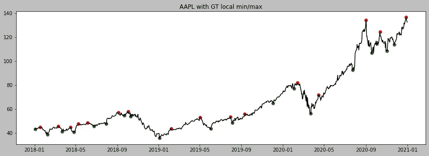

# 我如何使用机器学习在股票市场交易

> 原文：<https://medium.com/analytics-vidhya/how-im-using-machine-learning-to-trade-in-the-stock-market-3ba981a2ffc2?source=collection_archive---------0----------------------->

免责声明:这篇文章是关于我用来创建交易机器人的一个简单策略。虽然回溯测试显示交易机器人是盈利的，但交易机器人没有能力处理“黑天鹅”事件，如市场崩溃。此外，我不是财务顾问，也不是专业交易者。我分享这个只是为了娱乐。所以交易&阅读风险自担。

T2 在我大学四年级的时候，一个朋友第一次介绍我进入股市。我记得我买了一只优步*(不是最聪明的事情)*推荐的股票，在几个小时内获得了 100%的回报。这笔交易太难忘了，我至今还记得这只股票。股票代码是 AETI *。显然这是新手的运气，因为我不知道自己在做什么。从那以后，我在金融市场上投入了大量的时间和金钱，也分享了一些收益和损失。虽然，我已经取得了一定的成功，但我最近发现，如果不是因为我的情绪，我可能会更成功。*

自从有了这个发现，我就一直在寻找在投资和交易过程中缓解情绪的方法。我意识到消除情绪的最好方法是创造一个交易机器人。在研究了几种算法交易策略后，我决定利用一个基本的机器学习模型，逻辑回归 *(LR)* ，提出自己的模型。

**制定战略..**

股市最根本的策略就是低买高卖。现在，如果你已经投资或交易了很长时间，你会知道这并不像听起来那么简单。所以，我想创建一个模型，尽可能准确地预测股票的低点和高点。

**图 1:** 苹果*(股票代码 AAPL)2018 年至 2021 年的股价走势。绿点是局部最小值(低点)，红点是局部最大值(高点)*

在图 1 中，你可以看到苹果从 2018 年到 2021 年的每日股价走势。绿点是局部最小值，红点是局部最大值。所以我打算使用 ML 来预测一个数据点是绿点*(类别 0)* 还是红点*(类别 1)。*我们的目标是，如果模型预测到一个绿点，就买入，当股价上涨一定百分比时卖出。

下面是我的策略
的四个步骤——用 ML 模型预测某一天买入股票是否有利。
——如果有利*(绿点)*买入股票。一旦股票上涨到一定的百分比，卖出股票以获得收益。如果股票下跌了一定的百分比，卖掉股票以减少损失。

其他一些细节
-算法一次只持有一只股票*(这样做是为了保持一切简单)
-* 卖出百分比是模型的两个超参数，我们可以选择它们来实现收益最大化。
-如果你想知道，“如果数据点既不是局部最大值也不是局部最小值，该怎么办？”等等，我们以后再谈这个。

**ML 模型**

如上所述，我使用的机器学习模型是逻辑回归 *(LR)。*如果不熟悉 LR，可以点击这里[查看我的教程笔记本。](https://github.com/kaneelgit/ML-DL-Algorithms/blob/main/Logistic%20Regression%20from%20Scratch.ipynb)

首先，我们的问题是一个有两个目标输出的二元分类问题。即，局部最小值*(类别 0，“绿点”)*和局部最大值*(类别 1，“红点”)。*接下来，我们必须确定模型的输入。一个非常简单的想法是使用股票价格&成交量作为 LR 模型的输入，并预测它是局部最小值还是局部最大值。然而，对于预测像股票方向这样复杂的事情来说，股价和成交量是非常少的信息。因此，我在我的模型中额外加入了另外四个输入参数。

*   标准化股票价格——我没有使用股票价格，而是使用标准化股票价格作为第一个输入参数。股票的价格行为通常可以用图 2 中的烛台来表示。烛台代表当天的最高股价(高)、最低股价(低)、开盘价(开)和收盘价(闭)(如果我们考虑如图 1 所示的日线图)。为了使它更容易，我创建了一个介于 0 和 1 之间的值来表示所有这四个值。这个值是通过等式 1 计算的。如果结果值接近 1，这意味着股票已经在当天的高点附近收盘，而如果归一化值接近 0，这意味着股票已经在当天的低点附近收盘。使用这样一个值的优点是，与使用一个单独的值(如当天的收盘价或平均值)相比，它包含了全天的价格行为信息。此外，该值对[股票分割](https://en.wikipedia.org/wiki/Stock_split)不敏感。

**等式 1:** 归一化值计算

*   成交量——模型中使用的第二个参数是股票的日成交量。该参数表示某一天的股票交易量(包括买入和卖出)。
*   3 天回归系数-下一个参数是 3 天回归系数。这是通过对过去三天的收盘价进行线性回归计算出来的。这代表了股票在过去三天的走向。
*   5 天回归系数——与 3 天回归系数类似的参数。我用了五天，而不是三天。
*   10 天回归系数—同上，但使用 10 天回归。这个值代表过去十天股价的方向。
*   20 天回归系数—同上，但使用了 20 天回归。

**图 2:** 一只股票分笔成交点的开盘价、收盘价、最高价和最低价。来源【https://analyzingalpha.com/open-high-low-close-stocks】——

**训练和验证模型**

在定义了我的模型之后，我使用 [TD Ameritrade API](https://developer.tdameritrade.com/apis) 收集历史数据来训练模型。用来创建数据集的股票是道琼斯 30 指数的 30 家公司和标准普尔 500 指数的 20 家其他知名公司。培训和验证数据跨度为 2007 年至 2020 年*(含)*。测试数据来自 2021 年。

为了准备训练和验证数据，我首先找到代表买点*(类别 0 或图 1 中的绿点)*或卖点*(类别 1)* 的数据点。这是通过一种被创建来搜索局部最小和最大点的算法来完成的。选取数据点后，收集成交量数据，计算归一化价格值&回归参数。图 3 显示了一个输入数据示例。

**图 3:** 体积，归一化值，3_reg，5_reg，10_reg，20_reg 为输入参数，目标为输出。如果 target 为 0，则该行表示来自购买点的数据(本地最小值)，如果该行表示 1，则该行表示销售点(本地最大值)。

准备好数据后，我使用 scikit-learn 包将数据分成训练和验证集，并训练 LR 模型。LR 模型使用输入参数并预测目标值。

**验证结果及分析**

验证集包含 507 个数据样本。完全训练的 LR 模型能够以 88.5%的准确度预测验证数据。

这个模型的准确性起初似乎很有说服力。让我们来看看这个模型在 2021 年对一只股票的表现。为了做到这一点，我选择了高盛(股票代码 GS)的数据，并使用训练好的 LR 模型预测股票每天的方向。结果如图 4 所示。

**图 4:** 股票代码 GS 的测试结果。绿点代表买点，红点代表我们模型预测的卖点。

当您查看图 4 时，您会看到该模型预测了许多假阳性*(阳性是购买点)*。虽然它似乎能正确预测几乎所有的局部最小值，但它错误地预测了买点。如果你记得在训练阶段，我只使用局部最大值和局部最小值来训练模型。所以中间数据点上的模型预测非常弱。

这可能是一个代价高昂的投资错误。毕竟高买低卖不是我们的本意😬。那么，我们该如何解决这个问题，更有把握地选择买点呢？让我们回到验证结果，看看我们是否能找到一种方法来增加我们购买点的确定性。

**图 5:** 验证数据集结果的混淆矩阵

在图 5 中，您可以看到验证结果的混淆矩阵。我们的模型在类别 0 *(买点/本地最小值)*中预测了 29 个实例，而它实际上是类别 1 *(卖点/本地最大值)。*这些是误正值*(误将阴性识别为阳性。还要记住，在我们的案例中，积极因素是购买点)。*如果我们回忆一下这个策略，我的模型的目标是使用 ML 模型寻找购买点。因此，我们可以尝试减少这些误报，并确保模型以高确定性预测买点。我们可以通过改变 LR 模型的阈值来做到这一点。

> 在逻辑回归二元分类中，默认阈值为 0.5。这意味着如果模型预测概率大于 0.5，则该数据样本将属于类别 1，而如果模型预测概率小于 0.5，则该数据点将属于类别 0。我们可以改变这个阈值来增加某个类别的模型预测的置信度。例如，如果我们将此阈值更改为 0.1，则只有小于 0.1 的预测将被选为购买点(类别 0)。这减少了错误购买点的数量，因为模型只选择接近 0 的样本。

所以为了确保我的模型能更准确地预测买点。我把我的模型的阈值改为 0.03。*(注意这只是一个例子。我们可以稍后尝试改变阈值来调整模型以良好地执行)。*您现在可以在图 6 中看到新的混淆矩阵。

**图 6:** 阈值改为 0.01 后的混淆矩阵。

如您所见，现在误报的数量为零。然而，这样做的缺点是，模型错过了许多真正的正值。在我们的例子中，模型只识别了五个买点，而没有识别出许多其他的买点。

现在让我们使用新的门槛，重新规划 2021 年高盛股票的买入点。

**图 7:** 使用阈值 0.03 后 GS 股票的买入机会

正如您在图 7 中看到的，现在该模型更加确定地预测了购买机会。然而，它也错过了几次买入机会。这是我们为了高确定性购买而不得不做出的牺牲。

**回测&结果**

接下来，我用 2021 年的股市数据对我的策略进行了回溯测试。我创建了一个股票模拟器和一个回溯测试脚本，使用 LR 模型和一个给定的阈值(t)每天扫描道琼斯 30 指数的买入机会。如果有可用的股票，模拟器然后购买股票并持有股票，直到它达到某个百分比的收益(g)、某个百分比的损失(l)或在某个天数后卖出(d)。最终回测模拟有四个参数(t，g，l，d ),目标是利润最大化。

我还通过改变这些参数创建了四种投资者类型。“不耐烦的交易者”、“温和的持有者”、“耐心的摇摆交易者”和“猿”。

*   不耐烦的交易者——这种交易者在很短的时间内买入并持有股票。交易者也寻找小收益。这个交易者也害怕亏损，所以如果股票下跌一点点，他就会亏本卖出。最后，这个交易者选择高门槛的股票，以便在他们脱手当前股票后迅速找到另一只股票。所以，这种交易者的参数是 t = 0.3，g = 0.005，l = 0.001，d = 3。
*   适度持有人——这种类型的交易者在适度的时间内购买并持有股票。交易者正在寻找具有高置信度的股票，因此阈值往往较低。与不耐烦的交易者相比，交易者也寻求更高的收益，对损失有更高的容忍度。对于这种类型的交易者，参数是 t = 0.1，g = 0.03，l = 0.03，d = 10。
*   耐心的摇摆交易者——正如“摇摆”这个词所暗示的，这种类型的交易者倾向于长期持有股票。此外，交易者喜欢选择成功概率高的股票。所以这类交易者门槛很低。此外，这位交易者相信卖出股票以减少损失，然后转向不同的股票。这类交易者的参数是 t = 0.05，g = 0.04，l = 0.003，d = 21。
*   猿类——猿类是股票市场上新出现的交易者。他们倾向于不理性地选择股票。所以他们不使用任何策略来选择股票。这些类型的投资者随机挑选股票，并在他们喜欢的时候随机卖出。

现在让我们进行回溯测试，看看这四个投资者的表现如何。这些模拟基于 2021 年的数据，每个投资者都有 3000 美元作为他们的初始余额。每种投资者类型的表现在 2021 年底进行衡量。

**图 8:**2021 年投资总值。每种投资者类型的初始余额为 3000 美元。

图 8 显示了四个投资者的表现结果。“耐心的摇摆交易者”在 2021 年底获得了 47.77%的收益，获得了最大的利润，其次是不耐烦的交易者，获得了 30.41%的收益。正如预期的那样，非理性交易者“猿”的收益最低，为 13.72%。

**图 9:** “耐心的摇摆交易者”(上图)和“不耐烦的交易者”(下图)的盈亏棒图

图 9 显示了“耐心的摇摆交易者”和“不耐烦的交易者”的盈亏柱状图。正如预期的那样，耐心的交易者做了少量交易，并尽快止损。不耐烦的交易者进行了大量交易，经常遭受损失。这也可以从表 1 中看出。

**表 1:** 各投资者类型汇总

这些结果表明，当使用 LR 模型时，购买高信心股票并持有更长时间比频繁购买信心较低的股票更有利。然而，我们也应该注意到，在 2021 年，股票市场出现了一些大幅上涨，这些结果可能是一个结果。显然，即使是非理性投资者“猿”，也取得了 13.72%的回报，这表明市场在 2021 年已经很慷慨了。

**与 S & P 500** 的比较

接下来，我将我的前两个投资者模型的表现与 2021 年 S&P 的表现进行了比较。

**图 10:** 两个模型(不耐烦的投资者&耐心的摇摆交易者)到 2021 年投资 3000 美元到 S & P 500 的比较。

图 10 显示了一月份向标准普尔 500 投资 3000 美元时的表现。结果显示，投资增长了 26.9%。与“耐心的摇摆交易者”47.77%的回报率和“不耐烦的交易者”30.41%的回报率相比，这是很低的。此外，“耐心的摇摆交易者”超过了苹果*(股票代码 AAPL)* 的 35%回报率，并在 2021 年与微软*(股票代码 MSFT)* 的 49%回报率相抗衡。

**其他想法和未来工作**

在我们当前的回溯测试模拟中，我们只是在算法一次交易一只有利股票时测试我们策略的性能。该算法扫描道琼斯 30 指数中的所有股票，并从中推荐最好的股票。然而，在现实世界中，我们可以将我们持有的股票数量转换成多只有利的股票。这可能会改变我们回溯测试模拟的性能，并有可能将回报更改为更高的值。

优化我们的模型性能的另一种可能的方法是通过训练 LR 模型来预测买点、卖点和中性点*(局部最大值和最小值之间的点)*。这样，我们可以更加确定地预测购买点，减少我们当前版本中错过的购买机会。这是因为这种类型的模型能够预测中性点，现在这些中性点不太可能被确定为买点。

此外，我们可以引入更多的输入变量，如 30 天回归系数、市场资本、市盈率，以增加模型的可预测性。我们还可以利用 lasso 正则化来消除对预测不重要的输入变量，并对重要的变量进行加权。此外，我们还可以测试其他 ML 模型，如支持向量机和随机森林，看看性能如何变化。最后，我们还可以使用深度学习技术，如 LSTM 以前在金融预测中使用的技术。

**结论**

在这篇博文中，我描述了我如何使用一个简单的 ML 模型，逻辑回归，在股票市场交易。该策略的回测结果看起来很有希望，2021 年的最大回报率为 47.77%，超过了标准普尔 500。虽然回溯测试结果显示该模型是有利可图的，但必须进行实时测试，以实际验证该策略的盈利能力。目前，我正在运行一个混合交易机器人*(因为这个模型是用真实的钱实时运行的，所以我确保我可以在任何时候介入这个机器人，并轻松完成订单。因此，在我的[互动经纪人账户](https://interactivebrokers.com/en/home.php)中，我使用了“混合”这个词*。虽然，该模型似乎如预期的那样工作，但现在推测还为时过早。我希望一旦我能够运行它一段相当长的时间，就可以公布结果。

非常感谢您的阅读！如果你有任何问题或意见，请告诉我。

页（page 的缩写）S —
我目前正在制作一个 GitHub 库，其中包含从 TD 中提取数据并进行回溯测试的代码。一旦我把链接 [**上传到 GitHub，我会把它贴在这里**](https://github.com/kaneelgit/Trading-strategy-) 。

关注我的 [*推特*](https://twitter.com/kaneel_s)