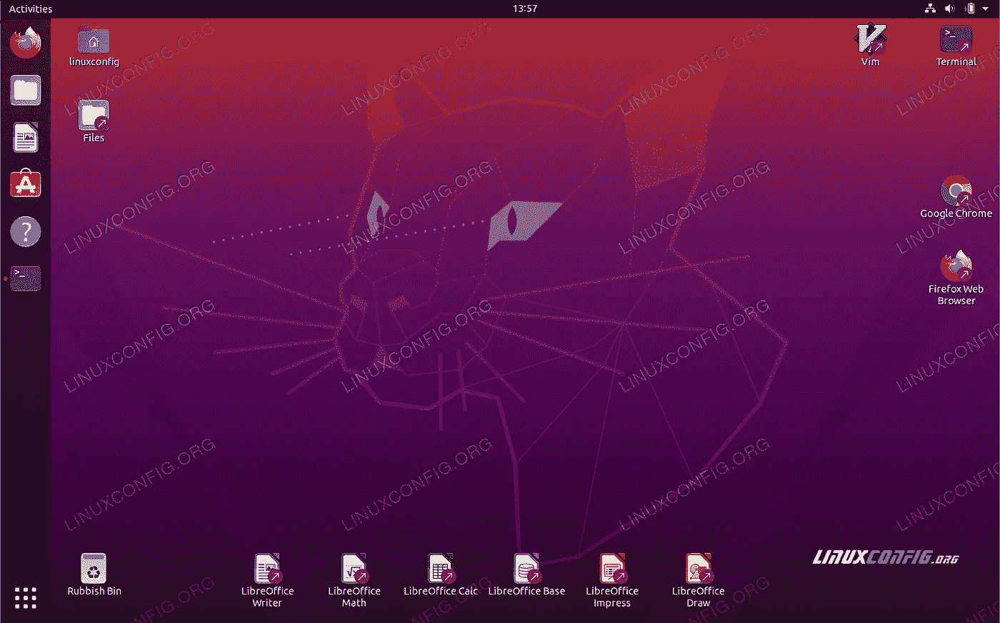
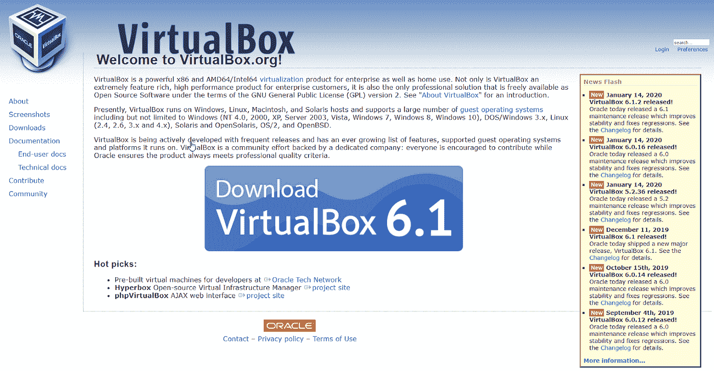
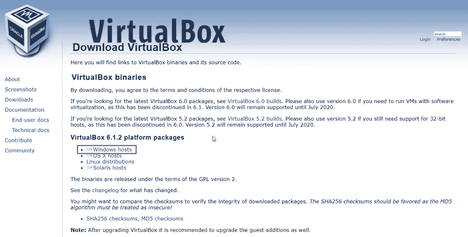
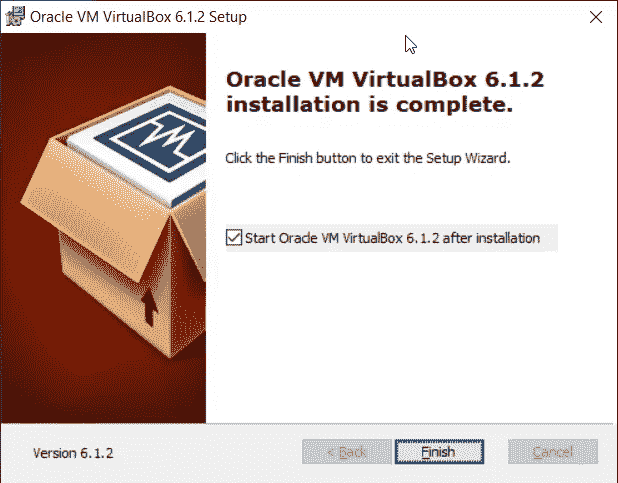
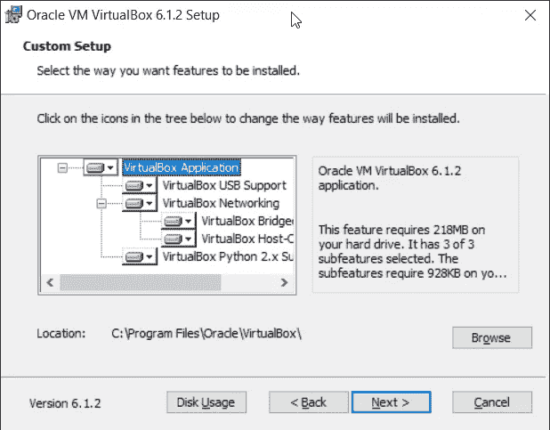
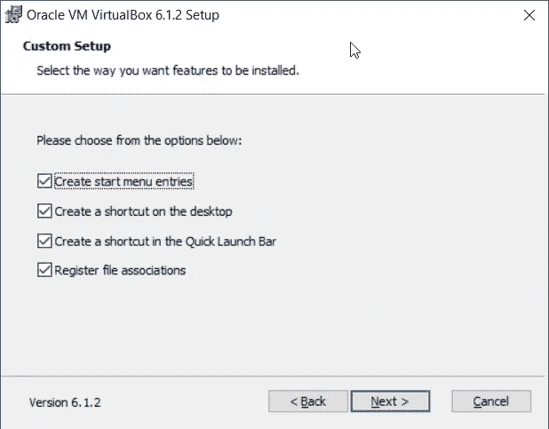
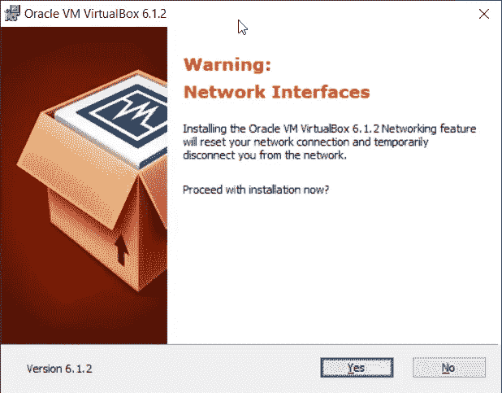
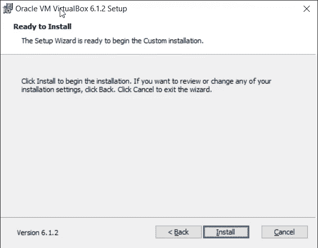
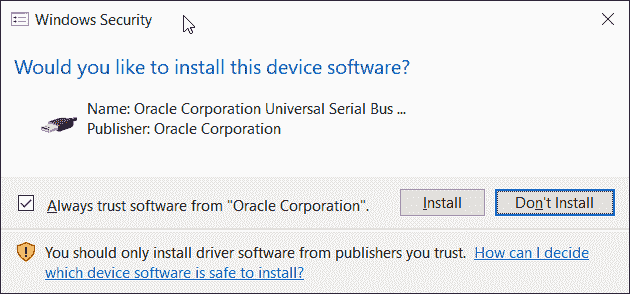

# 如何在 Windows 上安装虚拟机？

> 原文：<https://medium.com/analytics-vidhya/how-install-virtual-machine-on-windows-a5d964d625e3?source=collection_archive---------21----------------------->

在这篇文章中，我将解释如何在 windows 操作系统上安装虚拟机。

**安装 VirtualBox :**

1.  登录 Windows 10
2.  打开互联网浏览器(Google Chrome、Mozilla Firefox、Edge 或其他浏览器)
3.  打开网站虚拟盒子网站，点击下载如下截图所示。[链接](https://www.virtualbox.org/)

4.在下一个窗口中，单击 VirtualBox 平台软件包下的 windows 主机，如屏幕截图所示。您将为 Windows 下载该文件。

5.打开安装程序 VirtualBox

6.在欢迎使用 Oracle VM VirtualBox 安装向导下，单击下一步

7.在自定义设置下，保留默认设置和位置，然后单击。

8.在自定义设置下，单击下一步。

9.在警告:网络接口下，单击是。安装 Oracle VM VirtualBox 网络功能将重置您的网络连接，并暂时断开您与网络的连接。它还将在网络连接(控制面板\网络和互联网\网络连接)中创建虚拟网络适配器

10.在准备安装下，单击安装

11.单击是确认安装 Oracle

12.在您是否希望安装设备软件下，选择始终信任来自“Oracle Corporation”的软件，然后单击安装

13.等到安装完成。

14.单击“完成”启动 Oracle VM VirtualBox。

通过以上步骤，你可以很容易地在你的 windows 系统上安装虚拟机，现在你可以在任何操作系统上运行，而不需要双重引导你的系统

在下一篇文章中，我将上传如何在你的虚拟机上安装 ubuntu