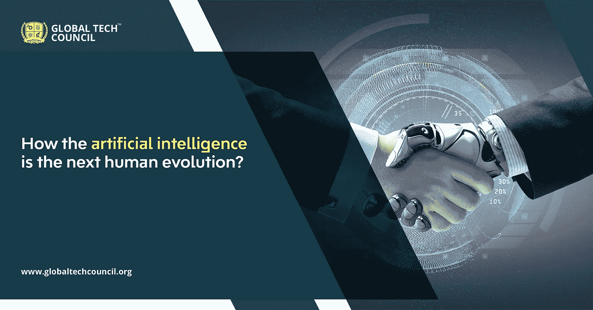

# 人工智能如何是下一次人类进化？

> 原文：<https://medium.com/analytics-vidhya/how-is-artificial-intelligence-the-next-human-evolution-76cff781b64a?source=collection_archive---------16----------------------->

技术进化是变革性的。我们已经看到了许多革命性的发展。从自动化机器到语音助手系统，这些变化都非常突出。你知道这些变化的核心是什么吗？是人工智能。这场技术革命有很长的历史，但只是最近我们才看到人工智能在现实生活中如此突出的应用。

这些[人工智能证书项目](https://www.globaltechcouncil.org/artificial-intelligence/certified-artificial-intelligence-ai-developer/)、认证和培训项目将帮助你获得熟练程度，并为你在人工智能和机器学习方面的成功未来做好准备。

**AI 跨行业应用:**

如果你仍然相信 AI 只在某个工作领域得到应用，或者它的使用仅限于高端用户，那么这些信息将是你的破冰之作。事实是，人工智能在所有商业领域都有应用:

**计算机科学**

**农业**

**航空**

**医疗保健**

**财务**

**采矿**

**电脑**

**教育**

**政府**

**汽车及更多**

围绕人工智能应用的一个普遍观点是，它将很快在许多工作中取代人类。虽然人工智能确实在以更快的速度发展，而且很快它将变得装备精良，功能强大，能够承担一些任务，但当涉及到算法的表达和让机器变得熟练时，总是需要人工智能专家和开发人员来帮助这个过程。

**让我们把注意力转移到人工智能最近在扮演什么角色上:**

人工智能变得越来越具有变革性。它正在被开发以承担“人类”工作，如疾病诊断、结果筛选、回答客户查询、翻译语言和客户服务。

尽管围绕人工智能的使用及其取代人类劳动力存在担忧，但仍有专家称赞这项技术的积极面，以及它如何帮助改善商业运营。这里我们想引用的一个例子是聊天机器人。这些自动化信使已经成为客户服务不可或缺的一部分。许多网站，甚至像脸书这样的社交媒体平台都在使用它来加强客户互动和回答他们的问题。这些机器人被设计成以与人类客户服务人员相同的方式回答客户的询问。但是，有必要对其进行更改。

另一个例子是一个电子商务网站，它从这项技术中受益匪浅。公司正在研究顾客的偏好和购买行为，并以此为基础；这些网站会向客户推荐合适的产品。

下一步是什么？

只有当你有最好的人工智能专家团队和[人工智能开发人员](https://www.globaltechcouncil.org/artificial-intelligence/certified-artificial-intelligence-ai-developer/)接管时，所有这些变化才有可能。由于人工智能的应用越来越多，它已经成为一个利润丰厚的职业机会。它还提供了巨大的增长前景。如果你也愿意成为一名人工智能专家，并希望了解更多关于这项技术的信息，那么这是加入全球技术委员会人工智能认证计划的正确时机。