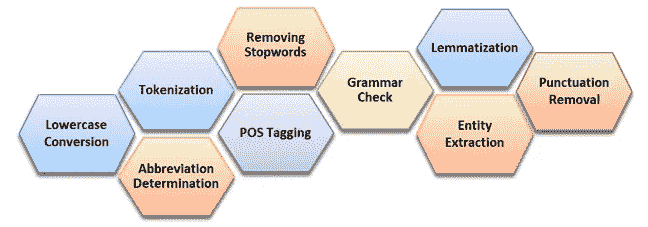

# 机器如何处理和理解人类语言——第一部分

> 原文：<https://medium.com/analytics-vidhya/how-machines-process-and-understand-human-language-part-1-3c7051abc4fd?source=collection_archive---------9----------------------->

## 机器能做到吗？如果是，机器是如何做到的？

在 T2 举行的 ACM 图灵会议上展示的海报。1] ，2019 年 5 月，中国

*人类的语言是高度模糊的……它也在不断变化和发展。人们擅长制造语言和理解语言，能够表达、感知和非常精细地解释。理论上，我们可以利用这些信息理解甚至预测人类的行为。机器能做到吗？如果是，机器是如何做到的？*

**是的，机器可以做到。**

人工智能的巨大进步让数据科学家变得更容易。理解人类或自然语言是被称为自然语言处理(NLP)的计算语言学的一部分。不仅理解语言，而且理解语言翻译、问答、文本摘要、垃圾邮件检测、情感分析、类似人类的对话等等。其中一个例子是人工智能聊天机器人或对话系统。对话系统正在成为当今最重要的战略通信技术之一。许多研究人员预测，到 2020 年，普通人与机器人交谈的次数将超过他们的家人。2*。尽管这种技术上的乐观存在障碍，但一些评论家已经注意到聊天机器人并没有实现最初的承诺，即应用程序和网站可以被取代。3*。平台供应商——比如脸书据说托管了 100，000 个机器人，以及超过 285，000 个聊天机器人。这一代人的期望是拥有自动语言翻译和语法纠正能力的类似人类的对话聊天机器人。不幸的是，许多聊天机器人模型的输出有时会给我们一些无意义的输出。**

**理解人类语言或非结构化数据是机器最复杂的任务之一，但借助当前的 NLP 技术，它正变得日益简单，并使机器能够理解人类语言并执行诸如关系提取、缩写、情感分析、命名实体识别和语音识别等任务。此外，在自然语言处理中，纠正嘈杂的、不合语法的文本仍然是一项具有挑战性的任务。理想情况下，给定一段文字，纠错系统将能够修复较小的印刷错误，以及涉及较长依存关系的语法错误，如非惯用的措辞或主动词一致的错误。然而，现有的方法通常只能纠正高度局部的错误，例如拼写错误或涉及冠词或介词的错误。基于分类器的纠错方法在捕捉大范围错误类型的能力方面受到限制 *[* [*参考文献。4*](https://www.aclweb.org/anthology/W14-1701.pdf) *。***

**在接下来的几个系列中，我将向您展示如何实现这一点的实际例子。在深入研究之前，重要的是要知道哪些过程有助于机器理解它正在摄取的东西。**

****自然语言处理(NLP)任务****

**如图 2 所示，NLP 过程的列表包括*小写转换、标记化、缩写确定、词性标注、语法检查、去除停用词、词条化、实体提取和标点去除*。您可以使用一个*自然语言工具包(NLTK)* 或 *StanfordNLP* 作为工具，对输入进行预处理，获得更准确的信息。**

****

**图 2 — [自然语言处理(NLP)中的活动列表](https://www.unsworks.unsw.edu.au/primo-explore/fulldisplay/unsworks_72771/UNSWORKS)**

**在下一篇文章(第 2 部分)中，我将通过一个实际例子来讨论每个 NLP 任务。请分享，敬请关注。感谢您的阅读。**

*****参考文献:*****

***【1】m . Nuruzzaman 和 O. K. Hussain，“使用递归神经网络* *通过序列标签识别聊天机器人问题回答的事实”，发表于 ACM 图灵庆祝大会-中国，中国成都，2019。***

***【2】高德纳。(2016)*[*2017 年及以后的顶级战略预测:挺过数字化颠覆的暴风*](https://www.gartner.com/en/documents/3471568/top-strategic-predictions-for-2017-and-beyond-surviving-) *。高德纳。***

***【3】j . Guynn，“* [*Facebook Messenger 对机器人*](https://www.usatoday.com/story/tech/news/2017/04/18/facebook-messenger-takes-another-swipe-chat-bots/100596798/) *”载于《今日美国》，编辑:Gannett 卫星信息网，2017。***

***【4】h . t . Ng，S. M. Wu，T. Briscoe，C. Hadiwinoto，R. H. Susanto，C. Bryant，* [*第十八届计算自然语言学习会议论文集:共享任务*](https://www.aclweb.org/anthology/W14-1701.pdf) *中的“CoNLL-2014 语法错误纠正共享任务”，马里兰州巴尔的摩，2014 年，第 1-14 页。***