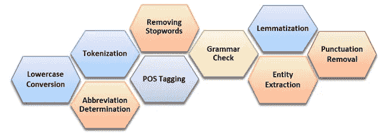

# 机器如何处理和理解人类语言——第二部分

> 原文：<https://medium.com/analytics-vidhya/how-machines-process-and-understand-human-language-part-2-5571f1f425a4?source=collection_archive---------6----------------------->

## ***机器能做到吗？如果是，机器是如何做到的？***

[在我之前的帖子(第一部分)](https://mohammad-nuruzzaman.medium.com/how-machines-process-and-understand-human-language-part-1-3c7051abc4fd)中，我已经讨论了概述、自然语言处理的重要性以及机器理解人类语言所需的 9 个步骤(图 1)。让我们在深潜之前对它们每一个进行总结和解释。

**标记化:**标记化是将一系列输入文本分割成单词、符号、短语或文本元素的技术。它被称为*令牌*。例如，如果用户输入的是*“每月保费是多少？”*，标记化过程后会有六个标记。这些是:*"什么"，"是"，"该"，"每月"，"保险费"，"什么？"。*这是任何自然语言处理过程(如解析、词性标注、实体提取、词汇化和语法检查)之前的强制步骤。

**缩写:**这是一个单词或短语的简写形式，用作由单词集合的首字母组成的完整形式的符号。这不应该被认为是拼写错误。例如，在诸如*“尽快联系您”的句子中，*缩写' *ASAP'* 不是字典中的单词，因此聊天机器人应该将*“ASAP”*识别为缩写，其完整形式为*“尽快”*。缩写及其完整形式的正确识别对于理解用户的查询、用户的上下文和纠正语法非常重要。

**词性标注:**词性(POS)解释一个单词在句子中的用法。它是为用户输入序列中的每个单词分配词性标记的过程，如名词、动词、形容词、副词、介词。考虑到句子*“订航班”*， *book* 是动词，但是在句子*“把书给我”*， *book* 是名词。词性标注是一项消歧任务，目标是为给定单词找到合适的标签。理解、提取关系、发现句子中的语法或词汇模式是非常重要的一步。

**词条化:**这是对词的词法分析。它旨在仅移除屈折词尾，并将单词转换回其常见的基本形式或单词的字典形式，称为*引理*。例如，单词*“研究”*的基本形式是*研究*。单词*【男孩】*的基本形式是*男孩*单词“*跑”*的基本形式是*跑*。

**语法检查**:语法检查是一项分析用户在基于文本的输入中经常犯的语法规则、句子结构和拼写错误的任务。包含语法错误的文本可能会导致产生不正确的响应。因此，能够识别和纠正这些语法错误是至关重要的。语法检查能够自动检测和纠正底层语法中的任何错误、非常规或有争议的用法。

**实体提取:**这是一个信息处理的过程，用于识别和提取命名的实体，并将其分类到各种预定义的类别中，如人员、组织、日期、位置等。实体提取技术自动从文本中提取专有名词，并确定它们的公共实体标签，例如人、位置、组织、事件。例如，在诸如*“Nuruzzaman 博士在 ELMO 工作”的句子中，*实体提取将“Nuruzzaman”提取为个人，将“ELMO”提取为组织。

**标点去除:**标点和停用词对于 AI 模型预测和生成响应不是必须的。标点符号是特殊字符，例如:？@ # % & *！诸如此类。停用词有:am，is，was，and，the，an，a，he 等。比如在回复*“你好！！，怎么会？是吗？”* NLP 将此处理为*“你好吗”*作为删除标点符号的结果。

现在是时候使用 NLP 工具做一些很酷的事情了。在进行任何步骤之前，第一个任务是小写转换。为了更好地权衡，我们将所有文本数据都转换成小写。这是最简单的文本预处理形式之一。这是为了确保无论字母以大写、标题大小写或句子大小写开头，相似的单词必须相互匹配。

这一点很重要，因为人工智能模型可能会将位于句子开头的大写字母单词与出现在句子后面但没有大写字母的单词区别对待。这可能会导致准确性下降。下面的代码片段使用进行小写转换。

**第二步，**我们将进行标记化。这是自然语言处理的重要一步。**标记化**是一种将输入序列流分割成单词、符号、短语或其他文本元素列表的技术。换句话说，标记化是将句子中的每个单词拆分成一系列单个单词的过程。不准确的单词识别或句子识别可能会导致产生意外或不相关的结果。单词检测需要更高的准确性，以使结果更准确。

标记化的输出被提供作为在各种步骤中的进一步文本处理的输入，这些步骤诸如标点符号去除、数字字符去除、词条化、词性标注、实体提取、拼写校正或语法检查。我们使用了 *PTBTokenizer* ，它每秒可以执行 315 万个令牌。例如，下面的代码片段显示了对句子*“告诉我美国运通卡的好处”执行的标记化*又分裂成*‘告诉’，‘我’，‘优惠’，‘美国运通’，‘信用卡’，’*。

**第三步，**我们将确定缩写及其完整形式。随着人们通过应用程序交流，缩写的使用持续增长。检测缩写的完整形式具有重大挑战，因为通常很容易将它们与拼写错误相混淆，或者通常，相同的缩写具有多个完整形式。例如，' *CU* '不是字典中的单词，因此它可能被检测为拼写错误或非单词错误。另一个例子是*‘UNSW’*，它有两种不同的完整形式，如下表所示。确定首字母缩略词指的是哪种完整形式是高度依赖于领域的。因此，发现首字母缩略词并将它们与它们的扩展形式联系起来，对于机器(AI 系统)正确理解人类语言是很重要的。

缩写及其完整形式的正确识别对于理解用户查询和上下文非常重要。比如缩写*“CS”*有五种完整形式。为了识别缩写，我们将该过程分为四个部分:(1) *缩写识别器、*、( 2) *缩写提取器、(3)定义查找器*和(4) *缩写匹配器。*

缩略语识别和提取过程

**(1) *缩写识别器:***

在这个步骤中，人工智能系统(机器)识别用户查询中所有可能是首字母缩写词的简短形式。为了识别首字母缩写词，我们关注在用户机器人对话中频繁出现的单词序列，并应用缩写规则。让我们考虑用户输入一个句子作为*“UNSW 在哪里？”*。我们的任务是识别 *UNSW* 是否缩写为*“新南威尔士大学”*或*“联合国作家协会”*。为此，首先将句子拆分成单词，并从用户定义的停用词列表中删除停用词。然后，将下列规则和条件应用于该单词，以确保识别出适当的缩写:

I .字符串包含至少两个字符。

二。该字符串不在用户定义的停用字词列表中。

三。该字符串不包含任何特殊字符。

四。它不在词典的单词、人名或地名中。

但是，很多专有名词都具有与上述相同的特征，被公认为一种缩写。为了减少识别错误缩写的可能性，人工智能系统应用了由 IBM Watson Talent System 创建的专有名称列表。

**(2) *缩写提取器:***

缩写提取是一个类似于实体提取的过程。目的是从上一步中提取识别出的缩写列表，因为它在字典中具有完整的形式。在这一步中，应用 NLP 技术(词性标注器)来为每个单词分配词性。接下来，实体提取用于从给定的句子中提取缩写。这一步的结果是找到的可能缩写的列表，在本例中是来自句子*“UNSW 在哪里？”的*“UNSW”*。第 3 部分将讨论词性标注。*

***(3)定义查找器:***

在缩写词被提取之后，AI 系统在包含成千上万个缩写及其完整形式的缩写数据库中搜索该缩写的可能定义。通过组合提取的缩写词，AI 系统用提取的缩写列表形成查询，以从缩写字典中检索完整形式(定义)的列表。

**(4) *缩写匹配器:***

所有缩写根据不同的行业领域进行分类，例如学术、商业、社会和杂项。

如图所示，*“UNSW”*与字典匹配，检索出结果*“新南威尔士大学”*。它有可能检索到多个结果。在这种情况下，AI 系统应用两个缩写规则来确定给定输入的适当完整形式。一个规则是确定命名实体(NER)及其关系。另一个规则是使用 NER 来识别缩写“UNSW”属于哪一类。这是通过使用 CRF 分类器来完成的。它是一个有区别的无向概率模型，用于标记或解析顺序数据，并被训练以最大化条件概率。在第 3 部分中将会详细解释。缩写的完整代码片段。

今天到此为止。在第三部分，我将向你展示(1)如何标注词性，(2)去除停用词，(3)检测和纠正句子中的语法错误。请分享、鼓掌并继续关注更多。感谢您的阅读。