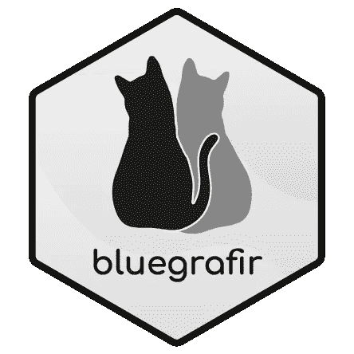

# 制作我自己的开源包是如何节省我大量时间的

> 原文：<https://medium.com/analytics-vidhya/how-making-my-own-open-source-package-saved-me-tones-of-time-848a77f77b82?source=collection_archive---------8----------------------->



自有资源

包是许多开源语言的核心。例如，在 CRAN in R 中，您可以找到已经发布的 17898 个包和超过 200，000 个 Python 包。

这些数字并没有包括 github 中所有非常有用的包。我花了很多时间用 R 和 Python 编程，但是有一些特定的项目我更喜欢用 R。

我几乎所有的心理测量项目都是用 R 编写的，因为我觉得在那个主题上它比 Python 更成熟一点，而且我也非常习惯它。

我经常遇到的一个大麻烦是，有时我找不到非常具体的分析，这些分析正变得流行和高度。其中一个是综合可靠性(CR)指数，另一个是在验证性因子分析(CFA)框架中提取的非常常见的平均方差(AVE)(Kline，2016)。

因为这两种分析在很多书中都有，所以我想我可以找到一个非常简单的函数来执行这两种分析。我大错特错了！

因为我曾经在 R 中使用 lavaan 包进行所有围绕结构方程模型(SEM)的分析，所以我开始手动计算 CR 和 AVE。

我是怎么做到的？

我在 R 中创建了一个简单的函数，并在我正在处理的脚本中运行它。大概是这样的:

```
# Manually had to hard code the values 
cargas1 <- abs(c(0.67,0.66,0.69,0.59))
errorv1 <- abs(c(0.55,0.57,0.52,0.66))# Created the functions for composite reliability comp.rel <- function(x,y) {  operacion <- (sum(x) * sum(x))/(sum(x) * sum(x) + sum(y))  return(operacion)} comp.rel(cargas1,errorv1)# Manually had to hard code the valuescargas2 <- abs(c(0.30,0.54,0.54))
errorv2 <- abs(c(0.91,0.71,0.71))# Created the functions for AVEave <- function(x) {  operacion <- sum(x^2)/length(x)  return(operacion)}ave(cargas1)
```

这种解决方案在许多方面都不是最理想的:

1.  它是硬编码的，因此如果将来我想部署它，可能会给团队带来巨大的麻烦。
2.  这很混乱，因为我不得不复制粘贴新创建的函数，有时我没有找到它们，我不得不重写它们。
3.  对我和检查我的代码的人来说，阅读起来很困难，因为没有好的解释或自述文件，很难理解这些数字。

这样的例子不胜枚举…

**推出**[**bluegrafir**](https://github.com/jsaraviadrago/bluegrafir)**套餐**

这发生在几年前，有一天我对这种情况感到厌倦。所以我决定自己做一个包放在 github 里。bluegrafir 是以我的两只猫(blue 和 grafito)命名的，旨在提供一种简单的方法来执行这些和其他功能。

总的来说，它是一个整洁的表，连续变量的线性变换，平均方差提取和验证性因素分析(CFA)的综合可靠性的实施。

此外，制作自己的软件包非常有趣，它真的让我的工作更有效率。为了制作这个包，我不得不真正深入 lavaan 包的内部工作，构造函数，测试它们并制作文档。这真的帮我解决了一些主要问题，让我的工作更有效率。例如:

1.  我发现所有需要计算 CR 和 AVE 的值都在一个深 lavaan 对象中，因此我可以从那里提取它，而不是硬编码它们。
2.  要打开这个函数，我不需要再次创建它，我只需要通过 [bluegrafir](https://github.com/jsaraviadrago/bluegrafir) 包调用它。
3.  我创建了一个非常详细的自述文件，所以如果有人想知道这些函数和包到底做了什么，他们可以在那里阅读。

此外…

4.我的团队开始使用这个包，所以我们没有“传递函数”,而且每个人都知道这个分析是关于什么的，以及它是如何完成的。所以更容易得到可重复的结果，因为我们都执行相同的代码。

5.我的团队开始有更多的时间，因为我们可以减少手动任务的时间，并将时间更多地用在创造性的事情上，例如解决业务问题。

为了使包有组织，有一些 blue_something 函数和其他 graph_functions 函数。所有的 blue _ functions 都专注于线性变换和图表中的 grafi_ in。我决定这样做，这样在包的名字和它的功能之间就有了一条连贯的思路。CR 和 AVE 有不同的名字，因为它们是用来计算不同的东西的。像“testthat”、“devtools”和“roxygen”这样的包是创建、测试和使用这些包的基础。

如果你想查看包裹，你可以点击这里( [bluegrafir](https://github.com/jsaraviadrago/bluegrafir) )。

**简单回顾一下**

1.  制作你自己的包是非常有趣的，你可以学到很多关于制作包的细节，并迫使你学习好的编码实践。
2.  创建自己的包帮助我提高了工作效率。它有助于减少硬编码、低效编码和与团队成员交流编码。
3.  创建一个包有助于所有团队减少手动任务，将它用在更有价值的事情上，并增加可重复结果和部署的可能性。

就是这样！希望这篇文章激励你制作自己的包！谁知道呢？也许你可以个性化它，给它一个很棒的名字和标志。

编码快乐！

**参考**

克莱恩河(2016 年)。*结构方程建模原理与实践。第四版*。纽约:吉尔福德出版社。