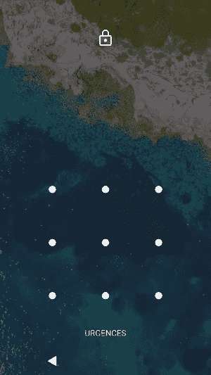

# 有多少种模式可以锁住你的安卓智能手机？

> 原文：<https://medium.com/analytics-vidhya/how-many-patterns-are-there-to-lock-your-android-smartphone-8af69256eca?source=collection_archive---------14----------------------->

## android 锁屏机制分析


照片由 [**布雷特·赛勒斯**](https://www.pexels.com/@brett-sayles?utm_content=attributionCopyText&utm_medium=referral&utm_source=pexels) 发自 [**佩克斯**](https://www.pexels.com/photo/black-combination-alarm-system-1990764/?utm_content=attributionCopyText&utm_medium=referral&utm_source=pexels)

如果你有一部安卓智能手机，你应该很熟悉你选择用来锁定手机的模式。每次，你拿起手机，机械地在屏幕上画出这些线，将点连接起来，形成解锁图案。



安卓锁屏

这种锁定机制比使用数字序列(如 PIN)更直观，但也有缺点，因为研究论文显示了如何有效地猜测解锁模式

*   人们通常使用从左上角开始的解锁模式。这种假设大大减少了攻击者的搜索空间
*   你手指上油渍留下的痕迹，因为这是你最常画的图案

这两种对锁机制的攻击通常被称为*启发式攻击*和*涂抹攻击*[【1】](https://dl.acm.org/doi/abs/10.1145/2462096.2462098)[【2】](https://www.emerald.com/insight/content/doi/10.1108/ICS-01-2015-0001/full/html)[【3】](https://www.usenix.org/legacy/event/woot10/tech/full_papers/Aviv.pdf)。

现在的问题是有多少种解锁模式，真的吗？389,112.

好吧，等等。这个数字来自[这篇研究论文](https://www.usenix.org/legacy/event/woot10/tech/full_papers/Aviv.pdf)【3】。但是，现在我们的目标是验证这一点！

# 有效模式的规则

正如本文 [3]中所解释的，有效模式有三个简单的规则

1.  该模式必须连接至少四个点
2.  在模式中，一个点最多只能使用一次
3.  除非之前已经连接过，否则中间点会成为接触点

规则 1 和 2 意味着图案中至少应该有一个方向变化，所以你不能有像直线一样明显的图案。然而，规则 3 是最有趣的，因为…对不起什么？哦，别担心！这也是一个简单的规则，这里有一个图解说明。


有效和无效模式的示例。不连接先前未连接的点，你就不能穿越。

该规则告诉你必须始终包括你在路上穿过的点，除非它们之前已经被包括在内。这就是我所说的“中间”点。现在，这个规则有趣的部分在于它使得数学推导可能模式的数量变得多么复杂。

# 数学解析尝试

我们先忽略规则 3。通过这种简化，连接 *k* 点的模式等同于从所有九个可用点中选取的那些 *k* 点的排列。通过从包含 9 个点的袋中依次选择 k 个点*来获得排列。不同排列的数量是*


然后，我们可以通过将所有具有 4 个或更多点的模式相加，得出模式的总数(规则 1)。


现在让我们考虑规则 3，想想它改变了什么。我们现在必须考虑应该从总数中减去的无效排列。这对于 1、2 或 3 点的模式来说是可以管理的，但是对于更长的模式来说就变得困难多了。这种复杂性可以通过使用强力算法来克服，该算法将测试所有模式并计算有效的模式。让我们使用 Python 代码。

# 程序分辨率

在我们的代码中，我们用一个数字标记每个点。


标记点

根据这些标签，我们需要构建一个跨越中间点的连接字典。这将有助于检查规则 3

```
INTERMEDIATE_POINT = {
"13": "2",
"46": "5",
"79": "8",

"17": "4",
"28": "5",
"39": "6",

"19": "5",
"37": "5"
}
```

我们如何知道一个给定的模式是有效的？让我们编写一个函数来实现这个功能。

我们已经拥有了编写主算法所需的一切。我认为使用递归函数是最自然的选择。递归有两个停止条件

1.  如果模式无效
2.  如果模式有最大长度，也就是说，它包含所有点(因为规则 2)

我们跟踪一个变量`count`来计算我们找到的有效模式的数量，并对增加了可用点中的一个点的模式进行递归调用。

让我们运行它。

```
count_patterns("", "123456789", max_length=9, min_length=4)
```

这将输出 389，112。这证实了论文中的结果！

# 规则 3 的影响

下面的代码演示了规则 3 对有效模式数的影响。我根据连接点的数量打印并绘制图案的数量。


模式和排列的数量与连接点的数量

[1]关于模式屏幕锁定方法和软侧信道攻击的安全性的初步研究。Panagiotis Andriotis，Theo Tryfonas，George Oikonomou，Can 伊尔迪兹。2013 年 4 月。

Android 模式锁屏的可用性和安全性研究。Panagiotis Andriotis，George Oikonomou，Alexios Mylonas，Theo Tryfonas。2016 年 3 月。

[3]智能手机触摸屏上的污迹攻击，Adam J. Aviv，Katherine Gibson，Evan Mossop，Matt Blaze 和 Jonathan M. Smith。2010 年 8 月。

*原载于 2021 年 1 月 16 日*[*https://adamoudad . github . io*](https://adamoudad.github.io/posts/lock_pattern/)*。*