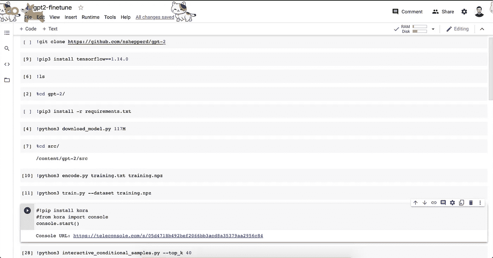
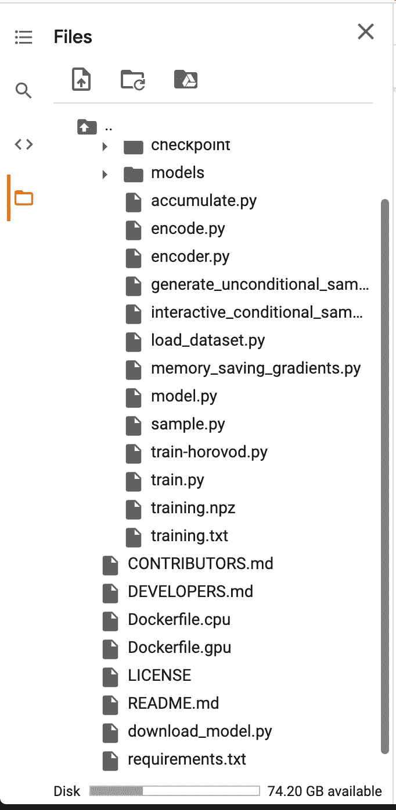
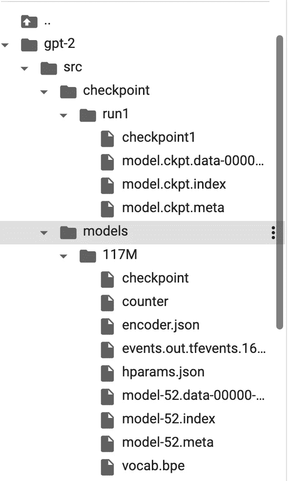
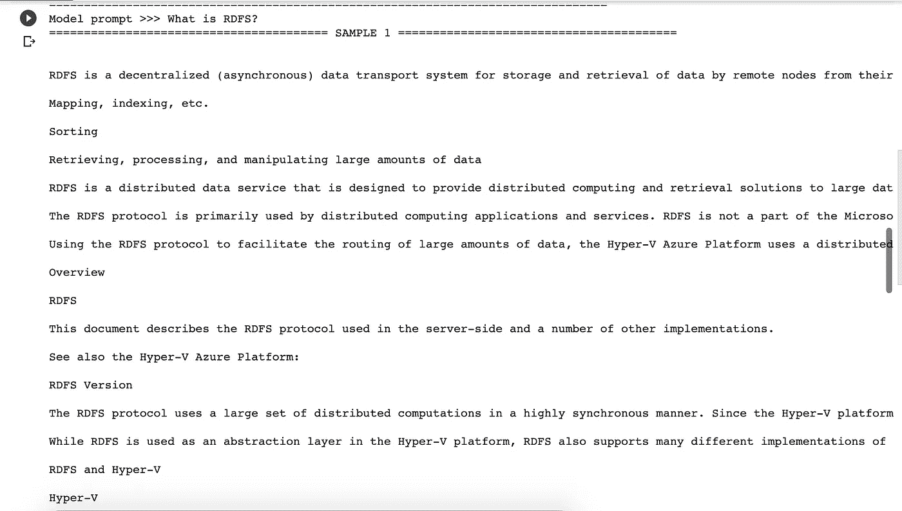
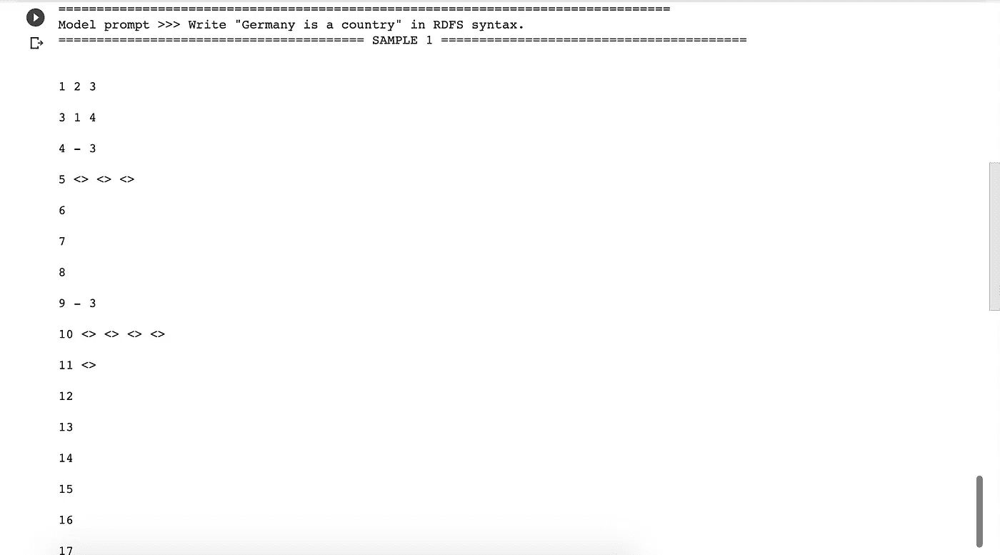

# 如何不微调 GPT-2(在谷歌实验室)

> 原文：<https://medium.com/analytics-vidhya/how-not-to-finetune-gpt-2-on-google-colab-f782cdbe0f0a?source=collection_archive---------13----------------------->

2021 年 1 月 6 日

再次大家好，我在这里的最后一个帖子是 GPT-2 的简单入门指南，我正在寻找微调该模型的方法，以创建自定义的东西。我目前正在上一门名为“语义网”的课，它的内容对我来说感觉很小众，然而由于讲座的范围在某些方面有点抽象，我有时很难理解概念。

由于 GPT 模型“神奇地”工作得很好，:D，我想也许我可以抛出 15000 行从一些主要网站收集的关于语义网和语义网概念的原始文本，它可以帮助我理解一些基础知识，同时指导我回答简单的语义网相关问题。嗯，嗯，嗯…它没有…:)

我的意思是，这并不奇怪，这可能不是你应该如何微调一个模型，因为我是一个完全的新手，我说为什么不。

然而，这种体验还不错，我可以帮助你只在谷歌实验室上微调 GPT-2，所以如果你不像我一样使用它，你可能会得到更好的结果作为回报。让我们开始吧。

[示例代码](https://github.com/eren23/gpt2-colab-finetune/blob/main/gpt2_finetune.ipynb)在此，但 [Github](https://github.com/nshepperd/gpt-2) 和 [Medium](/ai-innovation/beginners-guide-to-retrain-gpt-2-117m-to-generate-custom-text-content-8bb5363d8b7f) 上这两个回购的所有信用。这种过程真的很难，在这两个回购的帮助下，这就像是一个阳光明媚的周日下午:)

上一个教程完全是为了收集所有的图片和材料，我会把它们放在一张图片上，然后把结果放在另一张上。

第一步，我们需要安装 GPT-2 和一些额外的库，以便更容易微调。下一步是安装 TensorFlow，我无法找到一个像样的 GPU 版本，可以很好地与这个模型一起工作，所以这是我们使用的。

之后，我们可以定位到 gpt-2 文件夹并运行需求安装命令。它应该工作得很顺利。在那之后，我们可以安全地下载我们的模型了，但是未来的改变将会在内部进行。

在这一点上，由于使用 bash over colab 是相当痛苦的，我们将使用 files 部分来进行安排。

我们应该将“encode.py”、“train.py”和“train-horovod.py”从 gpt-2 主文件夹移动到/src 文件夹。我们最新版本的文件夹结构已经在上面给出了。

在运行优化模型之前，控制台上的最后 2 个步骤是对我们选择的文本进行编码，并训练新模型。为此，我们首先定位到/src 文件夹，然后运行上面第一张图中的命令。在 50 次迭代之后，我停止了我的模型，因为，老实说，从一开始它就不那么有希望了，因为我知道我用什么来喂养模型:)

在我们停止代码后，最后一步将是通过替换模型文件进行文件夹排列，我们可以改为复制模型并更改名称来保存前一个。调整后的模型位于/src/checkpoint/run1 文件夹中，我们可以将所有内容复制并粘贴到/src/model/117M 文件夹中。我把旧模型和检查点文件从旧模型中移走，并把它们保存在新模型的文件夹中，这完全没有必要。

这大概就是我们的文件夹结构应该看起来的样子。

现在我们可以安全地运行我们的交互式运行代码，看看会发生什么。我们可以创建一个新的单元来运行下面的命令。

上一个教程我用的是 Kora 但是 Kora 和 builtin 都有！colab 上的 bash 命令不知何故找不到我们的模型，切换背后的原因是。

我会在下面留下一些结果，这样你就可以看到当你用 garbage :D 对一个模型进行微调时会有什么样的结果。

实际上，当看最后一个时，你会感觉到它开始理解正在发生的事情，但是特别是数据收集部分仍然是处理这种问题时要解决的最大问题。其实大多数情况下，都是 ML 相关的问题。

谢谢你陪我走了这么远，我们下次再见。:)

*最初发表于***。**