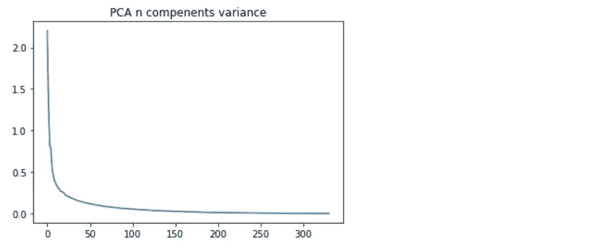

# 推荐系统如何工作

> 原文：<https://medium.com/analytics-vidhya/how-recommendation-system-works-855658527e13?source=collection_archive---------13----------------------->

## 使用基于内容和协作过滤向用户推荐博客

[来源](https://wallpapercave.com/w/wp7348236)

## 目录:

1.  什么是推荐系统
2.  为什么推荐有用
3.  推荐系统如何工作
4.  数据洞察
5.  探索性数据分析
6.  数据预处理
7.  协作过滤方法
8.  基于内容的过滤方法

# 1.什么是推荐系统:

一旦你是高中新生，每个人都对你陌生。当一个男孩走近你，向你介绍他，你也向他介绍你的，但是经过一番交谈，你发现他喜欢说唱歌曲，你也喜欢，经过深入的交谈，你向他推荐一些他从来没有听过的阿姆的说唱歌曲，这就是推荐。

推荐系统是帮助用户发现新产品和服务的机器学习系统。每次你在网上购物，一个推荐系统都会引导你找到最有可能购买的产品。

# 2.为什么推荐有用:

你熟悉 tiktok 视频 app，tiktok 有是最强大的推荐引擎。你可能不相信，但人们每天花 45 分钟在 tiktok 应用上，这个数字在 Snapchat、Instagram 和脸书上分别是 26 分钟、29 分钟和 37 分钟(根据调查)。

[来源](https://mediakix.com/blog/top-tik-tok-statistics-demographics/)

Tiktok 有很多方法来获取用户数据进行推荐。

***内容数据*** —抖音是一个拥有海量用户生成内容的平台。每种类型的内容都有其特点，系统应该能够识别和区分它们，以提供可靠的推荐。

***用户数据****——*这些包括兴趣标签、职业、年龄、性别、人口统计等。它还包括基于 ML 的客户聚类的潜在特征。

***场景数据*** —该数据根据不同的场景跟踪使用场景和用户的偏好变化。例如，用户在工作、旅行或通勤时喜欢观看什么类型视频。

***关联特征*** *:* 表示内容属性与用户标签之间的关联，包括关键词匹配、分类标签、来源匹配、主题标签，以及用户与内容之间的向量距离等潜在特征。

因为推荐系统 tik-tok 是所有应用程序的榜首，并获得巨额利润(以十亿计)。

# 3.推荐系统如何工作:

现在你对推荐系统了解不多，推荐主要分为两类。

1.  基于内容的方法
2.  协作过滤方法
3.  混合方法(基于内容的协作过滤方法)

## 1.基于内容的过滤:

基于内容的过滤

在基于内容的过滤方法中，向用户推荐类似于用户过去喜欢的产品。例如，如果人们喜欢复仇者联盟电影，我们会向用户推荐超级英雄电影，如 x 战警系列，奇异博士，蜘蛛侠，蝙蝠人等。根据人们对不同电影或不同产品的喜欢和不喜欢进行推荐。

> 一个基于内容的推荐系统是通过我们从用户那里获取的数据来工作的，无论是评分/观看/阅读。通过这些数据，我们创建了一个用户简档，然后用于向用户提供建议，随着用户提供更多的输入或对建议采取更多的行动，引擎变得更加准确。

## 2.协作过滤方法:

协作过滤方法

在协作过滤方法中，如果人 A 喜欢 3 部电影蝙蝠人电影、超人电影和雷神电影，而人 B 喜欢 x 战警电影、绿巨人电影、雷神电影。所以我们推荐 A 人看 x 战警电影，绿巨人电影，B 人看蝙蝠人电影，超人电影。

> 在协作过滤中，我们倾向于找到相似的用户，并推荐相似用户喜欢的内容。在这种类型的推荐系统中，我们不使用项目的特征来推荐它，而是将用户分类到相似类型的聚类中，并根据其聚类的偏好来推荐每个用户。

# 4.数据洞察:

建议以两种方式构建。

1.  基于内存
2.  基于模型

在基于记忆的方法中，使用不同的距离度量，如余弦相似度、欧几里德距离，并检查哪个产品或用户与我们的用户或产品相似。

在基于模型的方法中，使用不同的模型来推荐用户或产品，如 k 均值聚类、矩阵分解等。

我们看到一个与两个推荐系统相关的例子。我们建议用户发布博客文章(基于内容的过滤)和发布文章(协作过滤)。数据包含两个 csv 文件发布数据和用户发布数据。

发布数据

帖子数据包含每个博客帖子的唯一 id、帖子标题、帖子类别(AI/ML、绘画、操作系统)和帖子类型(博客、艺术品、技能)。

用户后数据

查看数据包含用户 id 和帖子 id，哪个用户 id 查看了哪个带有时间戳的帖子。

# 5.探索性数据分析:

我们从下图中看到，大多数用户是男性，少数用户不详。

用户计数图

我们从下面的 word cloud 中看到，大多数帖子是基于人工智能/机器学习、计算机应用的，少数帖子是法律、政治等。

# 6.数据准备:

对于数据准备，将文本转换为小写，将印地语单词转换为英语单词，并删除特殊字符

对于文本编码，我们将标题特征转换为 tf-idf 向量，将类别特征转换为多标签二值特征，因为我们的类别特征在单行中包含多个类别。

文章标题特征被编码成 tf-idf 特征向量，但是 BOW 和 tf-idf 向量不与单词相似度一起工作，所以将 TF-IDF 与 avg w2v 一起使用。我们将 tf-idf 单词值乘以特定单词 300 个模糊向量，并对它们进行平均。我们得到矩阵的最终形状(行数，300dim)

我们可以使用 KMean 聚类方法进行推荐，但 Kmean 方法不能很好地处理高维数据集，因此我们将使用降维技术 PCA 来减少特征。在解释方差图(肘形图)的帮助下，将选择能给出最大特征信息的 n_component。

我们从肘部看到，特征方差在 75 个特征之后减少太多。所以我们将为我们模型选择 75 个特征。

# 7.协作过滤方法:

创建端到端渠道，向类似博客文章推荐博客文章。在转换完所有的数据预处理和编码后，推荐使用 k-mean 聚类方法。

kmean

*   示例 1:

*   示例 2:

# 8.基于内容的过滤:

在 below pipeline 中，我们根据用户过去观看的帖子向用户推荐博客帖子。

*   示例 1:

*   示例 2:

*你可以在**[***LinkedIn***](https://www.linkedin.com/feed/)**上找到我，源代码在*[***GitHub****。*](https://github.com/tankmitesh/Post-recommendations-with-content-based-and-collaborative-filtering)**