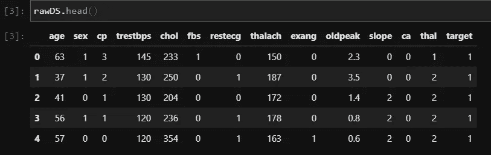
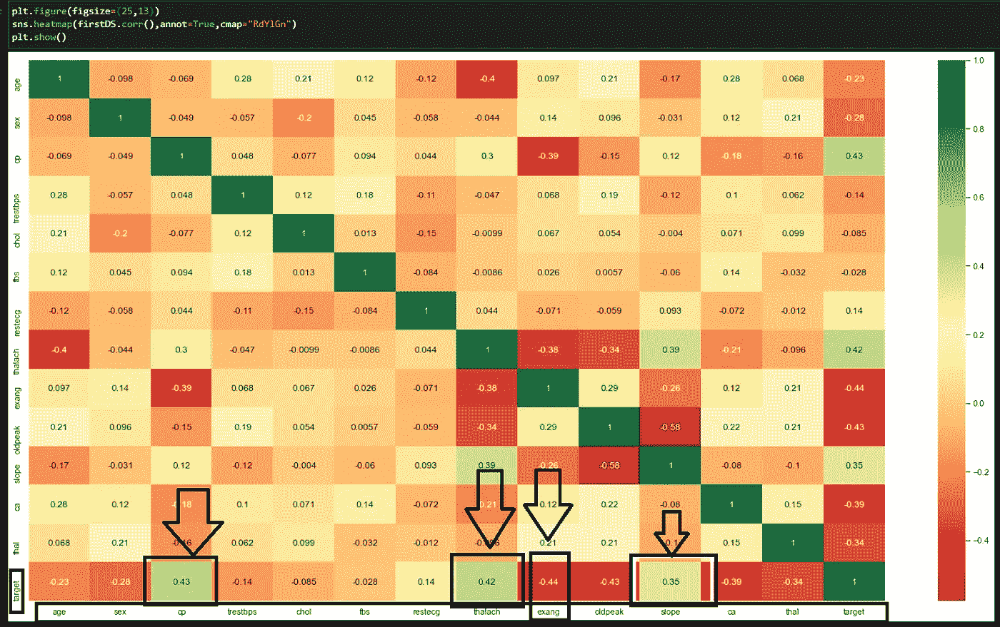
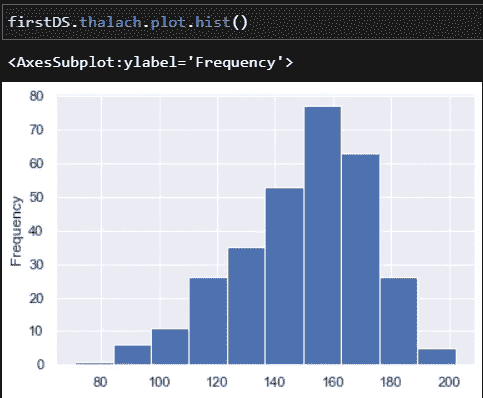
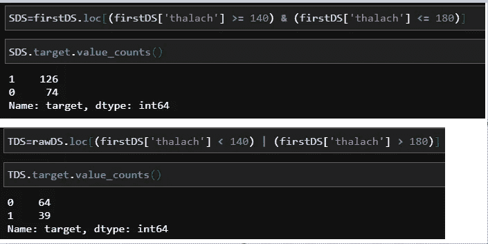
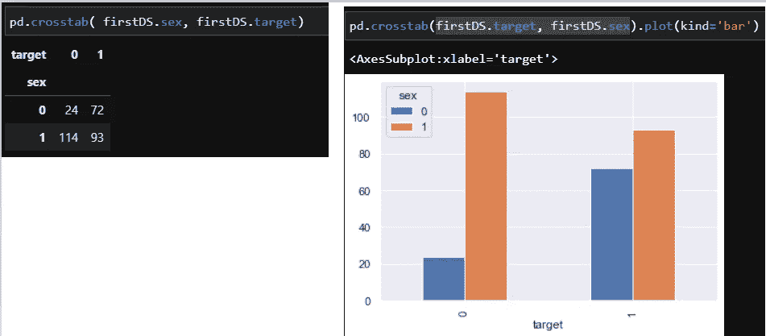

# 你的热图在机器学习模型中有多重要

> 原文：<https://medium.com/analytics-vidhya/how-relevant-is-heatmap-in-your-machine-learning-model-6eb79a820f18?source=collection_archive---------10----------------------->

证明你的机器学习模型的相关特征

[粘土银行](https://unsplash.com/@claybanks?utm_source=medium&utm_medium=referral)在 [Unsplash](https://unsplash.com?utm_source=medium&utm_medium=referral) 拍摄的照片

M 我们中的任何人都同意我的观点，人类的大脑比任何数字形式的数据更能理解图形表示。这就是图表出现的地方。许多 ML 开发者在机器学习模型中使用热图。但是我们真的理解它的含义吗？即使我们知道，这真的证明了你的模型吗？

今天，我将深入研究 Seaborn heatmap，并使用 ML 模型进行论证，以回答我们的问题。

本文的实际目的是理解热图的含义，而不是创建 ML 模型。因此，我们将有一点背景设置和一点 EDA(探索性数据分析)和更多的热图理解。

> 所以关上门，拿起 coffee☕，让我们开始吧。

**问题:**我们将有一个分类问题数据，该数据表明，如果一个人的读数涉及这些因素，他/她是否会患心脏病。([在这里找到数据](https://www.kaggle.com/ronitf/heart-disease-uci/))

1.  年龄:以年为单位的人的年龄。
2.  性别:1 代表男性，0 代表女性
3.  cp:胸痛(0，1，2，3)
4.  trestbps:休息血压
5.  胆固醇:胆固醇
6.  空腹血糖。
7.  restecg:心电图
8.  thalach:最大心率。
9.  例:心绞痛时运动
10.  oldpeak:锻炼时的心脏状况。
11.  斜率:运动时心脏的斜率
12.  克里斯安德森:指示血液流动
13.  thal:唐松草胁迫(越危险)
14.  目标:1 个人看起来有疾病，0 个人看起来没有任何心脏病。

# 好吧，让我们从小埃达开始

我们这里有什么样的数据？

数据前 5 名结果的标题集

目标将是我们的因变量，其余将是自变量。从文件中，我们可以说这是一个平衡的数据集。现在让我们来看看 seaborn 热图，找出 target 和其他列之间的相关性。

热图上的数据关联

关于热图的事情如右侧所示。绿色越多越正相关，红色越负相关。因此，我们可以说“cp”与“target”高度相关，“thalach”也是如此。这就是热图所显示的。让我们看看这是否正确。

## 1.“thalach”对“target”的影响分析(正相关)

我们所有的数据是“thalach”就像截图。

我们将这些数据分成两部分。我们有下文。

SDS 有大约 200 个数据，有大约 63%的几率患有心脏病(目标= 1)。另一方面，TDS 有 100 个数据，只有 38%的机会患有心脏病(目标= 1)。

> **结论**:这表明此人有**较高的心率**暂定有**较高的心脏病几率**。这在热图上也有显示。

## 2.“性别”对“目标”的影响分析(负相关)

如果我们仔细观察，大约有。女性患心脏病的几率为 73%。46%的男性患心脏病的几率。

> 🤷‍♂️嘿…！你从中得到了什么？

好的，让我解释一下。看到性的价值从 0-女到 1-男不等。正系数意味着如果“性”的价值增加，“目标”的价值也应该增加，但在目前的情况下，反之亦然。如果性的价值在增加，目标的价值在减少。解释负系数的原因。

> 凉爽的😎我听到了…这是负相关的，让我去掉这个特性。

> 🚫等等，这是你不应该做的。

我听到许多开发人员说，如果特性是负相关的——放弃它。事实上，任何负相关的特征都和正相关的特征一样重要。重要的是它们的值，如果系数值非常接近 0.0(正或负)，那么我们应该考虑放弃它。否则它对我们的模型是重要的，不管是正面的还是负面的。

# 数据调查的重要性

一个人应该总是试图理解他正在处理的数据的类型。

让我举个例子告诉你。如果你看一下“cp”栏的数据，它从[0–3](http://www.scielo.br/scielo.php?script=sci_arttext&pid=S1516-31802019000100054)不等。这意味着…

*   0:典型心绞痛
*   1:非典型心绞痛
*   2:非心绞痛性疼痛
*   3:无症状

好的，这是什么意思？“cp-0”表示这种疼痛与心脏密切相关，“cp-3”表示这些疼痛与心脏疼痛无关。也就是说，如果 CP 值较低，就有可能患心脏病。根据这个类比，这应该具有负系数值，但实际上它具有正系数值。

这意味着我们需要理解我们正在处理的数据。这应该是你的模型的根。