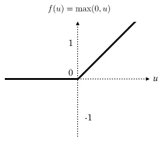
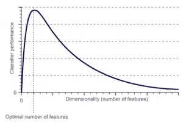
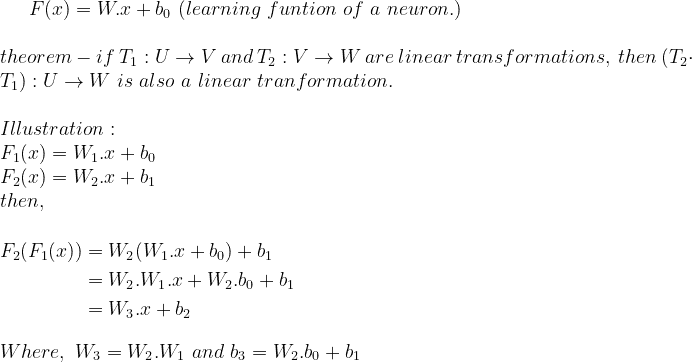
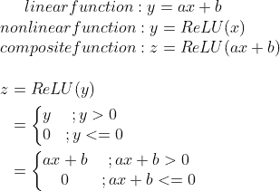
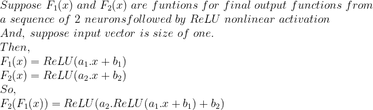
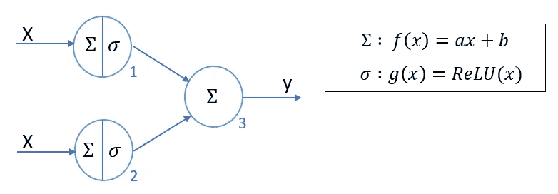
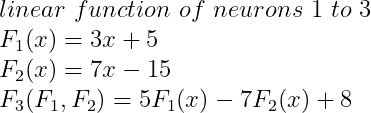
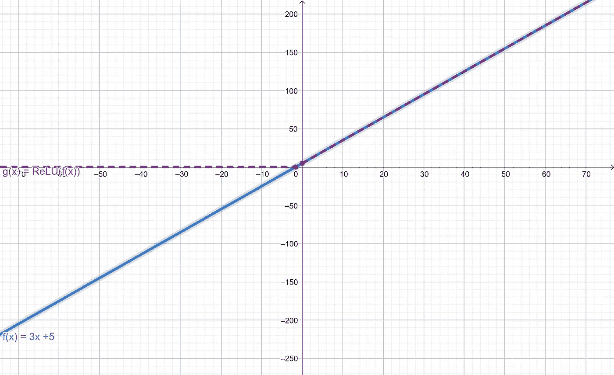
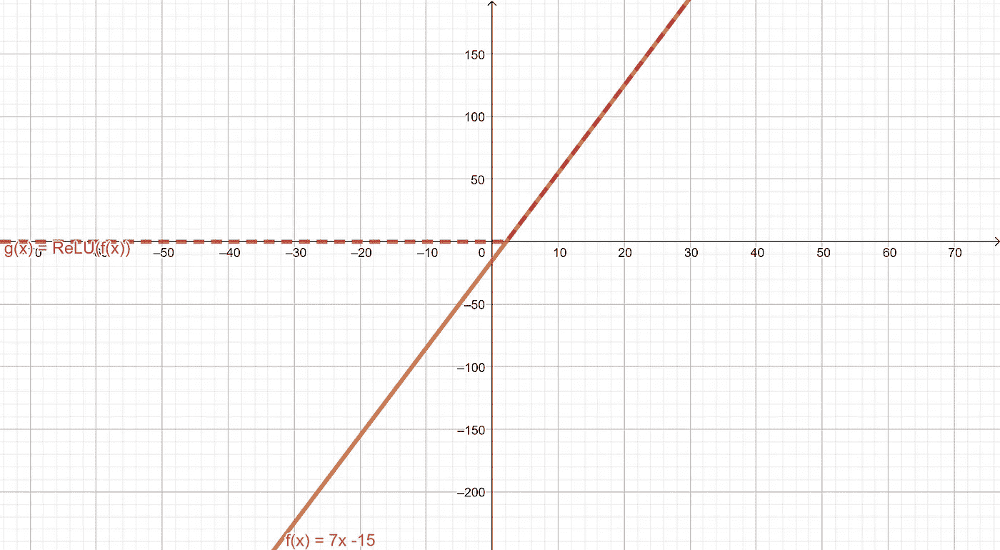
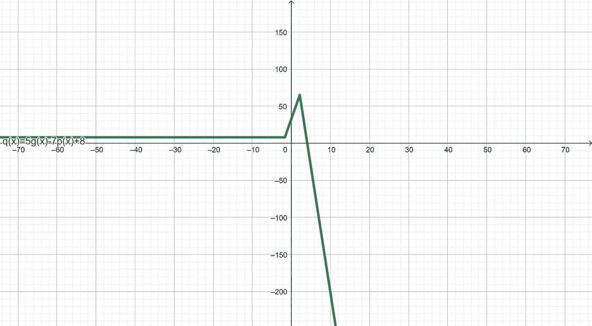

# ReLU 激活是如何工作的？

> 原文：<https://medium.com/analytics-vidhya/how-relu-works-f317a947bdc6?source=collection_archive---------8----------------------->

## 对于我们大多数人来说，ReLU 是如何工作的是一件神秘的事情。因此，很难理解神经网络是如何运作的，也很难理解我们从训练中获得了什么样的学习功能。

乔尔·菲利普在 [Unsplash](https://unsplash.com/s/photos/dimensions?utm_source=unsplash&utm_medium=referral&utm_content=creditCopyText) 上的照片

自从 2012 年由伊利亚·克里日夫斯基和杰弗里·辛顿在[发表的 AlexNet 论文](https://webcache.googleusercontent.com/search?q=cache:7Ne-wJBSKH8J:https://arxiv.org/pdf/1803.01164+&cd=5&hl=en&ct=clnk&gl=lk)以来，神经网络的真正潜力开始自己揭开。它的主要部分是 ReLU 激活函数，后面是卷积层。所以，我们来讨论一下 ReLU 激活函数的秘密，以及它对深度学习领域的改变。

> **关于 ReLU 的一般定义**

*“在人工神经网络的上下文中，整流器是一个激活函数，定义为其自变量的正部分:f(x)=max(0，x)。其中 x 是神经元的输入。这也称为斜坡函数，类似于电气工程中的半波整流。”—* [维基百科](https://en.wikipedia.org/wiki/Rectifier_(neural_networks))

[参考](https://images.app.goo.gl/BpGPGc3SRbNsKXNR7):ReLU 函数图。

简单来说，ReLU 是一个非线性函数。因此，当我们将 ReLU 的*域*设置为它所遵循的线性函数的*范围*时，我们已经对我们原来的*学习函数进行了非线性激活。*

从信号处理的角度来看，这是输入信号的整流，或者从拓扑(数学)的角度来看，这是空间的折叠。

想象 u(x) = x，合成 f(u(x)) = max(0，u(x))。它对我们的输入空间有什么影响？这实际上是“折叠”平滑输入。

为了理解折叠，想象一个 2D 输入平面。现在沿着一个轴折叠它，返回两个在“折叠”处相交的单独光滑的平面。在 ReLU 的情况下，其中一个是平的，另一个是有角度的。通过重复这一过程来创建许多“折叠”，我们可以使用 ReLU 函数从平滑的 2D 输入平面生成一个“n-折叠超平面”。(我们可以将这个想法扩展为一般输入，但那是另一篇文章的内容)

## 在讨论 ReLU 如何工作之前，我们必须先讨论 ReLU 应该做什么。

传统的机器学习算法严重遭受被称为*维数灾难*的现象。简而言之，当维度超过某个值后，模型的性能会随着输入的维度数量而急剧下降。

[具有维度的性能曲线](/@ODSC/confronting-the-curse-of-dimensionality-5bcf2998b30d)

这种现象的一个主要原因是模型的学习函数相对于高维数据点**偏差更小**。另一方面，我们不能建立一个非常高功率的学习功能。因为这种模型的计算复杂性将是巨大的，并且对大数据集的训练需要很长时间。

> **学习功能**

每个数学模型都必须基于一套明确定义的规则。类似地，在深度学习中，我们也有一个学习函数和与之相关的优化规则。深度学习非常擅长建立正确平衡*偏差&方差*值的学习函数。同样，这也是深度学习在机器学习涉及的每个领域都出名的主要原因。

根据定义，单个神经元的学习功能是线性变换功能。利用线性变换的性质，我们可以很容易地得出这样的结论:“单个神经元可以完成一系列神经元的变换”。

因此我们用非线性函数从线性函数给出非线性函数。那么神经元的最终学习函数是线性变换函数和非线性函数的复合函数。

由于神经元的最终输出不是线性的，这些函数的组合不能由一个简单的函数来代替。

现在，我们确信神经网络的结果不会是简单的线性学习函数。但是，**主要的问题仍然存在:*这个非线性函数如何鲁棒而精确地建立这样一个复杂的学习函数。***

为了说明 ReLU 是如何工作的，让我们使用一个简单的 3 个神经元的神经网络。

单神经元的中间和最终结果图

2-神经元的中间和最终输出函数。

三神经元的最终输出

如图所示，神经网络的最终复合函数相当复杂。此外，这个插图让你了解为什么我们在神经网络的每一层使用大量的神经元。两个 Relu 形成了一条“两次折叠线”。

沿着这条思路思考，ReLU 激活的组合导致下一层的多重折叠功能输入。换句话说，我们可以通过增加单层中可再激活神经元的数量来生成一个复杂得多的函数。

然而，我们最初的问题的一部分仍然存在；【ReLU 如何在高维空间中创建精确的学习函数*一般是凸函数*？既然有一些详细的概念要谈，让我们把我们最重要的问题留给另一篇文章。在那里我们将揭示为什么 ReLU 在深度学习领域的表现优于其他激活函数。最后你就会明白，为什么神经网络的学习功能不会考虑凸函数来做全局优化问题，反而最终会解决一个局部优化问题。

同时，试着自己想出我们的**最高题**。在本文的下一部分再见。

谢谢大家！

更新:

[本文第二部分的链接](/analytics-vidhya/how-does-relu-activation-work-part-2-8bb4feeb3b42)。