# 自我关注在《变形金刚》中是如何工作的

> 原文：<https://medium.com/analytics-vidhya/how-self-attention-works-in-transformer-6c76a12396b0?source=collection_archive---------10----------------------->

在之前的帖子中，我试图展示变形金刚的一些方面。现在我将把重点放在自我关注上。如果你想热身的话，可以查看之前的帖子，了解更多关于 transformer 架构的知识。([上一篇文章链接](/analytics-vidhya/nlp-transformer-unit-test-95459fefbea9))

我从[这里](#https://github.com/bentrevett/pytorch-seq2seq/blob/master/6%20-%20Attention%20is%20All%20You%20Need.ipynb)得到基础代码。但是我变化太大了，所以你可能跟不上我的台词。代码在 github，但使用 nbviewer.com 查看颜色。(github 有时不能支持所有视觉)
代码[链接](https://nbviewer.jupyter.org/github/mcelikkaya/medium_articles/blob/main/transformer_debugging.ipynb)在 nbviewer
代码[链接](https://github.com/mcelikkaya/medium_articles/blob/main/transformer_debugging.ipynb)在 Github

在 RNN 编码器-解码器中，在编码器端我们总结整个句子，在解码器的每一步我们希望网络使用这个总结。在 transformer 中，我们给出了完整的步骤，这样网络就可以学习每个步骤中哪个部分是最重要的。这意味着在 RNN 中，我们给出一个在所有步骤中创建的最终向量，而在 transformer 中，我们给出在所有步骤中创建的所有向量。

正如我在上一篇文章中所做的，我将想象立正学习的步骤。起初，网络随机产生注意力向量。然后通过检查损失，它对权重进行更新，最后你可以看到网络对单词进行了很好的关注。

我有一个方法叫做 translate_info，它展示了翻译的逻辑性和自我关注。 **Logits** 是 Softmax 之前分类模型的原始(非标准化)分数。然后 softmax 生成这些分数的概率总和为 1。

翻译是从输入**【SOS】**直到生成**【EOS】**输出(或达到我们尝试的最大长度)生成下一个单词的过程。所以当你看到下图时，它显示了每个翻译步骤的逻辑和注意事项。所以如果输入句子是**“我能吃苹果”**，翻译过程有 5 个步骤，**“ich konnen apfel essen<EOS>**。

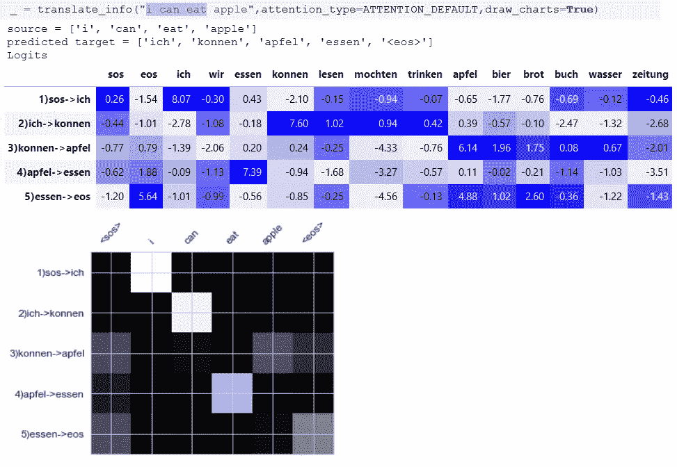

查看表格第一行。

**"1)sos- > ich"** 显示当前预测步骤，" sos "是当前单词" ich "是该步骤将要生成的单词，颜色显示最可能的列。在其他教程里他们写的是“sos”，但我觉得这种方式更好。

如果查**“ich”**最高概率 8.07 分。检查其他步骤以更好地理解。
上面的热图显示了对所有步骤的关注。在翻译步骤 1，注意力在**“我”**，在步骤 2，注意力在**“能”**。检查每一步，并理解网络如何在每一步运用注意力。由于我们在这一步生成了 **"ich"** ，在第二行 u 参见 **"2)ich- > konnen"** ，这意味着第二步解码器已经生成了【sos，ich】并将生成“konnen”。

所以我们试着一步一步来写。在翻译过程中，主要模块如下。

生成所有编码器状态(第 3、4 行)，解码器以“sos”启动。(第 7 行)现在让我们看看 for 循环的每次迭代(第 11 行)

**第一步:**
网络在这一步会生成什么？

我们一直展示网络例句:
**主语+动词(我吃苹果，我喝水……)
主语+ can +动词(我能吃苹果)
主语+想要+动词(我想吃苹果)**

所以在这一步主题是最有可能的。编码器状态也有“I”，所以在这一步网络将产生“ich”。(同时检查逻辑和注意力可视化) **输出=【<SOS>，ich】**

**第二步:**现在我们在解码器**中有了[ **< sos >，ich】**。**通过训练过程网络得知，在像这样的解码状态下，最好是把注意力放在【动词】、【能】、【想要】中的一个。所以现在在我们的来源，我们有动词和“可以”。
通过训练它还了解到，如果编码器中有**【can】**或**【want】**它必须现在生成。如果您检查第 2 行 logits，您会看到所有动词(essen、lesen、trinken)、**【can】**和**【want】**都具有高值。因为在训练中，这一步(第二步)生成的所有单词都是这类单词。
**输出= [ < sos >，ich，konnen]**

**第三步**:现在我们有[" < sos >，" ich "，" konnen"]，我们的网络被训练成，" konnen "后面带宾语。如果你检查逻辑，这一步的对象(apfel，brot，beer，wasser…)得分很高。你也会看到，现在网络对苹果公司非常重视，所以产生了“apfel”。
**输出= [ < sos >，ich，konnen，apfel]**

**第四步**:现在我们有[" < sos >，" ich "，" konnen "，" apfel"]，我们的网络被训练成，宾语后接动词，这样的模式。从编码器状态，我们知道我们的源有动词" eat "，所以网络生成" essen "
**Output =[<SOS>，ich，konnen，apfel，essen]**

**第五步**:现在我们有[" < sos >，" ich "，" konnen "，" apfel "，" essen"]，我们的网络被训练成，这个状态是一个完整的步骤，source "eos "是在这样一个状态之后。按以下顺序[“SOS”、“我”、“能”、“吃”、“苹果”]“EOS”来了之后这样想。所以在一个[" < sos >、" ich "、" konnen "、" apfel "、" essen"]之后，" eos "最有可能。
**输出= [ < sos >，ich，konnen，apfel，essen，< eos > ]**

以上是对 transformer 如何生成事物的逐步评估。现在让我们尝试一些不同的东西来检查我们的理解。

**理论**:即使我改变了句子的顺序，网络还是会关注正确的单词。我将给出一个输入句子为**“吃苹果可以吗”**，我声称它将生成正确的输出(至少是正确的意思)。通常注意力向量(Q，K，V)的计算是置换不变的。(即使你改变顺序，它也会计算同样的事情)但是这里不仅注意而且网络可以预测正确的句子。因为我们的布景太小了。不要误解。

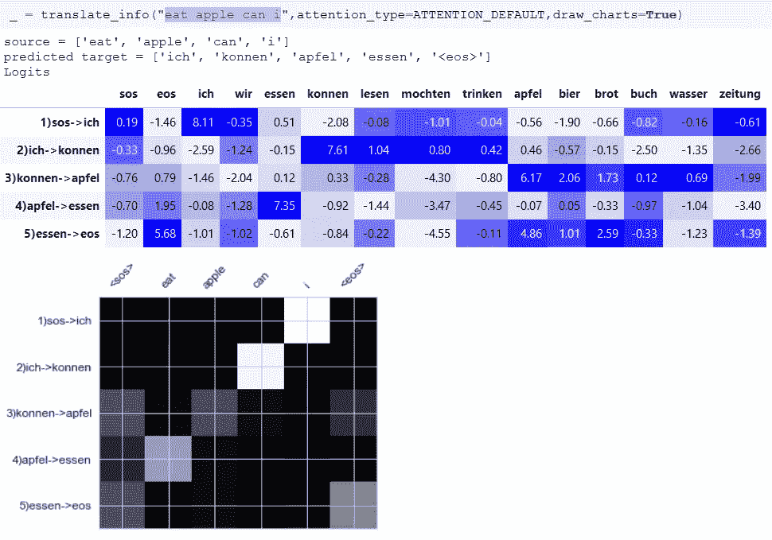

**无序句子的结果**

对于我们的小集合，即使顺序被改变，注意力也在正确的位置(根据注意力的性质),甚至我们给出了正确的输出(因为我们严格地用相同的模式训练网络),这也表明我们的网络不是简单地复制位置上的项目。

# 腐蚀自我关注

让我们更深入地了解注意力，如果注意力是正确地将重量应用到正确的位置，如果我改变重量应用会发生什么？我将改变变形金刚运用注意力的方式。注意力只是一个向量，所以我会生成一些向量，而不是网络学了什么。

下面我们对所有的单词一视同仁。这里我们正在划分，注意向量形状的第三维度。所以它意味着对每个单词给予同等的重视。如果维度是 5，我们会把注意力放在所有单词的 1/5 上。

它适用于小模式“我能吃苹果”，但不适用于如下更复杂的情况。也注意图表是全黑的，因为处处平等。由于我们对每一步都给予同等的关注，网络正在产生两次“埃森”。为什么？在“ich”之后，如果你检查逻辑“essen”和“apfel”总是有很大的分数。(“apfel”即使在第一步中也有很高的分数)因为在我们认为的所有步骤中，编码器数据同样重要，所以我们无法创建一个合适的句子，因为网络不是这样训练的。网络总是根据解码器状态(根据翻译过程的流程)改变注意力，但是这里即使解码器状态改变，注意力也不改变，这是误导。

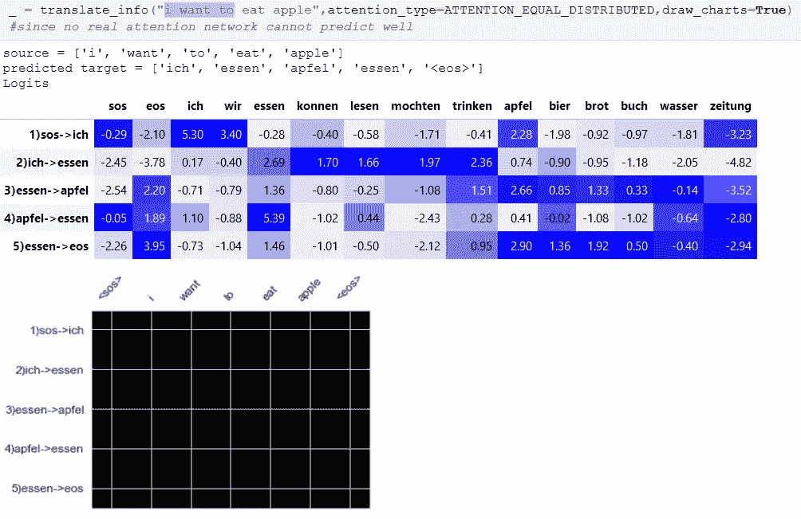

```
ATTENTION_AT_BEGINNING
```

现在让我们检查一下开始时的注意模式，我把它解释为，只注意前三个单词。1、2 和 3 个单词得到 1/3 的关注，其他得到 1/7 的关注。

你能猜出结果吗？由于模型只使用开始注意，解码器只知道句子的开始，所以只是作出一个非常糟糕的猜测。下面的句子只注意开头，所以除了**“我”**之外没有其他意思。这就像只听到一个句子的开头。还可以看到，它甚至没有生成正确的动词。！！试试“我能吃苹果”

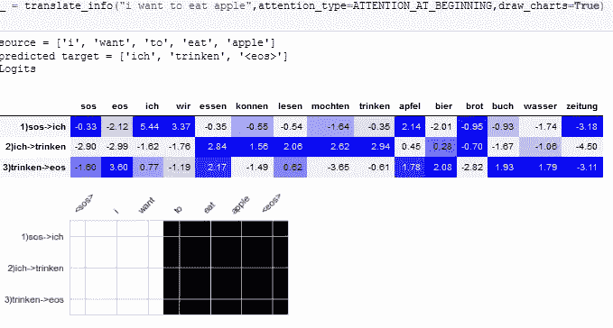

如果你检查下面，你可以看到网络生成的“埃森”两次。如果您查看最后一行，可以看到 network 在“apfel”方面的得分很高。

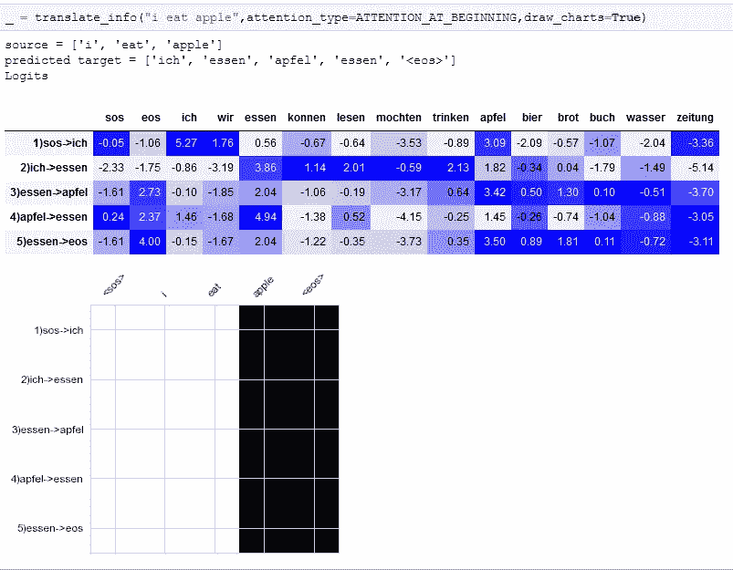

此外，如果您检查下面的句子，网络没有任何关于句子的想法。在第 2 行，“mochten”得分较高，但“trinken”和“essen”得分更高。因为我们从来没有这样训练过网络，它会做出非常糟糕的猜测。

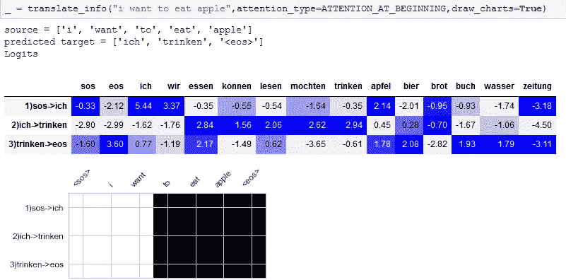

```
ATTENTION_AT_END
```

所以另一个随机的尝试，如果我们把更多的注意力放在最后一个单词上，会发生什么，它会很快跳到句尾。(但是要注意，它并没有立即跳转，它首先生成了**【ich】**，然后生成了**【lesen】**，由于 lesen 是某个句子的最后一个单词，所以它生成了**【EOS】**。

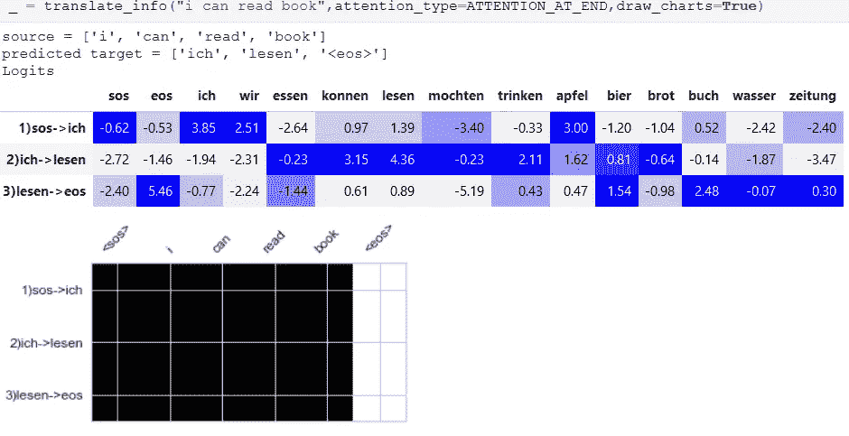

# 不断变化的网络架构

现在我们玩了注意力向量，并有了一个想法，网络模型如何对我们关于自我注意力的虚拟变化作出反应。现在让我们试着启用/禁用网络的其他部分。

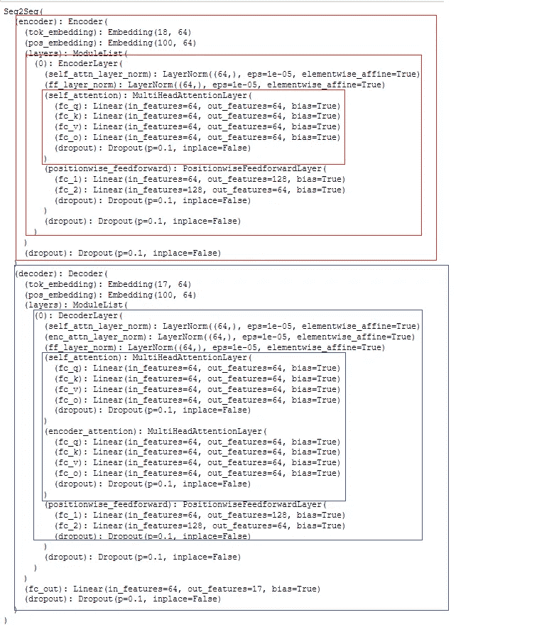

**建筑**

下面我将禁用，改变架构的一些部分，以测试网络的不同模块的效果。老实说，我没有写一个非常整洁的代码，我们只是在尝试，所以我用最简单的方法做了。只需在网络中放置一些组件的测试效果的专用路径。检查下面解码器的正向方法。我放了很多条件来改变计算。

我还把这些类 if 条件流交给 DecoderLayer 检查它们。我的意图是选择性地应用/不应用某些部分。

```
trg3 = self.enc_attn_layer_norm(trg2 + self.dropout(_trg2))
```

通常计算如上。这是 else 块(默认)，我通过仅使用该计算的一部分尝试了不同的组合。

1.  **不适用注意。**这里我所做的有点不同，我在应用注意力之前保持 trg 向量，然后在应用注意力之后，我恢复。(这似乎是打开/关闭部分代码的最简单方式)

```
APPLY_NOT_ATTENTION # check code for this part 
```

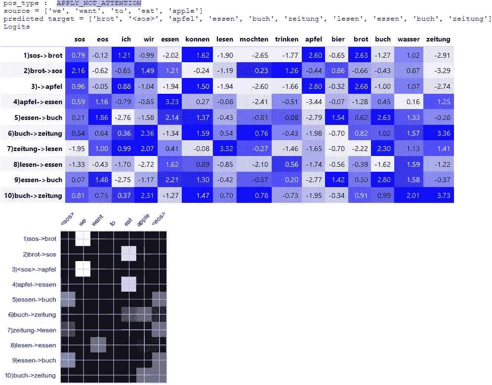

正如你在上面看到的，网络只是随机行走。因为它对源句子一无所知。这就像翻译一个句子却不知道源句一样。

2) **仅应用解码器自我关注**。这里，解码器也不知道源句子。所以在第一步，大多数可能是主语(" ich "，" wir ")，在第二步(" konnen "，" mochten "，动词)，在第三步是宾语(" apfel "，" bier "，" brot" …)。正如你所看到的，它在每一步都选择最可能的单词，只通过解码器端的权重。因此，它实际上又是在做一些随机的事情(或者更好地说，在每一步获得最高权重的项目)。

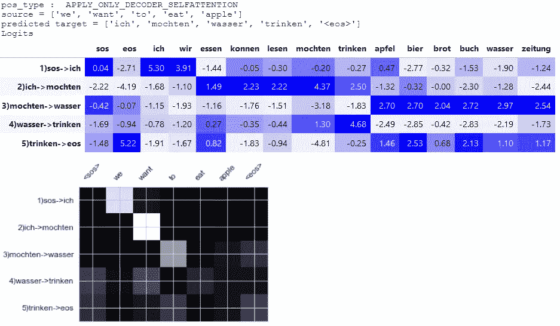

3) **仅应用退出**。除此之外，我们申请退学。由于辍学没有增加任何东西，我们有更多不可靠和奇怪的解决方案。但是这一步捕获了我们源句子的更多部分。我的猜测是，因为辍学是我们学到的一层，所以事实上它是防止网络，使完全随机猜测如上，所以这些猜测更好。事实上，如果你检查逻辑，网络是失踪产生“eos”与一个非常小的差异。)

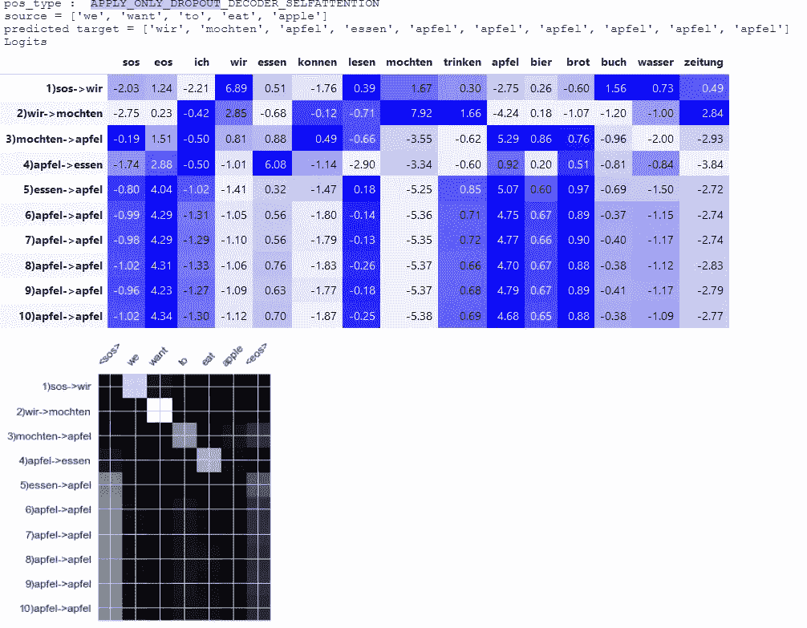

4) **仅适用于规范自我关注**。这给出了与第二个样本相同的输出，因为实际上包含的向量是相同的。

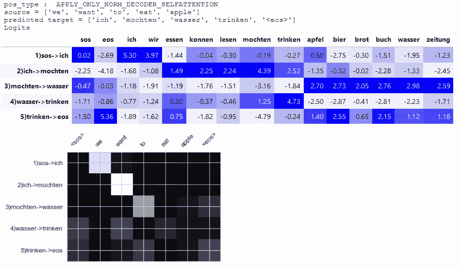

5) **仅应用源编码。**我在这里做了一些东西，很假。如果我直接复制源编码在解码器上使用会怎样？它会直接生成“eos”

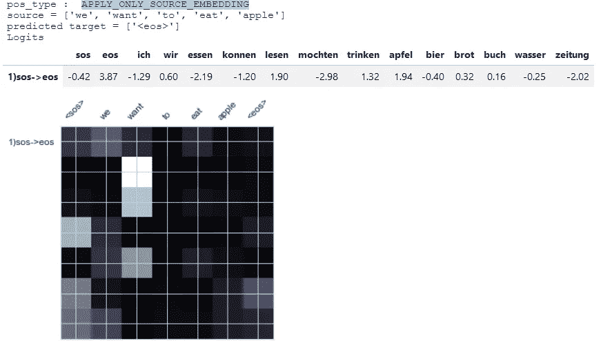

我们来看一个更有趣的案例，下面我们跳过 PositionwiseFeedforwardLayer。网络仍然能够生成“想要”的正确答案。但是对于另外两种情况，它产生 1 个以上“苹果”。如果你检查 logits**“EOS”**和**“apple”**的概率非常相似。位置层是具有 Relu 的层(其在解码器层的末端应用非线性)

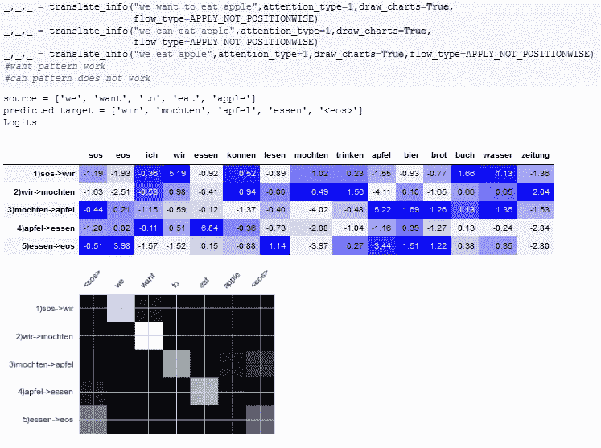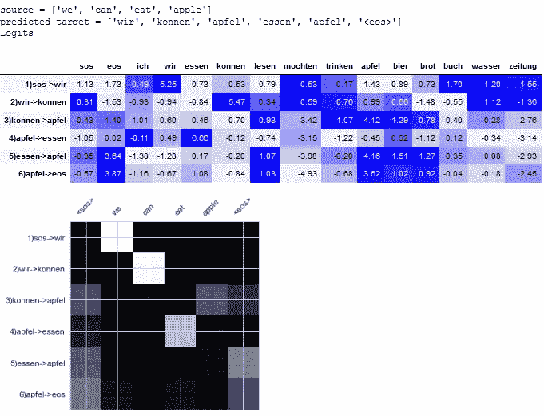

我试图展示注意力层产生了什么，以及它们是如何随着时间而变化的。还禁用了网络的某些部分，以显示它们如何影响输出和注意力。起初，逻辑可能有点难以理解，但实际上它非常简单。