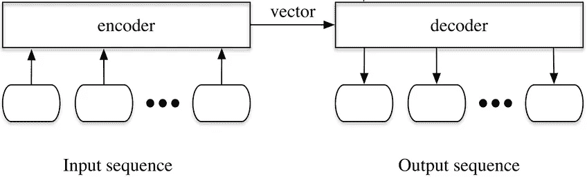
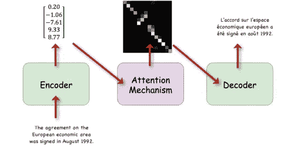
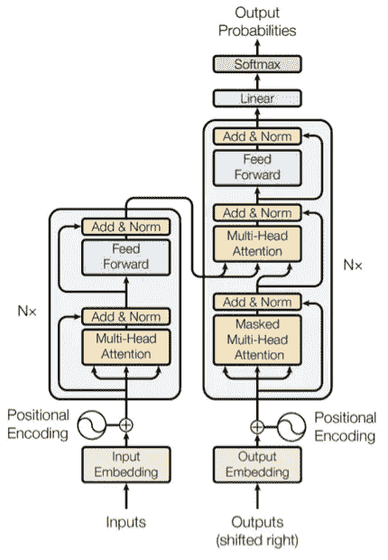

# NLP 变压器

> 原文：<https://medium.com/analytics-vidhya/how-seq2seq-sequence-to-sequence-models-improved-into-transformers-using-attention-mechanism-9905fb88d5ef?source=collection_archive---------3----------------------->

自然语言处理(NLP)是人工智能的一个分支，帮助机器理解人类的自然语言。基本上，人类主要通过语音或文本进行交流。那么，NLP 是如何工作的呢？嗯，我们可以在机器学习中处理的一种数据类型是序列数据，即一系列数据(例如，文本、语音)。NLP 可以构建这样的系统，它将一个数据序列作为输入，对其进行处理，并产生另一个数据序列。这个字母被称为序列模型或 Seq2seq(序列(输入)到序列(输出))。

在本帖中，我们将探讨什么是顺序模型以及从 seq2seq 到 transformer 的旅程。我将假设输入是文本/句子。请注意，我没有深入探讨我们正在探索的模型的架构细节。然而，我会解释高层次的想法，以及变压器是如何介绍的。

## Seq2Seq

seq2seq 是一个基于编码器-解码器的模型，它将一个句子(单词序列)作为输入，并将另一个句子作为输出。**编码器**是一个可以堆叠在一起的多 RNN(递归神经网络)单元。RNN 按顺序读取输入，对句子进行逐字编码，并产生输出。这个输出就是最终的**隐藏状态**(也称为上下文向量)，是输入的一个封装信息。这个向量将是解码器的输入。**解码器**也是一堆 RNN 单元，但旨在解码隐藏状态并将其转换为预测输出(单词)。

如果你需要更深入地阅读 seq2seq，这里有“[序列学习](https://arxiv.org/pdf/1409.3215.pdf)”[1]，这是 Google 发表的一篇研究论文，供进一步阅读。

这种类型的模型用于机器翻译、语音和实体识别、情感分类等任务。然而，隐藏状态向量是固定大小的长度，因此编码器很难封装/压缩句子中的所有信息。如果输入很长，就会遭遇所谓的信息瓶颈。**注意机制**是针对这一限制提出的解决方案。

## 注意机制

在英语中，注意力意味着将注意力集中在某件事情上的状态，在深度学习中也是如此。Dzmitry Bahdanau 等人在他们的[论文](https://arxiv.org/pdf/1409.0473.pdf) [2]中介绍了注意机制。它被添加到编码器-解码器模型中，以帮助该模型，特别是解码器关注句子/输入序列的相关单词/部分。特别是，它使编码器能够封装来自输入的所有信息，并传递所有产生的隐藏状态，而不是像 seq2seq 中那样只传递最后一个状态。这项技术证明并显示了更好的结果。

如果我们想让模型更快呢？引入 transformer 是为了加快模型的运行时间。

## 变压器

变形金刚是由谷歌在“[注意力是你所需要的一切](https://arxiv.org/abs/1706.03762)”[3]的论文中提出的。Transformer 是一个深度学习模型，也是一个基于编码器-解码器的架构，它使用注意机制，但不依赖于 RNNs 来加速模型。它由一个编码器和相同数量的解码器组成，编码器可以被认为是一堆编码器/编码层(本文中有六层)。

每个编码器/编码层的组件是两个子层，包括关注层和前馈神经网络(FFNN ),而解码器块由三个子层组成，包括两个关注层和一个 FFNN 层。

变压器—模型架构[3]。

作为进一步的阅读，一篇“[注意力模型的注意力调查](https://arxiv.org/pdf/1904.02874.pdf)”[4]论文通过提供一个注意力分类法，提供了一个注意力建模发展的结构化和全面的概述。

此外，您可以在这里找到“[带注释的 Transformer](http://nlp.seas.harvard.edu/2018/04/03/attention.html) ”，这是“注意力是您所需要的全部”论文的“注释”版本，由哈佛 NLP 团队以逐行实现的形式呈现。

## 结论

在这篇文章中，我们探讨了序列模型是如何在 NLP 中得到改进的，以及变压器是如何被引入的。

快乐学习！！

## 参考

[1] I. Sutskever，[用神经网络进行序列对序列学习](https://arxiv.org/pdf/1409.3215.pdf) (2014)，Google

[2] D. Bahdanau，[通过联合学习对齐和翻译的神经机器翻译](https://arxiv.org/pdf/1409.0473.pdf) (2015)，ICLR

[3] A .瓦斯瓦尼，[关注是你所需要的一切](https://arxiv.org/pdf/1706.03762.pdf) (2017)，谷歌

[4] S. Chaudhari，[注意力模型的仔细调查](https://arxiv.org/pdf/1904.02874.pdf) (2020)，《智能系统与技术汇刊》(TIST)