# 星巴克的用户在报价时的行为。

> 原文：<https://medium.com/analytics-vidhya/how-starbucks-users-behave-on-offer-ffbc17367094?source=collection_archive---------11----------------------->

## Udacity 的数据科学纳米学位顶点项目。


# 简介:

这是对星巴克用户在优惠上的行为的分析，为了进行这种分析，星巴克提供了包含模拟数据的数据集，模拟了星巴克奖励移动应用程序上的客户行为。


## 项目概述:

在这些数据集中，星巴克在给定的时间内向他们的用户发送报价，他们将发生的每个事件收集到一个文件中作为日志，报价可以是信息性的、折扣的或 Bogo 的，一些用户可能会再次收到相同的报价，一些用户可能不会收到相同的报价。

为此，他们向用户发送报价，并在日志文件中记录每个事件。

星巴克发送的优惠类型。

*   折扣:一定数量购买的折扣
*   Bogo:买一送一
*   信息:只是一个广告

他们为此提供了三个数据集:

1.  包含组合的报价 id 和关于每个报价的元数据(持续时间、类型等。)
2.  个人资料-每个客户的人口统计数据。
3.  交易记录、收到的报价、查看的报价和完成的报价。

## 问题陈述:

在此分析中，基本任务是找出哪个人口统计组对哪个优惠响应更大，因为这 3 个数据集包含关于每个优惠、每个用户和发生的每个事件的信息，我将组合这些数据集以形成一个大数据集，并将进行一些特征工程以提取一些有助于分析的特征。

我的策略是:

*   首先，我将对每个数据集做一些初步分析。
*   将所有三个数据帧处理成适于分析的形式
*   提取一些特征。
*   将所有三个数据帧合并成一个大帧。
*   基于每个事件分割组合的数据帧。
*   对数据进行分析，显示已查看的报价和已完成的报价类别。

在我们得到两个数据集后，报价浏览和报价完成。我将根据年龄、收入、性别和用户成为会员的年份来划分不同的人群。

## 指标:

因为主要任务是找出哪个人口统计群体对哪个产品更敏感，所以我在这里使用的指标是。

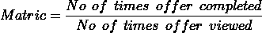

该矩阵清楚地提到了完成的报价占被查看报价的比例。我将把这个指标应用到所有的人口统计组，并比较他们的结果。

## 数据集的描述:

数据集中每一列的说明如下:

1.  作品集. json

*   id(字符串)-报价 id
*   offer_type (string) -一种报价类型，即 BOGO、折扣、信息
*   难度(int) -完成一个提议所需的最低花费
*   奖励(int) -为完成一项提议而给予的奖励
*   duration (int) -报价开放的时间，以天为单位(字符串列表)

2.profile.json

*   年龄(整数)—客户的年龄
*   成为会员日期(int) —客户创建应用程序帐户的日期
*   性别(str) —客户的性别(请注意，有些条目包含“O”代表其他，而不是 M 或 F)
*   id (str) —客户 id
*   收入(浮动)—客户的收入

3.抄本. json

*   事件(str) —记录描述(即交易、收到的报价、查看的报价等。)
*   人员(字符串)—客户 id
*   time (int) —测试开始后的时间，以小时为单位。数据开始于时间 t=0
*   value —(字符串字典)—报价 id 或交易金额，具体取决于记录

# 数据探索和可视化:

我对每个数据集做了一些初步分析，他们的发现列在下面几点。

## 数据集 1 - portfolio.json:

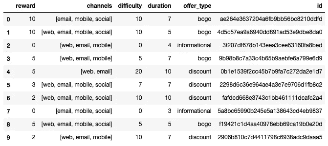

投资组合数据集(图 1)

1.  数据帧有 10 行 6 列。

2.数据帧中没有空值。

3.每列的数据类型是

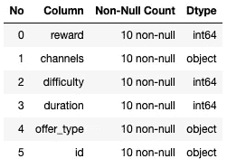

每一列的数据类型(图 2)

4.已使用多种渠道发送要约。

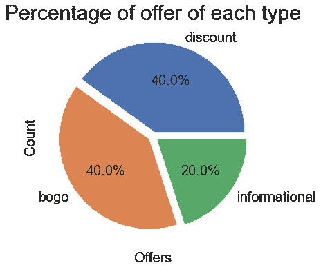

每个报价的比例(图 3)

5.有三种类型的优惠，即 BOGO，信息和折扣。

6.总共有 10 个优惠，其中 4 个是折扣，4 个是 BOGO(买一送一)，2 个是信息性的(广告)。

7.奖励和难度列包含以美元表示的价值。

8.持续时间的单位是天数。

9.列`channel`、`offer_type`和`id`包含分类值。

portfolio.json 文件有一个需要清理的 id 列，它包含散列形式的值。它还有一个 channels 列，其中有一个列表中不同通道的值，它也需要被清理。

## 数据集 2 - profile.json:

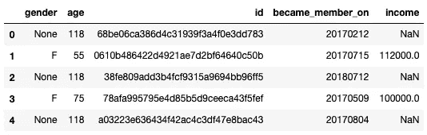

数据集 2 的头(图 4)

1.  行数为`17000`，列数为`5`。

2.数据帧中有`5`列。

3.包含分类值`gender`、`id`的列。

4.包含缺失值的列是`gender`、`income`和`age`(因为缺失的年龄值被编码为 118)。

5.每列的数据类型和非空计数如下所示。

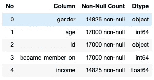

每列的数据类型。(图 5)

6.年龄的最大值是`118`，年龄的最小值是`18`。

7.最高收入为`120,000`，最低收入为`30,000`。

8.性别比例`Male - 57.2%`、`Female - 41.3%`和`Others - 1.4%.`

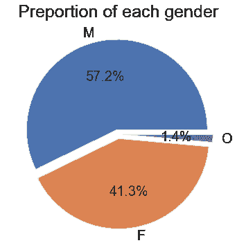

(图 5)

id 列包含需要映射到整数的哈希值，这样处理数据就变得更容易了。

成为成员列的数据类型是 int64，需要将其更改为日期数据类型。

看起来一些用户的年龄是 118 岁，性别栏中的值是`None`，他们的收入也是`NaN`。根据数据集，没有给出年龄信息的用户被编码为 118，然而，我认为，这是坏数据，因为只提供了用户 id 散列，我不打算在进一步的分析中考虑它。但是，我现在不会删除它们，因为我必须将它们映射到抄本数据帧。并且在组合两个数据帧之后，移除它们将变得容易得多。

## 数据集 3 -抄本. json:

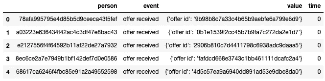

1.  抄本数据帧的形状是 306534 行和 4 列。

2.数据帧有四列。

3.每列的数据类型是

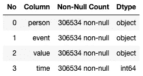

每一列的数据类型(图 6)

4.数据集中没有空值。

5.包含分类值的列是['人员'，'事件'，'值']

6.抄本数据帧中每个事件的计数为

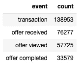

每个事件的计数(图 7)

在这里，person 列需要被清理，因为它的哈希值需要被转换成一个整数，这样剩下的工作就更容易了。

value 列包含基于发生的事件的 offer_id、金额和奖励的字典。需要为这些值创建一个单独的列。

# 数据预处理:

## 1.投资组合数据框架:


(图 8)

## 我遵循的步骤。

*   将每个哈希 id 映射到一个整数。
*   使用一键编码为每个通道创建每个列。
*   删除频道列。
*   将 id 列重命名为 offer_id，将 rewards 重命名为 offer_reward。

完成上述步骤后，DataFrame 看起来如下图所示。

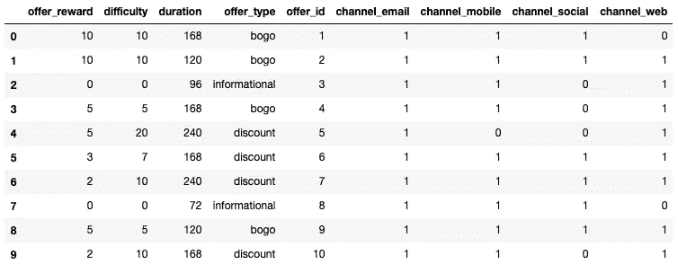

(图 9)

## 2.轮廓数据帧:

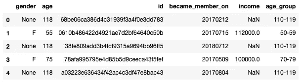

(图 10)

## 我遵循的步骤。

*   将每个散列 id 映射到一个 int。
*   将年龄划分为 10 年间隔的年龄组。
*   将“成为成员”列的数据类型更改为 DataTime。
*   将 id 列重命名为 person_id。
*   创建一个区间为 30，000 美元的收入组。
*   根据用户成为成员的年份创建一个列

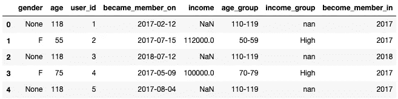

(图 11)

## 3.抄本数据帧:

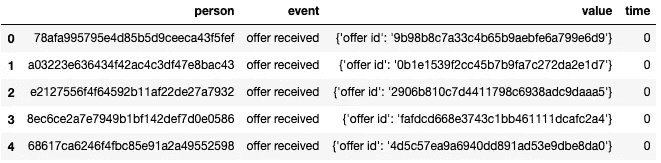

(图 12)

## 我遵循的步骤。

*   将每个散列用户 id 映射到一个 int。
*   将 person 列重命名为 user_id。
*   根据“值”列中的事件创建一个单独的列。
*   删除值列。

现在 DataFrame 看起来像这样。

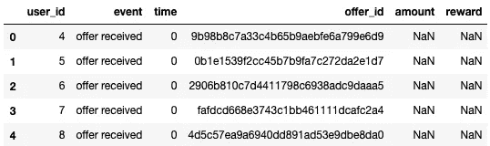

(图 13)

*   将要约 id 的每个散列映射到其 int id。

最终，数据框如下图所示。

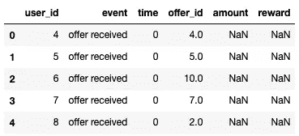

(图 14)

# 将三个数据框合并成一个大数据框。

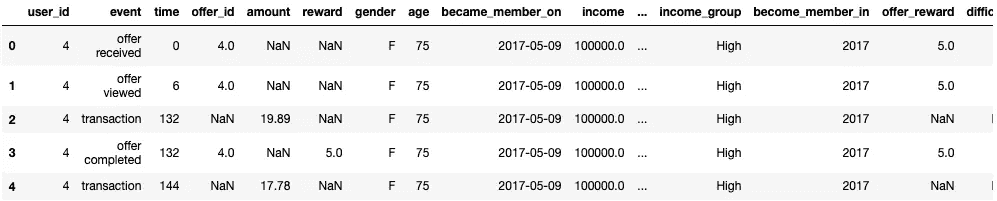

(图 15)

## 此数据框包含的列有:

```
['user_id', 'event', 'time', 'offer_id', 'amount','reward','gender',
'age', 'became_member_on', 'income', 'age_group', 'income_group',
'become_member_in', 'offer_reward', 'difficulty', 'duration',
'offer_type', 'channel_email', 'channel_mobile', 'channel_social',
'channel_web']
```

# 实施:

对于这个分析，我选择通过数据可视化来回答我的发现。

在这个分析中，我对完成报价的人和查看报价的人感兴趣。

我将使用的算法是划分数据集，最后根据事件列中的事件将数据集合并到四个不同的数据帧中。即收到要约、查看要约、交易和完成要约。

然后，使用已查看的出价和已完成的出价数据框，根据不同的人口统计组获得用户已查看的出价和已完成的出价的计数。

然后使用矩阵(浏览的报价数/完成的报价数)，我将分析和绘制结果的可视化。

## 编码过程中出现了复杂情况:

我在整个分析过程中面临的复杂问题是清理 offer_completed 数据框，因为该数据框中的用户没有查看报价，而是通过进行一些交易完成了报价。

因此，从理论上讲，这些人并没有受到要约的影响，因为他们可能会影响我们的最终结果，所以必须将其删除。

以上是我用来删除没有查看报价的用户的代码。

# 精致:

最初，我选择根据不同人群完成的报价与浏览的报价的比率来绘制我的整体分析。

但是，我认为基于不同报价的分析将提供更精确的报价信息。

因此，现在，我将计算每个人口统计组的已完成优惠与已浏览优惠的比率，而不是计算每个人口统计组的每种优惠类型(即信息、Bogo、折扣)的结果，因为它将提供有关人们感兴趣的优惠类型的深层信息。

# 组合数据集的分析。

## 基于年龄组:

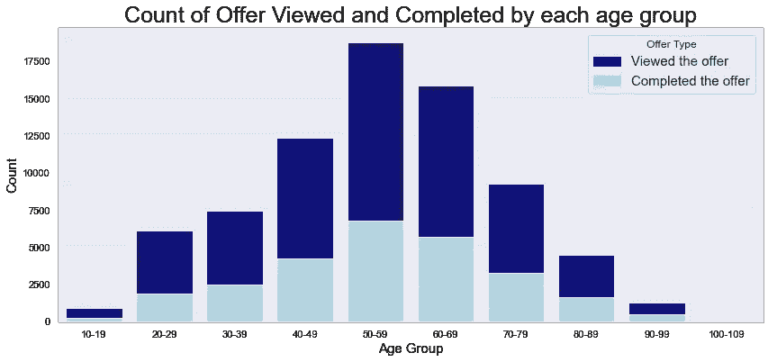

上图显示了有多少人受到了该优惠的影响，这是一个堆积条形图，深蓝色的条形代表查看该优惠的人数，浅蓝色的条形代表完成该优惠的人数。

从图中可以看出，年龄在 50-59 岁之间的人完成了大部分报价。

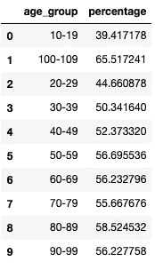

比率(已完成报价/已查看报价)

此处，左侧的表格显示了哪些年龄组的已完成出价与已查看出价的比率。

20 - 29 岁年龄组的浏览次数非常少(即 44.66 次)，但他们的报价浏览完成率很高。

对于 10 - 19 岁年龄组，完成的报价与浏览的报价的比率较低。

## 基于每种优惠类型的年龄组，已完成的优惠与已查看的优惠的比率:

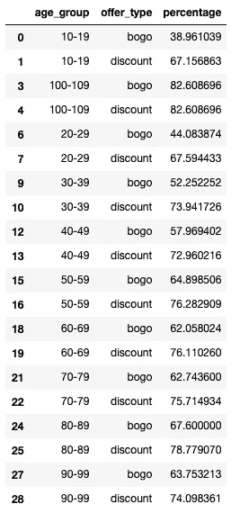

> 注意:由于没有人完成信息性报价，其百分比为零。

下图显示了有多少人查看了哪种类型的优惠。

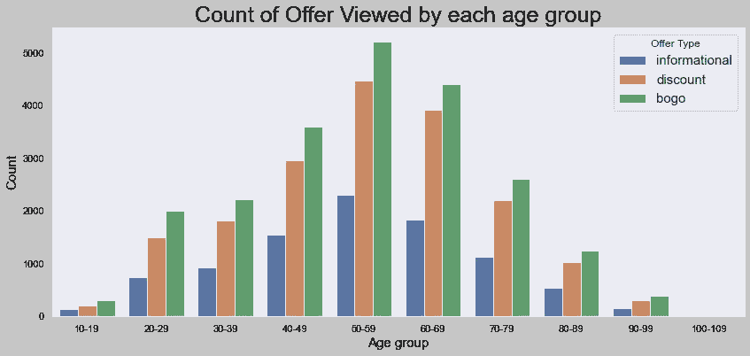

从上面的图可以看出，所有年龄段的人都在查看 BOGO(买一送一)提供的最多，第二个数字是折扣，最后是信息。

下图表示有多少人完成了哪种类型的聘用。

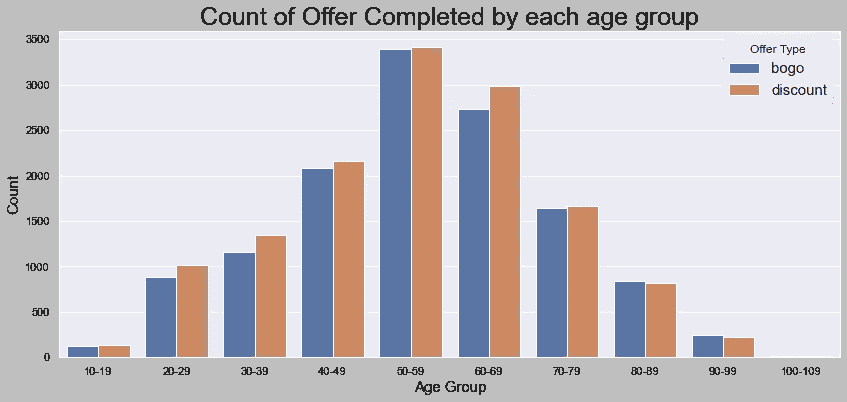

在上面的图表中，所有年龄组的人都比 BOGO 更经常完成折扣报价，我注意到最有趣的事情是没有人完成信息报价，尽管这不是报价，而是广告，人们仍然没有受到报价的影响。

在比较已完成和已浏览的报价图时，我还注意到，所有年龄组的人都在浏览 BOGO 的报价，然而，在已完成报价图中，折扣报价的高度大于 BOGO 的报价，(即，在每个年龄组中，人们完成折扣报价的次数多于 BOGO)

## 基于性别:

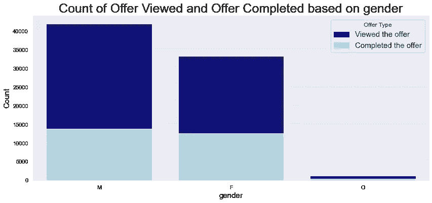

它显示了多少人受到了基于性别的报价的影响，深蓝色的条代表已查看的报价，浅蓝色代表已完成的报价。

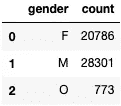

基于性别查看的出价计数。

左边的表格显示了根据性别查看的报价数量(男性- 28301，女性- 28301，其他- 773)。

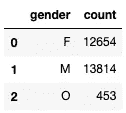

左边的表格显示了根据性别完成的聘用数量(男性- 13814，女性- 12654，其他- 453)。

## 基于性别的已完成聘用与已查看聘用的比率:

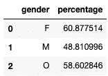

这里女性转化率高，60.87，男性转化率 48.8，其他 58.6。

> 注意:我说的转换率是指人们已经看到报价并完成了报价，所以完成报价数与浏览报价数的比率就是转换率，因为人们受到报价的影响。

## 基于每种聘用类型性别的已完成聘用与已查看聘用的比率:

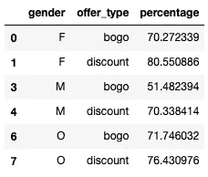

> 注意:由于没有人完成信息性报价，其百分比为零。

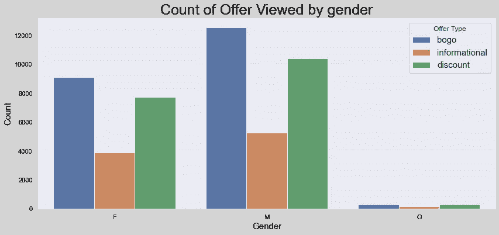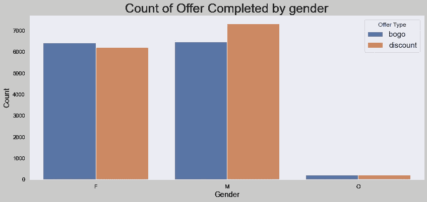

上图显示了基于报价类型的已查看报价和已完成报价的分布。

## 基于收入:

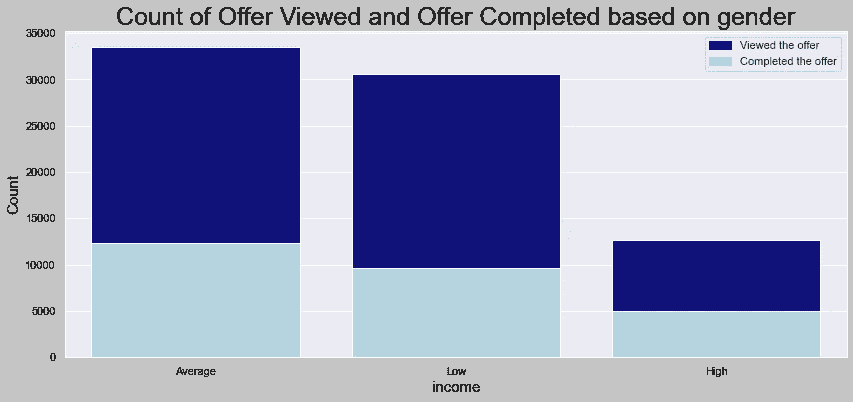

在这里，我根据以下区间划分了收入群体。

*   低收入——30000 至 60000 美元
*   平均收入-60000 美元到 90000 美元
*   高收入——9 万美元到 12 万美元

低收入人群比其他人看得更多，但他们的完成率仍然低于平均收入人群，平均收入人群看得更少，但他们的转化率很高。

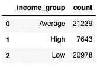

基于收入组查看的优惠计数。

这里，在左边，根据收入组查看的报价计数，(平均值-21239，高值-7643，低值-20978)。

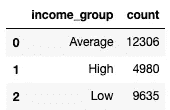

这里，在左侧，基于收入组的已完成报价计数(平均-12306，高-4980，低-9635)。

## 基于收入组的已完成报价与已查看报价的比率:

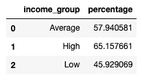

这里，平均低收入人群的转化率为 45.9%，平均收入人群的转化率为 57.9%，高收入人群的转化率为 65.15%。

## 根据每种报价的收入组，完成的报价与查看的报价的比率:

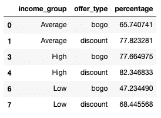

> 注意:由于没有人完成信息性报价，其百分比为零。

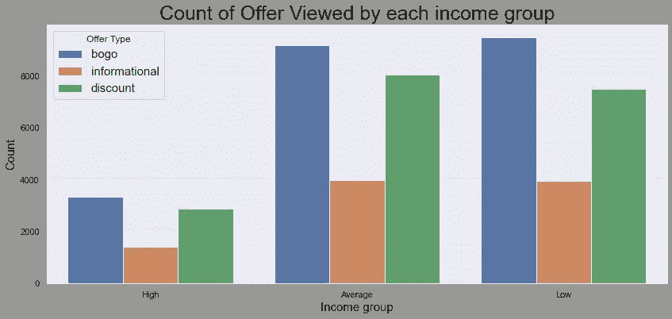

上图显示，Bogo 优惠在每个收入群体中都很受欢迎，折扣在第二位，信息优惠在第三位。

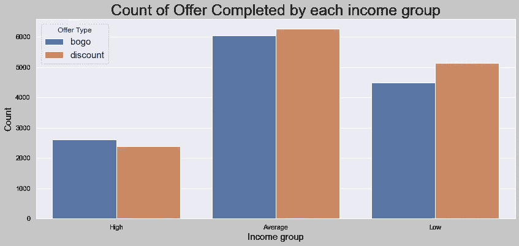

## 基于会员年份:

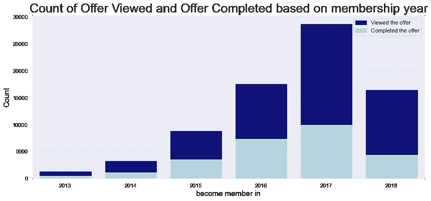

上图显示，随着时间的推移，人们变得不活跃，因为老会员的报价浏览率和报价完成率都在下降。

2017 年成为会员的人已经完成了大部分优惠。

在 2018 年，该图显示了一个短条，因为数据可能是在 2018 年收集的，并且这一年正在进行，在此之前可能很少有人注册。

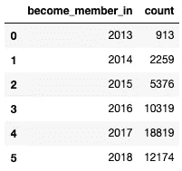

基于成为会员查看的优惠计数。

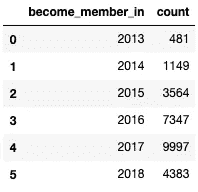

## 基于会员年度的已完成优惠与已查看优惠的比率:

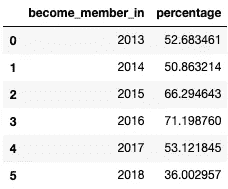

## 根据每种优惠类型的会员年份，完成的优惠与查看的优惠的比率:

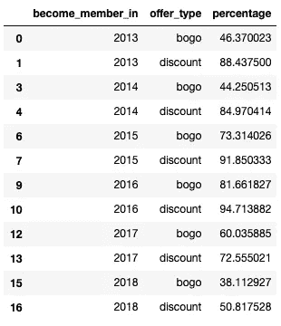

> 注意:由于没有人完成信息性报价，其百分比为零。

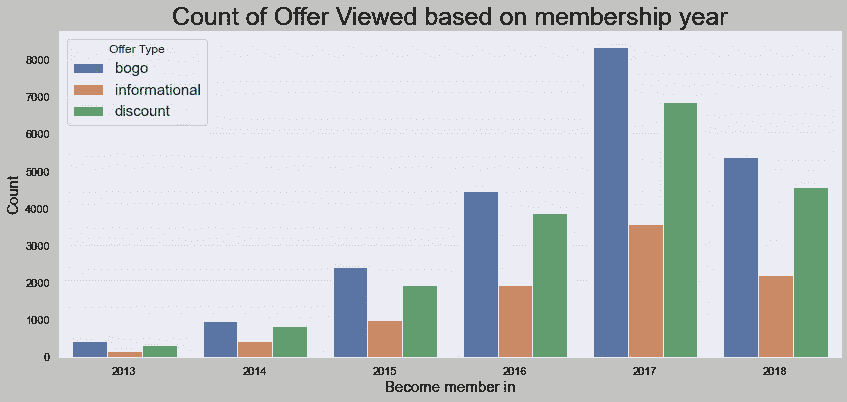

在所有的优惠中，BOGO(买一送一)是人们浏览最多的。

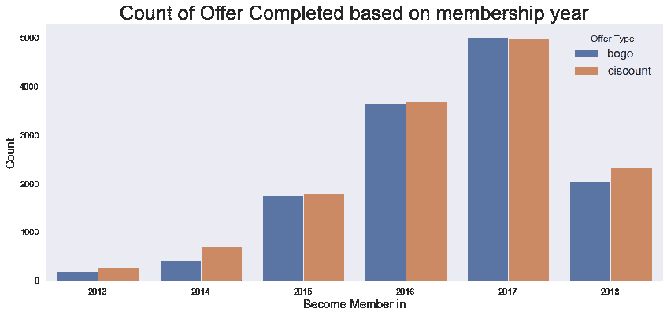

## 理由:

因为我的整个分析观点是基于人们在购买习惯中对报价的影响。我的意思是，在看到报价后，如果人们真的想完成报价。

因为我选择的答案是


分析后我得到的结果代表了完成报价的观众比例。

这清楚地代表了不同人群的兴趣，因为比例越高，他们对完成报价越感兴趣。

# 结论:

## 反思:

在这篇文章中，我只是根据对星巴克数据的分析提出了我的观察。

在这个项目中，我试图分析这个问题，即人们是如何对每种类型的提议做出反应的。

在这里，我只是从三个数据集的初步分析开始分析。

然后，我将所有数据帧处理成适合分析的形式

然后，我做了一些特征提取的重要特征进行分析。

然后，将所有数据帧合并成一个大帧。

数据分析，可视化的报价浏览和报价完成类别

我觉得有趣的结果是:

*   浏览最多的优惠是 Bogo，但完成最多的优惠是折扣。
*   没有人完成信息提供。
*   随着时间的推移，人们对报价越来越不积极。

对我来说，分析部分很有趣，因为它给了我一些我没有预料到的结果。

## 改进:

在这个分析中，我选择使用分析来回答我的发现，可以做的一个改进是通过分析交易数据框架，不同人口统计组的人进行了多少次交易来完成报价，以及他们的时间间隔，因为这可以提供关于如果报价的持续时间增加会发生什么的信息。它会导致更多的要约完成吗？

该分析可在我的 GitHub 个人资料[这里](https://github.com/aarsh-pandey/StarBucks-Capstone-Project.git)找到。