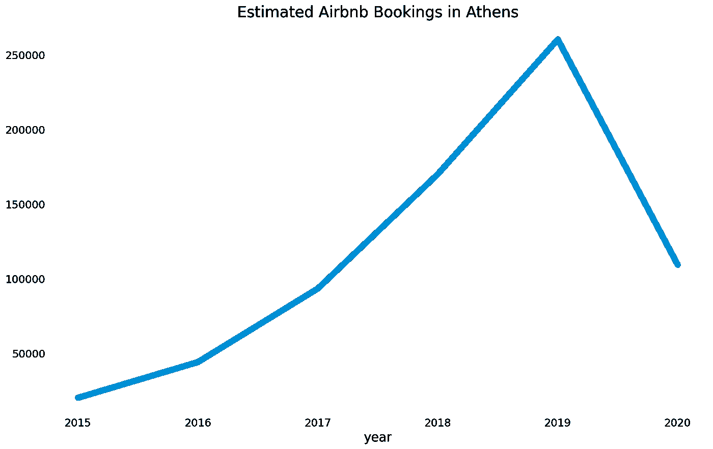
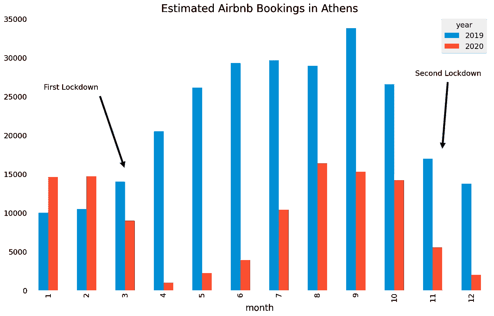
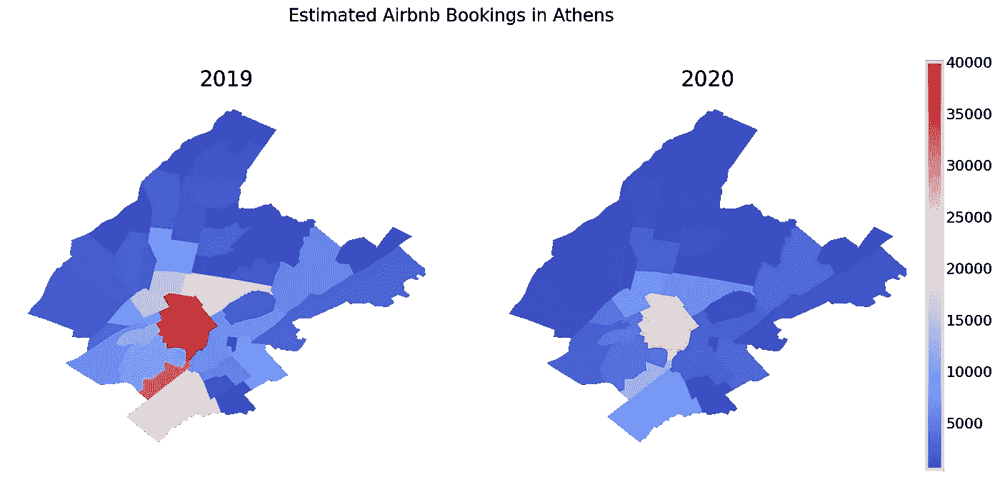
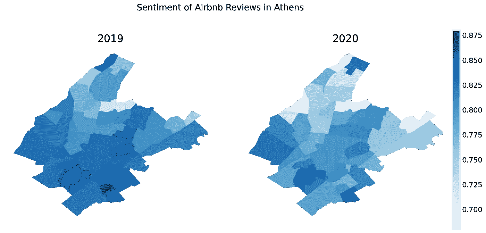

# 雅典的 Airbnb 市场如何受到新冠肺炎的影响

> 原文：<https://medium.com/analytics-vidhya/how-the-airbnb-market-in-athens-was-impacted-by-covid-19-db37f9b886fb?source=collection_archive---------16----------------------->

## 通过使用数据分析、可视化和自然语言处理探索希腊 Airbnb 市场

日落时分的雅典——埃文·怀斯在 [Unsplash](https://unsplash.com?utm_source=medium&utm_medium=referral) 上拍摄

新冠肺炎·疫情对人类活动的大多数方面都产生了毁灭性的影响。旅游业是受影响最大的行业之一，因为在这个充满挑战的时期，许多与之相关的公司都在为生存而挣扎。在本文中，我们将关注希腊首都雅典的 Airbnb 市场，以及它受到新冠肺炎影响的方式。大多数人都熟悉 [Airbnb](https://www.airbnb.com/) ，这是一个有数百万人在旅行中使用的短租平台。Airbnb 通过成为所谓的共享经济的基本组成部分，改变了酒店业。另一方面，Airbnb 在城市和当地社区的影响受到了众多研究人员的批评，他们声称这导致了更高的租金和中产阶级化。

# 数据分析和可视化

Airbnb 内部是一个网站，提供关于世界各地许多城市的 Airbnb 房源的免费数据集。Airbnb 内部的数据集被认为是可靠的，并被用于各种类型的关于短期租赁影响的研究。我们的分析是基于雅典城的最新数据。不幸的是，Airbnb 不会公布每一个房源的预订数量，所以我们必须根据其他数据来计算。根据 Airbnb 内部团队的说法，合理的假设是[大约 50%的预订得到了审核](http://insideairbnb.com/about.html)，因此我们将基于该比率进行估算。

图 A

如图 A 所示，雅典的 Airbnb 市场在 2015 年至 2019 年期间显著增长。与前一年相比，预订数量以惊人的速度增长，从 50%到 100%不等。这一大幅增长在 2020 年停止，预订量下降了近 60%，降至 2017 年的水平。去年 Airbnb 市场的崩溃只能归咎于新冠肺炎疫情。其他因素可能也有影响，但是识别它们超出了本文的范围。从过去几年的趋势来看，如果疫情没有发生，我们可以假设市场将继续增长，但这只是一种推测。

图 B

让我们仔细看看 2020 年的数据，这样我们可以更好地了解发生了什么。如图 B 所示，雅典 Airbnb 市场在去年 1 月和 2 月保持增长，增长率约为 40%。这清楚地表明，在不同的环境下，今年对市场来说可能是很棒的一年。3 月 23 日，当希腊政府为抗击疫情采取了一系列严格措施后，预订量下降，导致 3 月 23 日全国封锁。4 月和 5 月市场崩盘，相比 2019 年跌幅超过 90%。

全国封锁最终被解除，希腊政府放松了大部分措施。这导致夏季预订量逐渐增加，夏季是希腊的旅游旺季。尽管有所改善，但 7 月至 10 月的预订量比去年同期减少了约 50%。由于新冠肺炎病例激增，[希腊政府在 11 月初实施了第二次全国封锁](https://www.naftemporiki.gr/story/1654788/greece-in-covid-19-lockdown-as-of-saturday-until-nov-30)。因此，Airbnb 的预订量在 2020 年的最后两个月再次下降。

图 C

要从整体上理解雅典 Airbnb 市场，需要将我们的注意力转移到城市的各个街区。这可以通过 choropleth 地图来实现，如图 c 所示。显然，2019 年最受欢迎的街区是 Omonoia、Syntagma、Monastiraki 和 Plaka，预订总数超过 50000 个。这并不奇怪，因为这些街区构成了雅典的中心，包含了一些最重要的建筑和地标，比如位于宪法广场的希腊议会。大量的咖啡馆、餐馆和商店位于风景优美的普拉卡和莫纳斯提拉基附近，吸引了各种游客和旅行者。

另一个受欢迎的街区当然是雅典卫城，那里坐落着古老的帕台农神庙，这是一个著名的地标，每年有数百万人前往参观。2020 年，社区的受欢迎程度排名没有明显变化，但所有社区的预订数量都明显下降。Omonoia、Syntagma、Monastiraki 和 Plaka 的预订量下降了 50%左右，其他街区的下降幅度从 15%到 70%不等。

图 D

到目前为止，我们的分析侧重于预订，但新冠肺炎对 Airbnb 市场的影响也可以通过检查其他指标来评估。Airbnb 的内部数据集包括文本评论，可用于提取有价值的见解。将文本转换成定量数据是一项具有挑战性的任务，可以通过情感分析来完成。这项技术是自然语言处理(NLP)广泛领域的一部分，我们应用它来评估 2019 年和 2020 年访问雅典的 Airbnb 用户的满意度。情绪分析算法是专门为社交媒体帖子或评论等文本开发的，并为每个用户评论输出从-1 到 1 的分数，其中-1 是最负面的情绪，1 是最正面的情绪。

正如我们在图 D 中看到的，雅典卫城是 2019 年雅典评价最高的街区，得分为 0.85。其他得分较高的街区包括 Lycabettus 和 Thiseio。应该指出的是，Omonoia、Syntagma、Monastiraki 和 Plaka 等受欢迎的街区排名相对较低，得分为 0.83。这一事实表明，当游客选择留在拥挤的市中心时，他们在雅典并不总是有很好的体验。2020 年，情绪排名没有明显变化，但大多数街区的分数下降了。2019 年所有街区的平均得分为 0.82，而次年该值降至 0.77。这可以归因于一些可能的因素，例如 Airbnb 用户对新冠肺炎的各种措施和限制感到沮丧，这些措施和限制阻碍了他们访问雅典的体验。

# 结论

不出所料，雅典的 Airbnb 市场受到了新冠肺炎的严重冲击。这是希腊政府为应对疫情和保护希腊公民以及国家卫生系统而采取的各种措施的直接后果。做任何预测都是有风险的，因为局势动荡不定，不可能知道疫情什么时候会结束。尽管如此，新冠肺炎疫苗接种已经在希腊开始，[据希腊当局称，所有高危人群将在接下来的几个月内接种疫苗](https://www.ekathimerini.com/260614/article/ekathimerini/news/vaccinations-to-proceed-in-three-phases)。如果一切按计划进行，这些措施将被取消，游客将能够毫无问题地访问希腊。希望这也能导致 Airbnb 市场的快速反弹。欢迎在评论中分享你的想法，或者在 [LinkedIn](https://www.linkedin.com/in/giannis-tolios-0020b067/) 上关注我，我经常在那里发布关于数据科学和其他主题的内容。你也可以访问我的[个人网站](https://giannis.io/)或者查看我的新书，名为[用 PyCaret](https://leanpub.com/pycaretbook/) 简化机器学习。

# 参考

[1] Wachsmuth、David 和 Alexander Weisler。" Airbnb 和租金差距:通过共享经济的中产阶级化."*环境与规划 A:经济与空间*50.6(2018):1147–1170。

[2] Gutiérrez，Javier 等，“Airbnb 在旅游城市的爆发:巴塞罗那酒店和点对点住宿的空间模式比较。”*旅游管理*62(2017):278–291。