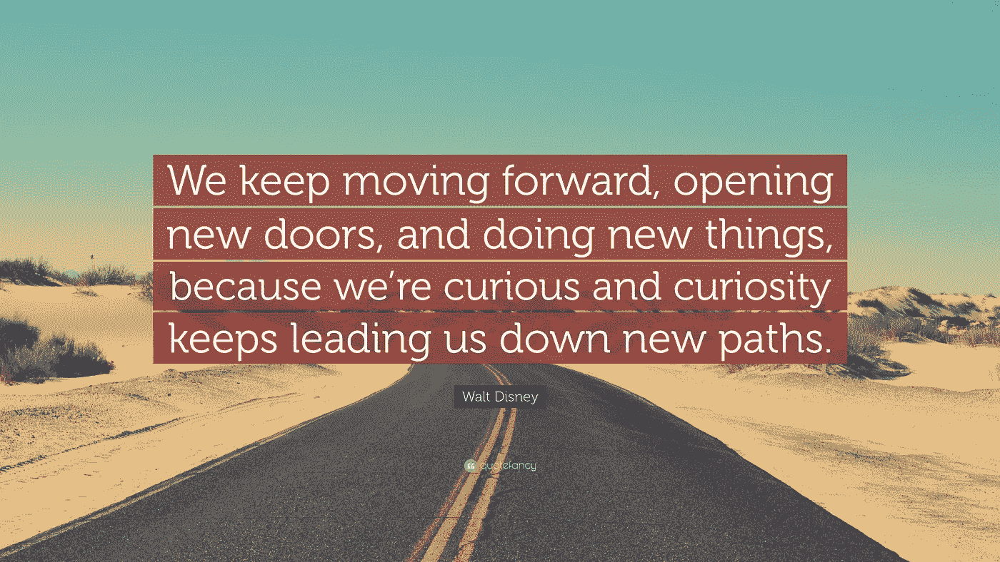

# 新冠肺炎·疫情如何把我变成一名机器学习实践者。

> 原文：<https://medium.com/analytics-vidhya/how-the-covid-19-pandemic-turned-me-into-a-machine-learning-practitioner-93a8caf4119d?source=collection_archive---------14----------------------->

## 我如何把消极的时间变成学习的机会。

与 Raj 在 [Unsplash](https://unsplash.com?utm_source=medium&utm_medium=referral) 上的[公路旅行照片](https://unsplash.com/@roadtripwithraj?utm_source=medium&utm_medium=referral)

# 开始

那是 2020 年 3 月。我是一名高三学生，我欣喜若狂地去华特·迪士尼世界进行我的毕业旅行。我把所有东西都打包好，然后在晚上 9 点睡觉，这样我就能赶上凌晨 3 点的航班。当时，我听说过冠状病毒，但没有多想。我和其他很多人一样，以为这只是一个会不了了之的病毒，所以没有太在意。伙计，我错了。凌晨 1 点，负责人发出了一封电子邮件，声明迪士尼之旅被取消。我妈妈一看到邮件就把我叫醒了。我充满了复杂的情感。我很沮丧，因为我不能做一件我期待了一整年的事情，但同时我理解这个决定。

迪士尼之旅取消两天后，我所在的高中关闭了所有面对面的学习，转而使用在线环境。此后不久，舞会和毕业典礼都被取消了。这绝对是一个奇怪的时代；然而，当我坐在家里享受高中以来最自由的时光时，我想为什么不利用这段时间做一些我通常没有时间做的事情。然后我突然想到。我为什么不学机器学习？！我一直想学习机器学习，但由于高中的责任，如 SAT，我一直没有时间这样做。我有我的目标，但是我有一个问题:我不知道从哪里开始。有些人说实现一个目标最困难的事情是开始。这句话在这里很适用。然而，一个想法像春天早晨的微风一样向我袭来。我的想法是从吴恩达教授在 Coursera 上的机器学习课程开始(本文参考资料部分有链接)。

我听说这个课程在教授初学者机器学习的艺术方面有多棒。带着这个想法，我开始了课程，向我的目标迈进了一步。

照片由[布拉登·科拉姆](https://unsplash.com/@bradencollum?utm_source=medium&utm_medium=referral)在 [Unsplash](https://unsplash.com?utm_source=medium&utm_medium=referral) 拍摄

# 吴恩达教授的机器学习教程

我花了大约三个月的时间在吴教授的课程上。我浏览了讲座，记了笔记，参加了测验，并尽我所能完成了项目。吴教授在用简单的术语解释高级概念方面做了非凡的工作。我能够非常容易地理解梯度下降&反向传播的思想。这个课程是一个很好的机器学习入门，我推荐给任何一个想学习机器学习的人。然而，公平的警告，这门课涉及到很多高层次的数学。当我说高级数学时，我指的是计算出许多许多导数，并执行各种线性代数计算。尽管如此，这门课在介绍机器学习的基础知识方面做得很好。关于这门课程，我不会讲太多细节，我认为最好是你自己完成这门课程，希望你能从这门课程中学到很多。但是，我可以自信地说，在我完成课程后，我对机器学习有了更多的了解，而且我肯定感到有更多的动力去学习更多的机器学习。

蒂姆·莫斯霍尔德在 [Unsplash](https://unsplash.com?utm_source=medium&utm_medium=referral) 上的照片

# 现在怎么办？

几乎像任何技能一样，为了变得更好，你必须练习。同样的方法可以应用于机器学习。是的，你可以去上另一门课，但是在现实世界中，你很少会应用你从某一门课中学到的东西。相反，你将应用你学到的概念。这正是我接下来做的。我开始建设项目。我的第一个项目是[泰坦尼克号挑战](https://www.kaggle.com/c/titanic)(别担心，我已经为你链接了挑战，以防你想解决它)。简而言之，这项挑战的目标是利用机器学习来“预测”一名特定乘客是否在泰坦尼克号沉没时幸存。数据集相当小，所以这对于初学者来说是一个完美的挑战。

在整个挑战过程中，我学到了很多东西。最突出的是，我了解了 Catboost 库。我不会深入研究 Catboost 到底是什么，但我只知道它是我最喜欢的机器学习库之一。一旦我完成了所有必要的任务，我就提交了一份文件。我期待着我的申请被评分。几秒钟过去了，我的期待建立起来。又过了几秒钟，嘣！我看到了我的分数。令我惊讶的是，我提交的作品在大约 32，500 个团队中排名前 14%。这个结果绝对令人震惊。我带着学习的心态去迎接挑战，最终我取得了很好的成绩。我很震惊，但嘿，我不是在抱怨。我学到了很多东西，我的分数也很高。这是两件令人惊奇的事情。在泰坦尼克号挑战之后，我参加了更多的项目，每个项目都帮助我学习新的东西。

现在，你不必像我一样应对同样的挑战，但是你需要确保你**练习**！**机器学习是一门艺术，你需要成为艺术家。没有人能在第一次尝试中成为毕加索。如果你失败了，不要担心，摆脱它，继续前进。你最终会突破的，别担心。**

[布雷特·乔丹](https://unsplash.com/@brett_jordan?utm_source=medium&utm_medium=referral)在 [Unsplash](https://unsplash.com?utm_source=medium&utm_medium=referral) 上的照片

# 资源

在这一部分，我冒昧地提供了一些资源的链接，这些资源帮助我成为了一名机器学习实践者。我希望你会发现这些资源同样有用，并能够在成为机器学习实践者方面迈出一步。

*   [吴恩达教授的机器学习课程](https://www.coursera.org/learn/machine-learning)
*   [伟大的机器学习参考书](http://Hands-On Machine Learning with Scikit-Learn, Keras, and TensorFlow)
*   [使用 PyTorch 进行深度学习的 Udacity 课程](https://www.udacity.com/course/deep-learning-pytorch--ud188)
*   [Kaggle，一个机器学习比赛现场](https://www.kaggle.com)
*   [UCI 数据仓库，一个实践机器学习的数据集的大集合](https://archive.ics.uci.edu/ml/datasets.php)

需要注意的是，我所链接的参考文献并不是机器学习的唯一参考文献。还有很多很多其他的参考资料。就像我之前说的，我希望这些资源能帮助你踏上你的机器学习之旅。

# 结论

继续向前引用，来自[quotefancy.com](https://quotefancy.com/quote/757120/Walt-Disney-We-keep-moving-forward-opening-new-doors-and-doing-new-things-because-we-re)，公共领域

如果从我的旅程中有什么可以吸取的，那就是我们必须继续前进。我们必须不断学习，接受挑战。通过不断学习，我们正在开辟新的道路，踏上新的旅程，到达新的目的地。新冠肺炎·疫情无疑在我们的生活中制造了漏洞；然而，即使在黑暗时期，也总是有机会的。我敦促你们抓住机会，我向你们保证，有一天，你们将能够俯视并赞美你们的成功。然而，这只有在你不断前进的情况下才有可能。我希望我的文章能给你提供信息，并对你有所启发，无论在什么情况下，你都可以去实现你的目标。此外，我希望我的文章能够帮助您开始您的机器学习之旅。如果我能做到，你也能。

如果您有任何反馈，请告诉我。反馈是我变得更好的方法之一。欢迎大家在下面留下评论。只要确保你的评论是恰当的。像往常一样，我真心感谢每一个在百忙之中抽出时间来阅读我的文章的人。它对我来说真的很重要。最后，永远记住，不断前进。

# 关于作者

我是罗格斯大学新不伦瑞克分校的本科生，正在攻读计算机科学和认知科学专业。此外，我正在辅修工商管理和数据科学证书。我已经应用机器学习一年多了，最近，我开始涉足深度学习。我是人工智能的超级粉丝，我喜欢与社区分享我的学习和经验。请随时通过 LinkedIn 联系我或者发邮件到 jinal.shah2821@gmail.com 给我。