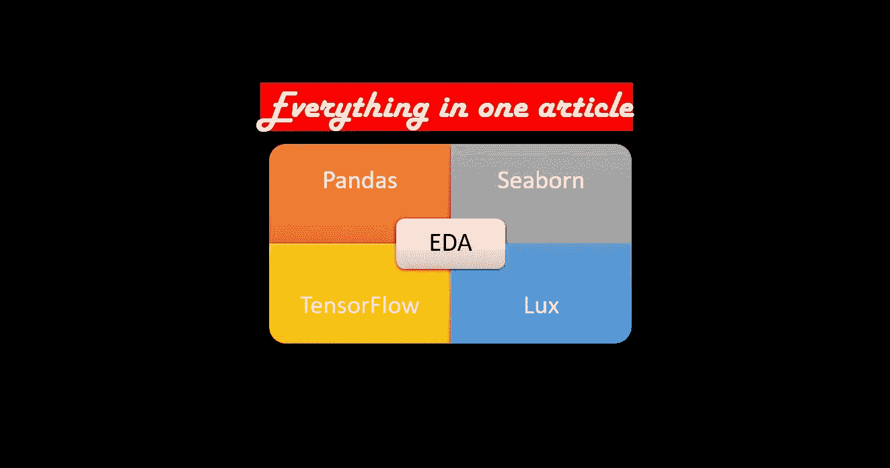

# 如何进行探索性数据分析

> 原文：<https://medium.com/analytics-vidhya/how-to-ace-exploratory-data-analysis-d3821011532b?source=collection_archive---------1----------------------->

## 入门指南

## 探索性数据分析(EDA)是任何以数据为中心的项目的主要构建模块。本文重点介绍使用 Python 库(如 Pandas、Seaborn、Tensorflow 数据验证器和 Lux)执行 EDA 的图形和数值方法。

附注:我做了这个横幅