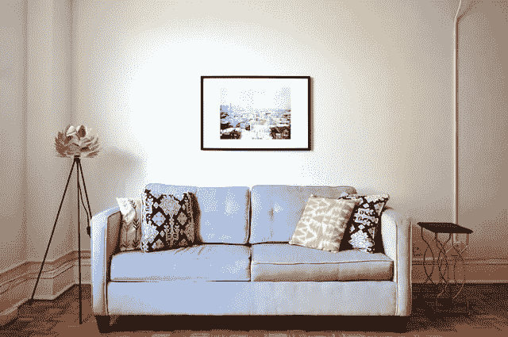

# 如何在网上面试中胜出

> 原文：<https://medium.com/analytics-vidhya/how-to-ace-your-online-interview-954f1639d659?source=collection_archive---------16----------------------->

你好，在这个故事中我会给你一些必须知道的重要提示来帮助你进行网上面试。

伊恩·斯托弗在 [Unsplash](https://unsplash.com/s/photos/success?utm_source=unsplash&utm_medium=referral&utm_content=creditCopyText) 上拍摄的照片

有些人可能对在线面试和用于此目的的技术感到不舒服。

# 知道视图中有什么

背景最好是真实的，这样才能显示你是谁。例如，你可以去你家的一个角落。你周围也可能有你不想看到的东西。保持你的背景简单和中立。让电视、人们走动和移动物体等干扰远离你的背景。确保照明良好，人们可以很好地看到你。你的背景不应该有太多的光线和亮度，因为这会干扰在另一边观看你的视频的人的眼睛。以下是一些很好的背景示例:

[Beazy](https://unsplash.com/@beazy?utm_source=unsplash&utm_medium=referral&utm_content=creditCopyText) 在 [Unsplash](https://unsplash.com/s/photos/sofa?utm_source=unsplash&utm_medium=referral&utm_content=creditCopyText) 上拍照

照片由[娜奥米·赫伯特](https://unsplash.com/@naomish?utm_source=unsplash&utm_medium=referral&utm_content=creditCopyText)在 [Unsplash](https://unsplash.com/s/photos/sofa?utm_source=unsplash&utm_medium=referral&utm_content=creditCopyText) 上拍摄

如果你想使用视觉背景，请使用有移动物体或运动的东西，如海浪、海底、鱼等。使用简单而不分散注意力的视觉背景。

# 选择职业装

你可以选择一些你去办公室面试时会穿的衣服。这不一定意味着要穿西装打领带，但要确保它既专业又简单。

# 装备

准备好你的视频和音频设备，确保你在面试中使用的每一个设备都充满电并正常工作。

确保你知道如何使用将要在面试中使用的软件，这样到时候你可以在点击链接后轻松连接。

有时当你打开笔记本电脑时，它可能会显示关于更新或问题的消息，所以请确保你的笔记本电脑已经打开。

# 身体语言和行为

确保你看起来很投入，你在用眼神交流，你没有萎靡不振。想想如果不在网上，你会如何展示自己。你想用你的语言和非语言表达出你是好奇的，专注的，而不是分心的看着你的手机或其他方向。用微笑和眼神来表示你感兴趣并且不厌烦。

# 做家庭作业

在 LinkedIn 上查找面试官，以便在面试前更好地了解他。阅读公司历史、价值观、目标等。

知道你要问什么。知道他们在找什么。知道你如何适应那个角色。

能够流利而有说服力地讲述你所做的事情、你的技能、你的经历、你的性格等等。

# 知道这个问题的答案吗

*   说说你自己吧。
*   你为什么认为你是这个角色的最佳人选？
*   你的强项是什么？
*   你的弱点是什么？
*   是什么把你带到这家公司的？
*   我们为什么要雇用你？
*   你以前的经历对你的工作有什么帮助？
*   你认为未来的自己在哪里？
*   你如何回应一个不同意你的同事？

# 刷牙

# 和朋友一起练习这些技巧

感谢阅读。请按拍手按钮。如果对技术和商业感兴趣也可以关注。

**Instagram 教育账号:**【https://www.instagram.com/cool_short_notes 