# 如何在自然语言处理分类任务中获得最先进的结果

> 原文：<https://medium.com/analytics-vidhya/how-to-achieve-state-of-the-art-results-on-nlp-classification-tasks-342fa07c7fe9?source=collection_archive---------13----------------------->

使用拥抱人脸库释放迁移学习的力量


作者安东尼奥·利斯

# 介绍

大家好，在我之前的帖子“如何在不到 10 分钟的时间内创建一个最先进的图像分类器”之后，我决定为 NLP 空间做一些类似的事情。

因此，在这篇文章中，我们将看到如何使用拥抱人脸库和利用迁移学习的力量轻松创建一个最先进的模型分类器，就像我们在 Rover 分类挑战中所做的那样。

# 资料组

我们将用来测试我们模型的数据集是我们从 [Kaggle](https://www.kaggle.com/lakshmi25npathi/imdb-dataset-of-50k-movie-reviews) 下载的经典 [IMDB 数据集](https://ai.stanford.edu/~amaas/data/sentiment/)。数据集有 50K 个电影评论，根据评论的投票，用二进制标签正面/负面，>= 10 分之 7 是正面，< 7 是负面。这是一个二元情感分类的数据集。

# 数据探索

让我们来看看数据:

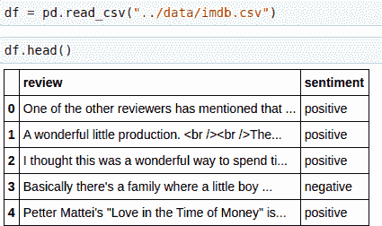

这里没有什么复杂的，让我们看看一些关于评论和情绪变量的统计数据。

查看我们的目标变量“情绪”，我们可以看到数据完全平衡，我们有 25k 正面和 25k 负面评论:

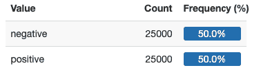

我们还可以看看评论长度的分布:

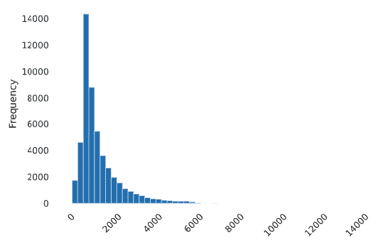

查看超过 7000 个字符的评论，我们在整个数据集上获得 71/29 的分布，有利于正面评论的 50/50 分布:

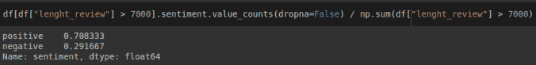

所以，看起来长评论有更高的概率有一个积极的情绪。在我们的建模中，这可能是一个很好的变量，但是这里我们对使用纯 NLP 管道感兴趣，所以我们将忽略它。

在进入建模阶段之前，我们需要将数据集分为训练集和测试集:

```
df_train = df[:25000]
df_test = df[25000:]
```

好了，我们现在准备启动一些神经网络。

# 开始简单

我们将非常简单地从 NLP 世界中使用的一些标准架构开始。首先，我们定义一些参数:

```
MAX_SEQUENCE_LENGTH = 1000
MAX_NUM_WORDS = 20000
EMBEDDING_DIM = 100
```

MAX_SEQUENCE_LENGTH 参数是我们将在模型中考虑的单词序列的最大长度。MAX_NUM_WORDS 是分词器根据词频考虑的最大字数。EMBEDDING_DIM 是我们将在模型中使用的嵌入层的大小。

# 数据预处理

让我们从标记我们的评论开始:

```
tokenizer = Tokenizer(num_words=MAX_NUM_WORDS) tokenizer.fit_on_texts(df_train.review.values) train_sequences = tokenizer.texts_to_sequences(df_train.review.values) test_sequences = tokenizer.texts_to_sequences(df_test.review.values) word_index = tokenizer.word_index
```

我们使用 Keras 的标记器来识别评论中的单词。然后，我们使用 texts_to_sequences 方法将文本数组转换为数字数组，其中每个单词都有自己的索引保存在字典中(word_index)。

我们将它应用于训练集，并将其应用于训练集和测试集。然后我们填充生成的序列。这是必要的，因为 GPU 希望所有矩阵的长度相同，所以我们将使用 MAX _ SEQUENCE _ LENGHT 参数来定义数组的形状，当序列较短时，我们用一串零填充开头。

```
X_train = pad_sequences(train_sequences, maxlen=MAX_SEQUENCE_LENGTH) X_test = pad_sequences(test_sequences, maxlen=MAX_SEQUENCE_LENGTH)
```

对于目标变量，我们需要从一个单值变量(1，0，1 等等)转换成一种 hot 编码形式([0，1]，[1，0]，[0，1])。我们可以使用 Keras 中的 to _ categorical 函数:

```
y_train = to_categorical(np.asarray(df_train.sentiment.map(labels_index)))y_test = to_categorical(np.asarray(df_test.sentiment.map(labels_index)))
```

好了，我们基本上完成了数据预处理，现在我们可以定义我们的第一个神经网络。

# 一维卷积神经网络

我们的第一个模型是一维卷积神经网络:

```
model = Sequential() model.add(Embedding(num_words, EMBEDDING_DIM, input_length=MAX_SEQUENCE_LENGTH)) 
model.add(Conv1D(128, 5, activation='relu')) model.add(MaxPooling1D(5)) model.add(Conv1D(128, 5, activation='relu')) 
model.add(MaxPooling1D(5)) 
model.add(Conv1D(128, 5, activation='relu')) model.add(GlobalMaxPooling1D()) 
model.add(Dense(128, activation='relu')) model.add(Dense(len(labels_index), activation='softmax'))
```

我们可以使用 summary()方法很容易地看到模型的架构:

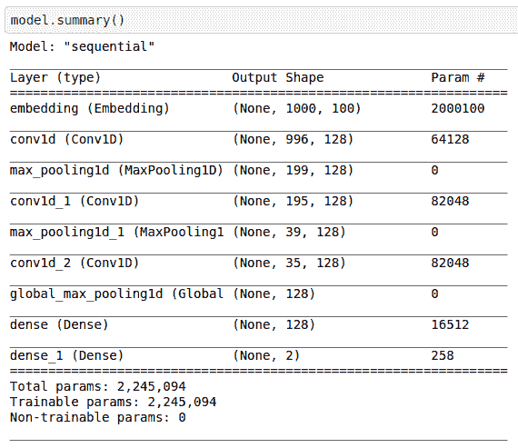

好，让我们来训练它:

```
model = Sequential() 
model.add(Embedding(MAX_NUM_WORDS, 128)) 
model.add(LSTM(128, dropout=0.2)) model.add(Dense(2, activation='sigmoid')) model.compile(loss='binary_crossentropy', optimizer='adam', metrics=['accuracy']) model.fit(X_train, y_train, batch_size=128, epochs=4)
```

纪元 1/5
196/196[= = = = = = = = = = = = = = = = = = = = = = = = = = = = = = = = = = = 27s 53 ms/step—损耗:0.6013 — acc: 0.6137
纪元 2/5
196/196[= = = = = = = = = = = = = = = = = = = = = = = = = = = = 10s 53 ms/step—损耗:0.2510 — acc: 0.9005
纪元 3/5【历元

最后，我们可以在测试集上评估它:

```
score, acc = model.evaluate(X_test, y_test, batch_size=128)
```

196/196[= = = = = = = = = = = = = = = = = = = = = = = = = = =]—4s 18ms/步—损耗:0.3681 — acc: 0.8878

获得了 88.78%的准确率。第一次尝试还不错，我们的模型现在过拟合，我们应该使用一些下降层来限制它，但这不是我们的最终目标。让我们尝试另一种通常用于 NLP 任务的架构，LSTM 网络。

# LSTM

让我们从定义我们的 LSTM 模型开始:

```
model.add(Embedding(MAX_NUM_WORDS, 128)) 
model.add(LSTM(128, dropout=0.2)) model.add(Dense(2, activation='sigmoid'))model.compile(loss='binary_crossentropy',optimizer='adam',metrics=['accuracy'])
```

和前面一样，我们可以使用 model.summary()来查看模型:

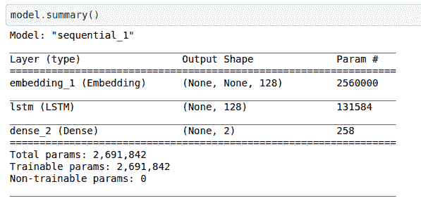

我们现在可以安装它:

```
model.fit(X_train, y_train, batch_size=128, epochs=4)
```

历元 1/5
196/196[= = = = = = = = = = = = = = = = = = = = = = = = = = = = = = = = = = = = 25s 121 ms/step—损耗:0.5804 —精度:0.6935
历元 2/5
196/196[= = = = = = = = = = = = = = = = = = = = = = = = = = = 24s 121 ms/step—损耗:0.2336 —精度:0.9126 【T12

我们在测试集上评估它:

```
score, acc = model.evaluate(X_test, y_test, batch_size=128)
```

196/196[= = = = = = = = = = = = = = = = = = = = = = = = = = =]—8s 41 ms/步—损耗:0.4413 —精度:0.8777

和以前一样，有过度拟合，这里我们更少概括。好吧，我们换个方法。

# 语言模型

我们现在要改变方法。到目前为止，我们只是定义了模型并训练它，从随机权重开始。

一种不同的方法是使用来自评论的文本来训练语言模型，然后调整分类任务的权重。最简单的形式是，语言模型学会根据前面的单词预测下一个单词，这就是我们在这里要实现的。

出于两个主要原因，我们将构建一个非常基本和简单的语言模型:

*   更大的网络意味着更多的训练时间和 GPU 内存
*   语言模型的真正优势在于在一个大的不同数据集(如 wikitext)上进行训练，然后利用迁移学习，就像我们在 rover 分类上对 ResNet 所做的那样

在这篇文章的最后一部分，我们将使用预先训练好的语言模型。现在，让我们在评论的基础上建立我们最基本的语言模型。

我们像以前一样从标记文本开始:

```
tokenizer = Tokenizer(num_words=MAX_NUM_WORDS) tokenizer.fit_on_texts(df_train.review.values) train_sequences = tokenizer.texts_to_sequences(df_train.review.values) test_sequences = tokenizer.texts_to_sequences(df_test.review.values)
```

现在我们需要为语言模型创建一个输入序列。首先，我们对评论进行标记化，然后我们创建一个向量，从前两个词(标记化)开始，然后添加其他词:

```
input_sequences = []for line in df_train.review.values:
    token_list = tokenizer.texts_to_sequences([line])[0]
    for i in range(1, len(token_list)):
        n_gram_sequence = token_list[:i+1]
        input_sequences.append(n_gram_sequence)
```

结果是这样的:


这是第一次复习，我们有 12 个单词，因为我们在考虑第 11 个元素。第 12 个元素将等于第 11 个加上一个额外的字。当我们到达评审的末尾并开始新的评审时，第一个元素将是 long 2。这是必要的，因为它们之间的审查是不相关的。

为了清楚起见，让我们看看第二个和第三个元素:

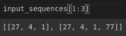

同样的事情，第二个元素有三个单词，第三个元素只有一个单词。

与以前不同的是，我们不能只给模型一个 numpy 数组，这会消耗太多内存。因此，我们创建一个批处理生成器来生成一批数据:

```
class KerasBatchGenerator(object):
    def __init__(self, input_sequences, batch_size):
        self.input_sequences = input_sequences
        self.batch_size = batch_size
        self.current_idx = 0

    def generate(self):
        while True:
            if (i + 1)*self.batch_size < len(self.input_sequences):
                in_seq = input_sequences[i*self.batch_size: (i + 1)*self.batch_size]
                in_seq = np.array(pad_sequences(in_seq, maxlen=MAX_SEQUENCE_LENGTH, padding='pre'))

            else:
                in_seq = input_sequences[i*self.batch_size:]
                in_seq = np.array(pad_sequences(in_seq, maxlen=MAX_SEQUENCE_LENGTH, padding='pre'))

            X = in_seq[:,:-1]
            y = in_seq[:,-1]
            y = to_categorical(y, num_classes=num_words)
            self.current_idx += len(self.input_sequences) // self.batch_size
            yield (X, y)
```

我们现在可以创建生成器并定义我们的第一个语言模型。我们将使用之前使用的相同的 LSTM，但在最后，我们将有一个包含 n+1 个单词的密集层，其中 n 是保留在标记器中的最大单词数，+1 表示未知单词(不在适合的词汇中的单词):

```
gen = KerasBatchGenerator(input_sequences, 2048) 
model = Sequential() 
model.add(Embedding(num_words, EMBEDDING_DIM, input_length=MAX_SEQUENCE_LENGTH)) 
model.add(LSTM(128, dropout=0.2)) 
model.add(Dense(MAX_NUM_WORDS + 1, activation='softmax')) model.compile(loss='categorical_crossentropy', optimizer='adam')
```

最后，我们现在可以训练我们的语言模型:

```
model.fit(gen.generate(), steps_per_epoch=len(input_sequences)//2048, epochs=1, verbose=1)
```

2777/2777[= = = = = = = = = = = = = = = = = = = = = = = = = = = =]—2267s 815 ms/步—损耗:3.8493

一旦训练了我们的语言模型，我们就可以构建一个新的模型，它使用训练好的嵌入层，并在此基础上构建与以前相同的 LSTM:

```
new_model = Sequential()
for layer in model.layers[:-2]:
    new_model.add(layer)
new_model.add(LSTM(128, dropout=0.2))
new_model.add(Dense(2, activation='sigmoid'))
print(new_model.summary())
new_model.compile(loss='binary_crossentropy',
              optimizer='adam',
              metrics=['accuracy'])
```

我们可以使用 summary()方法来查看新模型:

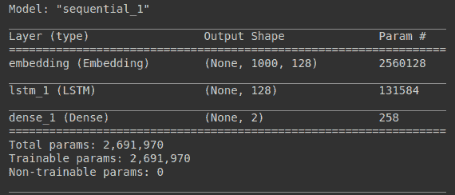

我们对它进行五个时期的训练，并像以前一样在训练集上对它进行评估:

```
new_model.fit(X_train, y_train, batch_size=128, epochs=5) 
score, acc = new_model.evaluate(X_test, y_test)
```

历元 1/5
196/196[= = = = = = = = = = = = = = = = = = = = = = = = = = = = = = = = = = = = = = 22s 105 ms/step—损耗:0.6124 —精度:0.6411
历元 2/5
196/196[= = = = = = = = = = = = = = = = = = = = = = = = = = = = 21s 105 ms/step—损耗:0.4067 —精度:0.8216
历元 3/5

我们获得了 87.48%的准确率。这与之前的结果相同，我们也过度适应了。但是这里的重点不是提高性能。我们想介绍语言模型的概念以及它是如何被训练的。

现在是时候拿出大枪，从根本上提高我们的分数。

# 释放迁移学习的力量

像谷歌和 OpenAI 这样的公司训练并提供在从互联网上搜集的非常大的文本数据集上训练的非常大的语言模型。例如，著名的 GPT-3 训练有 4990 亿个令牌:

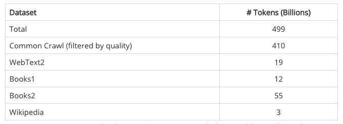

GPT-3 和 GPT-2 使用下一个单词预测进行训练，就像我们的语言模型一样。不幸的是，GPT-3 不是开源模型，OpenAI 选择通过商业 API 提供它，所以我们不得不满足于 GPT-2。

我们将使用三个预训练的语言模型，它们都基于 Vaswani 等人在 2017 年发表的著名论文[“注意力是你所需要的一切”](https://arxiv.org/pdf/1706.03762.pdf)中提出的 transformer 架构:

*   由谷歌人工智能伯特
*   OpenAI 的 GPT-2
*   卡耐基梅隆大学和谷歌大脑团队的 XLNet

使用这些模型的最好方法是使用拥抱脸的[变形金刚库。通过这种方式，我们可以构建一个标准管道，只需更改所用的模型。](https://huggingface.co/transformers/)

# 伯特(男子名ˌ等于 Burt)

让我们从伯特开始。

我们使用拥抱脸的标准管道。我们加载 Hugging Face 提供的配置，并将关于从隐藏状态返回输出的参数更改为 False:

```
model_name = 'bert-base-uncased' 
max_length = 1000 
config = BertConfig.from_pretrained(model_name) config.output_hidden_states = False
```

我们加载用于训练 bert 的同一个记号赋予器，并使用之前定义的配置加载预训练模型。

```
tokenizer = BertTokenizer.from_pretrained(pretrained_model_name_or_path = model_name, config = config) # Load the Transformers BERT model 
transformer_model = TFBertModel.from_pretrained(model_name, config = config)
```

我们可以像往常一样使用汇总方法来查看模型:

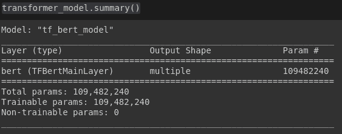

我们只取主要的一层:

```
bert = transformer_model.layers[0]
```

我们定义我们的输入需要遵循拥抱脸所需的格式(您可以在[文档](https://huggingface.co/transformers/)中找到它):

```
input_ids = Input(shape=(max_length,), name='input_ids', dtype='int32') attention_mask = Input(shape=(max_length,), name='attention_mask', dtype='int32') inputs = {'input_ids': input_ids, 'attention_mask': attention_mask}
```

我们现在可以定义我们的模型:

```
bert_model = bert(inputs)[1] 
dropout = Dropout(config.hidden_dropout_prob, name='pooled_output') pooled_output = dropout(bert_model, training=False) 
dense_inter = Dense(128, activation='relu')(pooled_output) 
logits = Dense(2)(dense_inter) model = Model(inputs=inputs, outputs=logits)
```

我们看到了:

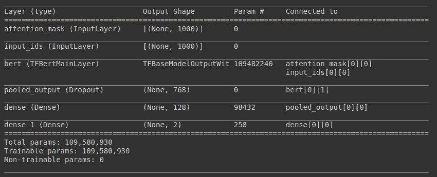

我们定义优化器、损耗和指标，并对其进行编译:

```
optimizer = Adam(learning_rate=1e-05, epsilon=1e-08, decay=0.01, clipnorm=1.0)

loss = CategoricalCrossentropy(from_logits=True) metric = 'accuracy' 
model.compile(optimizer=optimizer, loss=loss, metrics=metric)
```

我们使用 BertTokenizer 来标记我们的训练和测试输入:

```
X_train = tokenizer(text=df_train['review'].to_list(), add_special_tokens=True, max_length=max_length, truncation=True, padding=True, return_tensors='tf', return_token_type_ids = False, return_attention_mask = True, verbose = True) X_test = tokenizer(text=df_test['review'].to_list(), add_special_tokens=True, max_length=max_length, truncation=True, padding=True, return_tensors='tf', return_token_type_ids = False, return_attention_mask = True, verbose = True)
```

我们符合这个模型:

```
model.fit({"input_ids": X_train["input_ids"], "attention_mask": X_train["attention_mask"]}, y_train, batch_size=4, epochs=2)
```

历元 1/2
6250/6250[= = = = = = = = = = = = = = = = = = = = = = = = = = = = = = = = = =-4153s 663 ms/step—损耗:0.3503 —精度:0.8488
历元 2/2
6250/6250[= = = = = = = = = = = = = = = = = = = = = = = = = = = = = = = 4141s 663 ms/step—损耗:0.2460 —精度:0.9130

最后，我们来看看测试集的准确性:

```
score, acc = model.evaluate({"input_ids": X_test["input_ids"], "attention_mask": X_test["attention_mask"]}, y_test)
```

782/782[= = = = = = = = = = = = = = = = = = = = = = = = = = =]—1186s 2s/step—损耗:0.2610 —精度:0.9129

好的，我们有 91.29%的准确率，还不错。我们正朝着正确的方向前进。这里的问题是训练这些模型的时间。我们只能用 4 的小批量训练 2 个纪元。如果批量更大，GPU 将会耗尽内存。

# GPT-2

是时候使用 GPT 2 号了。为了让事情更有趣，我们使用 GPT-2 的更大版本，而对于伯特，我们使用标准版本。但是因为我们有一个更大的模型，我们使用最大序列长度 300 来训练它:

```
model_name = 'gpt2-large' 
max_length = 300 
config = GPT2Config.from_pretrained(model_name) config.output_hidden_states = Falsetokenizer = GPT2Tokenizer.from_pretrained(pretrained_model_name_or_path=model_name, config=config)transformer_model = TFGPT2Model.from_pretrained(model_name, config=config)
```

流水线是一样的，取主层，定义模型，输入，训练和评估它:

```
gpt2 = transformer_model.layers[0]
input_ids = Input(shape=(max_length,), name='input_ids', dtype='int32')
inputs = {'input_ids': input_ids} gpt2_model = gpt2(inputs)[0] 
dense_inter = Flatten()(gpt2_model) logits = Dense(2)(dense_inter) model = Model(inputs=inputs, outputs=logits) 
optimizer = Adam( learning_rate=1e-05, epsilon=1e-08, decay=0.01, clipnorm=1.0) 
loss = CategoricalCrossentropy(from_logits=True) metric = 'accuracy' model.compile( optimizer = optimizer, loss = loss, metrics = metric) X_train = tokenizer( text=df_train['review'].to_list(), add_special_tokens=True, max_length=max_length, truncation=True, padding=True, return_tensors='tf', return_token_type_ids = False, return_attention_mask = False, verbose = True) X_test = tokenizer( text=df_test['review'].to_list(), add_special_tokens=True, max_length=max_length, truncation=True, padding=True, return_tensors='tf', return_token_type_ids = False, return_attention_mask = False, verbose = True)model.fit(X_train["input_ids"], y_train, batch_size=2, epochs=2) score, acc = model.evaluate(X_test["input_ids"], y_test)
```

历元 1/2
12500/12500[= = = = = = = = = = = = = = = = = = = = = = = = = = = = = = = 7667s 611 ms/step—损耗:0.3798 —精度:0.8894
历元 2/2
12500/12500[= = = = = = = = = = = = = = = = = = = = = = = = = 7637s 611 ms/step—损耗:0.2418 —精度

准确率跃升至 92.74%。好的，让我们看看最后一个模型。

# XLNet

流水线是相同的，我们使用标准模型，因为这是一个更大的模型，即使在其基础形式中，我们也需要将序列长度减少到 500 来训练它。

```
model_name = 'xlnet-base-cased' 
max_length = 500 
config = XLNetConfig.from_pretrained(model_name) config.output_hidden_states = Falsetokenizer = XLNetTokenizer.from_pretrained(pretrained_model_name_or_path=model_name, config=config) transformer_model = TFXLNetModel.from_pretrained(model_name, config=config)
```

我们训练模型:

```
model.fit(X_train["input_ids"], y_train, batch_size=4, epochs=2)
```

纪元 1/2
6250/6250[= = = = = = = = = = = = = = = = = = = = = = = = = = = = = = = =-3524s 562 ms/step—损耗:0.4341 —精度:0.8810
纪元 2/2
6250/6250[= = = = = = = = = = = = = = = = = = = = = = = = = = = = 3512s 562 ms/step—损耗:0.2526 —精度:0

我们在测试集上评估它:

```
score, acc = model.evaluate(X_test["input_ids"], y_test)
```

782/782[= = = = = = = = = = = = = = = = = = = = = = = = = = =]—941 秒/步—损耗:0.2861 —精度:0.9370

好的，所以最终我们能够达到 93.70%的准确率。

# 结论

我们最好的成绩是 93.70%，一点都不差。但是我们可以通过三种方式得到更好的结果:

*   为更多时代而训练
*   用更大的序列长度训练
*   微调评论的语言模型

我们无法探索这些选项中的任何一个，原因很简单，我们没有足够强大的 GPU。目前，这是 NLP 的最大问题。为了训练大型模型，你需要在云 GPU 上花费大量资金(根据[一项估计](https://lambdalabs.com/blog/demystifying-gpt-3/)，训练 GPT-3 至少需要 460 万美元)。

你可以在我的 [Github](https://github.com/antonai91/nlp/tree/main/imdb) 上找到所有代码。有任何问题，你可以通过 [Linkedin](https://www.linkedin.com/in/lisiantonio/) 联系我。

在说再见之前，如果你想在我发布东西的时候得到通知，你可以在下面订阅。

如果你喜欢这篇文章，分享给你的朋友和同事吧！我会在下一篇文章中看到你。与此同时，要小心，保持安全，记住*不要成为另一块墙砖*。

Anton.ai

*原载于 2021 年 4 月 1 日*[*https://antonai . blog*](https://antonai.blog/how-to-achieve-state-of-the-art-results-on-nlp-classification-tasks/)*。*