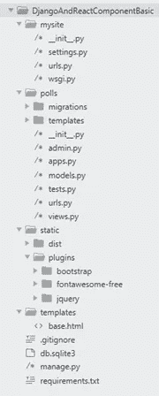
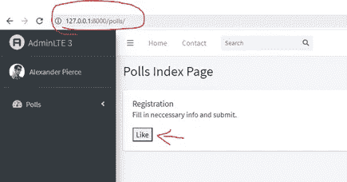
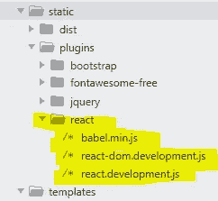
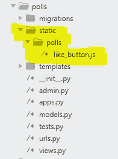
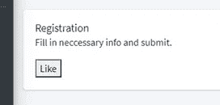
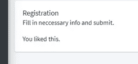

# 如何将 React JS 添加到 Django 中——基本方法

> 原文：<https://medium.com/analytics-vidhya/how-to-add-react-js-into-django-24e79e67e992?source=collection_archive---------2----------------------->

多年来，我一直在寻找一个适合 Django 的前端库。问题是 UI 需求增长如此之快，以至于传统的技术栈(Django 模板引擎+ Bootstrap + Vanilla JavaScript)不再适应现代 web 开发的步伐。在我已经在许多项目中研究和使用了不同的库之后，JQuery、React JS 和 Vue JS 似乎是顶层的选择。其中，React JS 绝对吸引我的眼球。利用其基于组件的开发，我们可以用最少的维护工作以省时的方式扩展我们的 ui。除此之外，React 社区在 UI 开发的各种解决方案方面也非常有创新性。

与大多数使用 React/Node 作为 web 框架和 Django 作为 REST 服务的教程不同，我将使用 Django 作为 web 框架，并将 React 作为纯前端解决方案。在本文中，我们将通过一个简单的例子向您展示如何在 Django 中启用 React 组件。

# 依赖关系:

1.Python 3.7

2.Django 2.2.x

3.反应 17

4.AdminLTE 3.0.5(见我之前的教程[这里](https://www.linkedin.com/pulse/how-use-adminlte-django-yiqing-lan/)为这个主题库)

# 我的方法:

## 第 1/5 步:预览

我们将从如下所示的项目开始我们的教程。



在教程的最后，我们将在 **polls** app 的 **127.0.0.1:8000/polls/** 页面添加一个 React“喜欢”按钮。



## 步骤 2/5:添加 React 和 JSX 库

在 **/static/plugins/** 文件夹中新建一个文件夹 **react** 。在我们刚刚创建的 **react** 文件夹中，创建三个 JavaScript 文件并粘贴下面每个页面的内容。

[https://unpkg.com/react@17/umd/react.development.js](https://unpkg.com/react@17/umd/react.development.js)

[https://unpkg.com/react-dom@17/umd/react-dom.development.js](https://unpkg.com/react-dom@17/umd/react-dom.development.js)

[https://unpkg.com/babel-standalone@6/babel.min.js](https://unpkg.com/babel-standalone@6/babel.min.js)

然后，我们将期待如下结果。



## 步骤 3/5:在模板中导入库

在这个项目中，每个页面都使用**base.html**作为基础模板。因此，我们将在**base.html**文件中导入库，使它们对所有子模板可用。最后导入它们。结果如下。

```
<script src=""></script>
 <script src=""></script>
 <!-- JSX support-->
 <script src=""></script>
```

## 步骤 4/5:为“喜欢”按钮创建容器

让我们在 **127.0.0.1:8000/polls/** 页面中添加一个部门，在那里将添加按钮。它就像一行代码一样简单。确保 id 已声明。

```
<div id="like_button_container"></div>
```

## 步骤 5/5:创建 React 组件

在**民调** app 中创建一个文件夹**静态**。在我们刚刚创建的**静态**文件夹中，创建一个文件夹 **polls** 。然后我们可以在 polls 文件夹中创建一个文件 **like_button.js** 。该模式如下所示。



将下面的 JSX 代码复制粘贴到 like_button.js 文件中。

```
'use strict';

 const ***e*** = React.createElement;

 class LikeButton extends React.Component {
   constructor(props) {
     super(props);
     this.state = { liked: false };
   }

   render() {
     if (this.state.liked) {
       return 'You liked this.';
     }

     return (
       <button onClick={() => this.setState({ liked: true })}>
         Like
       </button>
     );
   }
 }

 const ***domContainer*** = ***document***.querySelector('#like_button_container');
 ReactDOM.render(<LikeButton />, ***domContainer***);
```

让我们开始项目并回顾我们已经取得的成果。我们期望按钮被呈现在“like_button_container”部分。当我们点击按钮后，它将被转换为“你喜欢这个。”文字。

之前。



之后。



# 结论

希望这篇教程给你一点提示。确保在生产环境下使用这些库。

[https://unpkg.com/react@17.0.1/umd/react.production.min.js](https://unpkg.com/react@17.0.1/umd/react.production.min.js)

[https://UNP kg . com/react-DOM @ 17 . 0 . 1/UMD/react-DOM . production . min . js](https://unpkg.com/react-dom@17.0.1/umd/react-dom.production.min.js)

在本文中，我没有机会介绍如何将 React 组件连接到 Django 视图。如果你感兴趣，请留下你的评论。我最近非常忙。但我一定会就此写一篇新文章。

我已经在 git 中上传了这个项目。回购名称为 DjangoAndReactComponentBasic。点击这里查看这个项目。

[](https://github.com/slow999/DjangoAndReactComponentBasic) [## slow 999/djangoeriactcomponentbasic

### 在 GitHub 上创建一个帐户，为 slow 999/djangoeriactcomponentbasic 开发做贡献。

github.com](https://github.com/slow999/DjangoAndReactComponentBasic) 

点击这里查看我在 YouTube 上的视频。