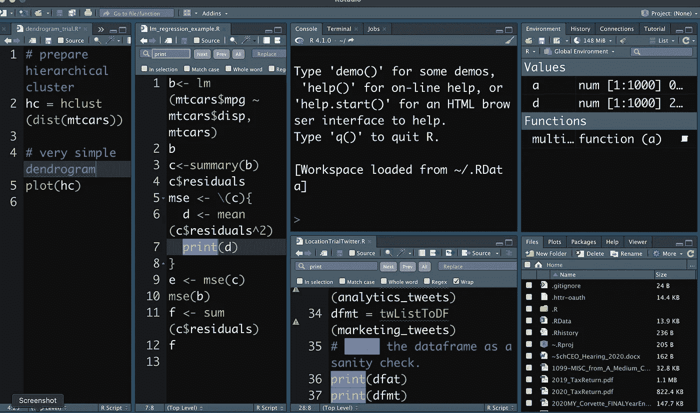

# 如何在 RStudio 中添加源列窗格

> 原文：<https://medium.com/analytics-vidhya/how-to-add-source-columns-panes-in-rstudio-94fde0d6aff8?source=collection_archive---------3----------------------->

## 该特性提供了一种查看 R 编程脚本和数据模型的新方法

添加一个源列窗格，即使是第二个，也可以增强 R Studio 中的工作流

RStudio 中一个有趣的特性是在标准的 4 格窗口旁边增加了列。用户可以在其 RStudio 窗口布局中添加源列窗格。该功能是在 RStudio 版中引入的。这是增强您工作流程的可靠方法…