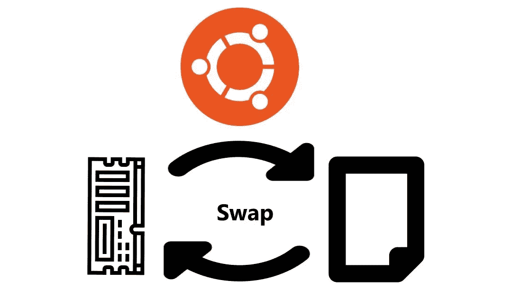

# 如何在 Ubuntu 上添加交换空间

> 原文：<https://medium.com/analytics-vidhya/how-to-add-swap-space-on-ubuntu-ff9af2820adc?source=collection_archive---------7----------------------->

防止应用程序出现内存不足错误的最聪明的方法是给服务器增加一些交换空间。在本指南中，我们将介绍如何向 Ubuntu 18.04 服务器添加交换文件。



# 什么是 Swap？

*交换区*是硬盘上的一个区域，它被指定为操作系统可以临时存储它无法再保存在 RAM 中的数据的地方。基本上，这使您能够增加服务器在其工作“内存”中可以保存的信息量，但有一些注意事项。当 RAM 中没有足够的空间来保存正在使用的应用程序数据时，将主要使用硬盘上的交换空间。

# 检查系统中的交换信息

在开始之前，我们需要检查系统是否已经有一些可用的交换空间。有可能有多个交换文件或交换分区，但是通常一个就足够了。

我们可以通过键入以下命令来查看系统是否有任何配置的交换空间:

> sudo swapon——展示

如果您没有得到任何输出，这意味着您的系统当前没有可用的交换空间。

您可以使用`free`实用程序来验证没有活动的交换:

> 自由 h

```
Outputtotal        used        free      shared  buff/cache   available
Mem:           985M         84M        222M        680K        678M        721M
Swap:            0B          0B          0B
```

正如您在输出的**交换**行中看到的，系统上没有活动的交换。

# 检查硬盘分区上的可用空间

在创建交换文件之前，我们将检查当前的磁盘使用情况，以确保有足够的空间。为此，请输入:

> 东风-h

```
OutputFilesystem      Size  Used Avail Use% Mounted on
udev            481M     0  481M   0% /dev
tmpfs            99M  656K   98M   1% /run
/dev/vda1        25G  1.4G   23G   6% /
tmpfs           493M     0  493M   0% /dev/shm
tmpfs           5.0M     0  5.0M   0% /run/lock
tmpfs           493M     0  493M   0% /sys/fs/cgroup
/dev/vda15      105M  3.4M  102M   4% /boot/efi
tmpfs            99M     0   99M   0% /run/user/1000
```

在这种情况下，`Mounted on`列中带有`/`的设备就是我们的磁盘。在这个例子中，我们有足够的可用空间(仅使用了 1.4G)。你的用法可能会有所不同。

一般来说，对于交换空间大小，一个等于或两倍于系统 RAM 大小的空间是一个很好的起点。另一个很好的经验法则是，如果你只是将它作为 RAM 后备，那么任何超过 4G 的交换空间都是不必要的。

# 创建交换文件

让我们现在创建它

现在我们知道了可用的硬盘空间，我们可以在文件系统上创建一个交换文件。我们将在根(/)目录中分配一个我们想要的交换大小的文件，名为`swapfile`。

创建交换文件的最好方法是用`fallocate`程序。这个命令会立即创建一个指定大小的文件。

由于我们示例中的服务器有 1G RAM，因此我们将在本指南中创建一个 1G 文件。对此进行调整，以满足您自己的服务器的需求:

> sudo fallocate-1 克/交换文件

我们可以通过键入以下命令来验证预留的空间量是否正确:

> ls-LH/交换文件

```
-rw-r — r — 1 root root 1.0G Apr 25 11:14 /swapfile
```

# 启用交换文件

现在我们有了一个大小合适的文件，我们需要把它转换成交换空间。

首先，我们需要锁定文件的权限，这样只有拥有 **root** 权限的用户才能读取内容。这使得普通用户无法访问该文件。

通过键入以下命令，使该文件只能由根**访问:**

> sudo chmod 600 /swapfile

通过键入以下内容来验证权限更改:

> ls-LH/交换文件

```
Output-rw------- 1 root root 1.0G Apr 25 11:14 /swapfile
```

如您所见，只有**根用户**启用了读写标志。

我们现在可以通过键入以下命令将文件标记为交换空间:

> sudo mkswap /swapfile

```
OutputSetting up swapspace version 1, size = 1024 MiB (1073737728 bytes)
no label, UUID=6e965805-2ab9-450f-aed6-577e74089dbf
```

标记文件后，我们可以启用交换文件，允许我们的系统开始使用它:

> sudo swapon /swapfile

通过键入以下命令验证交换是否可用:

> sudo swapon——展示

```
OutputNAME      TYPE  SIZE USED PRIO
/swapfile file 1024M   0B   -2
```

我们可以再次检查`free`实用程序的输出:

> 自由 h

```
Outputtotal        used        free      shared  buff/cache   available
Mem:           985M         84M        220M        680K        680M        722M
Swap:          1.0G          0B        1.0G
```

恭喜你。，我们的交换已经成功设置，我们的操作系统将在必要时开始使用它。

# 使交换文件永久化

我们最近的更改已经为当前会话启用了交换文件。但是，如果我们重新启动，服务器将不会自动保留交换设置。

我们可以通过将交换文件添加到我们的`/etc/fstab`文件中来改变这一点。

备份`/etc/fstab`文件，以防出错；

> sudo cp /etc/fstab /etc/fstab.bak

通过键入以下命令，将交换文件信息添加到您的`/etc/fstab`文件的末尾:

> echo '/swap file none swap SW 0 0 ' | sudo tee-a/etc/fstab

接下来，我们将查看一些可以更新的设置，以调整我们的交换空间。

# 调整您的交换设置

调整交换度属性

`swappiness`参数配置系统将数据从 RAM 交换到交换空间的频率。这是一个介于 0 和 100 之间的值，代表一个百分比。

我们可以通过键入以下命令来查看当前的交换度值:

> 目录/进程/系统/虚拟机/交换性

```
Output60
```

对于台式机，swappiness 设置为 60 是一个不错的值。对于服务器，您可能希望将其移至更接近 0 的位置。

我们可以使用`sysctl`命令将交换度设置为不同的值。

例如，要将 swappiness 设置为 10，我们可以键入:

> sudo sysctl vm.swappiness=10

```
Outputvm.swappiness = 10
```

该设置将持续到下次重新启动。我们可以通过将该行添加到我们的`/etc/sysctl.conf`文件中，在重启时自动设置该值:

> sudo nano /etc/sysctl.conf

在底部，您可以添加:

/etc/sysctl.conf

```
vm.swappiness=10
```

完成后，保存并关闭文件。

# 调整缓存压力设置

您可能想要修改的另一个相关值是`vfs_cache_pressure`。该设置配置系统选择缓存多少 *inode* 和 *dentry* 信息，而不是其他数据。

> cat/proc/sys/VM/VFS _ cache _ 压力

```
Output100
```

按照当前的配置，我们的系统从缓存中删除 inode 信息太快了。我们可以通过键入以下命令将其设置为更保守的值，如 50:

> sudo sysctl VM . VFS _ cache _ pressure = 50

```
Outputvm.vfs_cache_pressure = 50
```

同样，这只对我们当前的会话有效。我们可以通过将它添加到我们的配置文件中来改变它，就像我们对 swappiness 设置所做的那样:

> sudo nano /etc/sysctl.conf

在底部，添加指定新值的行:

`vm.vfs_cache_pressure=50`

完成后，保存并关闭文件。

就这样，你完了！！！


照片由[布鲁斯·马尔斯](https://unsplash.com/@brucemars?utm_source=medium&utm_medium=referral)在 [Unsplash](https://unsplash.com?utm_source=medium&utm_medium=referral) 拍摄

感谢阅读..快乐编码