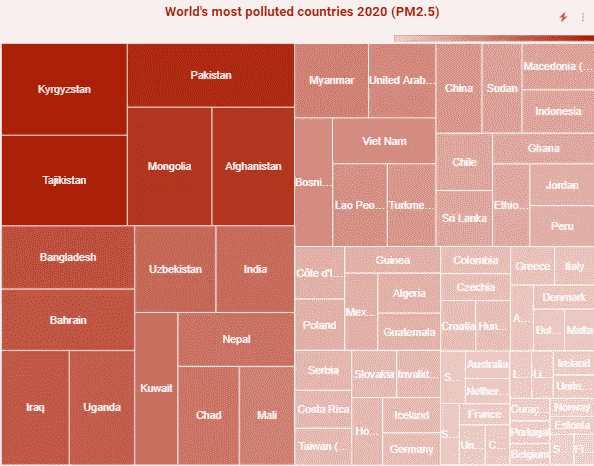
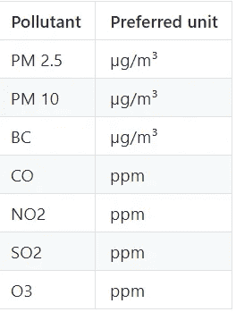
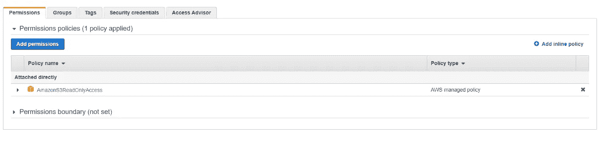
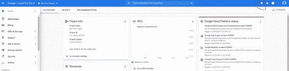
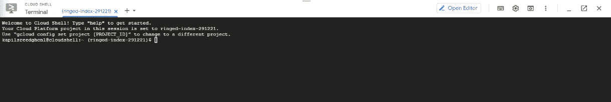
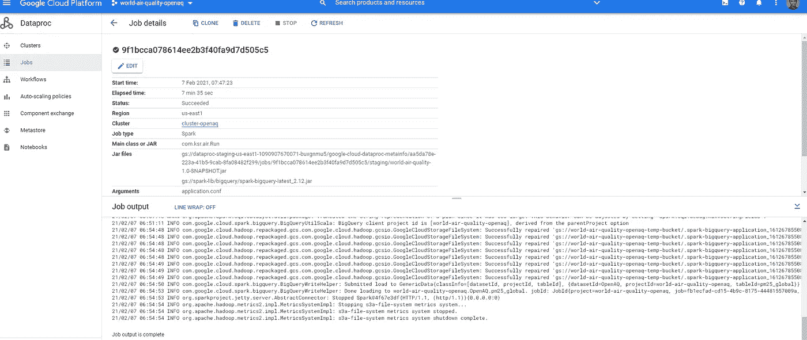
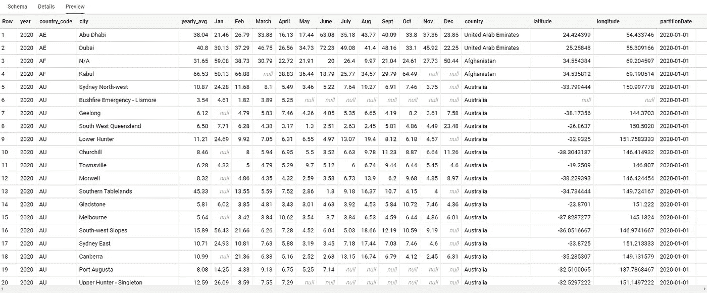
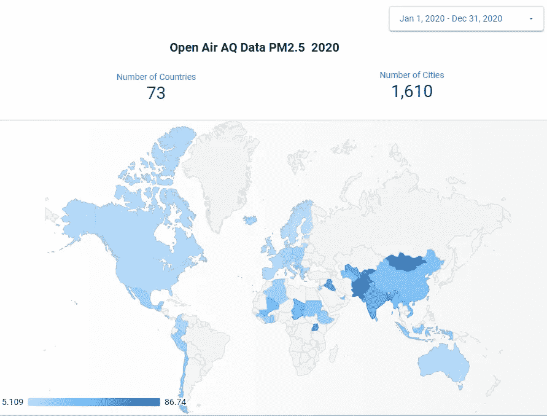
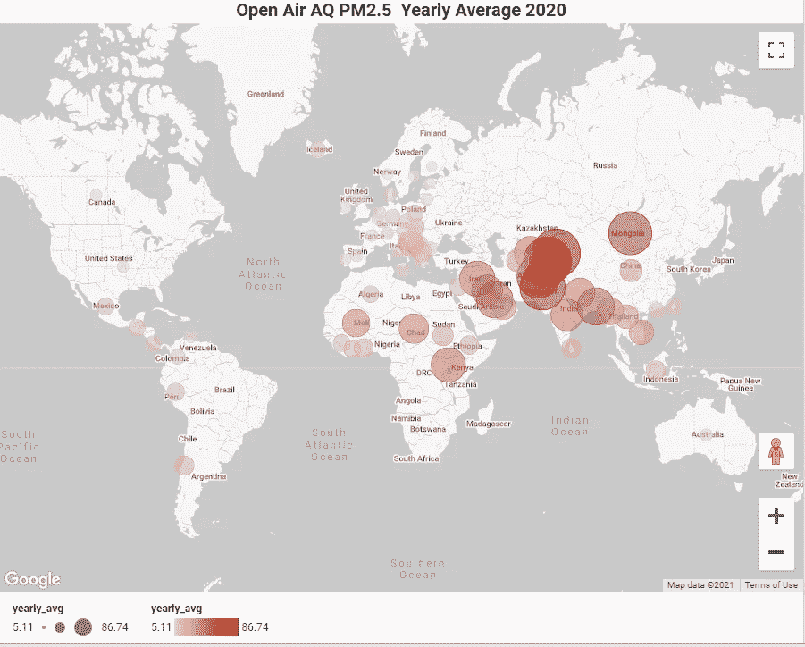

# 使用 Apache Spark & BigQuery 分析全球空气污染

> 原文：<https://medium.com/analytics-vidhya/how-to-analyze-global-air-quality-using-apache-spark-bigquery-7743fd54e634?source=collection_archive---------10----------------------->

## 如何在云上分析全球空气污染数据

据世卫组织报道，每年有 700 万人死于接触污染空气中的细颗粒物，导致中风、心脏病、肺癌、慢性阻塞性肺病和包括肺炎在内的呼吸道感染。

世界上 91%的人口生活在空气质量超过世卫组织标准的地方。



2020 年世界污染最严重国家(pm2.5)树形图

这里我们分析来自 [openaq](https://openaq.org/#/) 的全球空气质量数据:

*   **使用 **Apache Spark** 从 openaq [s3](https://openaq-fetches.s3.amazonaws.com/index.html) 桶中提取**并汇总全球历史空气污染数据
*   **找出**世界上污染最严重的城市和国家(以 [PM2.5](https://www.epa.gov/pm-pollution/particulate-matter-pm-basics) 水平衡量)
*   **计算**空气质量指标的月、年平均值
*   **可视化**使用谷歌数据工作室，创建树形图和地理图
*   将所有 openaq 数据加载到 **Bigquery** 中，并查找细节

**数据集**

这里我们使用的数据集来自**[**OpenAQ**](https://openaq.org/#/about)，在 AWS [s3](https://openaq-fetches.s3.amazonaws.com/index.html) 上公开。**

**OpenAQ 是一个非营利组织，通过协调、共享和使用 OpenAQ 数据，使全球社区能够净化空气。**

**[](https://registry.opendata.aws/openaq/) [## OpenAQ

### 空气质量城市环境地理空间可持续性全球，从公共…

注册表. opendata.aws](https://registry.opendata.aws/openaq/) 

OpenAQ 平台测量以下污染物:



来源:[https://github.com/openaq/openaq-data-format](https://github.com/openaq/openaq-data-format)

在这个项目中，我们将分析 **PM2** 。 **5** (直径小于 2.5 微米的颗粒)污染物，因为它是最危险的 [*****](https://www.ncbi.nlm.nih.gov/pmc/articles/PMC4740125/#:~:text=raising%20worldwide%20concerns.-,PM2.,investigate%20the%20impact%20of%20PM2.) 。

**人生苦短 RTFM:源代码**

[https://github.com/ksree/world-air-quality](https://github.com/ksree/world-air-quality)** 

# ****基础设施设置****

**我们将需要 AWS 凭证来读取公共 S3 桶，以及一个 GCP 帐户来分析谷歌云上的数据集。**

1.  ****创建 AWS IAM 用户凭证以读取亚马逊 S3 的 NOAA 数据****

**如果您没有 AWS 帐户，请注册 [AWS 免费层](https://aws.amazon.com/free/)，然后按照说明[创建 IAM 用户](https://docs.aws.amazon.com/IAM/latest/UserGuide/id_users_create.html)**

**授予您的用户 [AmazonS3ReadOnlyAccess](https://console.aws.amazon.com/iam/home?region=us-east-2#/policies/arn%3Aaws%3Aiam%3A%3Aaws%3Apolicy%2FAmazonS3ReadOnlyAccess)**

********

**为您的用户创建访问密钥。(记下您的**访问密钥 ID** 和**秘密访问密钥。**我们将向我们的 spark 工作提供这些凭据。)**

****

****2。如果您没有 GCP 帐户，请创建一个帐户****

**[GCP 免费等级——免费延长试用和永远免费|谷歌云](https://cloud.google.com/free)**

**一旦你注册并登录到 GCP 控制台。通过点击下面截图中突出显示的图标来激活云壳。Cloud Shell 提供了对虚拟机实例的命令行访问，这是我们将要设置用例的地方。(或者，您也可以在笔记本电脑终端上完成此操作)**

********

**GCP 控制台**

********

**谷歌云外壳**

**现在我们已经有了 AWS 和 GCP 证书，让我们开始吧。**

****3。建立你的 GCP 数据湖****

**要设置我们的 GCP 环境，我们需要:**

*   **创建项目**
*   **启用计费(仍在免费层)**
*   **启用 Dataproc 和 BigQuery 服务**
*   **创建一个谷歌云存储桶**
*   **创建大查询数据集**
*   **创建一个 Dataproc 集群**

**要建立您的 GCP 数据湖，请在您的 google cloud shell 上执行以下命令**

**GCP 服务设置命令**

# ****读取聚合并将 OpenAQ 数据加载到 BigQuery****

1.  ****构建并打包 spark 应用程序****

**在您的云 shell 中执行以下脚本**

**验证生成的应用程序配置文件，该文件应包含您的 AWS 密钥和密码:**

```
cat $HOME/application.conf
```

**检查您的 AWS 密钥和密码。开始日期和结束日期是我们将从 openAQ 中提取的数据集的范围。**

****

****2。提交 Dataproc 作业，将数据聚集并加载到 BigQuery****

**要在 Dataproc 上提交 spark 作业，请执行下面的命令**

**完成 4 年的历史 openaq 空气质量数据的加载和聚合需要 7 分钟。**

****

**现在我们已经将数据加载到 BigQuery 中，让我们看一看。**

# ****OpenAQ** **数据集洞察****

**转到 BigQuery 控制台，查看新创建的表**

**数据集的预览应该如下所示:**

****

**OpenAQ pm2.5 数据集**

**【2020 年全球污染最严重城市(pm2.5)**

```
SELECT city, country, yearly_avg, Jan, Feb, March, April, May, June, July, Aug, Sept, Oct, Nov, Dec
FROM   `world-air-quality-openaq.openaq.pm25_global`
WHERE  year = 2020
ORDER  BY yearly_avg DESC
```

**2020 年 100 大污染城市(PM2.5)**

****污染最严重的国家****

**2020 年和 2019 年的年平均值**

```
SELECT 
      country,
      TRUNC(AVG(IF(year = 2019, yearly_avg, NULL)), 2) AS `AVG_2019`,
      TRUNC(AVG(IF(year = 2020, yearly_avg, NULL)), 2) AS `AVG_2020`
FROM `kapilsreed12-1dataflow.OpenAirAQ.pm25_global`
GROUP BY country
HAVING AVG_2020 IS NOT NULL  AND  AVG_2019  IS NOT NULL  
ORDER BY AVG_2020 DESC
```

****数据工作室可视化:****

****

**2020 年 PM2.5 年平均值地理图**

****

**2020 年 pm2.5 年平均值的谷歌地图视图**

****

**2020 年世界污染最严重国家的树状图**

# **概述**

**我们是这样做的:**

1.  **使用 **Apache Spark** ，我们连接到 AWS S3 托管的 OpenAQ 数据集，应用聚合，并用地理信息增强数据集。最后，我们**将这个数据集加载到 BigQuery** 中**
2.  ****使用 **BigQuery** 获得关于全球 PM2.5 污染物的洞察****
3.  ****用**数据工作室**可视化**几个数据点**

**这个博客的目标是展示如何使用云和开源工具来探索这个大型数据集并从中获得洞察力。**

**创造和分享你自己的见解。**