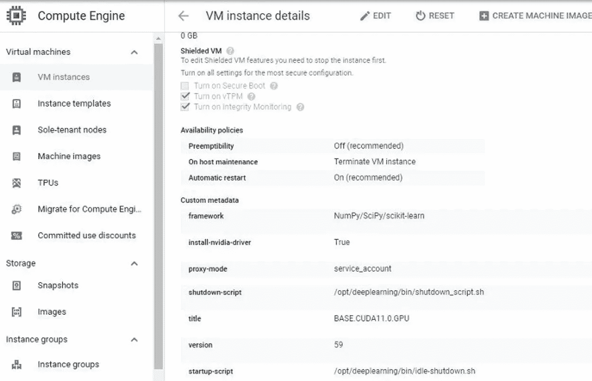

# 如何自动关闭 GCP 上的一个空闲虚拟机实例来削减高额账单

> 原文：<https://medium.com/analytics-vidhya/how-to-auto-shutdown-an-idle-vm-instance-on-gcp-to-cut-fat-bills-b08ae20437af?source=collection_archive---------5----------------------->

自动关闭 GCP 上的空闲虚拟机实例以控制您的 GCP 账单的配置


(图片来自[https://unsplash.com/](https://unsplash.com/))

现收现付云计算(PAYG 云计算)是一种流行的按使用量收费的云计算支付方式。你只需在使用服务时付费。这听起来非常好，除了一个问题，您可能会忘记关闭实例，这最终会花费大量不使用的时间。这篇文章介绍了如何在 GCP 上配置空闲 VM 实例的自动关闭。

**步骤 1:将空闲关闭 shell 脚本上传到 VM 实例。**

Justin Shenk 提供了 idle-shutdown shell 脚本作为 Github gist([https://gist . Github . com/Justin Shenk/312 b5 E0 ab 7 ACC 3 b 116 f 7 BF 3 b 6d 888 fa 4](https://gist.github.com/justinshenk/312b5e0ab7acc3b116f7bf3b6d888fa4))。该脚本监控虚拟机实例的 CPU 使用情况。我们需要将它上传到虚拟机实例。

如果您通过 GCP AI 笔记本访问 VM 实例，您可以使用以下代码通过 Jupyterlab 下的终端加载文件:

```
cd /opt/deeplearning/binsudo wget [https://gist.githubusercontent.com/justinshenk/312b5e0ab7acc3b116f7bf3b6d888fa4/raw/59f021c2bf0388ba36e5a589dba52e233ee84964/idle-shutdown.sh](https://gist.githubusercontent.com/justinshenk/312b5e0ab7acc3b116f7bf3b6d888fa4/raw/59f021c2bf0388ba36e5a589dba52e233ee84964/idle-shutdown.sh) 
```

确保使用 sudo 命令。否则，由于权限问题，文件不会保存在文件夹中。

**第二步:配置实例的元数据**

接下来，我们需要通过虚拟机实例编辑模式添加一个元数据“启动脚本”。滚动到“自定义元数据”部分，单击“添加项目”，在左侧框中输入“启动脚本”，在右侧框中输入“/opt/deep learning/bin/idle-shut down . sh”(我们在步骤 1 中保存的脚本的路径)。保存并退出实例编辑模式。



(虚拟机实例编辑元数据)

**第三步:配置启动脚本**

启动脚本中的默认设置是，当实例 cpu 使用率连续一小时不超过 10%时，关闭 VM 实例。您可以自定义 cpu 使用率阈值(10%)和/或空闲时间窗口(一小时)。

**步骤 4:安装软件包“bc”**

需要程序包' bc '来检查实例 cpu 使用情况。您可以在 Linux VM 实例上安装软件包，如下所示:

```
sudo apt-get install bc
```

如果它在某些 Linux 版本上失败了，您可能需要更新您的 apt，如下所示:

```
sudo apt-get --update
sudo apt-get --upgrade
sudo apt-get install --reinstall apt
```

重启您的实例，您应该能够享受自动关机功能，以削减庞大的云账单。