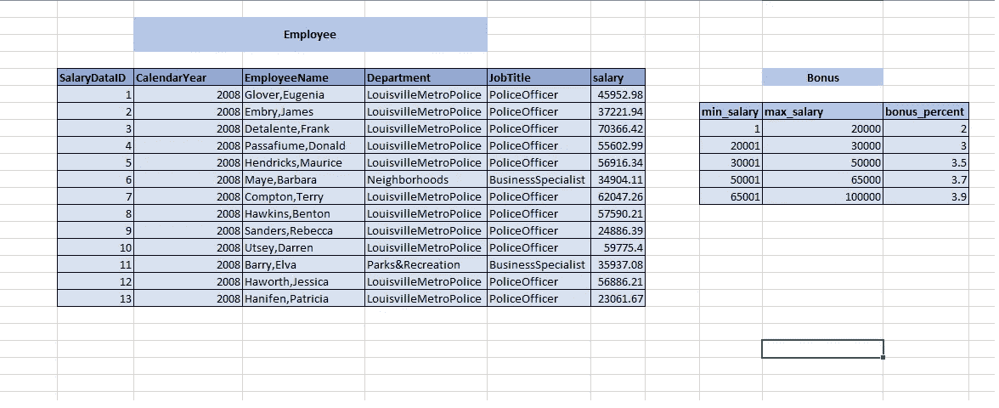

# 如何避免 Spark 中的广播式加入

> 原文：<https://medium.com/analytics-vidhya/how-to-avoid-broadcastnestedjoin-in-spark-372d20b8e82d?source=collection_archive---------5----------------------->

连接是 Spark 作业中至关重要的操作之一。Spark 支持以下类型的连接

1.  内部连接
2.  左侧外部
3.  右侧外部
4.  全外
5.  左反
6.  左半部

> 在本文中，我们将探讨广播嵌套连接性能问题以及如何避免它。

每一个都有其使用案例。基于 Spark 成本的优化器根据各种参数选择最佳连接策略，例如:

*   连接类型
*   连接条件(equi，between 等。)
*   数据的大小
*   暗示
*   Spark 配置，如 spark . SQL . autobroadcastjointhreshold
*   还有更多…

基于上述参数，Spark 选择下面列出的一种连接策略:

*   广播散列连接
*   无序散列连接
*   无序排序-合并连接
*   广播嵌套循环连接

> 更多信息，请参考下面的链接。

 [## 阿帕奇/火花

### Apache Spark——用于大规模数据处理的统一分析引擎

github.com](https://github.com/apache/spark/blob/master/sql/core/src/main/scala/org/apache/spark/sql/execution/SparkStrategies.scala) 

对于大多数场景，spark 选择了正确的连接策略，但是也有一些场景，选择的策略并不是最好的。我们将在本文中讨论其中的一个问题以及修复它的方法。

出于演示目的，我将使用下面的数据集。

员工和奖金表

**用途**:计算员工奖金。

**如何:**根据**min _ salary≤salary≤max _ salary**加入员工和奖金表

**预期结果**:在最佳时间计算奖金。

为了获得更好的性能，因为奖金表很小，所以它应该适合广播散列连接。

首先，我们将数据加载到数据帧中，然后使用 between 函数将它们连接起来。下面是它的代码片段。

加载员工和奖金表数据

下面是 Spark 准备的物理计划，其中使用了“BroadcastNestedLoopJoin”连接策略。这很慢。我们将通过下面的例子来理解这一点

**Ex** :在实时场景中，假设一个分区有 100K 行，广播表有 20K 条记录。

> 球部分估计:Spark 中优化分区的大小是 100 MB(近似值)。对于 12 列和 100K 条记录，文件大小为 104 MB)

所以通过上面的计算，对于每个分区，BroadcastNextedLoopJoin 将迭代 2000000000 次。这可能会导致性能问题。这里我们已经考虑到所有分区是均匀分布的(可能在这一步之前，我们必须执行其他的 join 或 group by 或 window 操作)。并不总是如此。

如果我们使用类似如下的连接条件，将使用相同的连接策略:

如果我们像下面这样在连接中添加一个相等的条件，Spark 将使用广播散列连接。

但是我们如何得到这个新列，我们可以在连接条件中使用它，它不影响连接结果。

让我们尝试在两个数据框架中添加默认列，并在连接条件中使用它。

从物理计划可以看出，Spark 在查询计划中忽略了这个新列，这可能是由于一些内部优化。

让我们尝试在现有列的帮助下构建一个常量列。

我们已经使用了 salary 列并将其乘以 0，并在 join 中使用了结果列。现在 Spark 在用 BroadcastHashJoin。

如果我们在数据中没有一个数字列。我们可以创建一个带有一条记录的虚拟数据帧，并与两个数据帧交叉连接。

在上面的代码中，Spark 在连接中考虑了 temp_clm。它将 BroadcastNestedLoopJoin 转换为 BroadcastHashJoin。由于交叉连接是对一条记录执行的，其影响可以忽略不计。

我们可以根据自己的方便程度使用任何方法，并强制 spark 使用 BroadcastHash join，这比 BroadcastNestedLoopJoin 要快。

请分享你对此的想法，快乐学习。

> “一旦你停止学习，你就开始死亡”
> —阿尔伯特·爱因斯坦