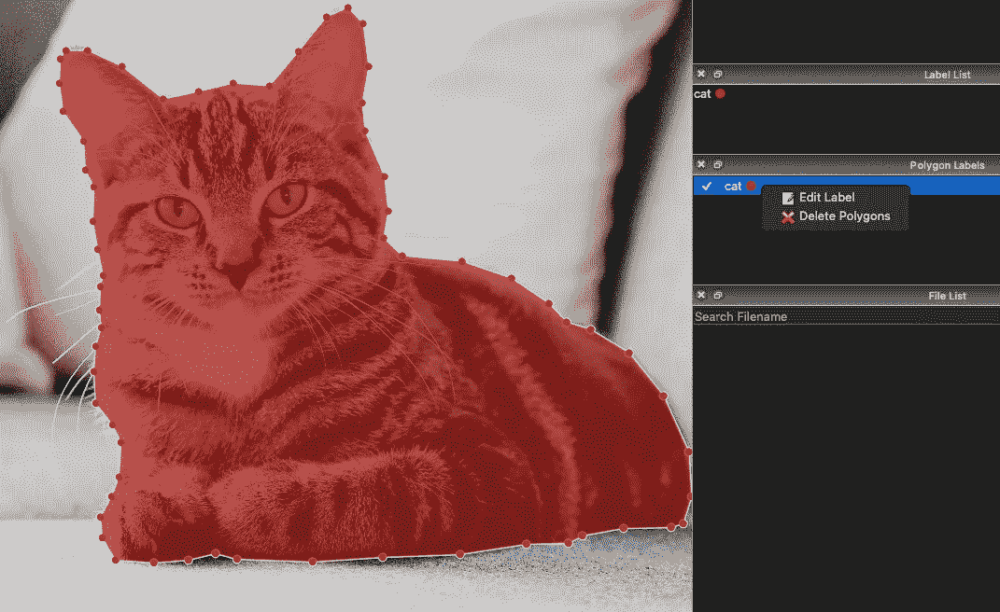
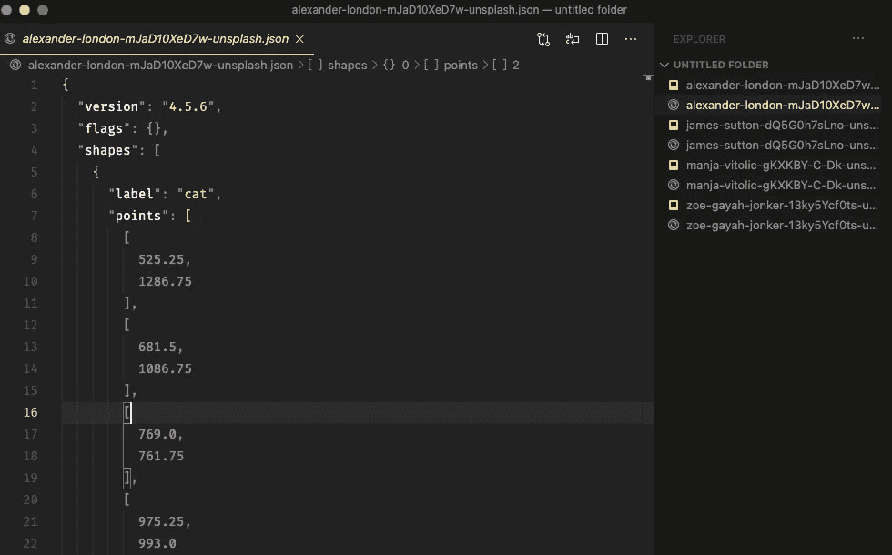
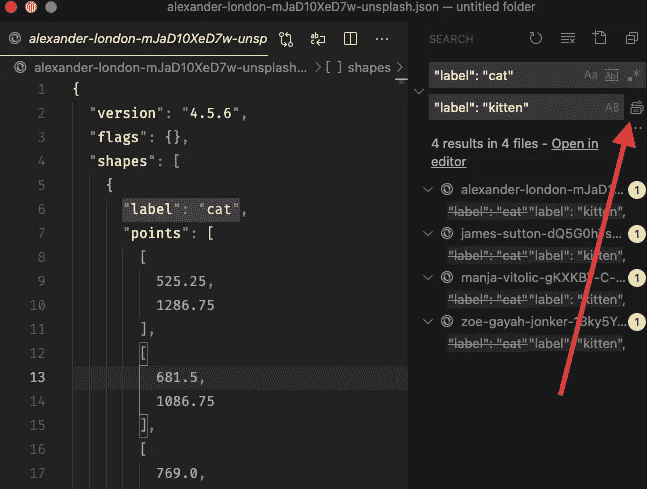

# 如何批量重命名实例分段数据的注释

> 原文：<https://medium.com/analytics-vidhya/how-to-batch-rename-annotations-for-your-instance-segmentation-data-43918cffef01?source=collection_archive---------9----------------------->

## 利用 Visual Studio 代码

照片由[西格蒙德](https://unsplash.com/@sigmund?utm_source=medium&utm_medium=referral)在 [Unsplash](https://unsplash.com?utm_source=medium&utm_medium=referral) 拍摄

有些情况下，您必须从已经注释的图像数据中更改注释标签。假设我们用“猫”标注了图片，然后我们想把那个标注改成“小猫”。

# 单一图像

以下是如何在 Labelme 中更改单个图像注释。右键单击多边形标注列表，然后选择“编辑标注”，继续为标注输入新名称。

由[埃里克-扬·勒辛克](https://unsplash.com/@ejleusink)在 [Unsplash](https://unsplash.com) 拍摄的猫咪照片

对于 10 幅图像来说，这仍然是可行的，但是如果您已经有了 10.000 幅带注释的图像数据呢？一个一个地更改注释标签会令人沮丧。

# Visual Studio 代码

因为 Labelme 不提供批量重命名功能，所以我们将使用另一个软件，即 Visual Studio 代码。

> 那么我们为什么要使用 Visual Studio 代码呢？

注释输出是 JSON (JavaScript 对象符号)格式的。它基本上是一个文本文件。Visual studio 代码是程序员常用的代码编辑器。您可以用它来编写 Python、Javascript、PHP 以及包括 JSON 文件在内的更多内容的代码。

如果您还没有:

 [## Visual Studio 代码-代码编辑。重新定义的

### Visual Studio Code 是一个重新定义和优化的代码编辑器，用于构建和调试现代 web 和云…

code.visualstudio.com](https://code.visualstudio.com/) 

# 如何在 VS 代码中批量重命名

打开 VS 代码，并打开包含已经注释的图像数据的文件夹。确保所有图像都在同一个文件夹中。下面是注释输出的 JSON 的样子。

VS 代码 UI 显示 JSON 文件

我们可以看到文字*“标签”:“猫”*。我们要做的基本上就是找到并替换文件夹中所有文件的文本。

按下键盘上的*⌘command+*⇧*shift+h*。它将打开侧边栏上的搜索和替换框。请注意，默认情况下，VS 代码侧边栏在左边。在下面这张图片中，我将我的自定义到了右边。

跨文件替换文本

在搜索框中键入要替换的文本。在这种情况下，我们可以键入*“标签”:“猫”。*然后在替换框上键入新标签，即*“标签”:“小猫”。最后点击全部替换按钮，这是替换框右边的小按钮。按⌘ *命令+* ⌥ *选项+s* 保存我们所做的所有更改。就是这样。*

在 Labelme 中重新打开图像数据，我们会看到所有的注释都被重命名了。