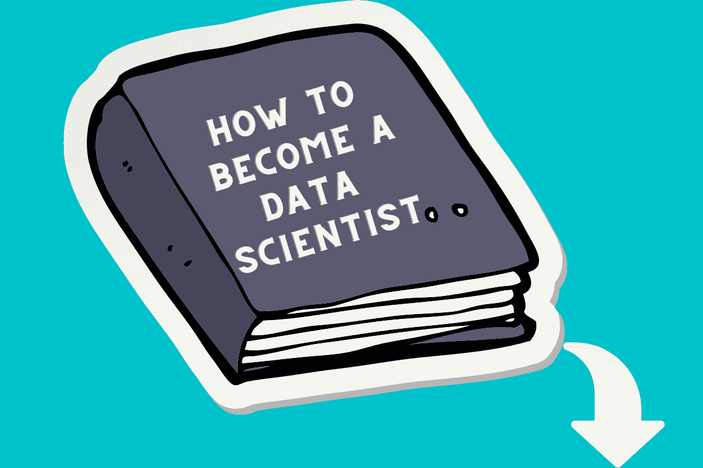
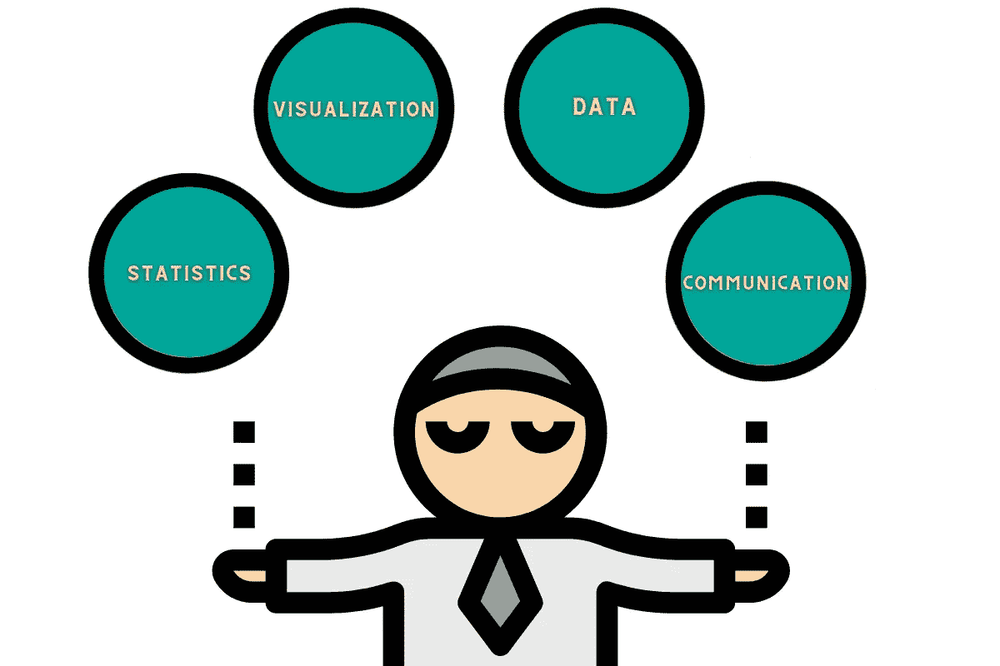
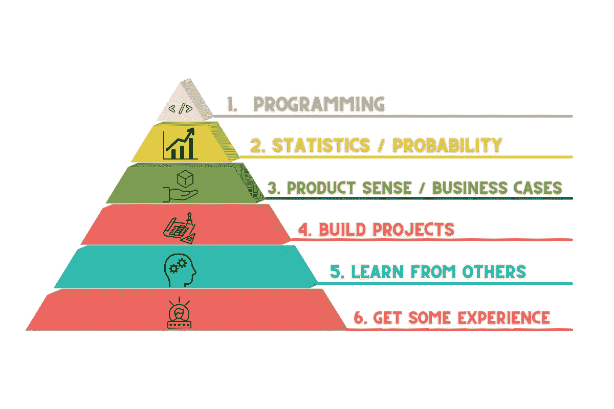
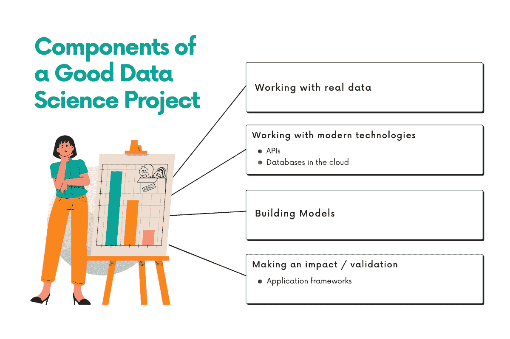
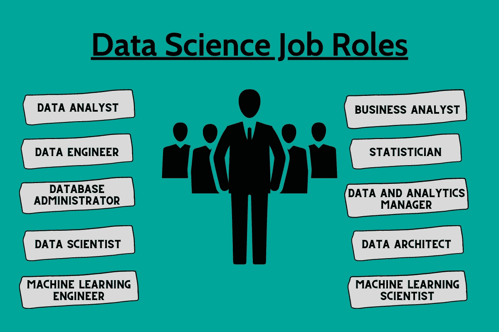
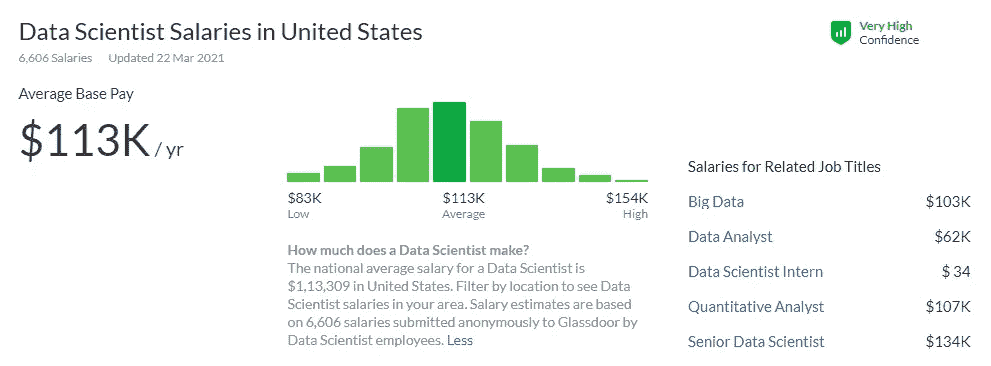
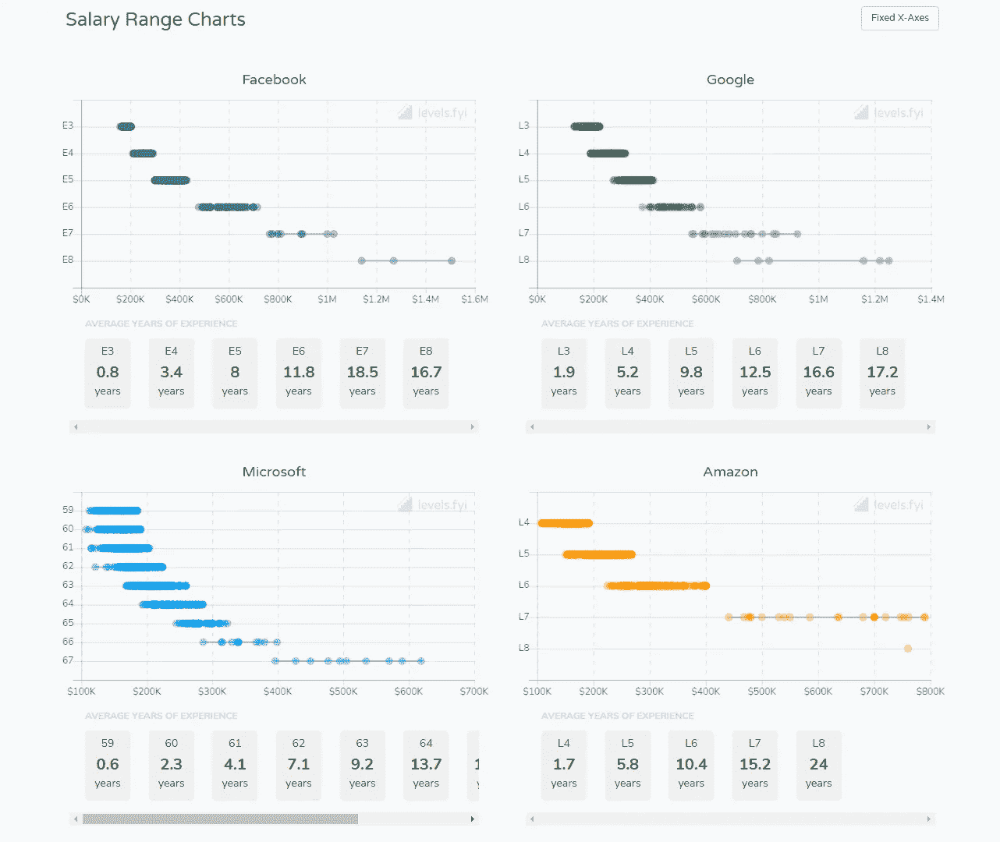

# 如何从零开始成为一名数据科学家

> 原文：<https://medium.com/analytics-vidhya/how-to-become-a-data-scientist-from-scratch-d4211592469b?source=collection_archive---------3----------------------->

*想知道如何从零开始成为一名数据科学家？这份全面的指南将带你经历成为一名成功的数据科学家的每一个必要步骤。*

作者创造的形象

# 如何成为数据科学家的完整职业指南

数据科学已经成为学生最热门的职业选择。这已经成为 T2 发展最快的职业道路之一。在这个高科技世界中，每个企业和组织都需要数据科学家来最大限度地利用他们的数据。这为那些希望受雇于数据科学家角色的人提供了持续的机会。这篇博客文章将带你了解成为一名成功的数据科学家的所有必要步骤。

# 什么是数据科学家？

作者创造的形象

数据科学家是对公司最有价值的数据专家。他们拥有解决复杂棘手的数据相关问题的[技能](https://www.stratascratch.com/blog/most-in-demand-data-science-technical-skills/?utm_source=medium&utm_medium=click&utm_campaign=blog)。他们是大数据鼓吹者，使用科学方法收集和分析大量结构化和非结构化数据。

数据科学家是分析专家，他们可以利用自己的技术技能和软技能来发现趋势和管理数据。为了找到应对多项业务挑战的解决方案，数据科学家需要具备以下技能:

*   行业知识
*   理解杂乱和非结构化的数据
*   好奇心
*   商业头脑
*   协力

# 数据科学家的角色和职责是什么？

数据科学家的角色结合了计算机科学、数学和统计学。数据科学家进行数据收集、分析、处理和建模，然后在解释之后，他们创建可操作的计划来利用这些数据。他们还使用数据可视化技术来呈现信息。招聘人员会发现你是一名数据科学家，可以分析他们的大量原始信息，找到有助于改善他们的业务或组织的模式。雇主总是希望你构建数据产品来提取有价值的商业见解。

作为数据科学家，您必须与业务利益相关方密切合作。你必须了解他们的目标，并确定如何实现这些目标。因此，作为一名数据科学家，你还需要良好的沟通、批判性思维和解决问题的技能。

## 数据科学家的职责

作者创造的形象

1.  使用数据可视化技术呈现信息
2.  **数据
    a** 识别数据分析问题和有价值的数据源
    **b** 自动化收集流程
    **c** 定义正确的数据集和变量
    **d** 处理结构化和非结构化数据
    **e** 清理和验证数据
    **f** 分析大量信息以识别模式和趋势
3.  **统计学
    a** 建立预测模型和机器学习算法
4.  **沟通
    a** 使用可视化和其他方式与利益相关者沟通
    b 合作并提出解决方案和策略以应对多项业务挑战

# 如何成为一名数据科学家

你可能会想，你需要一个工程学本科毕业生，或者有统计学和数学背景的人。毫无疑问，这将是有益的，但你知道这是没有必要的吗？基本上，有三种方法可以成为数据科学家:

*   获得数据科学或类似定量领域的学士或硕士学位
*   参加一个训练营项目
*   自己学吧

# 没有学位能成为数据科学家吗？

这是一个很常见的问题:没有学位，你能否成为一名数据科学家。答案是——肯定是的！即使你没有相关领域的学位，你也可以自学成为一名数据科学家。许多成功的数据科学家既没有学士学位也没有硕士学位。数据科学家的教育背景差异比几乎任何其他技术职业都大。人们还注意到，大量来自机器学习、软件工程、数据分析等其他行业的人转向了数据科学。

事实是，你的课程或你是否有学位并不影响你成为数据科学家的机会。真正重要的是你的技能。

所以，正如许多知名的数据科学家没有技术学位，他们仍然是成功的数据科学家，即使你有另一个领域的学位，你也可以成为成功的数据科学家。

# 数据科学家技术资格

在这里，我们试图概述成为一名数据科学家应该具备的技术资格。作为一名数据科学家，您应该掌握以下最受欢迎的数据科学技能:

*   Python 或 R 编程
*   用 SQL 编写查询
*   构建和优化机器学习模型
*   数据争论
*   BI 工具，如 Tableau、powerBI 和 Qlik
*   了解关系数据库，如 PostgreSQL、MySQL、SQL Server、Teradata、BigQuery、Oracle 或雪花
*   托管仪表板的能力

如果你在 Python 和 R 之间感到困惑，想知道哪种语言更好，可以看看这篇文章: [Python vs R for Data Science](https://www.stratascratch.com/blog/python-vs-r-for-data-science-which-language-is-better/?utm_source=medium&utm_medium=click&utm_campaign=blog)

# 数据科学家非技术资格

[软技能](https://www.stratascratch.com/blog/5-soft-skills-that-will-make-you-a-great-analyst/?utm_source=medium&utm_medium=click&utm_campaign=blog)或非技术技能与你的技术技能同等重要。这些软技能总能带来更高的效率和生产力。这些软技能包括:

*   批判性思维
*   有效沟通
*   演示技巧
*   适应性
*   多功能协作
*   通力合作者

软技能为您提供了培养和提高数据科学表现的机会。招聘人员总是在数据科学家候选人中寻找这些软技能。

技术和软技能的结合可以帮助数据科学家为他们的公司创造商业价值，并为他们提供促进其数据科学职业发展的机会。

# 成为数据科学家的步骤

您的数据科学之旅并不轻松，但如果您遵循以下几个步骤，您的努力、辛勤工作和投入的时间将会得到回报，这些步骤将有助于您成为一名数据科学家。

以下是成为数据科学家的简单步骤:

作者创造的形象

## 1.编程；编排

使用最广泛的编程语言是 Python 和 SQL。对于许多候选人来说，编程是成为数据科学家最耗时也是最难的一步。学习 Python 和 SQL 的语法并不难，难的是你如何处理你的解决方案以及如何实现它们。

在编程领域，要成为一名数据科学家，你必须学会两种编程技能:

*   数据分析
*   机器学习

**数据分析**

数据分析就是提取和操作数据，然后能够产生见解和建议。在这里，您需要掌握 SQL 知识，因为这种语言是特定于领域的语言，您将使用它从数据库中提取数据。您还需要了解另一种脚本语言，通常是 Python 或 r。

您可以在学习编码基础知识的同时开始构建项目。它将帮助你展示你的数据科学技能。为了在这方面做得更好，我们还有另一条建议——试着练习面试问题。在数据科学面试中，没有比这更好的成功方式了。只要练习大量的面试问题，并更好地进行数据分析。通过练习[编写面试问题](https://www.stratascratch.com/blog/data-science-coding-interview-questions-with-5-technical-concepts/?utm_source=medium&utm_medium=click&utm_campaign=blog)，你将解决与数据科学行业相关的实际问题。由于你已经掌握了必要的技术技能，你将能够很容易地回答大多数问题。

现在有很多平台可以练习数据科学面试问题。 [LeetCode](https://leetcode.com/) 是最受欢迎的一款，但它是为软件工程师量身定制的。那么，你认为 LeetCode 是为数据科学面试准备而打造的吗？在这里了解:[数据科学 leet code](https://www.stratascratch.com/blog/how-to-use-leetcode-for-data-science-sql-interviews/?utm_source=medium&utm_medium=click&utm_campaign=blog)。

还有我们推荐的 [StrataScratch](https://www.stratascratch.com/?utm_source=medium&utm_medium=click&utm_campaign=blog) 。因为这个平台是专门为数据科学家设计的，并提供了数百个真实的数据科学面试问题来练习。
同样重要的是要知道，无论你多么努力地学习数据分析，你永远也不会成为专家。这不是小菜一碟。但这并不意味着你应该停止努力继续成长。你必须在新的领域不断提高自己的技能。因此，为了掌握数据科学技能，您需要尽可能多地练习。

面试官通常会在一个问题中尝试几个概念。这些是他们会测试你的概念。知道这些概念是什么以及如何处理它们是很重要的。这里有一个解释这些概念的视频:

作者通过 [YouTube](https://www.youtube.com/channel/UCW8Ews7tdKKkBT6GdtQaXvQ/) 的视频

对于数据分析，我们建议做尽可能多的相关面试问题，同时掌握 SQL 和 Python 或 r。

下面是真题数据分析编码题练习:[https://platform.stratascratch.com/coding](https://platform.stratascratch.com/coding?utm_source=medium&utm_medium=click&utm_campaign=blog)

**机器学习**

这是成为数据科学家需要学习的另一项编程技能。机器学习是数据科学的一个主要部分，数据科学家需要展示他们对机器学习算法的知识。机器学习就是实现机器学习模型。您需要了解数据科学工作流来构建和实施这些模型。而要理解这个工作流程，就得学习 Python 或者 r，这是我们推荐做项目的地方。

有这么多平台可以找到项目。Kaggle 是最受欢迎的平台之一。你可以这样利用 Kaggle:

*   在那里找一个项目
*   获取数据集
*   安装 jupyter 笔记本
*   开始做项目

此外，保持与人交谈，以了解更多信息，并确定您可以改进的领域。

另一个受欢迎的资源是 confetti.ai，这个平台可以通过为你提供一堆机器学习类型的问题来帮助你更好地实现机器学习模型。它们提供了大量的编码和理论问题来帮助你理解模型。

学习如何实现机器学习模型可能是你应该花费大部分学习时间的地方。这将帮助您更好地理解数据科学工作流，包括提取数据、操作数据、要素工程、模型优化、模型实施和建议。这种数据科学工作流程是您需要擅长的，因为您每天都要在工作中完成这些任务。

## 2.统计/概率

统计学和概率是成为数据科学家必须学习的第二个技术课题。我们刚刚讨论了机器学习模型。有哪些机器学习模型？它们只是统计模型。作为一名数据科学家，你必须了解它们是如何工作的。

你可以通过项目做到这一点。当你要做项目和建立模型时——ML 甚至回归模型——你必须阅读这些模型的基础理论和数学知识。它将使您更好地理解模型的基本假设，这将帮助您更好地清理数据和设计要素，从而帮助您开发更准确的模型。

**学习机器学习和回归理论的资源**

学习机器学习和回归理论的最佳资源是通过谷歌搜索，它可能会带你到 Medium 或维基百科或其他一些权威网站。在那里你会找到一堆文章，并对基本理论有更好的理解。

**如何练习传统统计学&概率**

练习传统统计和概率的最佳资源是 Brilliant.org 的。他们为练习提供的问题类似于您在数据科学面试中得到的问题。

你也可以在 StrataScratch 上探索这样的问题来练习:[https://platform.stratascratch.com/technical](https://platform.stratascratch.com/technical?utm_source=medium&utm_medium=click&utm_campaign=blog)

## 3.产品意识/商业案例

成为数据科学家的第三步是学习产品意识。这是一个非技术性的概念，要成为一名数据科学家，你需要学习这个概念。

**什么是产品感？**

这类似于产品管理(显然不太一样)，但这是当你看到问题并做出决定。虽然每个人都在学习如何建立模型，但同样重要的是，确保你学习产品意识，以提供影响和可操作的分析，使产品朝着正确的方向发展。

**你应该专注于培养产品意识以成为一名成功的数据科学家的理由:**

*   它有助于衡量产品不同部分的成功。
*   这有助于快速而系统地行动。
*   它有助于识别产品是否表现良好。
*   它有助于数据科学家设定分析目标，并防止未来的范围蔓延。
*   没有产品感的模型是没有用的。
*   它帮助你找出如何处理和分析一个问题，以提出解决问题的建议。

**如何在产品感上变得更好？**

既然我们知道产品意识对数据科学职业确实很重要，那么我们如何才能更好地掌握产品意识呢？我们建议阅读产品管理案例研究，了解项目经理是如何思考和做出决定的。有很多案例，有视频，有平台。YouTube 是拥有大量 PM 视频的资源之一。你可以查看像 Exponent 这样的频道，在那里你可以学到很多关于 PM 的知识。

另一个选择是在 Glassdoor 上阅读问题和其他人的回答。这可能不是最好的选择，因为你在那里看到的回答的质量，但你应该尝试这个免费的选项。

## 4.构建项目

学习完所需的技术技能后，构建项目是展示您的[数据科学技能](https://www.stratascratch.com/blog/essential-data-science-skills-to-be-a-data-scientist/?utm_source=medium&utm_medium=click&utm_campaign=blog)的最佳方式。正如我们上面讨论的那样，建立项目可以帮助你学习机器学习算法、统计和概率，它还可以帮助你了解真实的数据科学工作并提高你的技能。它帮助你创建一个作品集，向你潜在的雇主展示你的技能。在建立了一些较小的项目后，你应该会找到一个你感兴趣的领域并深入其中。随着你技能的提高，开始让问题变得更复杂。

要成为一名全栈数据科学家，你应该具备现实世界的技能——在分析/编码以及使用现代技术方面。

找到唯一能提升你的投资组合的数据分析项目创意:[能让你得到工作的数据分析项目创意](https://www.stratascratch.com/blog/data-analytics-project-ideas-that-will-get-you-the-job/?utm_source=medium&utm_medium=click&utm_campaign=blog)

作者通过 [YouTube](https://www.youtube.com/channel/UCW8Ews7tdKKkBT6GdtQaXvQ/) 发布的视频

**能给任何人留下深刻印象的好项目的组成部分**

作者创造的形象

1.  使用真实数据:它特指实时更新的数据。
2.  使用现代技术:在云中使用 API 和数据库
3.  构建模型:实现模型——无论是回归还是某种类型的机器学习模型。
4.  产生影响/验证:与他人分享您的代码并获得一些验证。

## 5.向他人学习

向他人学习是提高技能和学习人们解决数据相关问题的不同方法的好主意。因此，也开始与其他数据科学家合作吧。可以通过面对面或在线社区来完成。

这里有一些不错的在线社区，你可以考虑一下:

*   子编辑，如/r/datascience
*   Quora
*   卡格尔

参与在线社区可以帮助你找到机会，并通过向他人学习来增加你的知识。您还可以通过聚会与更有经验的数据科学家面对面交流。

## 6.找一份初级工作，积累一些经验

学习识别趋势的基础知识对于成功的数据科学家职业生涯至关重要。而这是可以通过真实的体验做到的。公司总是渴望填补入门级数据科学职位。许多数据科学家的职业生涯始于数据分析师。你可以搜索初级数据科学家或初级数据分析师等职位。但是作为一名数据科学家获得第一份工作可不是一件容易的事。这里的第四步，建设项目，工程。独立构建项目显示了你处理数据的热情和能力，并使你能够获得第一份工作。

# 您可以获得的数据科学工作角色类型

在寻找数据科学工作时，我们建议仔细阅读工作描述。数据科学的工作角色大相径庭。以下关于不同数据科学工作角色的详细信息将帮助您发展特定的数据技能，以匹配您希望从事的职业角色。以下是一些你可以从事的领先的数据科学职业:

作者创造的形象

*   数据分析师 :
    这个角色负责各种任务，包括可视化、操作和处理大量数据。
*   **数据工程师** :
    数据工程师在执行数据科学模型之前执行他们的任务，例如构建和测试可扩展的大数据生态系统。
*   **数据库管理员** :
    数据库管理员负责数据库的备份和恢复。
*   数据科学家的主要任务是为公司寻找、清理和组织数据。利用数据分析和数据处理技能，他们必须了解业务挑战并提供最佳建议。
*   **机器学习工程师** :
    凭借统计学和编程技能，他们创造数据漏斗，交付软件解决方案。
*   **机器学习科学家** :
    机器学习科学家研究自适应系统的新数据方法和算法。
*   **数据架构师** :
    数据架构师创建数据管理的设计计划，以便数据库能够得到最好的安全措施的保护。
*   **统计学家** :
    统计学家的工作是组织数据，以确定趋势和关系，并提供有价值的见解。
*   **数据和分析经理** :
    该角色包括数据科学运营以及根据技能和专业知识向团队分配职责。
*   **业务分析师** :
    业务分析师找到一种方法，将大数据与可操作的业务洞察联系起来，从而实现业务增长的目标。

# 成为一名数据科学家需要多久？

你可以在短短 3 个月内学会从事数据科学职业所需的技能。大多数网上训练营通常会在一年内完成。所以你不需要花大学四年的时间去成为一名数据科学家。学习数据科学技能并获得数据科学家的第一份工作有多种途径。

然而，普遍的共识是，数据科学是一个不断发展的领域，所以你必须在职业生涯中花费数年时间成为一名优秀的数据科学家。这完全取决于你每天投入多少时间，你对你的学习之旅投入多少。

# 数据科学家工资

*做数据科学家能挣多少钱？*

你可能很想知道这个！

据 [Glassdoor](https://www.glassdoor.co.in/Salaries/us-data-scientist-salary-SRCH_IL.0,2_IN1_KO3,17.htm?clickSource=searchBtn) 报道，数据科学家职位目前的平均年薪为 11.3 万美元。数据科学高薪背后的因素是对数据专业人员的高需求。但是，这个数字可能会因地点、数据科学家的教育水平、经验和企业规模的不同而有所不同。

图片来自[玻璃门](https://www.glassdoor.co.in/Salaries/us-data-scientist-salary-SRCH_IL.0,2_IN1_KO3,17.htm?clickSource=searchBtn)

经验是决定你作为数据科学家薪水的最重要因素之一。根据 [levels.fyi](https://www.levels.fyi/charts.html) 的数据，以下是数据科学专业人士在大公司每一年的工作经验能挣多少钱:

图片来自[关卡.参考消息](https://www.levels.fyi/charts.html)

# 结论

总而言之，我们可以说数据科学家通常应该了解 3-4 个不同的主题。这很难，需要一段时间才能做好。要成为一名数据科学家，你需要很好地理解编程和统计、机器学习和回归、如何实现以及背后的理论。你有三种方式来学习这些技能——获得数据科学学士或硕士学位，参加训练营项目，或者自学。

*最初发表于*[*https://www.stratascratch.com*](https://www.stratascratch.com/?utm_source=medium&utm_medium=click&utm_campaign=blog)*。*