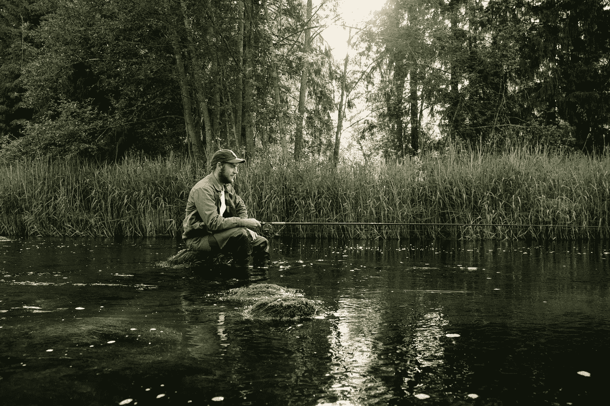

# 如何成为一名自由数据科学家

> 原文：<https://medium.com/analytics-vidhya/how-to-become-a-freelance-data-scientist-d11ba38cfb9a?source=collection_archive---------8----------------------->

# 顶级自由职业者的实用技巧

如果你是一个书呆子式的数据科学家，想开始作为一个独立(远程)的自由数据科学家工作，这篇文章是为你准备的。从现在朝九晚五的工作到远程自由职业的转变是一种解放的体验。最终的回报是巨大的，包括:

*   更快的学习速度，因为你不断地接受新的项目和使用不同的技术。
*   有机会与尖端的创业公司合作，而不必离开旧金山的一个小房间。
*   自由安排你的日、周、月，而且没有人会计算你今年休了多少天假。
*   更高的时薪，这意味着月末更高的薪水。

# 一个自由数据科学家的道路

我叫保罗·拉巴塔·巴约。我是一名自由职业的数据科学家和 ML 工程师，作为一名远程自由职业者工作了 2 年多。之前，我曾在一家顶级移动游戏公司 Nordeus 担任数据科学家。在我周围，有一群伟大的数据科学家和了不起的数据工程师。当我加入团队时，他们已经在内部建立了数据分析平台，帮助公司管理一款拥有超过 2M 日活跃用户的游戏。我觉得自己是另一只活跃在一个成熟群体中的蜜蜂。我 90%的时间花在技术上，包括改进产品的数据分析和提高效率的 ML 开发。10%的时间花在与团队其他成员交流我的工作上。

对于像我们这样的书呆子、数据科学家和 ML 怪人来说，这种分裂感觉很棒。然而，这种舒适是有代价的，这种代价来自于我不断的两个想法

1.  虽然机器学习技术和应用随处可见，但我一直在使用相同的技术解决相同的问题，一次又一次。无聊。
2.  为什么我必须等待基于他人意见的年度评估才能获得加薪？一定有更好的办法。

最终，我辞去了工作，开始作为一名远程自由数据科学家工作。这种转变既具有挑战性，又令人难以置信地丰富。在路上，我收集了一些知识，我将其浓缩为 **4 个实用技巧**，以帮助你加入我并开始**走在另一边**。

[范 D](https://www.flickr.com/photos/fand_photography/) 摄

# 1.保持冷静，不要低估你的专业知识

你的第一个问题是:我在哪里找到我的第一个项目？

互联网上有大量与数据相关的工作。如果你访问像 [Upwork](https://www.upwork.com/) 这样的网站，你可以看到每分钟都有新的职位发布。是的，有很多数据科学的工作，这是你每天早上都应该感谢的事情。然而，在那些大型网站上也有很多竞争。世界各地的自由职业者都试图和你在同一个池塘里钓鱼。

你可能会想:

*“考虑到我的技能和生活成本，让我们把工资定得比我认为合理的低一些，以增加我找到第一份工作的机会”*

大错特错。顺便说一句，我犯了两次这样的错误。在我的第二个自由职业项目中，我和另一个数据工程师在同一个时区工作，他的薪水是我的两倍多。他第一次从事自由职业。无数次后悔自己的*聪明*定价。

大多数客户愿意支付更高的费用来减少项目的不确定性。你的工作是一个非常合格的工作，过度的价格折扣也被解释为项目成功的更高的不确定性。此外，请记住，你是在试图说服另一个人，而不是一个成本最小化的机器人。你需要表现出自信，设定一个比你认为自己价值更低的价格恰恰相反。

# 2.几个池塘里的鱼

图片来自 [**像素**](https://www.pexels.com/photo/man-in-gray-jacket-and-black-pants-sitting-on-brown-rock-in-the-river-4828253/?utm_content=attributionCopyText&utm_medium=referral&utm_source=pexels)

现在有很多自由职业平台。我已经使用了其中的 3 个(Upwork、Toptal 和 Braintrust)，但也可以随意探索其他的。

这些平台可分为两组:

*   **基于卷的平台**，像 [**Upwork**](https://www.upwork.com/) 。客户和自由职业者都没有准入门槛。任何人都可以发布工作，任何人都可以注册成为自由职业者。这是一个寻找小项目的好地方，但是当你开始的时候，很难找到好的客户。好工作通常只对那些通过之前的项目在平台内部建立了声誉的申请者开放。这让你处于不利地位，坦白地说，当你开始的时候会很沮丧。尽管如此，我建议您在 Upwork 中创建一个配置文件。Upwork 的客户可以通过在平台内部搜索找到你的个人资料，并直接要求你发送一份建议书。这是一个你必须留有余地的选择。
*   **基于质量的平台**，像 [**Toptal**](https://www.toptal.com/Bxdpg6/worlds-top-talent) 或者 [**智囊团**](https://app.usebraintrust.com/r/pau1/) 。他们的客户更少，但质量更高。为了看到并申请这些平台内的项目，你需要通过一个筛选过程。大约需要 2 到 5 周才能完成。这很耗时耗力，但回报是巨大的。在这些平台中，你有机会与伟大的客户联系，通常是初创公司和大企业，他们愿意为 Toptal 向他们承诺的质量支付更高的价格。不要被他们“只有前 3%”的政策吓到。我可以有把握地说，2 年前我加入 Toptal 的时候，我还不是一个“前 3%的机器学习工程师”。

# 3.客户寻找非常具体的个人资料

大多数客户并不寻找全面的数据科学家，而是寻找能够解决他们问题的特定资料。一个非常了解如何

*   分析数据集，
*   用 Tableau 构建一个仪表板，
*   在谷歌云中建立数据管道，
*   建立一个机器学习模型，
*   刮一个网站，
*   …

试图将自己呈现为无所不能的终极自由职业数据科学家很有诱惑力，但这不是客户想要的。此外，数据科学是一个巨大的市场。缩小你的个人资料，你仍然是在一个相当大的池塘里钓鱼。记住这一点。

我的第一份自由职业可以粗略地描述为*“我们的数据工程师没有一个能在 Tableau 中构建一个漂亮的仪表板。可以吗？”*。这不是我能想到的最令人兴奋的工作，但这是我在之前的工作中已经做过上千次的事情。我是这方面的专家，这是对客户有价值的东西。

从专注于你已经是专家的项目开始你的道路。避免冒名顶替综合症，赚取你的第一张支票，建立自信。

做兼职，甚至是小时工，你可以学到和以前朝九晚五一样的东西。利用这个机会，在额外的时间里学习新的技能，为下一份合同中你想从事的下一个领域做准备。

# 4.写能解决商业问题的提案，而不是陈述信

一个典型的错误是这样开始一个提议:

*“亲爱的 x，我叫 Y，是一名在 A、B、C、d 有 N 年经验的数据科学家，我有 E 的背景，还有……”*

当然可以。你的潜在客户想知道你不可思议的背景。但她不是你的妈妈或爸爸。他想把问题解决，所以开门见山。从第一段开始就把重点放在问题上，没有只能让她打哈欠的序言和陈述。使用要点列举与问题直接相关的非常具体的事情，并减少认知负荷。还有，保持 BS 最小。你喜欢阅读别人如何赞美自己吗？对你的潜在客户也一样。

自从我开始从事自由职业以来，我一直保存着我写的每一份建议书。所有为我赢得工作的提议都有这样的结构:

*“嗨 X！我叫 y，最近建了 N 个和你问题直接相关的东西 Z:*

*   *阿尔法项目*
*   【beta 项目
*   伽玛项目 …

我很乐意帮你解决这个问题。让我们本周打个电话了解一下具体情况。最好，Y.

# 结论

照片由 [**Pixabay**](https://www.pexels.com/@pixabay?utm_content=attributionCopyText&utm_medium=referral&utm_source=pexels) 来自 [**像素**](https://www.pexels.com/photo/close-up-photography-of-penguin-on-snow-86405/?utm_content=attributionCopyText&utm_medium=referral&utm_source=pexels)

作为一名数据科学家，自由远程工作无论在智力上还是经济上都是令人难以置信的回报。如果这些建议能对你的自由职业道路有所帮助，我会非常高兴。

我总是乐于帮助他人并在新项目上合作。你可以打[**plabartbajo@gmail.com**](mailto:plabartbajo@gmail.com)找到我。

如果你想阅读更多关于自由职业者、数据科学和机器学习的内容，请订阅 [***datamachines* 时事通讯**](https://datamachines.xyz/subscribe/) 或查看我的[博客。](http://datamachines.xyz/blog/)

祝您愉快！

— —

文章最初发表在 [datamachines.xyz 博客](http://datamachines.xyz/2021/05/18/how-to-become-a-freelance-data-scientist/)