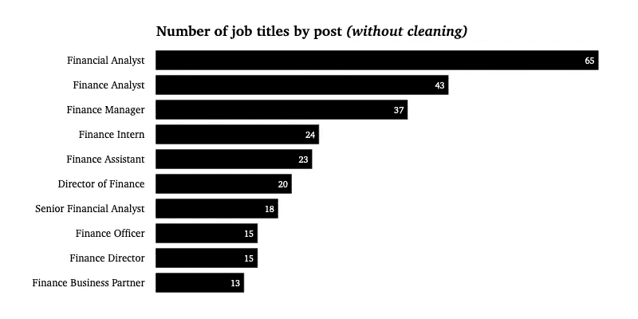

# 如何进入金融业——实际上是 Python

> 原文：<https://medium.com/analytics-vidhya/how-to-break-into-finance-indeed-python-5cca7637e114?source=collection_archive---------16----------------------->


[克里斯李](https://unsplash.com/@chrisli?utm_source=medium&utm_medium=referral)在 [Unsplash](https://unsplash.com?utm_source=medium&utm_medium=referral) 上拍照

L 由于招聘网站上的招聘信息太多，找工作变得很难。作为一名年轻的毕业生，我在寻找实习机会时就明白了这一点。当我看到所有不同的职位名称时，这变得很有挑战性，有时有长句，有我甚至不知道的术语，甚至更糟的是，没有任何关于工作是什么的说明。在金融等领域，每天都有新的工作标签产生，你很快就会迷失方向，失去动力。

因此，我决定调查金融领域的工作机会，以获得一些结果，并最终获得一些想要在该领域工作的人的关键要素。

*让我们从数据开始…*

# **确实工作机会**


照片由

我搜索了工作机会中具有有趣属性的有力数据。我认为这的确是一个完美的工作平台，也是最常用的。我首先尝试用关键词“金融”来抓取网页。收集的数据集很好，但还不够，而且有限制，大多数行都是重复的。因此，我决定寻找一个比我的脚本具有更好的逻辑和健壮性的工具。我选择了 web 数据提取软件， [**Octoparse**](https://www.octoparse.com) 。Octoparse 允许用你抓取的网站的一个实时窗口创建数据提取。你用多种选择建立你的提取电路。对于我来说，提取器非常棒，尤其是因为它允许创建一个分页，这对于像 Indeed 这样的网站来说是完美的。在 Octoparse 上花些时间，你将能够从大量网站上获得数据。

为了获得尽可能多的工作机会(记住大多数职位发布会保持活跃 30 天)，我选择从***【indeed.com】******【uk.indeed.com】***和***【ca.indeed.com】***中提取数据，关键字为“ ***【金融】*** 。Octoparse 会自动从页面中提取一些数据，例如每个报价的标题、URL、公司名称、公司评级、帖子摘要和日期。我想要更多的信息，所以，我增加了工资的提取。这个数据比其他的信息要少，但是从我得到的信息来看，这就足够了。

数据集如下所示:


表 1

我在处理数据集之前清理了它。正如您所看到的，有些行有 NaN 值，但是我考虑为 Salary 列保留 NaN 值，因为这是我稍后要处理的信息，并且不是分析的问题。

移除 nul 值后，我得到了 3 个同质数据集。

我将 3 个数据集合并成一个，主表的形状是 **2183 行(工作机会)**。工作机会从“刚刚发布”到“30 天以上”，这很好地代表了 2021 年 1 月/2 月的金融就业市场，因为我在 2 月下旬进行了提取。

# 主要结果


由[托尔加·乌尔坎](https://unsplash.com/@tolga__?utm_source=medium&utm_medium=referral)在 [Unsplash](https://unsplash.com?utm_source=medium&utm_medium=referral) 上拍摄

我所做的分析旨在从金融就业市场输出一些想法，实际上主要是 3 个国家的金融工作机会:美国、加拿大和英国。

我检查了我得到的每一条信息，从报价的位置到摘要中使用的词语。我做了一个基本的统计分析，用清晰的可视化和一些自然语言处理工作，试图更好地理解雇主想要什么。

*现在让我们来看看这些结果……*

## 去哪里从事金融工作？

为了最大化你找到工作的机会，去某个领域的顶级城市或顶级公司看看是很重要的。显然，你收到的聘书越多，你被聘用的机会就越多。然而，你得到的优惠越多，你的竞争对手就越多，所以你必须比他们更优秀才能脱颖而出。

因为上指定的位置可以是一个城市或整个地址，所以我不得不使用下一个函数来清理该列(对每个有多个地址的城市重复这个函数) :

```
jobs.loc[jobs.Location.str.contains('New York'), 'Location'] = 'New York'
```

完成后，我将数据按地点分组，得到了工作机会最多的 10 个城市，看起来就像这样。


图 1

伦敦以 229 个职位位居榜首，其次是加拿大的两个城市多伦多和蒙特利尔。纽约在前三名中垫底，有 87 个报价。

现在我们有了从事金融工作的地方，让我们来看看哪些公司提供的服务最多。

我首先查看数据集中公司的数量。

```
jobs.Company.nunique()
```

我统计了从摩根士丹利到东西学院的 1410 家独特的公司。数据集中有各种类型的公司。

groupby 函数之后的排序如下:


图 2

我们观察到加拿大皇家银行领先，蒙特利尔银行紧随其后。这可能令人惊讶，但这两家银行是加拿大最大的 5 家银行的一部分，并且是世界上 100 家最大的银行之一。脸书是第三家提供金融职位的公司，提供了 19 个职位。我们可以看到著名的英美服务网络德勤(Deloitte)，还有花旗集团(Citigroup)、摩根大通银行(JPMorgan Chase Bank)，最后还有四大会计师事务所中的另一个网络毕马威(KPMG)。

但是，找工作不仅仅是选职位，还要选公司。所以，了解自己应聘的公司很重要。的确有一个评分的功能，让申请人对公司有一个想法。我看了这些从 1 到 5 的评分(5 分)。

```
jobs_rating = jobs[['Company', 'Company_Rating']]
jobs_rating.columns = ['Company', 'Rating']
jobs_rating.sort_values(by='Rating', inplace=True, ascending=False)
jobs_rating.drop_duplicates(inplace=True)
```


表 2

评级最好的公司之一是英国的房地产企业 Linley & Simpson。我们可以观察到评级为 1 的两家公司，AgencyAnalytics 和丰田斯巴鲁 Sheboygan。

观察提供最多融资的公司的评级可能会很有趣。

```
jobs_rating.loc[jobs_rating['Company'].isin(topjobs_bycompany['Company'].tolist())]
```


表 3

脸书是员工心目中最好的公司，加拿大皇家银行/毕马威/德勤次之。我们注意到，总体而言，这些公司的评级都很高。

既然我们知道在金融界应该选择哪些公司和城市，我们需要知道我们要瞄准的职位名称。

## 哪些工作？

金融领域的工作岗位是多种多样的，因此我决定将这些职位归为主要职位，以便能够分析该领域主要职位的分布情况。从清洗前的 1705 个职位到清洗后的 18 个职位，我能够区分财务分析师、财务经理、董事、助理……然后，我创建了一个条形图，按职位统计招聘数量。

清洁前:



图 4

清洁后:


图 5

我们观察到金融分析师的表现优于其他人，有 717 份工作机会，其次是财务经理和财务总监。

如果我们现在看看这些不同的工作地点，结果是诱人的。


图 6


图 7


图 8

金融分析师大多位于伦敦，其中近一半在那里，然后是多伦多和蒙特利尔，共有 40%在那里。纽约是他们第四大代表城市。只有 10%的人。

**金融经理**也大多在伦敦，但在多伦多的人数几乎相同。我们可以看到门洛帕克名列前三，这很有意思。

**财务总监**分布不同，多伦多是第一个地点，伦敦是第二个地点。

我们知道更多关于职位的信息，但是数据集中的**就业类型**呢？为了获得信息，我将每个头衔与“实习生”联系起来作为实习，与“学徒”联系起来作为学徒，其他的作为全职工作。
我得到了以下结果:

*全日制:* **1926 年** *实习生:***235 年***学徒* : **22 年**

现在我们对金融领域的不同职位及其分布有了一个概念，让我们通过分析薪水来看看哪一个职位的薪水最高。

要做到这一点，我需要在薪水栏上工作，因为实际上信息是“每年 XXX”。我必须把它清理干净并转换成浮点数。我使用了一些正则表达式并创建了一些函数来得到结果。我还需要转换成$，所以我划分数据集来处理，并使用一个库来正确地转换它。

让我们看看工资的分布情况:

```
salaryperyrs.Salary.describe()
```

最高工资相当于**35 万美元**，最低工资为**10051 美元**。工资中位数是 44212 美元，我认为这相当不错。

当我们现在来看薪酬最高的工作时，我们得到了以下结果:

```
Risk Manager       $111,000                 
Financial Director $102,632                 
Trader             $90,000
```

相反，收入最低的工作是会计和财务助理，平均收入不到 28000 美元。

最高职位在这些公司中:

```
Xero                                                   $350,000                 
Los Angeles County Department of Human Resources       $325,563                 Medical University of South Carolina                   $251,489
```

工资最低的公司多在大学，比如*剑桥地区学院*或者 *MK 学院*。

最后，哪些城市工资最高？

```
Los Angeles       $325,563                 
Charleston        $251,489                 
Denver            $237,500
```

最少的城市是莫克姆或英国的巴里。

为了完成这个分析，我查看了报价摘要，并使用 NLP 处理获得了一些输出。

## **如何进入金融？**

为了分析报价摘要，我决定先按标题收集摘要，然后查看整个数据集。

首先我用正则表达式清理了摘要(clean_sum 是一个特殊的函数，里面有 regex):

```
sum_clean = pd.DataFrame(offer_sum.Summary.apply(lambda x :clean_sum(x)))
sum_clean.Summary = sum_clean.Summary.apply(lambda x: ' '.join([word for word in x if word not in (stop)]))
```

清理之后，让我们用 NLTK 库进行标记化和词汇化:

```
lemmer = WordNetLemmatizer()
sum_clean.Summary = sum_clean.Summary.apply(lambda x: word_tokenize(x))
sum_clean.Summary = sum_clean.Summary.apply(lambda x : [lemmer.lemmatize(y) for y in x])
```

摘要现在已经标记化和词条化，我们能够显示每个词在数据集中的出现频率(首先通过标题)。我使用 *Counter()* 函数创建了一个频率数据框架，并为金融分析师、交易员和金融助理构建了 3 个词云。

**财务分析师:**


文字云 1

我们可以在它的总结中找到分析和商业的词汇。对于财务分析师来说，管理看起来很重要，团队合作也很重要，是公司的支柱...总的来说，这个总结主要基于金融词汇。在中间，我们注意到“学士”这个词意味着拥有学士学位应该是必要的。

**交易员:**


文字云 2

我们看到的是另一个词汇，而不是之前的词云。很明显，它专注于市场、交易、资产……交易者需要有关于金融市场的“很强的技能”、“能力”。

**财务助理:**


文字云 3

一个财务助理必须是一个“支持者”，他必须协助，成为一个“团队”的一部分，他操作，报告和负责。

让我们以**整个摘要集**中的频率作为结论，并尝试注意是否有一些有趣的单词脱颖而出。
排名是这样的:


图 9

我发现令人信服的是，在金融工作机会的主体中,*经验*和*学位*之间的巨大分布差异。我们观察到经验是程度的两倍。有经验显然比有学位更重要。这并不意味着拥有学位不重要，但你需要在课堂上获得财务经验，以面对其他申请人。

# 结论

这个分析的目的是输出关键字为“ **finance** ”的招聘结果。它可以与任何其他关键字复制，它允许了解我们可以找到什么类型的数据。这可能是一个很好的方式来使用真实的数据进行个人动机，找工作，瞄准公司的理想城市。此外，总结中的词频也是一种工具，可以用来制作更好的简历。

感谢您花时间阅读这篇文章，希望您喜欢！
有兴趣可以在我的[**GitHub**](https://github.com/npogeant/indeed-finance)**上找代码。**