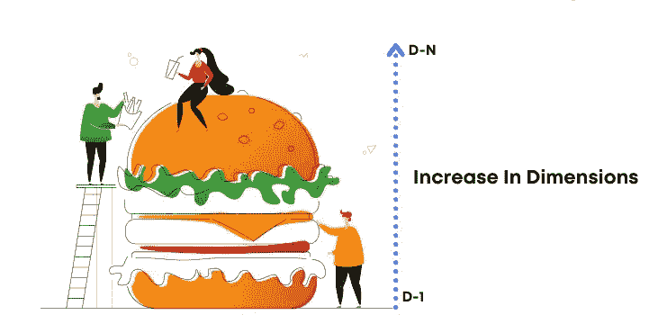
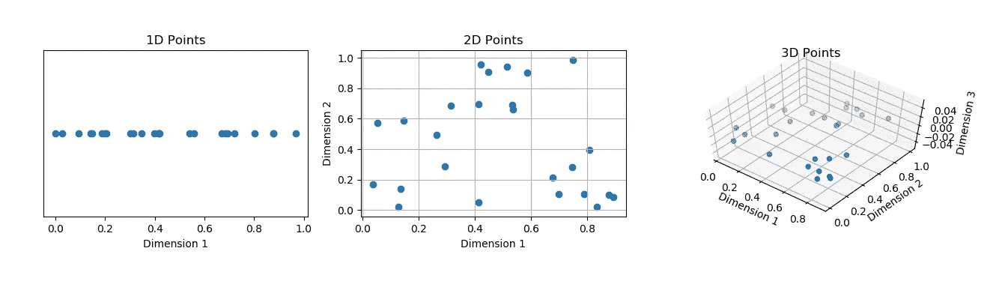
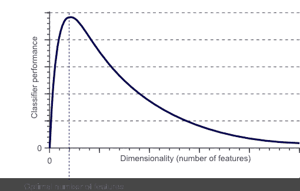
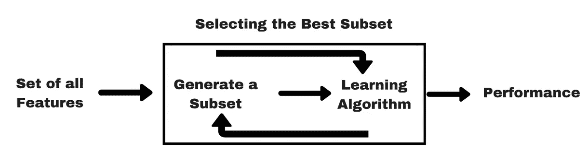
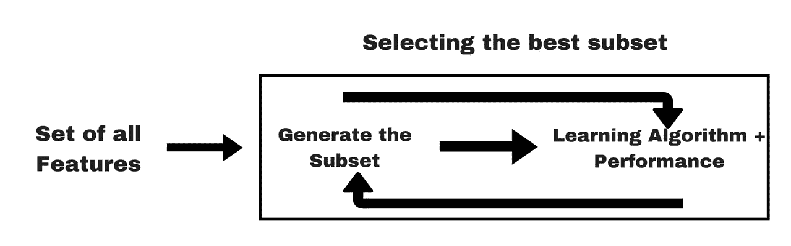
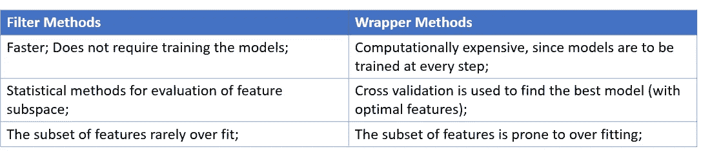

# 如何打破「维度诅咒」？

> 原文：<https://medium.com/analytics-vidhya/how-to-break-the-curse-of-dimensionality-b366d5d23c86?source=collection_archive---------8----------------------->

*少即是多| ML 中的特性选择*

来源:——【dataaspirant.com】

数据越多，分析就越好。或者，那是神话？一次又一次，我们不断听到这个术语——“维数灾难”。为什么拥有更多维度(数据集中更多要素)是一种诅咒？让我们来深潜一下！

假设，我们有 25 个观察值，只有一个特征，也就是说，只有一个属性定义这些观察值。我们将这 25 个观察值绘制成平面上的点。因为只有一个特征，所以只有一个维度。从下图中，我们可以看到 1D 空间中的点是紧密排列的。

保持观察值的数量不变，如果我们将特征的数量增加到两个，那么这些点在 2D 空间中变得稀疏。稀疏性随着第三特征的增加而增加。你可以想象当有 100 或更多的维度时会发生什么。

来源:——【aiaspirant.com 

## ***空间的指数增长如何成为诅咒？***

数据通常分为训练数据和测试数据。模型建立在训练数据上，并根据测试数据进行评估，也就是说，模型在未知数据上的性能被测量。

假设我们正在建立一个员工流失模型，唯一的特征是性别。我们在训练数据中至少需要两个样本*(每个类别一个——女性和男性)*，以便模型可以准确地预测在测试数据中何时遇到相同的类别。现在，我们添加另一个特性，年龄组*(有两个类别，25-40 岁，40-60 岁)*。如果我们需要每个组合*(男性&25-40 岁，男性&40-60 岁，女性&25-40 岁，女性&40-60 岁)*的最少一个样本，我们在训练数据中将需要至少四个样本。对于第三个特征，比如具有三个类别的工作级别，我们将需要训练数据中的 12 个 *(2*2*3)* 样本。

因此，样本大小必须随着特征数量的增加而增加，以便模型相当准确。如果有 100+个特征，应该有足够的样本来解释每个特征。在这种意义上，如果模型仅在选择的特征组合上被训练，则当新的/不太频繁的特征组合被馈送到模型时，模型可能不能准确地预测结果。这是典型的 ***过度拟合*** 的场景。

基于距离的算法，如 kNN、聚类等。会认为每个记录是等距的，或者每个样本将是特征的唯一组合(由于代表性不足)。

> 我们拥有的特征越多，我们需要的样本数量就越多，才能在样本中很好地代表所有特征值的组合。

> 特征多于样本数量的场景(假设每个样本解释一个特征)被称为*维数灾难*。

## 治愈方法是什么？

好吧，对于这个问题，显而易见且直截了当的答案是 ***增加*** 的样本数量。如果维度如此之大，以至于增加更多的样本会使模型变得复杂怎么办？下一个最好的选择是 ***来减少尺寸*** 。

虽然大的维度会对模型性能造成威胁(过度拟合)，但非常低的维度无助于模型学习数据中的基本模式(欠拟合)。 [*从这里了解更多关于过拟合&欠拟合(偏差方差权衡)*](/analytics-vidhya/whats-the-trade-off-between-bias-and-variance-2e25dd08716b) 。

 [## 偏倚和方差之间的权衡是什么？

### "近似正确比完全错误要好。"沃伦·巴菲特

medium.com](/analytics-vidhya/whats-the-trade-off-between-bias-and-variance-2e25dd08716b) 

来源:——[towardsdatascience.com](https://towardsdatascience.com)

模型性能随着特征数量的增加而提高。它通过最佳数量的特征达到最高精度。此后性能下降。这被称为**休斯现象**。

以下是降维的两种方法。

***# 1——特征提取***:——这是一种降低维数的技术，其中新的特征集是作为原始特征的组合而创建的，这样， ***新特征数<原始特征数*** 。主成分分析&因子分析都是特征提取的例子。查看我的博客中关于 PCA 的详细解释。

 [## 多维数据——好事还是坏事？

### PCA(主成分分析)的“为什么、什么和如何”

medium.com](/analytics-vidhya/multi-dimensional-data-boon-or-bane-3de73c9650bb) 

***# 2——特征选择***:——该技术涉及从原始特征空间中选择相关/有用特征的子集。有几种方法可以选择这些特征。这篇博客讨论了一些特征选择的常用方法。

# **特征选择方法**

## **#1 —过滤方法:-**

过滤方法是预处理步骤的一部分，并且独立于所使用的 ML 算法。这些方法可以进一步分为无监督的和有监督的，这取决于目标变量是否被考虑用于特征选择。

来源:——[analyticsvidhya.com](https://www.analyticsvidhya.com/)

## →无监督过滤方法:-

这些方法不考虑目标变量。这些方法在去除冗余/无用变量方面是有用的。

*   ***缺失值比率*** :-具有多个缺失值的特征，即如果缺失值的比率大于阈值，则这些特征不传达任何信息，因此可以在建模之前被丢弃。*可根据数据和域选择阈值。*
*   ***低方差*** :-方差很小或可以忽略的特征可以认为是*常量*。没有太多的变化，这些特征携带很少或没有信息。可以选择适当的阈值，基于该阈值，可以丢弃低方差特征。对值进行归一化可能是理想的，因为方差取决于要素的范围，并且预计每个要素的方差都不同。
*   ***高相关性*** :-彼此具有高相关性(线性关系)的特征通常传达相似的信息。这些特征变得多余。例如，随着年龄的增长，工作级别增加，工资也增加。这些功能中的一个或多个可能会被删除。

## →监督过滤方法:-

这些方法会考虑目标变量。通过测量独立特征和目标变量之间的关系，这些方法在去除无关变量方面是有用的。

> 互信息是通过独立特征获得的关于目标变量的信息量。具有最大互信息的特征被选为重要/相关特征。

*   使用互信息进行特征选择的函数—[***mutual _ info _ class if***](https://scikit-learn.org/stable/modules/generated/sklearn.feature_selection.mutual_info_classif.html#sklearn.feature_selection.mutual_info_classif)***，***[***mutual _ info _ regression***](https://scikit-learn.org/stable/modules/generated/sklearn.feature_selection.mutual_info_regression.html#sklearn.feature_selection.mutual_info_regression)

> 也可以计算独立特征的 p 值，以确定它们的显著性。p 值越高，显著性越低。可以丢弃最不重要的特征。

*   使用 p 值的特征选择技术— [***ANOVA*** (方差分析)](https://scikit-learn.org/stable/modules/generated/sklearn.feature_selection.f_classif.html)、 [***卡方***](https://scikit-learn.org/stable/modules/generated/sklearn.feature_selection.chi2.html#sklearn.feature_selection.chi2) 、 [***皮尔逊系数***](https://scikit-learn.org/stable/modules/generated/sklearn.feature_selection.f_regression.html)

## ***#2 —包装方法*** :-

特征的子集用于训练模型。基于样本外数据的模型性能，添加或删除特征并构建后续模型。

来源:——[analyticsvidhya.com](https://www.analyticsvidhya.com/)

下面是一些常用的包装方法。

*   ***正向选择* :-** 从初始模型中的一个特征开始的建模迭代过程。在再次构建模型之前，添加一个最能改进模型的附加特征。这一过程一直持续到新特征的添加不能提高模型性能为止。
*   ***后向选择*** :-这与前向选择类似，除了初始模型是用所有特征构建的。在每个迭代步骤中，最不重要的特征被移除，直到模型性能没有改善。
*   [***递归特征消除***](https://scikit-learn.org/stable/modules/generated/sklearn.feature_selection.RFE.html) :-这使用外部估计器，如线性回归或随机森林，取决于监督学习的类型。初始模型具有所有功能。基于系数值或特征重要性，确定最不重要的特征。在移除最不重要的特征之后，构建下一个模型。从这些模型中只选择最好的模型。该最佳模型用于与在连续步骤中建立的模型进行比较。由于，它着眼于最佳模型，**对于给定的步长只有**，这种算法也被称为 ***贪婪优化算法*** 。*特征子空间的大小(要选择的最佳特征数量)是一个超参数，可以进行调整以提高模型性能。每一步要移除的特征数量也是一个超参数。*默认情况下，仅删除最不重要的特征。这个迭代过程一直持续到达到最佳特征数量*(超参数)*。

## ***#3 —嵌入方法*** :-

这些方法结合了过滤器和包装器方法的特点。当一个无关紧要的特性被删除时*(在包装方法中)*，这主要意味着该特性的系数变为零。嵌入方法不是删除特征，而是保留无关紧要的变量，然而，对它们的系数增加了惩罚，从而降低了它的重要性。

来源:——[analyticsvidhya.com](https://www.analyticsvidhya.com/)

***岭回归*** *(惩罚系数的平方和)****套索回归*** *(惩罚系数的绝对值和)*都是嵌入式方法的流行例子。

## 外卖:-

为什么我们需要降维(在高维数据集中)？

较少(最佳)数量的功能将…

1.  训练时间较少。
2.  降低模型复杂性，从而提高可解释性。
3.  降低过度拟合的可能性。
4.  提高准确性。

嗯…

# 少即是多！